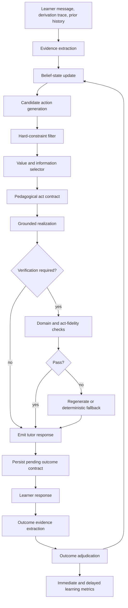

# Plan 2.1–2.3: Technical Plan for Evidence-Bearing Adaptive Tutoring

## Executive summary

Plan 2.0 has demonstrated a useful but bounded capability: an explicit closed-loop policy can map predeclared learner-state signals to the intended strategy families on held-out trap-derived suites, while a repaired contextual realization improves judge-rated response quality over the frozen baseline. The current result establishes **state-to-action control fidelity**, not yet **state validity**, **learning efficacy**, or **human-ready autonomy** [[I1]](#i1) [[I2]](#i2).

The next program should preserve that validated control path while extending it in a strict dependency order:

1. **Make intervention outcomes evidential.** A tutor action must create a pending, action-specific claim about what learner behavior would count as success, failure, or continued uncertainty.
2. **Replace single-state commitment with a calibrated, multi-axis belief state.** Cognitive, affective, interactional, metacognitive, and task-framing hypotheses should be represented separately, with evidence provenance, decay, and learner correction.
3. **Select actions under uncertainty.** Candidate pedagogical acts should be filtered by hard correctness, conduct, leakage, and ownership constraints, then ranked using expected learning value, information value, burden, and reversibility.
4. **Realize actions through explicit contracts.** The language model should express a selected act, not silently choose the pedagogy while generating prose.
5. **Adapt scaffold intensity and verification routing.** A universal minimal hint and an always-on verifier should both be replaced by state- and risk-conditioned control.
6. **Learn policies only after outcomes become observable.** Start with safe micro-randomization and population-level bandits; introduce contextualization only after stable treatment heterogeneity is demonstrated.
7. **Validate in a bounded human setting.** The strongest initial product path is a structured-domain tutor or tutor copilot, not a general autonomous tutor.

The target system is a hybrid adaptive controller:

```text
learner evidence
    -> calibrated belief state
    -> safe candidate pedagogical acts
    -> constrained action selection
    -> grounded linguistic realization
    -> learner response
    -> action-specific outcome adjudication
    -> belief and policy update
```

This direction is consistent with the literature. Current LLMs remain substantially weaker than explicit tutoring systems at reliable adaptivity [[S1]](#s1), hybrid finite-state designs can outperform unconstrained free-form tutoring [[S2]](#s2), models strongly over-intervene when silence would be pedagogically appropriate [[S3]](#s3), uncertainty-preserving learner models provide a principled alternative to hard labels [[S4]](#s4), and verification can help or harm depending on upstream reliability and task difficulty [[S5]](#s5).

---

## 1. Baseline to preserve

The implementation must begin from a frozen Plan 2.0 reference, not from a moving target.

### 1.1 Current positive

The June 19, 2026 branch record reports:

- Cross-suite baseline/treatment strict strategy shifting at 6/6.
- Paired-suite baseline/treatment strict strategy shifting at 8/8.
- Pair specificity of 3/3 with zero false-positive divergence in the paired suite.
- Sonnet-scored composite quality improvements of +4.8 on the cross-suite and +3.0 on the paired suite.
- Structurally complete outcome records, but predominantly inconclusive outcomes.
- Final generation in mock mode rather than unrestricted real-LLM mode [[I1]](#i1) [[I2]](#i2).

### 1.2 Frozen reference profiles

The following profiles and run artifacts should be retained as the reference treatment history:

| Suite | Baseline profile | Treatment profile |
|---|---|---|
| Cross-suite | `cell_136_plan2_closed_loop_crosssuite` | `cell_150_plan2_quality_repeat_contextual_crosssuite` |
| Paired | `cell_151_plan2_pair_specificity_closed_loop` | `cell_152_plan2_pair_specificity_repeat_contextual` |

The plan should not alter these profiles. New profiles must use new canonical names, the next available cell numbers, and explicit configuration hashes.

### 1.3 Baseline validation before new tuning

Before promoting any Plan 2.1 mechanism:

- Re-run the frozen profiles with real generation.
- Score with the existing primary judge and an independent held-out judge.
- Complete the already identified ablations: state scramble, outcome closure off, and context realization off.
- Verify configuration, prompt, dialogue, and policy hashes.
- Confirm that all analysis is rubric-version homogeneous.
- Preserve judge pairing by matching the same response content across judges.

This milestone is a prerequisite because otherwise later improvements may be compensating for an unmeasured real-generation regression.

---

## 2. Research objectives and non-goals

### 2.1 Primary research objectives

The program should answer six ordered questions:

1. **State validity:** Can the system recover and calibrate learner-state hypotheses rather than merely react to surface cues?
2. **Policy validity:** Given uncertainty, does it select an appropriate pedagogical action and know when not to intervene?
3. **Realization validity:** Does the generated utterance faithfully implement the selected action without correctness errors, answer leakage, or overspecification?
4. **Outcome validity:** Does the learner subsequently exhibit the behavior predicted by the action contract?
5. **Learning validity:** Does the adaptive policy improve independent progress, transfer, and retention over a strong fixed policy?
6. **Agency validity:** Does adaptation preserve learner ownership, override rights, and productive struggle?

### 2.2 Secondary engineering objectives

- Make every adaptive decision replayable and attributable.
- Keep mock and real-LLM execution behaviorally comparable at the policy layer.
- Enable counterfactual policy evaluation from logged data.
- Keep state schemas and action contracts versioned.
- Support both autonomous and human-copilot presentation modes.
- Avoid retroactive rewriting of historical rows.

### 2.3 Explicit non-goals

This program will not initially attempt to:

- Build a general tutor for arbitrary subjects.
- Infer stable personality traits from short interactions.
- Train an unrestricted end-to-end reinforcement-learning policy.
- Replace domain verification with judge-model preference.
- Treat sentiment, politeness, or “I understand” as learning evidence.
- Optimize one scalar quality score at the expense of correctness or agency.
- Expand the learner-state taxonomy post hoc to rescue failed held-out results.

---

## 3. Architectural principles

### P1. Separate inference, decision, realization, and outcome

The system must make four independently testable objects:

```text
BeliefState -> ActionDecision -> Realization -> OutcomeAssessment
```

A fluent response cannot stand in for an action decision, and a judge-rated response cannot stand in for a learner outcome.

### P2. Use a multi-axis belief state

A learner can simultaneously have a prerequisite gap, experience overload, and request an example. Therefore, the state must not be one global mutually exclusive label. It should contain separately normalized distributions for:

- epistemic state;
- task framing;
- interactional intent;
- affect/regulation;
- metacognition/help seeking;
- mastery by knowledge component.

### P3. Preserve evidence provenance and reversibility

Every posterior change must point to evidence spans, observations, rules, or assessments. Temporary hypotheses must decay. Contradictory evidence must be able to reverse a prior inference.

### P4. Hard constraints precede optimization

Correctness, forbidden answer disclosure, conduct constraints, and learner override rights are not reward terms that a policy may trade away. They filter the action set before scoring.

### P5. Non-intervention is an action

Models tend to over-intervene; MetaCLASS found that no intervention was appropriate in 41.7% of annotated cases, while evaluated models chose it only 4.2% of the time [[S3]](#s3). `observe_no_intervention` must therefore be explicit, logged, and evaluated.

### P6. Mechanical evidence outranks model self-judgment

Where a derivation, proof step, symbolic transformation, test case, or constrained answer can be checked mechanically, that evidence should lead. LLM adjudication should be secondary and carry uncertainty. LeanTutor illustrates the value of separating formal checking, next-step generation, and natural-language feedback [[S16]](#s16).

### P7. Policy learning follows observability

A system with mostly inconclusive outcomes does not yet possess a reliable reward signal. Micro-randomization, bandits, or offline RL must wait until action-specific closure has acceptable validity.

### P8. Personalization must beat a strong population policy

Large-scale tutoring evidence shows that population-level bandit policies can improve outcomes, while contextual personalization may add little when treatment heterogeneity is weak [[S6]](#s6). Adaptation must demonstrate incremental value rather than assume it.

### P9. Simulators require epistemic constraints

A fluent LLM impersonating a weak learner can use knowledge the simulated learner should not possess. Simulated learners must be governed by an explicit epistemic-state specification [[S7]](#s7).

### P10. Human correction is part of adaptation

State estimates should be visible and correctable in copilot and research interfaces. A learner or tutor correction should create evidence, revise the state, and be auditable.

---

## 4. Target runtime architecture



### 4.1 LangGraph node decomposition

The existing adaptive runner should evolve toward these nodes:

1. `loadContext`
2. `extractEvidence`
3. `updateBelief`
4. `adjudicatePendingOutcomes`
5. `generateCandidateActions`
6. `applyHardConstraints`
7. `selectAction`
8. `constructActContract`
9. `groundAct`
10. `realizeAct`
11. `routeVerification`
12. `verifyOrFallback`
13. `persistDecision`
14. `emitTutorTurn`

Outcome adjudication should occur before the next action selection so that the latest learner behavior can resolve the prior action and influence the next belief state.

### 4.2 Three adaptation timescales

| Timescale | State | Decision |
|---|---|---|
| Turn | immediate misunderstanding, overload, intent, current next step | next pedagogical act |
| Episode | unresolved proof debt, scaffold history, pending outcomes, derivation strategy | whether to persist, switch, fade, or close |
| Session | knowledge-component mastery, forgetting, transfer history, preferred successful scaffolds | problem selection, spacing, and long-run support |

Do not store short-lived turn states as permanent learner characteristics.

---

## 5. Core data model

The first implementation should use explicit schemas validated at runtime. JSON Schema, Zod, or an equivalent validator is acceptable; the repository should choose one and use it consistently.

### 5.1 `LearnerBeliefStateV1`

```js
/**
 * Versioned, multi-axis, uncertainty-preserving learner state.
 */
{
  schemaVersion: "plan2-belief-v1",
  runId: "eval-...",
  dialogueId: "...",
  turnIndex: 7,
  updatedAt: "2026-06-19T...Z",

  axes: {
    epistemic: {
      posterior: {
        prerequisite_gap: 0.41,
        misconception: 0.27,
        procedural_slip: 0.17,
        sufficient_mastery: 0.07,
        unknown: 0.08
      },
      entropy: 1.39,
      topTwoMargin: 0.14
    },

    task_framing: {
      posterior: {
        correctly_framed: 0.52,
        task_misread: 0.31,
        goal_unclear: 0.12,
        unknown: 0.05
      },
      entropy: 1.10,
      topTwoMargin: 0.21
    },

    interaction_intent: {
      posterior: {
        answer_seeking: 0.46,
        example_request: 0.28,
        substantive_objection: 0.15,
        exploration: 0.06,
        unknown: 0.05
      },
      entropy: 1.34,
      topTwoMargin: 0.18
    },

    regulation: {
      posterior: {
        stable: 0.44,
        overload: 0.30,
        frustration: 0.17,
        disengagement: 0.04,
        unknown: 0.05
      },
      entropy: 1.31,
      topTwoMargin: 0.14
    },

    metacognition: {
      posterior: {
        calibrated: 0.31,
        low_confidence: 0.28,
        unproductive_help_seeking: 0.21,
        poor_monitoring: 0.12,
        unknown: 0.08
      },
      entropy: 1.49,
      topTwoMargin: 0.03
    }
  },

  mastery: {
    "kc.chain_rule": {
      mean: 0.62,
      variance: 0.08,
      lastObservedTurn: 5,
      evidenceCount: 4
    }
  },

  activeEvidenceIds: ["ev-103", "ev-104"],
  pendingOutcomeIds: ["out-44"],
  policyFlags: {
    diagnosticBudgetUsed: 1,
    repeatedInconclusiveUnderSameCondition: false,
    learnerCorrectedTutorState: false
  }
}
```

### Design decision

Each axis is a separate simplex. This permits co-occurrence across axes while preserving interpretable uncertainty within each dimension. Every axis includes an `unknown` state so the system is not forced to manufacture certainty.

### 5.2 `EvidenceObservationV1`

```js
{
  schemaVersion: "plan2-evidence-v1",
  evidenceId: "ev-104",
  turnIndex: 7,
  source: "learner_message", // learner_message | derivation_checker | timing | tutor_correction | assessment
  span: "walk me through the answer",
  normalizedFeature: "direct_answer_request",
  extractor: {
    type: "rule_llm_hybrid",
    version: "evidence-extractor-v1",
    confidence: 0.91
  },
  effects: [
    {
      axis: "interaction_intent",
      state: "answer_seeking",
      logLikelihoodRatio: 1.20
    },
    {
      axis: "regulation",
      state: "overload",
      logLikelihoodRatio: 0.35
    }
  ],
  ttlTurns: 2,
  contradictionKey: "request_intent",
  reviewStatus: "unreviewed"
}
```

Evidence should modify beliefs rather than directly select actions.

### 5.3 Belief update rule

The first version should be deterministic and auditable:

```text
logit_t(state) = decay(axis, elapsed_turns) * logit_(t-1)(state)
                 + sum(active evidence LLRs)
                 + transition prior
```

Then normalize within each axis using softmax. Clamp any single unverified LLM-derived observation so it cannot drive a posterior above a configured cap. Mechanical evidence may use a higher cap.

Initial implementation requirements:

- Axis-specific decay rates.
- Evidence expiration.
- Contradiction handling.
- Learner correction with high evidential weight.
- Stable ordering under equivalent evidence permutations.
- Full replay from event history.

A later version may learn likelihoods or transition parameters, but the first evidence should be generated under a frozen transparent updater.

### 5.4 `PedagogicalActionContractV1`

```js
{
  schemaVersion: "plan2-action-contract-v1",
  actionId: "minimal_hint",
  family: "scaffold",
  scaffoldLevel: 2,

  preconditions: [
    "learner_has_attempted",
    "valid_local_next_step_exists",
    "no_unresolved_task_misread"
  ],

  intendedEffects: [
    "enable_one_independent_step",
    "preserve_learner_construction"
  ],

  requiredContent: [
    "one_targeted_conceptual_cue"
  ],

  forbiddenContent: [
    "complete_next_derivation",
    "final_answer",
    "more_than_one_unrequested_step"
  ],

  expectedObservations: [
    "learner_produces_valid_next_step",
    "learner_asks_targeted_followup",
    "evidence_of_deeper_gap"
  ],

  successRule: "independent_valid_next_step_without_echo",
  failureRule: "same_error_after_faithful_attempt",
  inconclusiveRule: "acknowledgement_without_attempt",
  fallbackActions: ["discriminative_probe", "partial_completion"]
}
```

### 5.5 Proposed action ontology

| Macro family | Action | Purpose |
|---|---|---|
| Observe | `observe_no_intervention` | Preserve productive struggle and collect evidence |
| Diagnose | `discriminative_probe` | Separate leading state hypotheses |
| Orient | `task_reframe` | Correct goal or task-model mismatch |
| Scaffold | `retrieval_prompt` | Prompt recall without supplying content |
| Scaffold | `minimal_hint` | Unblock one local step |
| Scaffold | `constrained_choice` | Reduce search space while preserving choice |
| Scaffold | `partial_completion` | Supply structure when prerequisites are insufficient |
| Example | `contrast_case` | Distinguish a misconception or boundary |
| Example | `buggy_example` | Elicit diagnosis from a prepared error |
| Example | `worked_example` | Model a procedure under high support need |
| Constructive | `self_explanation` | Require integration and rationale |
| Assessment | `retrieval_check` | Test unaided recall |
| Assessment | `transfer_check` | Test application in a changed context |
| Regulation | `affect_stabilization` | Reduce overload without replacing task work |
| Agency | `ownership_restoration` | Return plan choice or next move to learner |
| Escalation | `human_or_tool_handoff` | Route beyond system competence or consent boundary |

Each action must have a versioned contract. Adding an action requires a scenario set, unit tests, realization tests, closure rules, and at least one explicit no-op comparison.

### 5.6 `ActionDecisionV1`

```js
{
  decisionId: "dec-209",
  beliefSnapshotId: "belief-208",
  candidateActions: [
    {
      actionId: "discriminative_probe",
      allowed: true,
      utility: {
        expectedLearning: 0.34,
        informationGain: 0.46,
        agency: 0.70,
        burden: 0.22,
        risk: 0.08,
        reversibility: 0.90
      },
      finalScore: 0.61
    },
    {
      actionId: "partial_completion",
      allowed: true,
      utility: {
        expectedLearning: 0.51,
        informationGain: 0.08,
        agency: 0.31,
        burden: 0.18,
        risk: 0.22,
        reversibility: 0.55
      },
      finalScore: 0.38
    }
  ],
  rejectedActions: [
    {
      actionId: "worked_example",
      reason: "violates_current_scaffold_ceiling"
    }
  ],
  selectedAction: "discriminative_probe",
  selectionPolicy: "deterministic-voi-v1",
  selectionProbability: 1.0,
  diagnosticBudgetBefore: 0,
  diagnosticBudgetAfter: 1
}
```

Persist the complete candidate set, not only the winning action. This is necessary for debugging and later off-policy evaluation.

### 5.7 `OutcomeContractV1` and `OutcomeObservationV1`

```js
{
  outcomeId: "out-44",
  originatingDecisionId: "dec-209",
  actionId: "discriminative_probe",
  openedAtTurn: 7,
  earliestObservableTurn: 8,
  expiryTurn: 10,
  target: {
    axis: "epistemic",
    hypotheses: ["prerequisite_gap", "task_misread"]
  },
  successEvidence: [
    "posterior_margin_between_target_hypotheses_increases_by_at_least_threshold"
  ],
  failureEvidence: [
    "probe_is_not_discriminative_under_observed_reply"
  ],
  disallowedEvidence: [
    "tutor_restates_its_own_hypothesis",
    "learner_polite_acknowledgement_only"
  ],
  status: "pending"
}
```

Resolution states:

```text
observed_success
observed_failure
inconclusive
not_yet_observable
invalidated_by_confounded_followup
expired_without_evidence
```

All outcome evidence should record whether it is:

- mechanically verified;
- rubric- or rule-based;
- LLM-adjudicated;
- human-reviewed;
- immediate, near-transfer, far-transfer, or delayed-retention evidence.

### 5.8 Event-sourced trace

The adaptive trace should be replayable from append-only events:

```text
learner_turn_received
source_evidence_extracted
belief_updated
pending_outcome_adjudicated
action_candidates_generated
hard_constraint_applied
action_selected
act_contract_created
realization_generated
verification_routed
verification_completed
tutor_turn_emitted
outcome_contract_opened
```

The current final state may be stored for fast reads, but the event log is the source of truth for analysis and replay.

---

## 6. Runtime policy

### 6.1 Candidate generation

The candidate generator should be deterministic from:

- current belief state;
- action-contract preconditions;
- scaffold history;
- pending outcomes;
- derivation/proof state;
- conduct and ownership constraints;
- diagnostic budget;
- learner-declared preferences or corrections.

It should not ask an LLM to invent the available pedagogical actions.

### 6.2 Hard-constraint filtering

Reject candidates that violate any of:

1. Domain correctness.
2. Prohibited answer leakage.
3. Maximum scaffold level.
4. Repetition constraints.
5. Learner opt-out or correction.
6. Conduct policy.
7. Ownership policy.
8. Unsupported state assertion.
9. Open outcome that must be observed before a confounding intervention.
10. Known system competence boundary.

Constraints should return machine-readable reason codes.

### 6.3 Deterministic selector v1

For allowed action `a` and belief `b`:

\[
J(a \mid b) =
 w_L E[\Delta learning]
 + w_I I(S; O \mid a)
 + w_A Agency(a)
 + w_R Reversibility(a)
 - w_B Burden(a)
 - w_K Risk(a)
 - w_C Cost(a)
\]

Add a robustness penalty:

\[
J_{robust}(a) = J(a) - \kappa Var_{s \sim b}[U(a,s)]
\]

This discourages an action that performs well only if the top hypothesis is correct and badly otherwise.

The first selector should use a frozen lookup table and deterministic formulas, not learned weights. This produces an interpretable baseline for later policy learning.

### 6.4 Diagnostic value of information

A diagnostic action is allowed only when:

- leading hypotheses would produce meaningfully different downstream actions;
- the expected observation is likely to separate them;
- no cheaper reversible action is robust across the leading hypotheses;
- the diagnostic budget is not exhausted;
- the learner has not declined further questioning;
- the same condition has not already produced an inconclusive diagnostic.

Stop diagnosis when:

```text
expected information gain <= burden threshold
OR downstream action is invariant across leading hypotheses
OR repeated inconclusive under same live condition
OR learner overload/decline crosses threshold
OR safe reversible action dominates
```

This generalizes the current repair rule rather than replacing it.

### 6.5 No-intervention action

`observe_no_intervention` should be selected when:

- the learner is productively progressing;
- current work is valid but incomplete;
- intervention would likely reduce ownership or reveal too much;
- no safety or severe misconception condition requires immediate correction;
- the expected value of waiting exceeds the expected value of acting.

Its outcome contract may look for:

- continued valid progress;
- self-correction;
- a learner-initiated targeted request;
- stalled or worsening work that triggers a later intervention.

No-intervention must not be used as a cost-saving shortcut. It is a pedagogical action with success and failure conditions.

---

## 7. Grounded realization and verification

### 7.1 `PedagogicalActSpecV1`

Before generation, construct a complete act specification:

```js
{
  selectedAction: "minimal_hint",
  learnerFacingGoal: "prompt recognition of the invariant without completing the algebra",
  knownLearnerWork: ["..."],
  validNextSteps: ["..."],
  misconceptionTargets: ["..."],
  permittedFacts: ["..."],
  forbiddenDisclosures: ["next full derivation", "final identity"],
  requiredSpecificity: "refer_to_current_expression",
  maxNewSteps: 1,
  expectedLearnerWork: "state and execute the next transformation",
  closureRule: "independent_valid_next_step_without_echo",
  registerConstraints: ["plain_language", "non_punitive"]
}
```

The model receives this object and the local dialogue context. It does not receive authority to alter the selected action.

### 7.2 Candidate realization

Generate a small bounded set, initially one or two candidates. More candidates increase cost and selection complexity without guaranteed benefit.

Each candidate should be checked for:

- domain correctness;
- action-contract fidelity;
- answer leakage;
- number of supplied steps;
- unsupported claims about learner state;
- tone and conduct;
- unnecessary complexity.

### 7.3 Risk-routed verification

Verification should be conditional because recent proof-tutoring evidence found that a verifier improved weak upstream feedback but harmed already reliable feedback through overspecification [[S5]](#s5).

Proposed routing score:

```text
verificationRisk =
  domainComplexity
  + realizationUncertainty
  + answerLeakagePotential
  + stateNovelty
  + unsupportedActionHistory
  + highConsequenceFlag
  - deterministicGroundingStrength
```

Routing tiers:

| Tier | Condition | Checks |
|---|---|---|
| 0 | Low risk, strongly grounded | schema and leakage checks only |
| 1 | Moderate risk | act-fidelity and domain checker |
| 2 | High risk | independent verifier plus deterministic checker |
| 3 | Unsupported or unsafe | deterministic fallback or human/tool handoff |

The verifier may reject or request bounded regeneration, but it may not silently expand the scaffold level.

### 7.4 Deterministic fallback

Every action contract should have a template fallback populated from verified domain facts. If generation or verification fails repeatedly, the system should emit the fallback or hand off rather than improvise.

---

## 8. Adaptive scaffold ladder

Use a single ordered support scale. This operationalizes the assistance dilemma: support must be sufficient to unblock learning without replacing productive learner work [[S17]](#s17):

| Level | Action form | Learner work preserved |
|---:|---|---|
| 0 | Observe or acknowledge | Entire next move |
| 1 | Retrieval/prediction prompt | Recall and application |
| 2 | Targeted conceptual cue | Choose and execute step |
| 3 | Constrained choice or representation | Select among bounded options |
| 4 | Partial completion | Complete remaining structure |
| 5 | Buggy, contrast, or worked example | Diagnose or reconstruct |
| 6 | Direct explanation followed by reconstruction | Reproduce and transfer |

Policy rules:

- Increase at most one level after one ordinary failure.
- Permit larger increases only for verified prerequisite absence, severe overload, or explicit learner request.
- Fade support after independent success.
- Do not treat affective frustration alone as proof of low mastery.
- Treat help seeking as a metacognitive behavior that may itself need feedback, not automatically as a content deficit [[S18]](#s18).
- Do not use a worked example without a planned self-explanation or transfer closure.
- Record the highest support level exposed, because later “independent” performance may be contaminated.

The literature suggests that scaffold effectiveness can differ by prior knowledge, supporting a state-conditioned ladder rather than a universal hint policy [[S8]](#s8).

---

## 9. Evidence-bearing outcome closure

### 9.1 Closure principles

1. Create the outcome contract when the action is selected.
2. Tie success to observable learner behavior, not tutor intent.
3. Distinguish acknowledgment from demonstration.
4. Keep delayed actions open until an appropriate later assessment.
5. Mark confounded outcomes rather than forcing a verdict.
6. Permit multiple observations to contribute to one outcome.
7. Separate action success from long-run learning.

### 9.2 Action-specific examples

| Action | Observed success | Observed failure | Inconclusive |
|---|---|---|---|
| Discriminative probe | Leading hypothesis margin materially changes | Reply does not distinguish target hypotheses | Learner does not answer the probe |
| Minimal hint | Valid next step independently produced | Same error after faithful attempt | “Got it” without work |
| Task reframe | Learner restates goal and begins appropriately | Continues solving the wrong task | Polite agreement only |
| Partial completion | Learner completes remainder and explains connection | Cannot continue from supplied structure | Copies supplied fragment |
| Buggy example | Learner identifies and explains the error | Endorses the bug | Gives unrelated critique |
| Worked example | Correct self-explanation plus isomorphic success | Cannot apply the method | Says example is clear |
| Affect stabilization | Re-engagement followed by task progress | Distress or withdrawal increases | Sentiment improves without task evidence |
| Ownership restoration | Learner chooses plan or authors next move | Defers immediately without attempt | Agrees with tutor's plan |
| No intervention | Productive progress or self-correction | Avoidable stall or worsening misconception | Turn contains no observable work |

### 9.3 Mechanical-first adjudication

Adjudication order:

1. Domain checker or test harness.
2. Deterministic transcript features.
3. Contract-specific rubric.
4. Independent LLM adjudicator with structured confidence.
5. Human review for calibration samples and disputed cases.

The action-generating model must not be the sole outcome judge.

### 9.4 Closure validity dataset

Create a manually reviewed calibration set containing:

- clear successes;
- clear failures;
- acknowledgments that must remain inconclusive;
- copied or echoed answers;
- confounded follow-ups;
- delayed success;
- adversarial surface cues.

Primary metrics:

- precision and recall for `observed_success`;
- false-success rate;
- agreement with expert adjudication;
- closure latency;
- proportion of eligible actions that resolve observably;
- resolution by action family.

---

## 10. Longitudinal mastery and memory

### 10.1 State separation

Persist three distinct stores:

```text
volatile turn state      short TTL
episode state            dialogue lifetime
longitudinal mastery     session-to-session with decay
```

### Volatile state

Examples: overload, frustration, answer-seeking hypothesis, current task misread.

### Episode state

Examples: derivation plan, unresolved proof debt, attempted scaffold levels, pending outcomes.

### Longitudinal state

Examples: knowledge-component mastery, retrieval strength, transfer history, prior successful scaffolds.

### 10.2 Mastery representation

Start with a simple interpretable model per knowledge component:

```js
{
  knowledgeComponent: "kc.chain_rule",
  posteriorMean: 0.62,
  posteriorVariance: 0.08,
  evidence: {
    correctIndependent: 3,
    correctAfterHint: 2,
    incorrect: 1,
    transferSuccess: 0
  },
  lastPracticeAt: "...",
  decayModelVersion: "kc-decay-v1"
}
```

Do not count performance after high scaffold exposure as equivalent to independent performance. DAS3H and related knowledge-tracing work support modeling skill-specific learning and forgetting over time [[S9]](#s9).

### 10.3 Open learner model

For human-facing versions, provide a concise correctable summary:

```text
Current hypothesis: you may understand the rule but be applying it to the wrong subexpression.
Confidence: moderate.
Evidence: your last two transformations.
Alternative: the prerequisite identity may still be unclear.
```

Do not display stigmatizing labels or hidden psychographic claims. Open learner-model research supports interpretability and user access to model assumptions [[S10]](#s10).

---

## 11. Persistence architecture

Avoid overloading `evaluation_results` with every turn-level object. Keep summary columns there where needed, and add normalized adaptive tables.

### 11.1 Proposed tables

```sql
CREATE TABLE adaptive_trace_events (
  id TEXT PRIMARY KEY,
  run_id TEXT NOT NULL,
  dialogue_id TEXT NOT NULL,
  turn_index INTEGER NOT NULL,
  event_type TEXT NOT NULL,
  schema_version TEXT NOT NULL,
  payload_json TEXT NOT NULL,
  config_hash TEXT NOT NULL,
  created_at TEXT NOT NULL
);

CREATE INDEX idx_adaptive_trace_dialogue_turn
  ON adaptive_trace_events(dialogue_id, turn_index, created_at);

CREATE TABLE adaptive_belief_snapshots (
  id TEXT PRIMARY KEY,
  run_id TEXT NOT NULL,
  dialogue_id TEXT NOT NULL,
  turn_index INTEGER NOT NULL,
  schema_version TEXT NOT NULL,
  belief_json TEXT NOT NULL,
  source_event_id TEXT NOT NULL,
  created_at TEXT NOT NULL
);

CREATE TABLE adaptive_action_decisions (
  id TEXT PRIMARY KEY,
  run_id TEXT NOT NULL,
  dialogue_id TEXT NOT NULL,
  turn_index INTEGER NOT NULL,
  belief_snapshot_id TEXT NOT NULL,
  selected_action TEXT NOT NULL,
  selector_version TEXT NOT NULL,
  selection_probability REAL NOT NULL,
  candidate_set_json TEXT NOT NULL,
  constraint_results_json TEXT NOT NULL,
  act_contract_json TEXT NOT NULL,
  created_at TEXT NOT NULL
);

CREATE TABLE adaptive_outcomes (
  id TEXT PRIMARY KEY,
  run_id TEXT NOT NULL,
  dialogue_id TEXT NOT NULL,
  originating_decision_id TEXT NOT NULL,
  opened_turn INTEGER NOT NULL,
  resolved_turn INTEGER,
  status TEXT NOT NULL,
  evidence_json TEXT NOT NULL,
  adjudicator_version TEXT,
  confidence REAL,
  created_at TEXT NOT NULL,
  updated_at TEXT NOT NULL
);

CREATE TABLE adaptive_delayed_assessments (
  id TEXT PRIMARY KEY,
  dialogue_id TEXT NOT NULL,
  knowledge_component TEXT,
  assessment_type TEXT NOT NULL,
  due_after_turn INTEGER,
  due_at TEXT,
  result_json TEXT,
  status TEXT NOT NULL,
  created_at TEXT NOT NULL,
  completed_at TEXT
);
```

All migrations must honor `EVAL_DB_PATH` and pass the hermetic test suite.

### 11.2 Summary fields

Add only stable aggregates to `evaluation_results`, for example:

- `adaptive_policy_version`
- `belief_schema_version`
- `action_contract_version`
- `observed_outcome_rate`
- `false_success_audit_rate`
- `mean_state_entropy`
- `diagnostic_turn_count`
- `no_intervention_count`
- `max_scaffold_level`

Before adding columns, inspect `services/evaluationStore.js`; its migrations remain the source of truth. Follow the repository architecture, registration, hermetic-testing, and paper-authoring constraints in `AGENTS.md` [[I3]](#i3).

### 11.3 Provenance

Every decision must retain:

- state taxonomy version;
- evidence extractor version;
- belief updater version;
- action-contract version;
- selector version and weights;
- realization prompt version;
- verifier router and verifier version;
- outcome adjudicator version;
- scenario and hidden-state schema versions;
- model/provider identifiers;
- content and configuration hashes.

---

## 12. Repository implementation map

### 12.1 Existing files to extend

| File | Change |
|---|---|
| `services/adaptiveTutor/stateSchema.js` | Add versioned belief, evidence, action, and outcome validators |
| `services/adaptiveTutor/graph.js` | Add evidence, belief, outcome, selection, grounding, and verification nodes |
| `services/adaptiveTutor/policyActions.js` | Replace flat labels with versioned action contracts and scaffold levels |
| `services/adaptiveTutor/persistence.js` | Add append-only events and normalized adaptive tables |
| `services/adaptiveTutor/runner.js` | Wire policy versions, replay modes, and real/mock parity checks |
| `services/adaptiveTutor/realLLM.js` | Accept act specs; return structured realization candidates |
| `services/adaptiveTutor/mockLLM.js` | Generate deterministic outputs keyed to act contract and hidden learner state |
| `services/adaptiveTutor/budgetTracker.js` | Track generation, verification, and diagnostic budgets separately |
| `config/tutor-agents.yaml` | Add new adaptive profiles with `runner: adaptive` |
| `services/evaluationRunner.js` | Register all new canonical profile names in `EVAL_ONLY_PROFILES` |
| `services/evaluationStore.js` | Add migrations and stable summary fields only |

### 12.2 Proposed new modules

```text
services/adaptiveTutor/
  evidenceExtractor.js
  beliefUpdater.js
  stateTaxonomy.js
  actionContracts.js
  candidateGenerator.js
  constraintEngine.js
  valueOfInformation.js
  actionSelector.js
  actSpecBuilder.js
  realizationGuard.js
  verifierRouter.js
  outcomeContracts.js
  outcomeAdjudicator.js
  longitudinalMastery.js
  adaptiveTraceReplay.js
```

Each module should expose pure functions where possible. Side effects should be isolated in the runner and persistence layers.

### 12.3 Proposed configuration files

```text
config/adaptive/
  state-taxonomy-v1.yaml
  evidence-likelihoods-v1.yaml
  state-transition-priors-v1.yaml
  state-decay-v1.yaml
  action-contracts-v1.yaml
  scaffold-ladder-v1.yaml
  selector-weights-v1.yaml
  verifier-routing-v1.yaml
  outcome-contracts-v1.yaml
  product-guardrails-v1.yaml
```

Configuration must be validated at startup and included in the config hash.

### 12.4 Proposed analysis scripts

```text
scripts/
  validate-adaptive-trace.js
  replay-adaptive-decisions.js
  analyze-state-calibration.js
  analyze-evidence-attribution.js
  analyze-diagnostic-information.js
  analyze-no-intervention.js
  analyze-action-fidelity.js
  analyze-outcome-closure-validity.js
  analyze-scaffold-transitions.js
  analyze-verifier-routing.js
  analyze-adaptive-policy-value.js
  analyze-policy-support.js
  export-adaptive-decision-log.js
```

Register them in `scripts/ANALYSIS-SCRIPTS.md` and the analysis toolkit documentation.

---

## 13. Scenario and simulator design

### 13.1 Epistemic State Specification

Each simulated learner scenario should declare hidden state explicitly, following the epistemic-fidelity principle proposed for valid LLM student simulation [[S7]](#s7):

```yaml
hidden_learner_state:
  schema_version: "ess-v1"

  mastered_kcs:
    - kc.product_rule

  partial_kcs:
    kc.chain_rule:
      mastery: 0.45

  unavailable_kcs:
    - kc.log_differentiation

  misconceptions:
    - id: applies_chain_rule_only_to_outer_term
      persistence: 0.7

  task_model:
    status: goal_unclear

  interaction_intent:
    state: example_request

  regulation:
    overload: 0.35
    frustration: 0.20

  allowed_inference_depth: 2
  prohibited_knowledge_access:
    - final_derivation

  response_model:
    help_uptake: conditional
    echo_probability: 0.1
    self_correction_probability: 0.2

  transition_model:
    minimal_hint:
      prerequisite_gap:
        success_probability: 0.15
    partial_completion:
      prerequisite_gap:
        success_probability: 0.55
```

The mock learner should enforce this specification mechanically. The LLM learner should receive constrained context and be audited for forbidden knowledge leakage.

### 13.2 New held-out suites

Create suites by causal geometry, not by surface wording:

| Suite | Purpose |
|---|---|
| `belief_ambiguity_v1` | Two plausible states share similar language but require different acts |
| `mixed_state_v1` | Cognitive and affective states co-occur |
| `state_reversal_v1` | Later evidence contradicts the initial state |
| `diagnostic_value_v1` | One probe discriminates; a generic probe does not |
| `no_intervention_v1` | Productive struggle versus harmful stall |
| `scaffold_ladder_v1` | Different prior knowledge requires different support levels |
| `closure_evidence_v1` | Success, failure, echo, acknowledgment, and confounding cases |
| `verifier_routing_v1` | Low- and high-risk realization cases |
| `untouched_geometry_v1` | Mechanisms not represented in training or tuning suites |

Reserve at least one suite that is not inspected during mechanism development.

### 13.3 Counterfactual pairs

Every state-sensitive scenario should have a minimal pair in which only one causal feature changes. Examples:

- Same wording, different verified work trace.
- Same error, different affect signal.
- Same request, but prior independent attempt present versus absent.
- Same learner state, different risk of answer leakage.
- Same posterior, but downstream action invariant versus divergent.

This supports direct measurement of counterfactual action sensitivity.

---

## 14. Test strategy

### 14.1 Unit tests

### Evidence and belief

- Evidence order invariance.
- Posterior normalization.
- Evidence expiry.
- Axis-specific decay.
- Contradiction reversal.
- Learner correction dominance.
- LLM confidence cap.
- Unknown-state floor.

### Actions and constraints

- Preconditions enforced.
- Forbidden disclosures block an action.
- Scaffold ceiling enforced.
- Diagnostic budget enforced.
- Repeated inconclusive diagnostic triggers fallback.
- No-intervention unavailable under urgent correctness or safety conditions.

### Outcomes

- Acknowledgment never counts as independent success.
- Echoed answer is marked contaminated.
- Delayed outcome remains pending.
- Confounding tutor action invalidates attribution.
- Mechanical checker outranks LLM adjudicator.

### Realization and verification

- Act spec cannot alter selected action.
- Verifier cannot raise scaffold level.
- Deterministic fallback passes contract.
- Low-risk cases bypass expensive verification.
- High-risk cases route correctly.

### 14.2 Property and metamorphic tests

- Paraphrases with equivalent evidence produce equivalent beliefs within tolerance.
- Adding irrelevant politeness does not alter epistemic state.
- Removing the only answer-seeking span reduces, rather than increases, that posterior.
- Permuting independent evidence events leaves the final posterior unchanged.
- Scrambling state snapshots degrades state-sensitive action accuracy.
- Replaying an event log reproduces the persisted decision exactly.
- Truncating history removes expired evidence but preserves longitudinal mastery.

### 14.3 Integration tests

- Full turn loop with pending outcome resolution.
- Multiple simultaneous pending outcomes.
- Real/mock policy parity for the same structured evidence.
- Database migration under `EVAL_DB_PATH`.
- Log isolation under `EVAL_LOGS_DIR`.
- Resume and replay idempotence.
- Rejudge with adaptive traces.
- Failure recovery after verifier or provider timeout.

### 14.4 Hermetic tests

Extend `npm run test:hermetic` to cover all new tables, scenario loaders, event replay, and mock-mode adaptive cells. No test may touch the production database or logs.

### 14.5 Golden traces

Maintain a small set of reviewed, versioned adaptive traces. Changes to their state, action, or outcome sequence require an explicit fixture update and rationale.

---

## 15. Experimental program

Cell numbers should be assigned only after inspecting the canonical registry. The names below are proposed suffixes.

### 15.1 Milestone E0 — Frozen baseline validation

Profiles:

```text
plan20_frozen_crosssuite_real
plan20_frozen_paired_real
plan20_state_scramble
plan20_outcome_closure_off
plan20_context_realization_off
```

Primary endpoints:

- strict-shift accuracy;
- action-family accuracy;
- pair specificity;
- response quality under primary and independent judges;
- act realization fidelity;
- real/mock divergence.

Promotion gate:

- Reproduce the qualitative direction of the Plan 2.0 positive.
- No unexplained provenance or rubric-version drift.
- Complete all planned ablations before tuning Plan 2.1.

### 15.2 Milestone E1 — Evidence-bearing closure

Conditions:

```text
closure_structural_existing
closure_action_specific_rules
closure_action_specific_hybrid_adjudication
```

Primary endpoint:

- precision of `observed_success` against expert review.

Secondary endpoints:

- observed resolution rate;
- false-success rate;
- closure latency;
- resolution by action family;
- adjudicator agreement.

Provisional engineering gate, to be locked before data generation:

- False-success rate no greater than 5% on the calibration set.
- Expert agreement sufficient for intended use; target Cohen's kappa at or above 0.70 where category prevalence permits.
- Material increase in observed success/failure relative to the structural baseline without forcing uncertain cases.

### 15.3 Milestone E2 — Belief-state representation

Conditions:

```text
belief_categorical_existing
belief_probabilistic_top1_policy
belief_full_distribution_policy
belief_full_distribution_no_provenance
```

Hold action contracts and realization fixed.

Primary endpoints:

- Brier score;
- expected calibration error;
- top-two hidden-state coverage;
- state reversal accuracy;
- unsupported persistence rate.

Mechanism endpoint:

- Whether full distributions improve action selection beyond merely improving the top label.

Promotion gate:

- No regression in frozen-suite strict shifting.
- Better calibration than categorical confidence surrogates.
- Correct reversal after contradictory evidence.
- Provenance ablation demonstrates that evidence tracking contributes to reliability or auditability.

### 15.4 Milestone E3 — Diagnostic value and non-intervention

Conditions:

```text
generic_first_probe
pair_discriminative_probe
voi_selector
voi_selector_with_no_intervention
```

Primary endpoints:

- posterior entropy reduction per diagnostic turn;
- correct downstream action;
- redundant-probe rate;
- no-intervention precision and recall;
- learner work preserved.

Promotion gate:

- Fewer redundant diagnostics.
- No increase in unresolved harmful stalls.
- Better discrimination of top competing states.
- No reduction in ownership metrics.

### 15.5 Milestone E4 — Adaptive scaffolding

Conditions:

```text
fixed_minimal_hint
rule_conditioned_scaffold_ladder
belief_conditioned_scaffold_ladder
```

Primary endpoints:

- independent next-step success;
- near transfer;
- highest scaffold exposure;
- answer leakage;
- turn burden.

Stratify by prior mastery and state family. Human adaptive-scaffolding evidence suggests that the best support form can differ by prior knowledge [[S8]](#s8).

### 15.6 Milestone E5 — Verification routing

Conditions:

```text
no_verifier
always_on_verifier
risk_routed_verifier
```

Primary endpoints:

- domain correctness;
- action fidelity;
- overspecification;
- answer leakage;
- cost and latency;
- learner progress.

Promotion gate:

- Risk-routed verification must preserve or improve correctness over no verifier while reducing overspecification and cost relative to always-on verification.

### 15.7 Milestone E6 — Policy learning readiness

No learned policy is promoted at this milestone. Instead, audit whether the logged data are adequate:

- candidate-set completeness;
- valid selection probabilities;
- sufficient support for each action;
- outcome observability;
- missingness and confounding;
- stable reward-vector definitions.

Proceed only if the data support defensible off-policy evaluation.

### 15.8 Milestone E7 — Safe policy optimization

Sequence:

1. Safe micro-randomization among prevalidated alternatives.
2. Population-level bandit.
3. Heterogeneous treatment-effect analysis.
4. Contextual bandit only where heterogeneity is stable.
5. Conservative sequential offline RL only if delayed outcomes justify it.

Micro-randomized trials provide a design for repeatedly estimating when an intervention works [[S11]](#s11). Doubly robust estimators combine reward and behavior-policy models for off-policy evaluation [[S12]](#s12), while Conservative Q-Learning addresses unsupported out-of-distribution actions [[S13]](#s13).

Promotion requirements:

- Positive lower confidence bound versus the frozen fixed policy.
- No regression on correctness, leakage, ownership, or opt-out handling.
- Adequate action support.
- Benefit not dependent on one simulator or one judge.

### 15.9 Milestone E8 — Human validation

Use the existing pilot infrastructure only after IRB approval, real consent text, and validated assessment items.

Recommended first comparison:

1. Strong fixed-policy tutor.
2. Autonomous adaptive tutor.
3. Human tutor with adaptive state and action recommendations.
4. Human tutor with state evidence only.

Primary educational outcomes:

- independent next-step performance;
- posttest mastery;
- near transfer;
- delayed retention where feasible.

Primary agency outcomes:

- answer over-disclosure;
- learner override acceptance;
- ownership of the next move;
- unsolicited-intervention rate;
- trust and perceived control.

Tutor CoPilot's randomized trial supports the plausibility of the human-copilot path, while also documenting grade-level and appropriateness failures that the act-contract and grounding layers should address [[S14]](#s14).

---

## 16. Metrics and analysis

### 16.1 Metric hierarchy

| Layer | Primary measures |
|---|---|
| Evidence | extraction precision/recall, provenance completeness |
| Belief | Brier score, ECE, entropy, top-k coverage, reversal accuracy |
| Policy | strict shift, family match, pair specificity, regret, no-op accuracy |
| Diagnosis | information gain, redundant probes, diagnostic burden |
| Realization | correctness, act fidelity, leakage, overspecification |
| Closure | observed resolution, false-success rate, latency, adjudicator agreement |
| Learning | independent progress, near transfer, far transfer, retention |
| Agency | ownership transfer, override acceptance, intervention rate |
| Generalization | untouched geometry, unseen KCs, paraphrase and noise robustness |
| Operations | tokens, latency, verifier use, fallback and handoff rates |

### 16.2 Reward vector

Do not collapse all outcomes immediately. Store:

```js
{
  independentProgress: 0 | 1,
  nearTransfer: null | 0 | 1,
  farTransfer: null | 0 | 1,
  delayedRetention: null | 0 | 1,
  agencyPreserved: 0..1,
  affectRecovery: null | -1..1,
  burdenTurns: integer,
  answerLeakage: 0 | 1,
  correctnessViolation: 0 | 1,
  computeCost: number
}
```

Policy optimization should be lexicographic:

1. Eliminate correctness, safety, and leakage violations.
2. Enforce minimum agency and consent constraints.
3. Optimize learning-related outcomes.
4. Break close ties with burden and cost.

Simulation-based reinforcement-learning work supports viewing pedagogy as a trade-off surface rather than a single objective [[S15]](#s15).

### 16.3 Statistical discipline

- Pre-register primary endpoints and promotion gates.
- Treat scenario and learner identity as clustering variables.
- Avoid treating turns from one dialogue as independent samples.
- Use paired comparisons when conditions share the same hidden scenario.
- Bootstrap by scenario/dialogue rather than by row where appropriate.
- Report confidence intervals and effect sizes, not only point estimates.
- Correct exploratory families for multiple comparisons.
- Keep judge reliability analyses paired on identical responses.
- Never mix rubric versions in a primary comparison.
- Report simulator, judge, model, and policy-version sensitivity separately.

---

## 17. Product-facing interfaces

### 17.1 Internal JavaScript API

```js
const observation = await adaptiveTutor.observe({
  dialogueId,
  learnerTurn,
  derivationState,
  timestamp
});

const recommendation = await adaptiveTutor.recommend({
  dialogueId,
  mode: "autonomous" // or "copilot"
});

const realization = await adaptiveTutor.realize({
  dialogueId,
  decisionId: recommendation.decisionId
});

await adaptiveTutor.recordOutcomeEvidence({
  dialogueId,
  learnerTurn: nextLearnerTurn,
  derivationState: nextDerivationState
});
```

### 17.2 Copilot response contract

```js
{
  leadingHypotheses: [
    {
      state: "task_misread",
      probability: 0.48,
      evidence: ["learner is solving for the wrong target"]
    },
    {
      state: "prerequisite_gap",
      probability: 0.36,
      evidence: ["repeated misuse of the identity"]
    }
  ],
  recommendation: {
    action: "discriminative_probe",
    rationale: "A short probe separates goal misunderstanding from missing prerequisite knowledge.",
    suggestedUtterance: "Before we calculate, what is this line meant to establish?",
    expectedEvidence: "Whether the learner can state the target independently."
  },
  alternatives: [
    {
      action: "task_reframe",
      tradeoff: "Faster, but commits to task misread before the state is clear."
    }
  ],
  risks: ["Do not reveal the target identity in the question."],
  overrideAllowed: true
}
```

### 17.3 Autonomous product guardrails

A learner-facing autonomous response should be blocked or handed off when:

- no safe action remains;
- domain verification fails repeatedly;
- the learner requests human help;
- the system detects self-harm, abuse, or another domain outside the tutoring contract;
- the state estimate depends on unsupported sensitive inference;
- the task falls outside the verified curricular scope.

---

## 18. Privacy, ethics, and learner rights

- Minimize personally identifying data in adaptive traces.
- Separate research identifiers from account identifiers.
- Do not persist raw affect or conduct labels longer than necessary.
- Expose state summaries only at an appropriate abstraction level.
- Allow learners or tutors to correct state assumptions.
- Log corrections and ensure they change future behavior.
- Avoid protected-attribute personalization unless explicitly approved, necessary, and ethically justified.
- Do not infer disability, diagnosis, motivation, or personality from dialogue cues.
- Provide a clear opt-out from adaptive profiling in product settings.
- Define data deletion and retention procedures before human deployment.
- Keep research randomization within prevalidated safe actions and disclose it through approved consent processes.

---

## 19. Reproducibility and paper integration

### 19.1 Run manifest

Every experimental run should persist:

- git commit;
- package version;
- scenario manifest and hash;
- profile and config hashes;
- state/action/outcome schema versions;
- generation and judge models;
- random seeds;
- real/mock mode;
- action-selection propensities;
- rubric versions;
- analysis script version.

### 19.2 Artifact policy

Generate machine-readable JSON and human-readable Markdown summaries for each analysis. Keep large exports ignored when appropriate, but cite exact artifact names in committed closeouts.

### 19.3 Canonical paper discipline

Any new empirical result, table, or interpretive claim must be added to `docs/research/paper-full-2.0.md` before appearing in a spin-off, deck, or product document. Update the paper version and revision history. Do not retroactively rescore historical data under a newer rubric.

---

## 20. Milestones and promotion gates

| Milestone | Deliverable | Gate to proceed |
|---|---|---|
| M0 | Frozen real-generation baseline and planned ablations | Provenance-clean replication and independent-judge check |
| M1 | Event schema, action-specific closure, closure calibration set | Low false-success rate and credible expert agreement |
| M2 | Multi-axis belief state with provenance and decay | Better calibration, correct reversals, no control-path regression |
| M3 | Action contracts, constraint engine, VOI selector, no-intervention | Better diagnostic efficiency and no agency regression |
| M4 | Adaptive scaffold ladder and grounded act specs | Better independent progress without added leakage |
| M5 | Risk-routed verification | Correctness benefit without always-on overspecification/cost |
| M6 | Longitudinal mastery and delayed assessments | Stable replay and interpretable mastery updates |
| M7 | Policy-learning readiness audit | Adequate support, propensities, and observable outcomes |
| M8 | Safe population policy optimization | Positive conservative value estimate, no guardrail regression |
| M9 | Contextual policy test | Demonstrated stable treatment heterogeneity |
| M10 | Bounded human/copilot pilot | Approved protocol and valid learning/agency outcomes |

No milestone is promoted solely because a judge score improves.

---

## 21. Initial implementation backlog

### Foundation

- **P21-001:** Create a frozen Plan 2.0 run manifest and replay command.
- **P21-002:** Define JSON schemas for evidence, belief, action decisions, act specs, and outcomes.
- **P21-003:** Add normalized adaptive persistence tables and migrations.
- **P21-004:** Implement append-only trace events and deterministic replay.
- **P21-005:** Add adaptive trace validation to hermetic tests.

### Evidence-bearing closure

- **P21-010:** Encode outcome contracts for the current Plan 2.0 action families.
- **P21-011:** Implement pending outcome lifecycle and confounding rules.
- **P21-012:** Build mechanical-first outcome adjudicator.
- **P21-013:** Create expert-reviewed closure calibration fixtures.
- **P21-014:** Add `analyze-outcome-closure-validity.js`.

### Belief state

- **P21-020:** Define multi-axis state taxonomy with `unknown` states.
- **P21-021:** Convert current binary policy signals into evidence observations.
- **P21-022:** Implement deterministic log-odds updater, decay, and contradiction handling.
- **P21-023:** Add learner/tutor correction evidence.
- **P21-024:** Create ambiguity, mixed-state, and reversal suites.
- **P21-025:** Add calibration and evidence-attribution analysis.

### Action selection

- **P21-030:** Version action contracts and scaffold levels.
- **P21-031:** Implement candidate generator and hard-constraint engine.
- **P21-032:** Implement deterministic utility and robustness scoring.
- **P21-033:** Implement diagnostic budget and information-value rules.
- **P21-034:** Add `observe_no_intervention` with closure rules.
- **P21-035:** Build diagnostic and no-intervention suites.

### Realization and verification

- **P21-040:** Implement `PedagogicalActSpecV1` builder.
- **P21-041:** Update real and mock LLM adapters for structured act realization.
- **P21-042:** Add act-fidelity, leakage, and step-count checks.
- **P21-043:** Implement verifier router and deterministic fallback.
- **P21-044:** Build routed-verification evaluation suite.

### Longitudinal and policy learning

- **P21-050:** Add mastery store and scaffold-contamination accounting.
- **P21-051:** Add delayed retrieval and transfer assessment records.
- **P21-052:** Log candidate sets and selection probabilities.
- **P21-053:** Implement action-support and missingness audit.
- **P21-054:** Implement doubly robust offline policy evaluation.
- **P21-055:** Add conservative promotion report with lower confidence bounds.

### Product and human validation

- **P21-060:** Add copilot recommendation serializer.
- **P21-061:** Add state-correction and override endpoints.
- **P21-062:** Instrument tutor acceptance, modification, and rejection.
- **P21-063:** Extend pilot ingestion with adaptive decision/outcome linkage.
- **P21-064:** Draft preregistered human comparison and measurement plan.

---

## 22. Research claim ladder

Use progressively stronger claims only when their required evidence exists.

### Level 1 — Control fidelity

> The system maps defined learner-state signals to predeclared strategy changes.

Required: held-out strict-shift tests.

### Level 2 — State validity

> The system's learner-state probabilities are calibrated and revisable against known or human-annotated states.

Required: state calibration, counterfactual pairs, reversal tests.

### Level 3 — Intervention validity

> Selected and realized interventions produce the action-specific learner behaviors they predict.

Required: evidence-bearing closure with low false-success rates.

### Level 4 — Adaptive value

> The adaptive policy improves independent learner performance over a strong fixed policy.

Required: randomized or defensible causal comparison.

### Level 5 — Learning efficacy

> The system improves transfer or retention for real learners.

Required: human pre/post, transfer, and ideally delayed measures.

### Level 6 — Product effectiveness

> The system provides reliable value in a defined deployment context at acceptable cost and risk.

Required: bounded deployment, operational metrics, subgroup analysis, incident handling, and user outcomes.

The present branch supports Level 1 and early evidence toward response-quality improvement. Plan 2.1 should target Levels 2 and 3 before claiming Level 4.

---

## 23. Key risks and mitigations

| Risk | Consequence | Mitigation |
|---|---|---|
| Surface cue overfitting | Apparent state accuracy without causal validity | Minimal pairs, hidden-state suites, state reversal |
| Taxonomy explosion | Post-hoc tuning and low statistical power | Frozen versioned taxonomy and explicit proposal process |
| False certainty | Misguided high-confidence intervention | Unknown states, posterior caps, learner correction |
| Compulsive diagnosis | Burden and loss of trust | VOI threshold, diagnostic budget, no-intervention |
| Reward hacking | More answers or sentiment instead of learning | Reward vector and hard constraints |
| False-success closure | Invalid policy-learning signal | Mechanical-first rules and expert calibration |
| Overscaffolding | Reduced agency and transfer | Scaffold ceiling, fading, ownership metrics |
| Verifier overspecification | Lower pedagogical quality despite correctness | Risk routing and contract-preserving verifier |
| Simulator competence leak | Invalid mechanism evidence | Epistemic State Specification and forbidden-access audits |
| Contextual overfitting | Complex policy no better than population baseline | Heterogeneity gate and conservative off-policy evaluation |
| Judge dependence | Result tied to one evaluator | Identical-response cross-judge reliability and human audit |
| Historical contamination | Invalid cross-version comparisons | Schema/rubric versioning and no retrospective rescoring |
| Sensitive profiling | Ethical and product harm | Short TTLs, no diagnostic traits, correction and opt-out |
| System complexity | Hard-to-debug failures | Event sourcing, pure modules, golden traces, ablation discipline |

---

## 24. Recommended program boundary

The highest-value coherent next program is:

> **Plan 2.1: Belief-State and Evidence-Bearing Adaptation**

Its preregisterable central hypothesis should be:

> A calibrated multi-axis learner belief state, combined with discriminative diagnosis and action-specific outcome closure, will increase observed learner-state resolution and appropriate action selection without reducing Plan 2.0's strict-shift fidelity, pair specificity, or learner ownership.

Plan 2.1 should stop after belief-state, outcome, diagnostic, and no-intervention validation. Adaptive scaffolding and routed verification can be Plan 2.2. Policy learning and longitudinal human validation should be Plan 2.3. This separation prevents a large simultaneous architecture change from making causal interpretation impossible.

---

# Sources

## Internal repository sources

<a id="i1"></a>
**[I1]** `PLAN_2_0/branch-progress-since-inception.md`. Branch progress record prepared June 19, 2026. Source for the current Plan 2.0 state, profiles, outcomes, and bounded claim.

<a id="i2"></a>
**[I2]** `PLAN_2_0/plan2-general-adaptation-closeout.md`. Current internal closeout for the repaired cross-suite and paired-suite result.

<a id="i3"></a>
**[I3]** `AGENTS.md`. Repository architecture, configuration, evaluation, testing, and paper-authoring constraints.

## External sources

<a id="s1"></a>
**[S1] Borchers, C., & Shou, T. (2025). _Can Large Language Models Match Tutoring System Adaptivity? A Benchmarking Study._** A 75-scenario benchmark finding that even the strongest tested model only marginally reproduced explicit ITS adaptivity.
https://arxiv.org/abs/2504.05570

<a id="s2"></a>
**[S2] Pal Chowdhury, S., Zouhar, V., & Sachan, M. (2024). _AutoTutor meets Large Language Models: A Language Model Tutor with Rich Pedagogy and Guardrails._** MWPTutor places an LLM inside a predefined finite-state pedagogical design and reports stronger human-evaluated tutoring than a free-form GPT-4 comparison.
https://arxiv.org/abs/2402.09216

<a id="s3"></a>
**[S3] Liu, N., Baraniuk, R., & Sonkar, S. (2026). _MetaCLASS: Metacognitive Coaching for Learning with Adaptive Self-regulation Support._** Defines 11 interpretable metacognitive moves and documents severe over-intervention. Recent preprint.
https://arxiv.org/abs/2602.02457

<a id="s4"></a>
**[S4] Christie, S. T., Cook, C., & Rafferty, A. N. (2024). _Uncertainty-preserving deep knowledge tracing with state-space models._** Introduces Dynamic LENS, combining temporal learner modeling with explicit epistemic uncertainty.
https://arxiv.org/abs/2407.17427

<a id="s5"></a>
**[S5] Yasir, T., et al. (2026). _When Verification Hurts: Asymmetric Effects of Multi-Agent Feedback in Logic Proof Tutoring._** Finds that verification helps weak upstream feedback but can reduce performance through overspecification when upstream feedback is already reliable. Recent preprint.
https://arxiv.org/abs/2603.27076

<a id="s6"></a>
**[S6] Schmucker, R., Pachapurkar, N., Bala, S., Shah, M., & Mitchell, T. (2025). _Learning to Optimize Feedback for One Million Students: Insights from Multi-Armed and Contextual Bandits in Large-Scale Online Tutoring._** Evaluates about 43,000 assistance actions and deploys learned policies across 166,000 sessions; contextualization offers limited additional value where treatment heterogeneity is small.
https://arxiv.org/abs/2508.00270

<a id="s7"></a>
**[S7] Yuan, Z., Xiao, Y., Li, M., Xuan, W., Tong, R., Diab, M., & Mitchell, T. (2026). _Towards Valid Student Simulation with Large Language Models._** Defines the competence paradox and proposes Epistemic State Specifications for constrained simulation. Recent methodological preprint.
https://arxiv.org/abs/2601.05473

<a id="s8"></a>
**[S8] Tithi, S. D., et al. (2026). _Adaptive Scaffolding for Cognitive Engagement in an Intelligent Tutoring System._** Reports a human comparison of BKT, DRL, and non-adaptive selection of guided versus buggy examples, with effects differing by prior knowledge. Recent preprint.
https://arxiv.org/abs/2602.07308

<a id="s9"></a>
**[S9] Choffin, B., Popineau, F., Bourda, Y., & Vie, J.-J. (2019). _DAS3H: Modeling Student Learning and Forgetting for Optimally Scheduling Distributed Practice of Skills._** Models skill-specific learning and forgetting across time.
https://arxiv.org/abs/1905.06873

<a id="s10"></a>
**[S10] Conati, C., Porayska-Pomsta, K., & Mavrikis, M. (2018). _AI in Education needs interpretable machine learning: Lessons from Open Learner Modelling._** Connects interpretable AI with the Open Learner Modeling tradition.
https://arxiv.org/abs/1807.00154

<a id="s11"></a>
**[S11] Qian, T., et al. (2021). _The Micro-Randomized Trial for Developing Digital Interventions: Experimental Design and Data Analysis Considerations._** Describes repeated randomization for estimating when and under what conditions adaptive interventions work.
https://arxiv.org/abs/2107.03544

<a id="s12"></a>
**[S12] Dudík, M., Langford, J., & Li, L. (2011). _Doubly Robust Policy Evaluation and Learning._** Foundational off-policy evaluation method combining reward and behavior-policy models.
https://arxiv.org/abs/1103.4601

<a id="s13"></a>
**[S13] Kumar, A., Zhou, A., Tucker, G., & Levine, S. (2020). _Conservative Q-Learning for Offline Reinforcement Learning._** Addresses overestimation and distribution shift in offline policy learning.
https://arxiv.org/abs/2006.04779

<a id="s14"></a>
**[S14] Wang, R. E., Ribeiro, A. T., Robinson, C. D., Loeb, S., & Demszky, D. (2024). _Tutor CoPilot: A Human-AI Approach for Scaling Real-Time Expertise._** Preregistered randomized trial with 900 tutors and 1,800 students; reports improved topic mastery and changed tutor strategies.
https://arxiv.org/abs/2410.03017

<a id="s15"></a>
**[S15] Dinucu-Jianu, D., Macina, J., Daheim, N., Hakimi, I., Gurevych, I., & Sachan, M. (2025). _From Problem-Solving to Teaching Problem-Solving: Aligning LLMs with Pedagogy using Reinforcement Learning._** Uses multi-objective reward weighting to expose the trade-off between pedagogical support and student solving. Simulation-based.
https://arxiv.org/abs/2505.15607

<a id="s16"></a>
**[S16] Patel, M., et al. (2025). _LeanTutor: A Formally-Verified AI Tutor for Mathematical Proofs._** Separates proof checking, valid-next-step generation, and natural-language feedback.
https://arxiv.org/abs/2506.08321

<a id="s17"></a>
**[S17] Koedinger, K. R., & Aleven, V. (2007). _Exploring the Assistance Dilemma in Experiments with Cognitive Tutors._** Foundational account of the trade-off between providing help and preserving productive learner work.
https://doi.org/10.1007/s10648-007-9049-0

<a id="s18"></a>
**[S18] Roll, I., Aleven, V., McLaren, B. M., & Koedinger, K. R. (2011). _Improving students' help-seeking skills using metacognitive feedback in an intelligent tutoring system._** Supports treating help seeking as a metacognitive process that can itself be scaffolded.
https://doi.org/10.1016/j.learninstruc.2010.07.004

---

## Source-use note

The plan triangulates recent LLM-tutoring benchmarks, hybrid tutor architectures, uncertainty-preserving learner modeling, human and deployed adaptive interventions, and conservative causal-policy methods. Several 2026 sources are recent preprints; they motivate architecture and experiments but do not independently establish human-learning efficacy. Stronger claims should continue to distinguish simulated mechanism evidence, judged transcript quality, observed learner behavior, and measured human transfer or retention.
