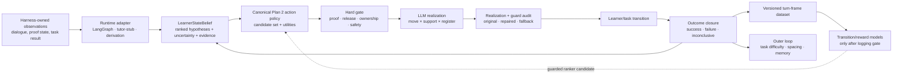
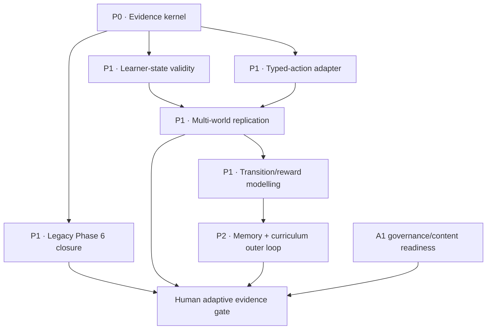

# Adaptive Tutor Implementation Plan

- **Date:** 2026-07-11
- **Status:** implementation in review; downstream claim runs remain gate-blocked
- **Starting point:** `preconscious@8f6f6baa` plus an unrelated in-progress DAG-dropout reporting repair
- **Source audit:** [Adaptive Tutor — State of the Evidence](2026-07-11-adaptive-tutor-state-of-evidence.html)
- **Claim boundary:** this plan can produce validated simulated adaptive control and a route to human evidence. It does not pre-authorize a human-learning, deployment, or “field theory validated” claim.

Read with:

- [Plan 2 genuine-adaptation implementation](../PLAN_2_0/GENUINE-ADAPTATION-IMPLEMENTATION-PLAN.md);
- [Plan 2 general-adaptation evidence plan](../PLAN_2_0/general-adaptation-evidence-plan.md);
- [Plan 3 dynamic-adaptation literature and completed audits](../PLAN_3_0/dynamic-adaptation-litreview.md);
- [PLAN 4.0 Phase 6 evidence gate](PHASE_6_EVIDENCE_GATE_PLAN.md);
- [architecture-aimed literature synthesis](../docs/explorations/literature/synthesis/adaptive-tutoring-strategy-gaps-2026-07-11.md).

## 1. Decision

Build by **consolidating and validating what already exists**, not by adding another adaptive architecture.

The canonical within-dialogue control kernel will be the existing Plan 2.x stack in `services/adaptiveTutor/`:

- `actionPolicy.js` already holds competing learner-state hypotheses, uncertainty, information-gain diagnosis, candidate scoring, state scramble, world constraints, and twenty typed pedagogical actions;
- `stateSchema.js` and `graph.js` already hold evidence IDs, exact-quote validation, supporting/contradicting evidence, hypothesis status and TTL;
- `adaptationContract.js`, `interventionLedger.js`, `outcomeObserver.js`, `realizationVerifier.js`, and `proofReleaseOwnershipGate.js` already separate state, selected action, realization, hard constraints, and observed consequence;
- `scripts/analyze-adaptation-belief-calibration.js` already computes top-k accuracy, Brier score, and calibration error;
- the state-scramble controls already collapse strict shift to `0/6` and `0/8` on the completed synthetic Plan 2.1 tests, showing that the current action choice is state-contingent in that bounded harness.

The three current surfaces will have distinct roles:

| Surface | Role in the programme | What it must not become |
|---|---|---|
| `services/adaptiveTutor/` | canonical state → action → guard → realization → outcome-closure kernel | another prompt-only persona system |
| Tutor-stub | low-cost experimental lab for learner profiles, register, formal proof progress, perturbations, and multi-policy comparisons | the production controller or evidence of human learning |
| Dramatic derivation / field planner | formal move-selection and proof-safety testbed; legacy Phase 6 closure experiment | proof that geometric field language is causally correct |

The implementation order is therefore:

1. seal the evidence substrate;
2. close the already-frozen legacy Phase 6 question before changing that planner;
3. validate the learner-state sensor;
4. adapt the existing Plan 2 action contract into tutor-stub and orthogonalise move/support/task/register;
5. run a multi-world confirmatory comparison;
6. fit transition and reward models only after identified logging exists;
7. integrate typed memory and curriculum selection only after within-session adaptation passes;
8. cross into human co-pilot and learner studies only after governance approval.

## 2. Non-negotiable programme rules

1. **No claim-bearing paid run before Phase 0 passes.**
2. **Run the legacy Phase 6 gate before refactoring `fieldPlanner.js`.** Otherwise the preregistered treatment changes before its test.
3. **Validate the state sensor before optimizing the policy.** A controller trained on classifier artifacts will optimize those artifacts.
4. **A policy is adaptive only when consequence closes.** State/action contingency is necessary but insufficient.
5. **Synthetic learners are stress instruments, not human effect estimators.** Ordinary Plan 3 SFS already showed non-selective simulator flipping (`SFS=0`); DAG-SFS worked only because public proof state and the scoring rule were harness-owned.
6. **Register is one action coordinate.** It must never substitute for instructional move, support, task, or difficulty.
7. **Use raw primary endpoints.** Weighted composites remain descriptive.
8. **Every phase has a kill rule.** A failed gate retires or demotes the mechanism; it does not trigger unconstrained tuning.
9. **No richer ontology, memory system, or learned controller earns priority merely by existing.** Each component must add held-out predictive or outcome value.
10. **Canonical-paper discipline remains binding.** Any empirical result enters `docs/research/paper-full-2.0.md` before a spin-off, talk, or external claim.

## 3. Target architecture



### 3.1 Canonical data contracts

The existing Plan 2 contracts remain the base. Extend additively rather than replacing them.

```text
LearnerStateBelief
  hypothesis[]: id, probability, evidence_ids, contradictions, status, expiry
  axes: proof, release, ownership, mastery, metacognition, affect
  task: knowledge_component, prerequisite_path, item_difficulty, discrimination
  uncertainty: entropy, calibration_band, next_discriminating_observation

PedagogicalAction
  action_type / move_family
  support_level
  task_or_knowledge_component
  item_difficulty
  register
  expected_evidence
  expected_transition
  fade_condition
  control_cost
  information_gain
  forbidden_moves

DecisionRecord
  full_candidate_set
  candidate_scores
  chosen_action
  selection_probability
  vetoes_and_repairs
  state_version, policy_version, model_version

OutcomeRecord
  predicted_transition
  observed_transition
  outcome: success | failure | inconclusive
  independent_evidence_ids
  next_policy_update
```

### 3.2 Shared experiment artifact contract

Every claim-bearing run, regardless of runner, must produce three distinct files:

```text
run-plan.json       write once before any model call
run-events.jsonl    append-only execution/resume event stream
run-seal.json       write once after closeout; artifact hashes and final state
```

Do not mutate one “manifest” through planned/running/completed states. The immutable plan records intent; the event stream records history; the seal records what actually exists.

## 4. Dependency graph



Phase 6 and the state/action work can proceed in parallel after Phase 0. Phase 6 must use the frozen legacy planner and its existing decision rules; it does not wait for the new action adapter.

## 5. Phase 0 — Evidence kernel

- **Priority:** P0
- **Engineering scale:** medium
- **Paid calls:** none
- **Workplan:** new `adaptive-eval-immutable-provenance`

### 5.1 Starting state

Commit `8f6f6baa` fixes one report blocker:

- a live tutor-stub QA plan is now create-once;
- `--from-dir` preserves an existing `qa-plan.json`;
- focused regression tests cover both behaviours.

This is necessary but not sufficient. Phase 6 still overwrites its manifest, tutor-stub policy draws are not all seedable, and neither system seals hashes, resume lineage, or artifact inventory.

### 5.2 Work packages

#### P0.1 Shared run artifact service

Create a small reusable service, tentatively `services/experimentRunArtifacts.js`, with:

- stable canonical JSON serialization;
- SHA-256 file/content hashing;
- exclusive create for plans and seals;
- append-only event writes;
- Git SHA, branch, and dirty-patch hash capture;
- requested, resolved, and observed model per role;
- runner, analyzer, policy, profile, prompt, world, and config hashes;
- master seed, per-job seed, and exact job order;
- parent/resume/superseded lineage;
- artifact inventory `{path, sha256, bytes, schema}`;
- a verifier that fails closed on drift or missing files.

Reuse patterns from:

- `services/evaluationStore.js` run snapshots;
- `services/evalSignature.js`;
- `scripts/package-poetics-run.js` and its tests;
- the new exclusive-create logic in `run-tutor-stub-qa-matrix.js`;
- Phase 6's existing Git/design manifest fields.

Migrate, without changing experimental semantics:

- `scripts/run-tutor-stub-qa-matrix.js`;
- `scripts/run-tutor-stub-auto-eval.js`;
- `scripts/run-derivation-phase6-gate.js`.

#### P0.2 Deterministic policy sampling

- replace tutor-stub policy/register `Math.random()` calls with a shared deterministic seeded sampler;
- derive each draw from `{run_seed, profile, policy, repeat, learner_turn, decision_kind}`;
- log the seed material, draw, distribution, and selected value;
- keep a compatibility flag only for replaying historical unseeded artifacts, never for new claim runs.

Reuse the repository's existing seeded implementations (`mulberry32`, `hashUnit`, or the deterministic dropout sampler) rather than adding a package dependency.

#### P0.3 Guard and repair accounting

Persist separately on every tutor turn:

- original candidate;
- guard matches, with rule and matched span;
- repaired candidate;
- final delivered response;
- deterministic-fallback flag and reason;
- policy/action selected before the guard;
- counterfactual action frequency for a guard-frequency-yoked control.

Reports must show repair/fallback exposure by policy and profile. Never call candidate guard matches learner-visible leaks.

#### P0.4 Report semantics and primary endpoints

- rename the current low-spread label from “robust across observed learners” to `low_cross_profile_dispersion`;
- reserve `robust` for a policy that passes both adequacy and non-inferiority thresholds;
- lead confirmatory reports with raw fixed-horizon coverage, grounded-by horizon, safety, repair, and fallback rates;
- keep the weighted outcome composite as secondary/descriptive;
- require the preregistration to identify one primary horizon and minimum effect before calls.

#### P0.5 Archive and clean-room replay

- package ignored raw artifacts into a checksummed archive location;
- add a small tracked evidence manifest under `config/adaptive-tutor-evidence/` linking run label, seal hash, archive URI/path, exclusions, and claim status;
- implement a clean-room replay command that reconstructs job order and seeded policy draws without model calls;
- verify report regeneration is read-only with respect to plan, events, raw rows, and seal.

### 5.3 Tests

- exclusive-create and `--from-dir` preservation;
- append-only event semantics;
- seal refusal on second write;
- seed stability and seed divergence;
- dirty-tree and clean-tree fingerprints;
- resume lineage and supersession;
- artifact checksum corruption detection;
- guard original/repair/fallback preservation;
- adequacy versus dispersion label cases;
- report regeneration byte-preserves the run plan and raw summaries.

### 5.4 Exit gate

Phase 0 passes only when one archived mock QA run can be reconstructed in a fresh temporary directory and the verifier proves:

- analysis changed no source artifact;
- job order and all policy draws reproduce;
- requested/resolved/observed models are present by role;
- all required code/config/prompt/policy/profile/world hashes exist;
- resume lineage is complete;
- every sealed artifact checksum matches;
- raw endpoint reports distinguish guard exposure, adequacy, and dispersion.

**Kill rule:** no claim-bearing Phase 6 or tutor-stub matrix runs if any part of the plan can still be overwritten or any stochastic policy draw is unreplayable.

## 6. Phase 1 — Split and close the Phase 6 questions

> **2026-07-11 protocol correction:** Sections 6.1–6.5 below preserve the
> original implementation intent, but the instruction to run that four-arm
> protocol unchanged is superseded. The audit proved that the named
> `hidden+proofDebt` control requires acts mode while the field-planner and
> report-only arms reject acts mode. The executable replacement is §6.6 and
> [the canonical Phase 6 plan](PHASE_6_EVIDENCE_GATE_PLAN.md).

- **Priority:** P1
- **Engineering scale:** small after Phase 0
- **Paid calls:** attended, staged
- **Workplan:** existing `field-planner-phase6-gate`

### 6.1 Why this happens before refactoring

The four-arm gate already preregisters the current hand-coded planner. Changing its action schema, field dimensions, or candidate scoring before the run would test a different treatment. Freeze the current planner at a clean committed SHA, adopt the Phase 0 artifact contract, reconcile the world list, and run the existing decision rules unchanged.

### 6.2 Final preflight

- add or explicitly exclude `world-019` / resistant-world coverage; record the choice before calls;
- confirm four distinct arms: baseline, field-report-only, advisory, enforce;
- freeze raw primary outcomes: grounded anagnorisis and hard safety/release adherence;
- retain turns-to-grounded and field diagnostics as secondary;
- prove the report-only arm has information but no conduct authority;
- run focused Phase 6 and field-planner tests;
- write the run plan and seal through Phase 0 infrastructure.

### 6.3 Execution ladder

1. dry plan, zero calls;
2. deterministic mock smoke;
3. one real row per arm to verify model routing and artifact closure;
4. `k=5` per arm/world directional gate;
5. proceed to `k=10` only if a promotable local contrast remains and the preregistered decision rule calls for it.

### 6.4 Frozen interpretations

- baseline ceiling → `ceiling`; do not add a harder world post hoc under the same run label;
- report-only matches planner arms → instrumentation/context effect, not planner control;
- enforce improves grounding but harms release/safety → negative control;
- advisory helps but enforce does not → recommendation value without authority value;
- enforce passes all rules → bounded evidence for the current hand-coded controller on the named formal failure mode.

No outcome validates “field theory,” human learning, or model-independent robustness.

### 6.5 Exit gate

Produce a sealed four-arm artifact and a verdict of exactly one of:

- `promote_bounded_controller`;
- `instrumentation_effect`;
- `negative_control`;
- `ceiling`;
- `null`;
- `invalid`.

Then freeze the legacy planner result. Later action-schema work starts from a new version and must not rewrite the Phase 6 verdict.

### 6.6 Executable replacement: Phase 6A and Phase 6B

The correction happened before any claim-bearing four-arm real dataset existed.

**Phase 6A** is a non-acts controller-feasibility gate. It freezes Marrick,
Hethel, and Marrick-resistant; the non-acts hidden-pacing base; four arm deltas;
the full staged decay object; numerical benefit, placebo, safety,
instrumentation, and negative-transfer thresholds; and a deterministic verdict
precedence. Seeds 1–5 can yield only `provisional_promote`. Seeds 6–10 run only
after that result, and local promotion requires both blocks and pooled k=10 to
pass.

**Phase 6B** is the eventual true comparison with production
`hidden+proofDebt`. It remains blocked until an acts-compatible planner consumes
only a validated public or tutor-reconstructed learner-state view and a leak
audit proves that the true board, proof distance, frontier, and decay ledger do
not cross the acts-mode redaction boundary. Phase 6A cannot substitute for
Phase 6B.

## 7. Phase 2 — Learner-state validity benchmark

> **2026-07-11 benchmark correction:** Sections 7.1–7.7 describe the first
> benchmark design. Its 12-row result says only that those proxy candidates did
> not earn promotion. It did not contain a true no-state baseline or the exact
> live last-four DAG/field/risk trajectory, and its generator/model/source axes
> were confounded. The replacement critical path is §7.8 and
> `config/adaptive-state-benchmark-v2.yaml`.

- **Priority:** P1
- **Engineering scale:** large
- **Paid calls:** mostly none; limited generation only after offline fixtures pass
- **Workplan:** new `tutor-stub-learner-state-validity`

### 7.1 Question

Does a learner-state representation predict a held-out observable better than a lean difficulty-aware belief state?

This phase validates the sensor, not the policy. It compares representations while holding the prediction task and data split fixed.

### 7.2 Representations

1. **Lean baseline:** knowledge component, prerequisite status, learner ability/mastery, item difficulty/discrimination, confidence, and last public evidence.
2. **Existing Plan 2 belief:** competing hypotheses, axes, entropy, evidence and contradiction ledger.
3. **PLAN_4_0 fields:** learner/tutor/discourse/joint dimensions and dynamics.
4. **Ablations:** field without dynamics, belief without affect, belief without task difficulty.
5. **Placebos:** deterministic state scramble, shuffled evidence IDs, stale state.
6. **Oracle:** harness-owned latent state where available; upper bound only.

### 7.3 Prediction targets

- next error family;
- next proof/evidence edge adopted;
- targeted-feedback uptake;
- whether the next move is learner-owned;
- task success at a frozen horizon;
- whether a diagnostic question resolves the top-hypothesis ambiguity;
- later, independent unassisted task performance.

Do not use a prose judge as ground truth when the harness owns the event.

### 7.4 Data tiers

#### Tier A — formal synthetic ground truth

Reuse rather than regenerate:

- adaptive trap and counterfactual scenario metadata;
- Plan 2 state-scramble fixtures;
- Plan 3 ordinary SFS as a negative simulator-validity result;
- Plan 3 DAG-SFS as a positive public-proof-state instrument;
- tutor-stub DAG dropout/re-adoption events;
- formal proof-DAG transitions and release outcomes.

#### Tier B — independent simulator triangulation

Use at least two independently constructed learner-generation families with latent state separated from language realization. Treat disagreement as uncertainty. More persona prose is not a valid second family.

#### Tier C — authentic dialogue slice

Build only from consented or otherwise authorized human interactions. Double-code learner error, evidence use, uptake, and ownership; report coder agreement. If no authentic slice is legally available, Phase 2 can pass only the synthetic-instrument tier and the controller claim remains correspondingly bounded.

### 7.5 Implementation surfaces

Prefer adapters and analyzers over a second state engine:

- add a tutor-stub turn-frame → `LearnerStateBelief` adapter;
- extend `analyze-adaptation-belief-calibration.js` for next-event log loss, Brier score, ECE, and grouped holdouts;
- add a lean difficulty-aware baseline module;
- add versioned benchmark export and split manifests;
- group splits by world/scenario family, learner source, and model family—never random adjacent turns from the same dialogue;
- record feature provenance and missingness.

Suggested new files:

```text
services/adaptiveTutor/tutorStubStateAdapter.js
services/adaptiveTutor/difficultyAwareBelief.js
scripts/export-adaptive-state-benchmark.js
scripts/analyze-adaptive-state-validity.js
config/adaptive-state-benchmark.yaml
tests/adaptiveStateValidity.test.js
```

### 7.6 Metrics

- multiclass log loss;
- Brier score;
- expected calibration error and reliability plots;
- top-1/top-k next-event accuracy;
- precision/recall for rare failure modes;
- incremental value over the lean baseline;
- performance by held-out world, learner source, and model family;
- abstention coverage/accuracy curve.

### 7.7 Exit and kill gates

**Pass:** at least one representation is calibrated and improves held-out prediction over the lean baseline across more than one world and model/learner family, without relying on a self-scoring channel.

**Demote fields:** full fields fail to improve held-out log loss/Brier over the lean state or lose under state-scramble controls. Retain them for visualization only.

**Stop:** no representation clears the lean baseline or the authentic slice reverses the synthetic ordering. Do not proceed to policy learning; improve measurement/data instead.

### 7.8 Benchmark v2 critical path

The corrected question is whether the tutor's **exact live public learner-state
projection** predicts world-general next-turn events beyond progressively
simpler rungs. Runtime and benchmark now share one pure DAG/field/trajectory
projection with parity tests.

The nested ladder is:

1. `no_state`: frozen task metadata, turn, and common action only;
2. `lean_dag`: current world-general public DAG state, without local fact IDs or
   learner text;
3. `dag_trajectory`: lean DAG plus exact public DAG/risk trajectory;
4. `field_trajectory`: DAG trajectory plus exact classifier field and full
   last-four trajectory;
5. matched cross-dialogue scramble and one-turn stale controls;
6. oracle latent transition distribution, upper-bound only.

Only two harness-owned co-primary targets bind the gate:

- `next_dag_event_family`: retract, derive, adopt, or none;
- `next_proof_trajectory`: advance, regress, or stall.

The data design is a bounded 3 × 2 × 2 crossing:

- Marrick, Hethel, and Ravensmark proof geometries;
- generalized durable-state and DAG-dropout/readoption transition kernels;
- `codex.gpt-5.6-terra` and `claude-code.sonnet` language realizers.

One seed-balanced six-action schedule is common to every representation. There
is no tutor-policy, profile, judge, or target sweep.

The staged envelope is:

- S0: 24 free contract dialogues, 144 transitions;
- S1: 24 technical-pilot dialogues, 144 transitions, 168 base calls; excluded
  from confirmation;
- S2: 6/cell only after a frozen 5,000-simulation power pass (72 dialogues, 504
  calls), otherwise 8/cell (96 dialogues, 672 calls). If 8/cell is
  underpowered, stop and redesign.

Including pilot, the paid ceiling is 96 or 120 dialogues and 672 or 840 base
calls. Representations are computed offline on the same transitions and add no
calls.

Analysis uses separate world-, generator-, and realizer-transfer lanes, one
small L2 multinomial head, whole-dialogue bootstrap, log loss, Brier, and ECE.
The oracle must first validate the instrument. Then choose the simplest rung
that beats no-state and matched controls across both targets without transfer
failure. Valid outcomes are no sensor, lean DAG only, DAG trajectory, or full
field trajectory—not only a global winner/null.

## 8. Phase 3 — Orthogonal pedagogical action contract

- **Priority:** P1
- **Engineering scale:** medium
- **Paid calls:** none for the build; small smokes after Phase 2
- **Workplan:** new `tutor-stub-typed-pedagogical-actions`

### 8.1 Reuse, do not rebuild

The existing `ADAPTATION_ACTIONS` registry already includes diagnosis, prediction, evidence request, strategy choice, contrast, fade, minimal hint, cognitive-load reduction, overconfidence repair, challenge, reanchoring, explanation, worked example, withholding, and relational repair.

The work is to:

- expose these actions through tutor-stub and, after Phase 1, a derivation adapter;
- add orthogonal task/support/register fields;
- make candidate and selection logging identified;
- strengthen outcome evidence and scaffold fading.

### 8.2 Additive schema version

Extend `PedagogicalAction` to a new additive version with:

- `move_family` mapped from existing `action_type`;
- `support_level` on a small ordinal scale;
- `task_id`, `knowledge_component`, `prerequisite_path`, and `item_difficulty`;
- `register`, selected independently from the move;
- `expected_evidence` and machine-checkable success/failure indicators;
- `fade_condition`, `independent_work_window`, and `responsibility_owner`;
- complete candidate set, scores, vetoes, and selection probability.

Maintain backward readers for existing Plan 2 traces.

### 8.3 Minimal experimental action families

Do not run a twenty-action factorial. Start with five distinguishable families drawn from the existing registry:

1. diagnose / elicit;
2. minimal hint / lower load;
3. explain / worked example;
4. request evidence / self-explanation;
5. fade / withhold / transfer responsibility.

### 8.4 Closed-loop scaffolding state

Compose existing action and human-scaffold components into a small state machine:

```text
diagnose → support → observe uptake → fade → independent work → transfer or recover
```

Every transition records:

- entry evidence;
- support level;
- expected uptake;
- observed uptake;
- fade reason;
- independent-work result;
- recovery action;
- ownership transfer.

The existing outcome ledger remains authoritative; do not create another free-form “scaffold field.”

### 8.5 Adapters

Suggested adapters:

```text
services/adaptiveTutor/tutorStubActionAdapter.js
services/dramaticDerivation/adaptiveActionAdapter.js   # only after Phase 1 closes
```

Tutor-stub's current response-configuration axes remain useful for realization. The adapter maps canonical move/support/task decisions into those axes while register stays separately controllable.

### 8.6 Required controls

- strong fixed action policy;
- state-blind action-frequency-yoked policy;
- seeded random policy over the safe candidate set;
- scrambled-state policy;
- oracle-state upper bound on formal fixtures;
- move-adaptive / register-fixed;
- move-fixed / register-adaptive;
- support-adaptive / move-and-register-fixed;
- guard-frequency-yoked output control.

### 8.7 Exit gate

Deterministic fixtures must prove that state, move, support, task/difficulty, and register can each be manipulated independently, with:

- the expected action selected before prose;
- no proof/release/ownership drift;
- complete candidate/propensity trace;
- outcome closure on the next observable;
- scaffold fading and independent-work windows exercised;
- backward trace readers still green.

Claim-bearing policy comparison waits for Phase 2's sensor pass.

## 9. Phase 4 — Confirmatory multi-world policy replication

- **Priority:** P1
- **Engineering scale:** medium-to-large
- **Paid calls:** yes, preregistered and attended
- **Workplan:** new `tutor-stub-multiworld-policy-replication`

### 9.1 Question

Does state-contingent pedagogical action selection improve formal, fixed-horizon outcomes beyond strong simple and action-frequency-matched controls, across worlds and learner sources?

This is not a repeat of the exploratory register-policy matrix.

### 9.2 Design requirements

- at least three proof geometries/worlds;
- at least two independent learner-generation families, plus formal deterministic learners where available;
- tutor, learner, and analyzer roles separated by model family for at least one full replication block;
- seeded blocked/interleaved arm order;
- pressure probe × no-probe factorial;
- fixed primary horizon chosen before calls;
- staged `n=1` route canary, `n=3` smoke, then at least `n=5` per cell; claim scale determined by a frozen precision/power calculation rather than convenience;
- no tuning on the held-out worlds.

### 9.3 Arms

Use a sequential design, not the full Cartesian product. First screen mechanism controls on deterministic/formal fixtures. Carry only the decisive arms into paid model-family replication.

Mechanism-control pool:

1. strong fixed guarded tutor;
2. state-blind action-frequency-yoked control;
3. state-scramble control;
4. adaptive move with fixed plain register;
5. fixed move with adaptive register;
6. adaptive move + adaptive register;
7. oracle-state upper bound on formal worlds only.

The paid confirmatory core should normally be only:

- strong fixed;
- frequency-yoked;
- adaptive move with fixed register;
- state-scramble.

Run the fixed-move/adaptive-register and adaptive-move/adaptive-register pair as a second, smaller factor-isolation block only if adaptive move clears the first gate. Oracle remains a formal-fixture upper bound. Do not include every historical register policy in the confirmatory matrix; retain separate exploratory appendices if needed.

### 9.4 Primary outcomes

- proof coverage at the preregistered horizon;
- grounded-by-horizon rate;
- hard safety and unreleased-premise integrity;
- independent-work success after scaffold fade;
- assistance dependence / tutor-control cost;
- repair and deterministic-fallback exposure.

Secondary:

- trajectory AUC;
- outcome-closure success/failure/inconclusive mix;
- calibration and diagnostic information gain;
- register/process measures;
- weighted composite.

### 9.5 Analysis

- policy × learner × world × model interaction estimates;
- cluster bootstrap or hierarchical partial pooling;
- uncertainty intervals on raw endpoints;
- guard-exposure sensitivity analysis;
- assigned-policy and realized-policy estimands;
- simulator-family sensitivity;
- preregistered minimum meaningful effect;
- no aggregation across incompatible artifact schemas or model provenance.

### 9.6 Exit and kill gates

**Pass:** a state-contingent action arm beats both the strong fixed and frequency-yoked controls on a raw formal outcome, with no safety loss, and the direction survives held-out worlds plus a second learner/model family.

**Heterogeneity only:** policies cross by learner but none beats the strong controls. Retain personalization as a hypothesis; do not call it successful adaptation.

**Close register efficacy:** adaptive register does not improve the fixed-move arm. Keep register for realization/usability, not the efficacy controller.

**Stop:** gains disappear under state scramble, guard-exposure matching, or held-out worlds; write the failure family and do not enlarge the policy.

## 10. Phase 5 — Transition/reward models and guarded ranking

- **Priority:** P1
- **Engineering scale:** large
- **Paid calls:** data collection only; model fitting offline
- **Workplan:** existing `tutor-stub-transition-reward-model`

### 10.1 Preconditions

Do not start because a turn-frame table exists. Start only when:

- Phase 2 validates at least one state representation;
- Phase 3 logs complete candidates and probabilities;
- Phase 4 supplies multi-world, multi-source transitions and raw outcomes;
- safe-action overlap/positivity is sufficient for comparison.

The earlier Paper 2 learned-policy OPE failed to beat the strongest implicit base and lacked logged propensities. This phase must answer a different, identified question rather than repeat that generic policy-learning arc.

### 10.2 Dataset contract

Version a stable export from `tutor_stub_turn_frames` / `v_tutor_stub_turn_training` containing:

- pre-action state and uncertainty;
- task/KC/difficulty;
- complete safe candidate set;
- candidate features and scores;
- selected action and propensity;
- guard/veto/repair/fallback path;
- observed next state;
- raw reward components;
- world/profile/model/version groups;
- artifact and dialogue hashes.

Introduce only bounded, seeded exploration within the safe candidate set. Record exact propensities. Abort OPE when overlap or effective sample size is inadequate.

### 10.3 Model ladder

1. constant and strong-fixed baselines;
2. ridge / logistic transition models;
3. shallow tree / GBM models;
4. doubly robust or cross-fitted policy evaluation if identification gates pass;
5. guarded learned ranker inside the existing veto layer.

No end-to-end RL, DPO, neural policy, or tutor fine-tuning in this phase.

### 10.4 Splits and comparisons

- leave-one-world/scenario-family-out;
- held-out learner source/profile;
- held-out model family;
- temporal split for drift;
- hand-coded planner;
- strong fixed;
- action-frequency-yoked;
- learned ranker;
- learned ranker + deterministic veto.

### 10.5 Exit and kill gates

**Pass:** transition predictions calibrate out of sample and a guarded learned ranker improves a predeclared raw outcome over strong fixed/yoked controls without safety loss.

**Model-only result:** transition prediction improves but policy value does not. Keep the model for diagnosis, not control.

**Stop:** overlap/ESS is insufficient, held-out calibration fails, or estimated advantage reverses under grouped cross-fitting. Do not solve this by adding a larger model.

## 11. Phase 6 — Typed memory and curriculum outer loop

- **Priority:** P2
- **Engineering scale:** large
- **Paid calls:** limited shadow evaluation
- **Workplan:** new `adaptive-curriculum-memory-controller`

### 11.1 Reuse existing bounded components

- in-session evidence/hypothesis TTL in `adaptiveTutor`;
- `services/adaptiveTutor/characterState.js` where evidence-backed;
- `services/dramaticDerivation/taskMastery.js` task recommendations;
- `services/dramaticDerivation/humanHandoff.js` advisory/hybrid/human recommendations;
- archived task-loop and handoff gate scripts/tests;
- `learnerMemoryService.js` only as a source of tested storage ideas, not as a wholesale live dependency;
- the longitudinal-drift line as evidence that narrative/Writing-Pad injection can be broken or null even when content exists.

### 11.2 Minimal memory record

```text
claim
knowledge_component
evidence_ids
source
confidence
valid_from / valid_until
supersedes
contradictions
retrieval_reason
action_preconditions
schema_version
```

The store must support abstention, supersession, contradiction, expiry, and a public evidence trail. No opaque narrative or vector memory is allowed to control policy without these fields.

### 11.3 Outer-loop actions

- repeat prerequisite;
- retrieve after spacing interval;
- interleave knowledge components;
- choose worked example versus independent problem;
- raise/lower item difficulty;
- schedule near/far transfer;
- fade support;
- recommend human handoff.

### 11.4 Required controls

- no-memory;
- current-valid-memory;
- stale-memory placebo;
- contradictory-memory conflict;
- irrelevant retrieved memory;
- fixed task sequence;
- mastery/difficulty adaptive sequence;
- human/advisory shadow mode.

### 11.5 Exit and kill gates

**Synthetic pass:** task/memory control improves held-out independent transfer proxies without proof-control drift, and stale/contradictory memory is rejected or abstained from.

**Human pass:** delayed unassisted performance improves over no-memory/fixed sequence.

**Stop:** benefit exists only during assisted closure, or stale memory harms performance. Do not expand memory breadth.

## 12. Phase 7 — Human boundary

- **Priority:** governance P0; adaptive study P2 until prerequisites pass
- **Engineering scale:** existing pilot infrastructure plus new study instrumentation
- **Workplan:** existing blocked `a1-human-learner-validation` plus new `adaptive-tutor-copilot-shadow-pilot`

### 12.1 Governance boundary

The existing A1 infrastructure is engineering-complete but recruitment remains blocked on IRB approval, consent, real item content, preregistration, and study operations. No synthetic result clears that blocker.

The existing A1 three-arm study is not automatically an adaptive-controller test. Do not silently replace its arms. Treat it as the human-learning foundation or run the adaptive study as a separately preregistered follow-up.

### 12.2 Stage H1 — Tutor co-pilot shadow

Before autonomous adaptation:

- show human tutors the recommended move, evidence, confidence, and one alternative;
- log accept, modify, reject, and reason;
- keep the human in final control;
- compare predicted transition with the actual next learner event;
- calibrate state and action confidence from overrides;
- audit subgroup and safety patterns.

This is the fastest authentic supervision path and does not require the controller to speak directly to learners.

### 12.3 Stage H2 — Guarded learner trial

Preregister a comparison of:

- guarded strong nonadaptive tutor;
- guarded adaptive tutor using the validated state/action kernel;
- optional human/co-pilot arm if feasible.

Required endpoints:

- pretest-adjusted immediate unassisted posttest;
- delayed retention, preferably one week;
- near and far transfer;
- hint/support dependence;
- calibration and self-regulation;
- learner agency and affect;
- safety and subgroup effects;
- time and effort.

Assisted dialogue success is secondary.

### 12.4 Exit gate

The project may claim a properly adaptive tutor only if adaptive selection improves independent learning or transfer over a guarded nonadaptive comparator, survives retention/safety checks, and the state/action mechanism remains calibrated on authentic transitions.

If this gate fails, retain the system as an evidence-aware tutor/co-pilot or research instrument rather than relabeling assisted performance as learning.

## 13. Workplan translation

Implementation has now translated these dependencies and stop rules into
`workplan/`. The board is rendered and validated from the item files; this
section records what was created or reconciled.

### 13.1 New cards

| ID | Priority | Depends on | Verification summary |
|---|---:|---|---|
| `adaptive-eval-immutable-provenance` | P0 | — | clean-room replay reproduces hashes/order/draws; plan/events/seal are immutable and checksummed |
| `tutor-stub-learner-state-validity` | P1 | provenance | lean vs Plan 2 vs fields vs scramble benchmark on grouped holdouts with calibration and authentic slice where available |
| `tutor-stub-typed-pedagogical-actions` | P1 | provenance | canonical Plan 2 actions exposed through adapters; move/support/task/register factors and controls manipulate independently |
| `tutor-stub-multiworld-policy-replication` | P1 | provenance, state validity, typed actions | preregistered multi-world/multi-source matrix reports raw endpoints, intervals, guard exposure, and held-out verdict |
| `adaptive-curriculum-memory-controller` | P2 | transition/reward | typed memory + task controller passes stale/conflict/abstention/fading tests and held-out transfer shadow gate |
| `adaptive-tutor-copilot-shadow-pilot` | P2/blocked | controller gates + human governance | recommendation/override study with authentic transition and independent outcome reporting |

### 13.2 Existing cards

- `field-planner-phase6-gate`: is now the triaged Phase 6A non-acts
  feasibility experiment with a frozen executable verdict contract;
  `field-planner-acts-safe-promotion-gate` preserves the blocked Phase 6B
  production hidden+proofDebt question.
- `tutor-stub-transition-reward-model`: now depends on multi-world replication, is blocked upstream, and requires logged propensities, overlap/ESS, grouped cross-fitting, and guarded learned-vs-yoked comparison.
- `a1-human-learner-validation`: remains blocked and P0; its governance and human-learning design were not diluted.
- `tutor-stub-headroom-contrast`: closed as exploratory evidence with model, guard, provenance, and post-hoc fixed-horizon limits recorded.
- `abm-learner-population`: closed at the failed yield-manipulation stop; it is not a simulator-validity prerequisite.
- `longitudinal-drift-adaptation`: closed as a bounded negative/instrument audit; its plumbing, not its claim, is reusable.
- `tutor-stub-human-discourse-layer`: targeted Marrick/fake-CLI and regression checks pass; closed as methods infrastructure, not efficacy evidence.
- archived task-loop/handoff cards remain archived; link and reuse their code rather than reopening their claims.

### 13.3 Milestone

Implemented milestone:

```yaml
id: adaptive-tutor-evidence-v1
title: Adaptive tutor evidence v1
target: 2026-09-30
status: active
description: Immutable evidence, validated learner state, orthogonal actions, Phase 6 verdict, multi-world replication, and a first identified transition controller.
```

Keep A1 under `human-pilot-prep`. Do not invent a human adaptive-study deadline while IRB remains unresolved.

## 14. Verification ladder

### Per change

```bash
node --check <changed-js>
node --test <focused-tests>
git diff --check
```

### Per work package

```bash
npm run test:hermetic
npm run lint
npm run provenance:validate
npm run audit:message-chain
```

### Workplan changes

```bash
node scripts/workplan.js render
node scripts/workplan.js validate
node scripts/workplan.js check
```

### Claim-bearing run

- clean committed SHA;
- sealed run plan before calls;
- attended canary and quota check;
- raw primary endpoint script frozen;
- exact model and rubric filters;
- architecture-independent outcome where available;
- report plus run seal and tracked evidence-manifest pointer;
- canonical paper update only after the decision rule is applied.

## 15. Parallel execution lanes

After Phase 0, safe parallelism is:

| Lane | Work | Merge constraint |
|---|---|---|
| A | Phase 6A protocol and runner; Phase 6B acts-safe adapter design | 6A uses non-acts hidden pacing; 6B remains blocked on reconstructed state |
| B | exact-state benchmark v2 and crossed latent generators | no paid pilot until S0 oracle/control/leakage gates pass |
| C | action-schema adapter and deterministic fixtures | build offline; no claim run before sensor gate |
| D | A1 governance/content | independent human/legal track |

Transition modelling waits for B+C+multi-world data. Memory/outer-loop waits for transition/policy identification. Human adaptive evaluation waits for governance plus the controller gates.

## 16. First implementation slice — execution record

Implementation was authorized on 2026-07-11. The slice resolved as follows:

1. Kept the unrelated dirty checkout isolated from this programme.
2. Created `codex/adaptive-tutor-implementation` in a sibling worktree from the then-current `preconscious@8f6f6baa`.
3. Created the milestone/cards, updated dependencies and stop states, then rendered and validated the board.
4. Added fail-closed tests for immutable plans, append-only events, exclusive seals, nested lineage, corruption, and replay.
5. Implemented the shared run-artifact service and migrated tutor-stub QA.
6. Migrated Phase 6 plumbing, found that the original hidden+proofDebt
   treatment was incompatible with every field arm, then prospectively split
   Phase 6A from the blocked Phase 6B production comparison.
7. Seeded tutor-stub policy/register draws and added exact replay contracts.
8. Persisted original, repaired, fallback, delivered, and final-audit guard records.
9. Corrected dispersion/adequacy, failed-row accounting, fixed-horizon endpoints, and guard coverage.
10. Packaged the fake-CLI mock QA run and checksum-verified clean-room restore plus read-only report regeneration.
11. Did **not** execute a staged real Phase 6 gate. Phase 6A is engineering-ready
    but still awaits an attended clean-SHA paid run; Phase 6B remains blocked.
12. Implemented the learner-state and Plan 2 action-adapter lanes. The v1 formal
    proxy returned `not_passed / do_not_optimize_policy`, so Phase 4 and every
    learned or human-adaptive downstream lane remain blocked pending v2.
13. Extracted the exact live DAG, classifier-field, DAG/risk, and last-four
    trajectory projection into one pure service shared by runtime and benchmark.
14. Corrected missing observations that previously became false zero-valued
    slopes, and added frozen parity/behavior tests.
15. Froze benchmark v2's 3-world × 2-kernel × 2-realizer critical path, nested
    representations, matched controls, strict oracle/proof-transition
    provenance, two harness targets, and six/eight-per-cell confirmation cap.
16. Added an immutable zero-call planning transaction and a deterministic
    five-verdict sensor evaluator over precomputed world/generator/realizer
    lanes. The cross-world kernel adapters, sequential realizer executor, and
    confirmation data remain to be implemented/run.
17. Froze and implemented Phase 6A's complete non-acts flags, decay process,
    numerical thresholds, instrumentation/manipulation gates, k=5 parent
    requirement for k=10, and deterministic report/seal verdict.

## 17. Things deliberately not scheduled

- a richer field ontology;
- more ego/superego or critic layers;
- another persona-prompt suite;
- a universal “best” register policy;
- narrative or vector memory with no evidence/expiry contract;
- neural policy, end-to-end RL, DPO, or tutor fine-tuning;
- a giant all-factors factorial;
- autonomous human deployment;
- a paper claim based only on synthetic profile separation, state/action contingency, or assisted closure.

Those become reconsideration candidates only when a preceding kill gate identifies a specific missing capability that they uniquely address.

## 18. Definition of programme success

The programme succeeds in stages:

1. **Reproducible adaptive experiment:** a clean-room replay proves exactly what ran.
2. **Valid sensor:** learner state predicts held-out observables beyond a lean baseline.
3. **Identified action:** move/support/task/register effects are separable.
4. **Successful simulated controller:** adaptive selection beats strong fixed and yoked controls on raw formal outcomes across held-out worlds/sources.
5. **Learned improvement:** a guarded learned ranker adds out-of-sample value with identified logging and no safety loss.
6. **Longitudinal improvement:** typed memory/task selection improves delayed independent performance without stale-memory harm.
7. **Proper adaptive tutor:** authentic learners show better unassisted learning, retention, or transfer than under a guarded nonadaptive tutor.

Stopping at any earlier stage is still a valid result. It defines what the machine can do without inflating the claim.

## 19. Implementation checkpoint — 2026-07-11

- **Phase 0 engineering is implemented:** immutable plan/events/seal transactions,
  deterministic sampling, strict requested/resolved/observed role provenance,
  guard accounting, fixed-horizon raw endpoints, package/restore, and
  byte-preserving derived reports have fake-model and mock coverage. Repository
  manifest `phase0-mock-qa-evidence-v1-61ceb224bb43` points to a bounded
  fake-CLI QA archive after checksum verification. Its fresh-directory restore
  independently verifies the QA parent and semantic learner-profile child,
  including exact job/draw replay, complete artifact inventories, and
  tutor/learner/analyzer model-role plumbing observations emitted through the
  fixed shim. No remote model ran. This fixture tests methods only; its manifest
  explicitly excludes model-quality, state-validity, policy-effect, learning,
  and provider-attestation claims.
- **Phase 6 is split before real calls:** Phase 6A now freezes an executable
  non-acts hidden-pacing feasibility test, its complete decay process, and
  numerical verdict contract. Phase 6B retains the original production
  question and remains blocked on an acts-safe reconstructed-state adapter; the
  true learner board cannot be passed around that redaction boundary. No paid
  rows or verdict were produced.
- **The v1 sensor proxy is not passed; the live sensor has not yet been fairly
  tested:** the 12-row fixture remains a useful negative instrument audit, but
  it lacked a no-state baseline, exact runtime trajectory, independent crossed
  generator/model axes, and nondegenerate world-general targets. Runtime and
  benchmark now share one pure DAG/field/trajectory projection with parity
  tests. Benchmark v2 freezes the 3-world × 2-kernel × 2-realizer critical path,
  nested sensor ladder, two primary targets, staged call ceiling, and stop
  rules. Its S0/S1/S2 data have not yet been generated, so no new sensor verdict
  exists.
- **Phase 3 engineering is in review:** the Plan 2 action registry is exposed
  through a default-off tutor-stub adapter with separate move, support, task,
  difficulty, and register axes; complete candidate/propensity provenance;
  next-observation outcome closure; and a bounded diagnose → support → uptake →
  fade → independent-work → transfer/recover lifecycle.
- **Phase 4 is explicitly blocked:** no multi-world paid policy comparison may
  launch until a new preregistered sensor dataset clears the upstream validity
  gate. Transition learning, memory/curriculum control, and human adaptation
  remain behind their original dependencies.

This checkpoint is an engineering result, not an efficacy result. It records a
failed **v1 proxy benchmark**, not a failure of the exact live sensor, and keeps
the larger policy-optimization programme gate-blocked. A future Phase 4 runner
must require a sealed passing v2 sensor report before that governance block can
become an executable runtime gate.
