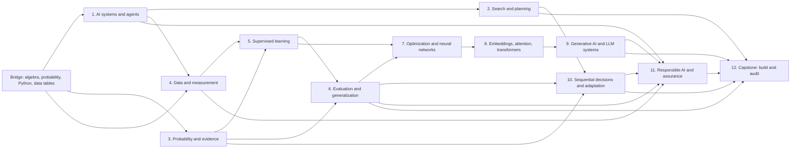

# AI Foundations: Curriculum and Technical Specification for an Evidence-Bearing Adaptive Tutor

## Executive decision

The first learner-facing curriculum should not be a broad conversational course called “Learn AI with a chatbot.” It should be a **bounded, technical AI-foundations curriculum whose learner work is inspectable at each step**.

The proposed course, **AI Foundations: Models, Evidence, and Responsible Systems**, is designed around five commitments:

1. Learners construct artifacts that can be checked: search traces, probability calculations, data schemas, code, model evaluations, attention calculations, risk registers, and system cards.
2. The tutor separates diagnosis, pedagogical action selection, linguistic realization, verification, and outcome closure.
3. Conceptual understanding is tested through application and transfer, not merely recognition or fluent explanation.
4. Responsible-AI reasoning is integrated into technical modules rather than isolated in one ethics lecture.
5. Adaptation must beat a strong fixed scaffold while preserving correctness, learner ownership, and the option not to intervene.

The full curriculum contains a bridge and twelve substantive modules, approximately seventy knowledge components, a prerequisite graph, an item and verifier architecture, and a capstone in which the learner builds and audits a bounded AI system. The recommended product MVP is a 24–30 hour vertical slice centered on **problem formulation, data, supervised learning, and valid model evaluation**.

This shape reflects four external curriculum anchors. CS2023 treats AI as a combination of representation, reasoning, search, machine learning, applications, and societal impact, and explicitly emphasizes valid train/validation/test procedures, overfitting, generative models, and integrated ethical analysis [S1]. AI4K12 organizes foundational understanding around perception, representation and reasoning, learning, natural interaction, and societal impact [S2]. UNESCO’s student framework combines a human-centred mindset, ethics, techniques and applications, and system design across understand–apply–create levels [S3]. NIST’s AI Risk Management Framework supplies a practical structure for governing, mapping, measuring, and managing AI risk [S4].

The curriculum also responds directly to the tutoring literature. Free-form LLMs do not reliably reproduce the adaptivity of explicit tutoring systems [S5], perform poorly on step-level diagnosis and next-action selection [S6], and strongly over-intervene when non-intervention is appropriate [S7]. Hybrid systems such as MWPTutor and LeanTutor illustrate the value of retaining explicit pedagogical and formal-verification machinery while using language models for flexible interaction [S8][S9].

---

## 1. Product and research objective

### 1.1 Product objective

Build a domain-grounded adaptive tutor that can help a technically capable beginner progress from informal ideas about AI to the ability to:

- formulate a bounded AI problem;
- represent and reason about a problem computationally;
- train and evaluate simple predictive models;
- explain the mechanics and limitations of neural and generative models;
- recognize invalid evaluation, leakage, overfitting, and distribution shift;
- document intended use, evidence, limitations, and risks;
- make justified decisions about whether an AI approach is appropriate.

The product’s distinctive value is not generated exposition. It is the **evidence-bearing control loop**:

```text
learner artifact
    -> mechanically grounded evidence
    -> calibrated knowledge and interaction state
    -> bounded pedagogical action
    -> verified response
    -> observable learner outcome
    -> updated mastery and policy state
```

### 1.2 Research objective

Use the curriculum as a controlled environment for studying whether explicit adaptation improves:

1. state validity;
2. pedagogical-action validity;
3. realization fidelity;
4. independent learner progress;
5. near and far transfer;
6. delayed retention;
7. learner agency and productive struggle.

The primary comparison is not an intentionally weak tutor. It is a **strong fixed mastery tutor using the same content, verifiers, and scaffold library**. A free-form LLM tutor can be retained as a benchmark arm, but the causal product question is whether the adaptive controller adds value over a good non-personalized policy.

### 1.3 Non-goals for the first release

The first release will not:

- claim to teach all of artificial intelligence;
- cover production-scale model training;
- use sensitive learner data or high-stakes decision domains;
- infer stable personality traits from dialogue;
- treat a polished explanation as proof of mastery;
- allow an LLM to determine mathematical or program correctness when a deterministic verifier is available;
- optimize engagement, sentiment, or course completion as substitutes for learning;
- train an unrestricted end-to-end reinforcement-learning tutor.

---

## 2. Audience, entry routes, and course formats

### 2.1 Primary audience

The default learner is an advanced secondary student, early undergraduate, or adult learner who:

- can manipulate simple algebraic expressions;
- understands functions and graphs at an introductory level;
- has encountered averages and basic probability;
- can read short Python programs, or is willing to complete the bridge;
- wants technical literacy rather than a purely managerial survey.

This is an explicit design assumption. The same content graph can later be retargeted to a no-code literacy route or a more mathematical undergraduate route, but mixing those audiences in the first pilot would weaken diagnosis and transfer measurement.

### 2.2 Entry routes

The diagnostic places learners into one of three routes:

| Route | Typical learner | Required bridge |
|---|---|---|
| Conceptual technical | Strong reasoning, little Python | Python and array bridge |
| Programming | Introductory Python, uneven statistics | Probability and data bridge |
| Accelerated | Prior programming and statistics | Challenge-based validation only |

A learner can test out of a bridge component only by passing an independent and a transfer item. Self-reported familiarity is useful evidence, but not a waiver.

### 2.3 Delivery formats

The same curriculum package supports:

- **Adaptive self-study:** the tutor presents tasks, diagnoses, intervenes, and closes outcomes.
- **Tutor-supported course:** an instructor controls pacing while the adaptive tutor handles practice and feedback.
- **Tutor copilot:** a human tutor sees learner-state hypotheses, evidence, recommended acts, and closure criteria.
- **Research laboratory:** policies, content versions, and hidden-state scenarios are frozen and compared experimentally.

---

## 3. Curriculum design principles

### C1. Teach AI as a system, not a model in isolation

Every substantive project identifies the task, people, environment, data, model, interface, decision rule, feedback path, and failure consequences. Learners should understand that a model with a high test score can still be part of a poor system.

### C2. Alternate symbolic and statistical AI

The course begins with agents, state representations, and search before moving to learning from data. This prevents “AI equals neural networks” and creates mechanically verifiable reasoning tasks. It also follows CS2023’s retention of both symbolic and subsymbolic approaches [S1].

### C3. Make evaluation a central strand

Train/test separation, baselines, leakage, metric choice, calibration, subgroup analysis, and shift are not an appendix. They are the spine of the course. Learners repeatedly ask: **What evidence would justify this claim?**

### C4. Integrate societal implications with the relevant technique

Data provenance appears with data preparation; threshold trade-offs with classification; representation harms with embeddings; hallucination and provenance with generative models; reward misspecification with reinforcement learning. CS2023 explicitly recommends studying applications and ethics alongside the methods to which they apply [S1].

### C5. Prefer production over recognition

A learner must construct a state space, calculate a posterior, repair a data split, implement a model, diagnose a learning curve, or write a test plan. Multiple-choice items are primarily diagnostic and retrieval tools.

### C6. Fade support with demonstrated expertise

Novices receive worked examples and completion problems; support is removed as mastery evidence grows. The scaffold policy must also be able to restore support after a transfer failure. This follows the worked-example and expertise-reversal literature [S12][S13].

### C7. Require self-explanation at meaningful boundaries

Self-explanation is used after a calculation, trace, model comparison, or error repair—not as a generic request to “explain your reasoning.” Prompts require the learner to connect an action to a principle or predict how a change would alter an outcome [S10].

### C8. Use retrieval and delayed transfer

Each module revisits earlier knowledge components after spacing. Retrieval is treated as learning evidence, and delayed items distinguish temporary fluency from retained capability [S11].

### C9. Treat non-intervention as a valid action

When the learner is making productive progress, the tutor should observe, record evidence, and avoid unnecessary interruption. MetaCLASS’s finding of strong compulsive-intervention bias makes this an explicit curriculum-runtime requirement [S7].

### C10. Separate correctness from pedagogy

A response can be technically correct but pedagogically inappropriate, or pedagogically attractive but wrong. Domain verification, act-fidelity checking, and pedagogical evaluation are separate stages.

---

## 4. Graduate profile

A learner completing the full course should be able to perform the following without step-by-step tutor support.

### 4.1 Problem formulation

- Distinguish AI, machine learning, deep learning, and generative AI in a concrete system.
- Decide whether a rule-based, search-based, statistical, or non-AI solution is a plausible baseline.
- Specify environment characteristics such as observability, stochasticity, and dynamics.
- Identify objectives, constraints, stakeholders, and unacceptable failures.

### 4.2 Representation and reasoning

- Encode a problem as states, actions, transitions, goals, and costs.
- Trace uninformed and heuristic search.
- Design and evaluate a simple heuristic.
- Translate a natural-language claim into a structured logical or probabilistic representation.

### 4.3 Learning from data

- Define features, labels, examples, and the target population.
- Identify measurement problems, sampling bias, leakage, and preprocessing errors.
- Train and compare simple regression, classification, and tree-based models.
- Explain loss, fitting, regularization, and the bias–variance trade-off.

### 4.4 Evaluation and evidence

- Construct and interpret a confusion matrix.
- Choose metrics that reflect the use context and error costs.
- Separate training, validation, test, and final audit data.
- Diagnose overfitting, underfitting, miscalibration, subgroup disparity, and distribution shift.
- Reject claims unsupported by the evaluation design.

### 4.5 Neural and generative systems

- Compute a small neural-network forward pass and one simplified optimization update.
- Explain learned representations, embeddings, tokenization, attention, and transformer blocks at a foundational level.
- Explain next-token prediction and sampling without anthropomorphizing the model.
- Distinguish prompting, retrieval augmentation, fine-tuning, tools, and agents.
- Design tests for hallucination, provenance, prompt injection, and failure under shift.

### 4.6 Sequential decisions and adaptation

- Formulate states, actions, rewards, transitions, policies, and values.
- Explain exploration versus exploitation.
- Perform simple value updates.
- Explain why an adaptive policy requires reliable state evidence and outcome measurement.

### 4.7 Responsible system design

- Produce a dataset datasheet and model/system card.
- Create a risk register using govern–map–measure–manage logic.
- Specify human oversight, monitoring, fallback, and incident response.
- Communicate intended use, limitations, and evidence without overstating capability.

---

## 5. Curriculum strands and standards alignment

### 5.1 Four recurring strands

| Strand | Central question | Typical artifacts |
|---|---|---|
| Representation and reasoning | How is the problem encoded, and what follows from that encoding? | state graphs, logical forms, search traces, Bayesian models |
| Learning from data | What patterns can be estimated, from what evidence, under what assumptions? | data schemas, pipelines, fitted models, learning curves |
| Evaluation and assurance | How do we know the system works, where it fails, and when claims are invalid? | test designs, metric analyses, red-team cases, model cards |
| Human-centred system design | Who is affected, how is control allocated, and what should happen when the system is wrong? | stakeholder maps, risk registers, oversight and fallback plans |

### 5.2 External alignment

| Framework | Curriculum use |
|---|---|
| CS2023 AI Body of Knowledge [S1] | Fundamental issues, search, knowledge representation and reasoning, machine learning, applications and societal impact; explicit train/validation/test practice; overfitting; neural and generative models |
| AI4K12 Five Big Ideas [S2] | Perception; representation and reasoning; learning; natural interaction; societal impact; used as a conceptual completeness check |
| UNESCO AI Competency Framework for Students [S3] | Human-centred mindset, ethics, techniques and applications, system design; understand–apply–create progression |
| NIST AI RMF and GenAI Profile [S4] | Risk framing, evidence, measurement, monitoring, and governance artifacts |
| Model Cards and Datasheets [S14][S15] | Standardized documentation deliverables integrated into labs and capstone |

---

## 6. Prerequisite graph



The runtime may interleave modules, but it must not introduce a task whose gate knowledge components remain unmastered unless the task is explicitly diagnostic.

---

## 7. Course map

| Module | Indicative hours | Main learner artifact | Primary verifier |
|---|---:|---|---|
| 0. Adaptive bridge | 6 | executable notebook and quantitative readiness trace | unit tests and numeric checks |
| 1. AI systems and agents | 6 | AI problem formulation card | schema and consistency rules |
| 2. Search and planning | 7 | state space, search trace, and heuristic | graph/search simulator |
| 3. Probability and evidence | 7 | Bayesian evidence model | exact and tolerance-based numeric checker |
| 4. Data and measurement | 7 | data schema, split plan, and datasheet | schema, leakage, and provenance checks |
| 5. Supervised learning | 9 | reproducible baseline model | hidden tests and fixed-data run harness |
| 6. Evaluation and generalization | 9 | model audit and claim–evidence table | metric engine and evaluation linter |
| 7. Optimization and neural networks | 8 | forward pass, update trace, training diagnosis | tensor and gradient checks |
| 8. Embeddings, attention, transformers | 8 | embedding and attention trace | matrix and architecture checker |
| 9. Generative AI and LLM systems | 8 | bounded LLM system and evaluation plan | pipeline tests, provenance and attack suite |
| 10. Sequential decisions and adaptation | 7 | policy model and counterfactual analysis | MDP/bandit simulator |
| 11. Responsible AI and assurance | 8 | risk register, model card, oversight plan | structured rubric plus evidence checks |
| 12. Capstone | 12–18 | built and audited bounded AI system | integrated hidden test and expert review |

---

# 8. Detailed module specifications

## Module 0 — Adaptive bridge: quantitative and programming readiness

**Essential question:** What representations and tools must I control before I can reason reliably about AI systems?

### Knowledge components

- `AF-B01` Variables, functions, and input–output mappings.
- `AF-B02` Vectors, matrices, indices, and shapes.
- `AF-B03` Mean, variance, proportions, and weighted averages.
- `AF-B04` Conditional probability notation.
- `AF-B05` Python expressions, conditionals, loops, functions, and lists.
- `AF-B06` Reading tables, plots, and simple error messages.
- `AF-B07` Reproducibility: seeds, deterministic runs, and recorded environments.

### Canonical tasks

- Compute an output from a small function table.
- Repair a shape mismatch in a vector operation.
- Interpret a distribution plot.
- Complete and test a short Python function.
- Explain why two unseeded runs differ.

### Verifiers

Exact numeric checks, array-shape validation, restricted Python unit tests, AST inspection for required constructs, and plot-property checks.

### Misconception signatures

- Treating a variable name as the value itself.
- Confusing row count with feature count.
- Reading correlation as causation.
- Believing a seed makes an experiment representative rather than repeatable.

### Mastery gate

The learner completes one independent quantitative task, one independent code task, and one mixed transfer task. Failure routes only the missing bridge components; the full bridge is not repeated.

---

## Module 1 — AI systems, tasks, and agents

**Essential question:** What makes a problem an AI problem, and when is AI the wrong tool?

### Knowledge components

- `AF-101` Distinguish AI, machine learning, deep learning, and generative AI.
- `AF-102` Identify prediction, generation, perception, reasoning, planning, and control tasks.
- `AF-103` Decompose an agent into observations, state, actions, objective, and environment.
- `AF-104` Classify environments by observability, determinism, dynamics, continuity, and number of agents.
- `AF-105` Specify a non-AI or rule-based baseline.
- `AF-106` Identify stakeholders, decision rights, constraints, and unacceptable failures.
- `AF-107` Separate model output from system decision and real-world outcome.

### Canonical tasks

- Classify several systems without relying on marketing labels.
- Convert a narrative use case into a structured agent–environment model.
- Compare a deterministic rule baseline with a learned approach.
- Identify where a human decision occurs after model output.
- Reject an ill-posed AI proposal and specify what evidence or redesign would be required.

### Verifiers

A JSON-schema-backed system formulation checks required fields. Consistency rules detect contradictions such as claiming a fully observable environment while omitting relevant state, or proposing supervised learning without labels. An LLM reviewer may assess argument quality only after structural checks pass.

### Misconception signatures

- “AI” means human-like general intelligence.
- Any automation counts as machine learning.
- A model’s prediction is the same as a decision.
- More complex technology is automatically more appropriate.
- The objective supplied to the system is identical to the stakeholder’s true goal.

### Transfer challenge

Given a new application, the learner chooses among rules, search, supervised learning, generative AI, or no automation and defends the choice with an evidence plan.

---

## Module 2 — Search, heuristics, and planning

**Essential question:** How can an agent find a solution when the answer is not directly available?

### Knowledge components

- `AF-201` Define states, initial state, goals, operators, transitions, and costs.
- `AF-202` Distinguish a state graph from a search tree.
- `AF-203` Trace breadth-first, depth-first, and uniform-cost search.
- `AF-204` Explain completeness, optimality, time, and space trade-offs.
- `AF-205` Define and calculate a heuristic.
- `AF-206` Test admissibility and consistency in small cases.
- `AF-207` Trace greedy best-first and A* search.
- `AF-208` Recognize combinatorial explosion and representation-induced difficulty.

### Canonical tasks

- Construct a state representation for a puzzle or routing problem.
- Advance a frontier one expansion at a time.
- Diagnose why a search trace is invalid.
- Design two heuristics and compare their informativeness.
- Implement A* against a reference interface.

### Verifiers

A graph simulator validates legal transitions, frontier ordering, explored-set handling, path cost, node expansions, and solution optimality. A heuristic checker exhaustively tests admissibility and consistency for bounded graphs. Hidden graphs prevent memorization of public traces.

### Misconception signatures

- Confusing the cheapest next edge with the cheapest complete path.
- Treating greedy search as optimal.
- Believing a larger heuristic is always better.
- Re-expanding states without recognizing duplicate-state handling.
- Defining states with insufficient information for valid transitions.

### Adaptive interventions

A top-two diagnostic distinguishes representation failure from algorithm-trace failure. For example, the tutor may ask the learner to predict the legal successors before discussing frontier order. A representation error triggers a state-model scaffold; a frontier error triggers a one-step trace scaffold.

### Transfer challenge

Model a novel scheduling or path-planning problem, choose a search method, and explain what property of the environment determines the choice.

---

## Module 3 — Probability, uncertainty, and evidence

**Essential question:** How should an AI system update beliefs and make decisions when evidence is incomplete?

### Knowledge components

- `AF-301` Events, complements, unions, intersections, and conditional probability.
- `AF-302` Base rates and likelihoods.
- `AF-303` Bayes’ rule and posterior updating.
- `AF-304` Independence and conditional independence.
- `AF-305` Distinguish probability, confidence, frequency, and calibrated belief.
- `AF-306` Expected value and simple expected utility.
- `AF-307` Sensitivity to priors, evidence quality, and asymmetric costs.

### Canonical tasks

- Complete a probability table.
- Convert rates to counts before applying Bayes’ rule.
- Update a posterior from evidence.
- Identify an invalid independence assumption.
- Choose a decision threshold under asymmetric costs.

### Verifiers

Exact rational arithmetic where possible, tolerance-based floating-point checks, symbolic-equivalence checks, and enumeration of probability tables. A decision checker verifies that the selected action follows from the learner’s stated utilities and posterior.

### Misconception signatures

- Prosecutor’s fallacy or inverse probability confusion.
- Ignoring the base rate.
- Treating two correlated observations as independent evidence.
- Interpreting 80% confidence as 80% accuracy without calibration evidence.
- Choosing the most probable state without considering decision costs.

### Transfer challenge

Analyze a screening or anomaly-detection scenario with a changed base rate and explain why the same test can yield a different posterior.

---

## Module 4 — Data, representation, and measurement

**Essential question:** What does a dataset actually measure, and what can a model legitimately learn from it?

### Knowledge components

- `AF-401` Examples, features, labels, targets, and units of analysis.
- `AF-402` Construct validity and proxy measurement.
- `AF-403` Sampling frame, target population, and selection bias.
- `AF-404` Training, validation, test, and final audit partitions.
- `AF-405` Data leakage, temporal leakage, identity leakage, and preprocessing leakage.
- `AF-406` Missingness, imputation, encoding, and scaling.
- `AF-407` Data provenance, licensing, consent, and documentation.
- `AF-408` Dataset shift introduced by collection and deployment differences.

### Canonical tasks

- Repair a feature/label schema.
- Identify the unit of analysis and duplicated entities.
- Choose a split strategy for temporal or grouped data.
- Detect leakage in a preprocessing pipeline.
- Compare imputation choices and their implications.
- Produce a concise dataset datasheet.

### Verifiers

Dataframe-schema checks, group and temporal split validators, duplicate-entity detection, pipeline fit/transform inspection, leakage rules, provenance-field validation, and deterministic statistics. A hidden dataset contains deliberately planted leakage patterns.

### Misconception signatures

- Assuming a column name proves construct validity.
- Randomly splitting time-dependent or person-level records.
- Fitting preprocessing on the entire dataset.
- Treating missing values as random without evidence.
- Assuming a large dataset is representative.

### Transfer challenge

The learner receives a new dataset description and must determine whether a claimed target can be measured, how to split the data, and what deployment population is unsupported.

---

## Module 5 — Supervised learning and baselines

**Essential question:** How does a model learn a mapping from examples, and what makes a comparison meaningful?

### Knowledge components

- `AF-501` Distinguish classification from regression.
- `AF-502` Define input representation, target, hypothesis, and loss.
- `AF-503` Fit and interpret a simple linear regression.
- `AF-504` Interpret logistic-model scores as probabilities under stated conditions.
- `AF-505` Trace a small decision tree.
- `AF-506` Establish trivial, rule-based, and simple statistical baselines.
- `AF-507` Train a reproducible model through a pipeline.
- `AF-508` Compare model families without test-set tuning.

### Canonical tasks

- Frame a narrative problem as regression or classification.
- Calculate predictions from a small linear model.
- Trace which leaf a decision-tree example reaches.
- Build a baseline and a simple model in Python.
- Explain what the fitted coefficients or splits do and do not establish.

### Verifiers

Hidden unit tests, fixed datasets, expected prediction tolerances, pipeline inspection, parameter and seed checks, and reproducibility re-runs. The system records whether the learner inspected test results before finalizing model choice.

### Misconception signatures

- Treating classification labels as inherently ordered.
- Interpreting association coefficients causally.
- Choosing a complex model without beating a trivial baseline.
- Comparing models trained or tested on different data.
- Repeatedly tuning against the test set.

### Transfer challenge

On a fresh dataset, the learner builds two defensible baselines and one learned model, then states what conclusion is justified before viewing the hidden audit result.

---

## Module 6 — Evaluation, generalization, calibration, and shift

**Essential question:** What evidence supports a claim that a model will work beyond the data used to build it?

### Knowledge components

- `AF-601` Construct and interpret a confusion matrix.
- `AF-602` Accuracy, precision, recall, specificity, and F-score.
- `AF-603` Threshold trade-offs and cost-sensitive decisions.
- `AF-604` Train/validation/test separation and nested decisions.
- `AF-605` Cross-validation and uncertainty in performance estimates.
- `AF-606` Underfitting, overfitting, and learning curves.
- `AF-607` Regularization and capacity control.
- `AF-608` Probability calibration and calibration curves.
- `AF-609` Subgroup evaluation and aggregation effects.
- `AF-610` Covariate, label, concept, and operational shift.
- `AF-611` Claim–evidence alignment and invalid performance reporting.

### Canonical tasks

- Derive metrics from counts rather than memorized formulas.
- Choose a metric and threshold for a use context.
- Diagnose learning curves.
- Repair a cross-validation or hyperparameter-tuning design.
- Compare aggregate and subgroup performance.
- Evaluate the same model under a shifted distribution.
- Write a claim that matches the evidence rather than exceeding it.

### Verifiers

A metric engine recomputes all values from predictions. An evaluation linter traces data access and flags test-set reuse, group leakage, preprocessing leakage, and incomparable model runs. Learning-curve tasks use parameterized ground truth. Calibration checks compute bin statistics and proper scoring rules.

### Misconception signatures

- “High accuracy means a good classifier.”
- Precision and recall are interchangeable.
- Cross-validation removes the need for a final test.
- A smaller training error means a better deployed model.
- Calibration and discrimination are the same property.
- Average performance guarantees acceptable subgroup performance.
- Historical test performance guarantees future performance.

### Transfer challenge

Audit a persuasive but invalid model-performance report. The learner must identify each unsupported claim, reconstruct a valid evaluation, and predict which conclusions may change.

---

## Module 7 — Optimization and neural networks

**Essential question:** How do neural networks transform inputs and adjust parameters, and why can training fail?

### Knowledge components

- `AF-701` Weighted sum, bias, activation, and layer composition.
- `AF-702` Tensor shapes through a feed-forward network.
- `AF-703` Loss as an optimization objective rather than a statement of social value.
- `AF-704` Gradient and local sensitivity intuition.
- `AF-705` Perform one simplified gradient-descent update.
- `AF-706` Explain backpropagation as efficient gradient computation.
- `AF-707` Capacity, regularization, initialization, and optimization failure.
- `AF-708` Diagnose training and validation curves.
- `AF-709` Distinguish learned representations from hand-engineered features.

### Canonical tasks

- Compute a small forward pass.
- Correct a tensor-shape error.
- Compare activation functions in a bounded case.
- Calculate one parameter update.
- Diagnose vanishing progress, overfitting, or a data-pipeline defect from traces.
- Visualize a small learned representation.

### Verifiers

Reference tensor computations, shape inference, automatic differentiation comparisons, tolerance checks, hidden training runs, and curve-classification rules. Learners may use a library, but must also complete small manual traces.

### Misconception signatures

- A neuron behaves like a biological neuron in a literal explanatory sense.
- Gradient descent guarantees the global optimum.
- Lower training loss always means better generalization.
- More layers automatically improve performance.
- The loss function fully represents the real goal.

### Transfer challenge

Given two failed training runs, diagnose different causes and propose tests that would distinguish optimization failure from data or evaluation failure.

---

## Module 8 — Embeddings, attention, and transformers

**Essential question:** How can a model learn representations of tokens and use context to transform them?

### Knowledge components

- `AF-801` Discrete symbols versus continuous learned representations.
- `AF-802` Embedding lookup and similarity.
- `AF-803` Tokenization and its consequences.
- `AF-804` Query, key, value, score, normalization, and weighted combination.
- `AF-805` Positional information.
- `AF-806` Residual pathways and layer composition at a conceptual level.
- `AF-807` Transformer block and sequence-to-sequence information flow.
- `AF-808` Representation limitations, spurious similarity, and bias.

### Canonical tasks

- Calculate cosine similarity for tiny vectors.
- Inspect alternative tokenizations and predict consequences.
- Compute a one-head attention example.
- Trace information through a simplified transformer block.
- Identify when an embedding analogy is unsupported.

### Verifiers

Matrix and vector calculations, tokenization snapshots, attention-weight recomputation, tensor-shape rules, and architecture graph checks. Explanations are constrained to named components and causal links rather than judged as free prose alone.

### Misconception signatures

- An embedding stores a dictionary definition.
- Similar vectors prove semantic equivalence or truth.
- Attention weights are a complete explanation of model reasoning.
- A transformer reads text with human-like understanding.
- Token boundaries correspond reliably to words or concepts.

### Transfer challenge

Analyze how a change in tokenization or context length affects a new input and distinguish a representational failure from a factual-knowledge failure.

---

## Module 9 — Generative AI, language models, tools, and agents

**Essential question:** What does a generative model optimize, how does an LLM system produce an answer, and how should its claims be tested?

### Knowledge components

- `AF-901` Next-token prediction and conditional generation.
- `AF-902` Decoding: greedy selection, temperature, top-k, and nucleus sampling.
- `AF-903` Pretraining, instruction tuning, and preference optimization at a high level.
- `AF-904` Prompting, retrieval augmentation, fine-tuning, and tool use as distinct interventions.
- `AF-905` Context limits, retrieval quality, grounding, and provenance.
- `AF-906` Hallucination, abstention, and evidence verification.
- `AF-907` Tool-calling and agent-loop failure modes.
- `AF-908` Prompt injection, data exfiltration, and boundary controls.
- `AF-909` Task-specific evaluation of generative systems.

### Canonical tasks

- Compute or compare small next-token distributions.
- Predict how decoding changes output diversity.
- Select among prompting, retrieval, tools, or fine-tuning for a bounded requirement.
- Build a small retrieval-grounded assistant over approved documents.
- Design factuality, refusal, provenance, injection, and regression tests.
- Trace a multi-step agent failure to its control layer.

### Verifiers

Pipeline contracts, document-ID provenance checks, retrieval recall tests, exact tool-call schemas, sandboxed tool execution, prompt-injection test suites, citation-to-source entailment checks, and deterministic fixtures. LLM judging is secondary and paired with reference evidence.

### Misconception signatures

- A language model retrieves a stored sentence for every answer.
- Lower temperature makes an answer true.
- Retrieval guarantees correctness.
- A citation proves the cited source supports the claim.
- Adding an agent loop necessarily improves capability.
- Fluent chain-of-thought is evidence that the system reasoned correctly.

### Transfer challenge

Given a new use case, design the least complex LLM architecture that could satisfy it, specify fallback behavior, and create a held-out evaluation suite before implementation.

---

## Module 10 — Sequential decisions, reinforcement learning, and adaptation

**Essential question:** How can a system choose actions over time when actions change future evidence and outcomes?

### Knowledge components

- `AF-1001` States, observations, actions, transitions, rewards, and terminal conditions.
- `AF-1002` Policy and value.
- `AF-1003` Discounting and a simple Bellman update.
- `AF-1004` Exploration versus exploitation.
- `AF-1005` Multi-armed and contextual bandits.
- `AF-1006` Reward misspecification and proxy gaming.
- `AF-1007` Partial observability and belief states.
- `AF-1008` Offline evaluation, support, and counterfactual limits.
- `AF-1009` Adaptive tutoring as constrained sequential decision making.

### Canonical tasks

- Translate a sequential scenario into an MDP or contextual bandit.
- Calculate a one-step value update.
- Compare exploration strategies in simulation.
- Identify a reward that invites a harmful shortcut.
- Explain why a hidden learner state requires a belief distribution.
- Determine when logged data cannot support a counterfactual policy claim.

### Verifiers

Small MDP and bandit simulators, policy rollouts, exact value calculations, reward-hacking test scenarios, action-support checks, and counterfactual replay with known ground truth.

### Misconception signatures

- Reward is equivalent to the true human goal.
- More personalized policies are necessarily better.
- Correlation in logged actions reveals the effect of choosing a different action.
- The most likely hidden state should always determine the action.
- An adaptive policy has learned if it merely changes behavior.

### Transfer challenge

Design a bounded adaptive policy for a new domain, specify observable outcomes, and explain what evidence would be required before policy learning is justified.

---

## Module 11 — Responsible AI, assurance, and governance

**Essential question:** What evidence, controls, and accountability are required before an AI system should be used?

### Knowledge components

- `AF-1101` Human-centred purpose and stakeholder analysis.
- `AF-1102` Intended use, out-of-scope use, and misuse.
- `AF-1103` Harm pathways and risk severity–likelihood reasoning.
- `AF-1104` Fairness definitions, subgroup metrics, and trade-offs.
- `AF-1105` Privacy, data minimization, and access control.
- `AF-1106` Robustness, adversarial behavior, security, and abuse cases.
- `AF-1107` Transparency, explanation, provenance, and documentation.
- `AF-1108` Human oversight, override, fallback, and escalation.
- `AF-1109` Monitoring, incidents, drift, and retirement.
- `AF-1110` Govern–map–measure–manage workflow.

### Canonical tasks

- Build a stakeholder and harm map.
- Compare fairness metrics and identify incompatible goals.
- Write intended and excluded uses.
- Convert a risk into a measurable test and mitigation.
- Produce a model card and system card.
- Design human override and incident response.
- Audit whether evidence supports deployment.

### Verifiers

Structured completeness checks, metric recomputation, traceability from risk to test to threshold to action, prohibited contradiction rules, evidence-link validation, and expert review. A high-quality document cannot pass if required claims lack referenced evidence.

### Misconception signatures

- Fairness is one universal metric.
- Removing a protected attribute removes discrimination.
- Explainability alone creates trustworthiness.
- Human oversight exists merely because a human is present.
- Documentation mitigates a risk without an operational control.
- Passing a benchmark establishes fitness for every use.

### Transfer challenge

Audit a model intended for a context different from its development setting and determine what evidence must be collected before deployment.

---

## Module 12 — Capstone: build and audit a bounded AI system

**Essential question:** Can I make a justified, reproducible, and appropriately limited AI-system claim?

### Capstone brief

The learner selects from approved low-stakes problem families or proposes an equivalent bounded problem. The project must include:

1. problem and stakeholder formulation;
2. a non-AI or trivial baseline;
3. a documented and licensed dataset, or a justified synthetic dataset;
4. a reproducible data pipeline;
5. at least two model or policy alternatives;
6. a predeclared evaluation plan;
7. a held-out audit set not used for development;
8. subgroup or slice analysis where meaningful;
9. a shift, robustness, or adversarial test;
10. a dataset datasheet and model/system card;
11. human oversight, fallback, and monitoring plan;
12. a final claim–evidence–limitation statement.

### Mechanically checked deliverables

- Repository structure and manifest.
- Reproducible environment and seed behavior.
- Data schema and split integrity.
- Unit and integration tests.
- Baseline and model metrics recomputed from predictions.
- Hidden audit-set result.
- Leakage and provenance checks.
- Required risk-to-test traceability.
- Model card fields and evidence links.

### Human or expert-reviewed deliverables

- Problem suitability.
- Stakeholder reasoning.
- Interpretation of trade-offs.
- Appropriateness of claims.
- Quality of limitations and deployment recommendation.

Expert review supplements deterministic checks; it does not override a failed correctness, leakage, or reproducibility gate.

### Capstone completion standard

Completion does not require a positive deployment recommendation. A rigorous conclusion that the proposed system should not be deployed can be an excellent result when supported by evidence.

---

# 9. Knowledge-component and mastery model

## 9.1 Knowledge component structure

Each knowledge component has:

```yaml
id: AF-602
name: precision_recall_and_error_costs
version: 1.0.0
module: evaluation_generalization
prerequisites:
  - AF-601
learning_outcomes:
  - compute_precision_and_recall_from_counts
  - select_metric_given_error_costs
observable_evidence:
  - numeric_derivation
  - context_specific_metric_choice
misconceptions:
  - swaps_precision_and_recall
  - optimizes_accuracy_under_class_imbalance
verifiers:
  - confusion_matrix_metric_v1
mastery_requirements:
  independent_successes: 2
  transfer_successes: 1
  delayed_retrieval_required: true
```

## 9.2 Evidence levels

| Level | Evidence | Use |
|---|---|---|
| E0 | recognition or selected response | weak diagnostic evidence |
| E1 | successful completion with substantial scaffold | evidence of supported performance |
| E2 | independent execution on a familiar structure | primary mastery evidence |
| E3 | near transfer to changed surface and parameters | promotion evidence |
| E4 | far transfer, error diagnosis, or justified design | robust mastery evidence |
| E5 | delayed independent retrieval or application | retention evidence |

A learner is not marked mastered solely because they can recognize a definition or complete a heavily scaffolded task.

## 9.3 Initial mastery rule

The following is an implementation default to be calibrated, not a universal learning constant:

- two independent successes on non-isomorphic variants;
- one near-transfer success;
- no recurrence of a high-severity misconception in the two most recent eligible observations;
- one delayed retrieval success for gate components;
- posterior mastery above the configured threshold if a probabilistic model is used.

The evidence rule remains visible even when Bayesian Knowledge Tracing or another learner model provides a posterior [S16].

## 9.4 Decay and reactivation

- Volatile dialogue states expire within turns.
- Module-level mastery decays only when there is evidence of forgetting or after a configured time interval.
- A failed delayed retrieval item reopens the component but does not erase prior evidence.
- Relearning begins with a discriminative probe, not a full module reset.

---

# 10. Item architecture

## 10.1 Item families

| Family | Example | Verification |
|---|---|---|
| Exact numeric | Bayes posterior, metric, attention weight | exact or tolerance calculation |
| Structured trace | BFS frontier, tree path, gradient update | simulator state comparison |
| Code construction | data split, model pipeline, search function | sandboxed hidden unit tests |
| Code diagnosis | leakage, shape error, test-set misuse | AST, runtime trace, and mutation tests |
| Graph construction | state space, system pipeline, causal flow | schema and graph invariants |
| Classification with rationale | environment type, model choice | label plus required evidence fields |
| Error analysis | diagnose invalid model report | predeclared error and misconception map |
| Design task | evaluation plan, oversight workflow | structural constraints plus expert rubric |
| Documentation | datasheet, model card | completeness and evidence-link validation |
| Transfer challenge | new domain using old principles | hidden domain and compositional verifier |

## 10.2 Item record

```yaml
id: AF6-METRIC-017
version: 1.1.0
status: active
module: AF6
kc_ids:
  - AF-601
  - AF-602
prerequisites:
  - AF-404
difficulty_author: 0.52
difficulty_empirical: null
prompt_template: metric_choice_v3
parameters:
  prevalence: 0.06
  false_negative_cost: 20
  false_positive_cost: 1
artifact_schema: metric_decision_v2
verifier:
  type: metric_context
  version: 1.4.0
misconception_map:
  chooses_accuracy: optimizes_accuracy_under_imbalance
  swaps_terms: swaps_precision_and_recall
hint_ladder:
  - identify_error_types
  - convert_rates_to_counts
  - compare_expected_costs
outcome_contract:
  success: independent_metric_choice_with_correct_cost_argument
  failure: repeats_same_metric_error_after_contrast
  inconclusive: response_missing_required_cost_assumption
pool: secure_mastery
provenance:
  author: curriculum_team
  reviewed_by:
    - domain_reviewer_01
license: project_internal
```

## 10.3 Item pools

- **Public practice:** examples may be explained and reused.
- **Secure mastery:** parameterized or hidden variants used for promotion.
- **Transfer:** new surface, representation, or domain; never used for tutor tuning.
- **Delayed retention:** reserved variants administered after spacing.
- **Research challenge:** hidden causal geometries and misconception combinations.

Tutor prompts, development traces, and public examples must not contain transfer-pool answer keys.

## 10.4 Authoring target

For the full curriculum, target:

- 6–8 reviewed items per knowledge component before parameterized variants;
- at least two independent verifier paths for high-severity gate components;
- at least one near-transfer and one delayed-retrieval item per gate component;
- at least two misconception-specific probes for common confusions;
- a smaller expert-reviewed far-transfer pool.

For approximately seventy components this implies a substantial item-development program. The MVP therefore narrows to approximately twenty-four components and 120–160 authored or parameterized items.

---

# 11. Verifier architecture

## 11.1 Verification hierarchy

Use the strongest available evidence in this order:

1. formal or deterministic domain check;
2. executable unit or integration test;
3. recomputation from learner-produced artifacts;
4. rule-based structural and consistency checks;
5. expert rubric;
6. LLM-assisted judgment with explicit uncertainty.

An LLM may help locate evidence or classify an explanation, but it must not silently replace a deterministic checker.

## 11.2 Core verifier services

| Verifier | Suggested implementation | Modules |
|---|---|---|
| Numeric and symbolic | Python decimal/fractions, NumPy, SymPy | 0, 3, 6, 7, 8, 10 |
| Search and graph | NetworkX plus custom reference algorithms | 2 |
| Code sandbox | isolated Python, resource limits, no network | 0, 2, 4–10, 12 |
| Data integrity | pandas/polars schema, split and leakage checks | 4–6, 12 |
| ML run harness | fixed datasets, seeds, hidden audit partitions | 5–7, 12 |
| Architecture graph | typed DAG validation | 1, 8, 9, 11 |
| Provenance checker | source IDs, claim links, document spans | 9, 11, 12 |
| Risk traceability | risk → test → threshold → action graph | 11, 12 |
| Explanation checker | required claims, relations, contradiction rules | all modules |

## 11.3 Code sandbox requirements

- No network access.
- Allowlisted packages only.
- CPU, memory, and time limits.
- Immutable input datasets.
- Separate public and hidden tests.
- Captured stdout, stderr, exceptions, and resource usage.
- Deterministic environment versions.
- No secrets in environment variables.

## 11.4 Explanation verification

Free prose is not fully mechanically verifiable. Therefore, important explanations should use a structured artifact:

```yaml
claim: "Recall is the primary metric in this use context."
evidence:
  - "False negatives have twenty times the stated cost of false positives."
  - "The class prevalence is 6%."
calculation_ref: "expected_cost_table_1"
assumptions:
  - "Costs are correctly specified."
limitation:
  - "The chosen threshold still requires calibration on deployment data."
```

The system checks required fields, recomputes referenced evidence, and detects contradictions. An expert or held-out judge assesses whether the argument is adequate.

## 11.5 Verifier validity program

Each verifier receives:

- positive fixtures;
- known misconception fixtures;
- adversarial but valid solutions;
- mutation tests;
- tolerance-boundary tests;
- versioned calibration data;
- human-disagreement review.

A verifier is not considered valid merely because it agrees with its author’s intended solution.

---

# 12. Adaptive tutoring design for the curriculum

## 12.1 Learner state

The curriculum-specific learner state extends the Plan 2.1 belief state with:

```yaml
curriculum_state:
  active_module: AF6
  active_kcs:
    AF-601:
      mastery_posterior: 0.91
      evidence_level: E3
      last_observed: 2026-06-19T10:00:00Z
    AF-602:
      mastery_posterior: 0.54
      evidence_level: E1
      likely_misconceptions:
        swaps_precision_and_recall: 0.63
        optimizes_accuracy_under_imbalance: 0.29
  prerequisite_gaps:
    AF-303: 0.18
  pending_outcomes:
    - action_id: action-123
      expected: independent_metric_choice
  scaffold_history:
    AF-602:
      highest_level_used: 3
      last_successful_level: 2
```

Cognitive mastery is separate from affect, task framing, help-seeking, and interactional intent.

## 12.2 Pedagogical act set

- `observe_no_intervention`
- `acknowledge_and_continue`
- `discriminative_probe`
- `retrieve_prerequisite`
- `reframe_task`
- `minimal_cue`
- `constrain_choice`
- `partial_completion`
- `worked_example`
- `buggy_example`
- `contrast_case`
- `self_explanation`
- `near_transfer_check`
- `delayed_retrieval_check`
- `affect_stabilization`
- `ownership_restoration`
- `human_handoff`

## 12.3 Curriculum-specific scaffold ladder

| Level | Act | Typical evidence condition |
|---:|---|---|
| 0 | Observe | learner is progressing and no high-risk error is present |
| 1 | Ask for prediction or retrieval | likely accessible knowledge with uncertain commitment |
| 2 | Give a targeted conceptual cue | local gap with preserved plan |
| 3 | Constrain choices or expose one structural relation | repeated local failure or overload |
| 4 | Complete one substep | prerequisite appears present but execution remains blocked |
| 5 | Show a worked or buggy example | novice schema missing or misconception persists |
| 6 | Direct explanation followed by reconstruction | lower levels failed or correctness risk is high |
| 7 | Handoff or alternative modality | system cannot safely resolve the barrier |

The tutor fades support after independent success and must not remain at a high scaffold level merely because the learner accepted it.

## 12.4 Example action contract

```yaml
act: contrast_case
kc_ids:
  - AF-602
purpose:
  - distinguish_precision_from_recall
preconditions:
  - learner_has_constructed_confusion_matrix
  - misconception_probability.swaps_precision_and_recall >= 0.45
content_constraints:
  - preserve_same_counts
  - change_question_from_predicted_positive_to_actual_positive
forbidden:
  - provide_final_metric_choice_for_mastery_item
expected_observation:
  - learner_identifies_correct_denominator
success_closure:
  - independent_recalculation_on_new_counts
fallback:
  - partial_completion
  - retrieve_prerequisite
```

## 12.5 Action-specific outcome closure

| Action | Success evidence | Failure evidence | Inconclusive evidence |
|---|---|---|---|
| Discriminative probe | response changes relative state probabilities | same ambiguity after a well-formed response | no interpretable response |
| Minimal cue | independent valid next step | repeated same error | learner changes topic |
| Contrast case | learner identifies discriminating principle and applies it | preserves original misconception | states preference without principle |
| Worked example | correct self-explanation plus isomorphic completion | copies surface procedure incorrectly | says “makes sense” only |
| Ownership restoration | learner chooses and initiates a valid plan | requests completed answer again without attempting | accepts responsibility verbally but does not act |
| Retrieval check | correct unaided recall after spacing | incorrect recall | not attempted |

A polite acknowledgment is never sufficient closure for a learning action.

---

# 13. Assessment system

## 13.1 Assessment layers

### Entry diagnostic

A 25–35 item adaptive diagnostic samples bridge knowledge and course gate concepts. It is low stakes and designed to choose an entry route, not to assign a global ability label.

### Embedded formative assessment

Each learning cycle includes:

1. prediction or elicitation;
2. worked or contrasting example when needed;
3. completion task;
4. independent task;
5. misconception-specific error analysis;
6. near transfer;
7. delayed retrieval.

### Module mastery challenge

A secure challenge contains at least:

- one independent procedural item;
- one conceptual error-analysis item;
- one transfer item;
- one claim–evidence item.

### Studio integrations

Three integrations combine multiple modules:

1. **Search and uncertainty studio:** choose actions under uncertain state information.
2. **Model audit studio:** identify leakage, overfitting, metric mismatch, and shift.
3. **LLM system studio:** build a grounded pipeline and attack its assumptions.

### Capstone

The capstone is an integrated performance assessment described in Module 12.

### Delayed retention

Gate components are sampled again after at least one meaningful spacing interval. The exact interval depends on delivery format and should be preregistered for efficacy studies.

## 13.2 Grading or certification model

For a formal course, a suggested model is:

- 25% knowledge-component mastery challenges;
- 20% verified labs;
- 20% transfer studios;
- 35% capstone and audit.

For a mastery product, report a competency profile rather than one opaque percentage. Certification requires all safety- and evidence-critical gates even if the aggregate score is high.

## 13.3 Critical gates

The following cannot be compensated for by strength elsewhere:

- data leakage and split integrity;
- metric computation and interpretation;
- test-set independence;
- model/system claim alignment;
- provenance and intended-use documentation;
- human fallback for the capstone;
- reproducibility.

---

# 14. Recommended MVP vertical slice

## 14.1 Product thesis

The first product should teach and assess one coherent capability:

> **Can the learner formulate, build, and critically evaluate a small predictive AI system without making invalid claims?**

This vertical slice is more valuable than a sequence of disconnected AI facts. It exercises numeric reasoning, code, data handling, conceptual diagnosis, evidence evaluation, and responsible-system design while remaining highly verifiable.

## 14.2 MVP modules

1. **AI problem formulation and baselines** — selected components from Module 1.
2. **Data, features, labels, and leakage** — Module 4 core.
3. **Simple classification and regression** — Module 5 core.
4. **Metrics, overfitting, calibration, and shift** — Module 6 core.
5. **Mini-capstone: model audit and system card** — selected Module 11/12 components.

### Indicative scope

- 24–28 knowledge components.
- 24–30 learner hours.
- 120–160 reviewed or parameterized items.
- 8–10 verifier types.
- 18–24 predeclared misconception signatures.
- 3 secure transfer challenges.
- 1 delayed-retention form.

## 14.3 MVP learner journey

The learner receives a low-stakes classification problem and must:

1. decide whether AI is appropriate;
2. specify a baseline;
3. inspect and document data;
4. create a valid grouped or temporal split;
5. train a simple pipeline;
6. select metrics based on error costs;
7. diagnose learning curves;
8. test calibration and a shifted slice;
9. write a bounded performance claim;
10. produce a compact model/system card.

The same system is revisited with new evidence, creating a coherent narrative and making adaptation observable.

## 14.4 Why this is the first slice

- Most learner artifacts can be mechanically checked.
- It teaches a durable distinction between model fitting and valid evidence.
- It supports meaningful misconceptions rather than trivia.
- It produces a demonstrable artifact useful to learners.
- It exercises the adaptive tutor’s core mechanisms without requiring frontier-model training.
- It creates a strong fixed-tutor baseline against which adaptation can be tested.

---

# 15. Content-package technical design

## 15.1 Suggested repository layout

```text
config/
  curricula/
    ai-foundations/
      curriculum.yaml
      knowledge-components.yaml
      mastery-policy.yaml
      misconception-taxonomy.yaml
      action-contracts.yaml
      assessment-blueprint.yaml

content/
  ai-foundations/
    modules/
      AF0-bridge/
      AF1-systems-agents/
      AF2-search/
      ...
    items/
      public-practice/
      secure-mastery/
      transfer/
      delayed-retention/
    datasets/
      manifests/
    examples/
    capstone/

services/
  curriculum/
    curriculumLoader.js
    prerequisiteGraph.js
    masteryTracker.js
    itemSelector.js
    outcomeAdjudicator.js
  verifiers/
    numericVerifier.js
    searchTraceVerifier.js
    codeSandboxVerifier.js
    dataIntegrityVerifier.js
    mlEvaluationVerifier.js
    provenanceVerifier.js
    riskTraceVerifier.js

schemas/
  curriculum/
    knowledge-component.schema.json
    item.schema.json
    learner-artifact.schema.json
    verifier-result.schema.json
    mastery-evidence.schema.json

tests/
  curriculum/
  verifiers/
```

These paths are a proposal and should be reconciled with the repository’s current conventions before implementation.

## 15.2 Curriculum manifest

```yaml
id: ai_foundations_v1
version: 1.0.0
title: AI Foundations: Models, Evidence, and Responsible Systems
audience: technical_beginner
modules:
  - AF0
  - AF1
  - AF2
  - AF3
  - AF4
  - AF5
  - AF6
  - AF7
  - AF8
  - AF9
  - AF10
  - AF11
  - AF12
gate_kcs:
  - AF-404
  - AF-405
  - AF-601
  - AF-604
  - AF-606
  - AF-611
  - AF-1102
  - AF-1108
assessment_blueprint: ai_foundations_assessment_v1
mastery_policy: evidence_bearing_mastery_v1
supported_modes:
  - adaptive_autonomous
  - human_copilot
  - fixed_mastery_control
```

## 15.3 Verifier result

```yaml
verifier_result:
  schema_version: verifier-result-v1
  item_id: AF6-METRIC-017
  artifact_hash: sha256:...
  verifier_id: metric_context
  verifier_version: 1.4.0
  status: partially_correct
  correctness: 0.72
  checks:
    confusion_matrix:
      passed: true
    metric_calculation:
      passed: true
    cost_alignment:
      passed: false
  evidence:
    - artifact_path: decision.metric
      observed: accuracy
      expected_family: recall_or_cost_sensitive
  misconception_updates:
    optimizes_accuracy_under_imbalance: 0.81
  eligible_for_mastery: false
```

## 15.4 Versioning rules

- Item wording changes that may affect difficulty create a new item version.
- Ground-truth or verifier changes create a new verifier version and require fixture revalidation.
- Knowledge-component boundary changes create a curriculum minor or major version.
- Historical learner evidence retains original content and verifier versions.
- Secure transfer forms are never silently moved into public practice.
- Model-generated content must record model, prompt, source inputs, reviewer, and approval status.

---

# 16. Research and evaluation plan

## 16.1 Research questions

### RQ1 — State validity

Can the tutor correctly distinguish prerequisite gaps, misconceptions, procedural slips, task misreads, overload, and unproductive help seeking from learner artifacts and dialogue?

### RQ2 — Incremental value of adaptation

Does a belief-state adaptive policy improve independent progress and transfer over a strong fixed scaffold using identical content and verification?

### RQ3 — Outcome observability

Do action-specific closure contracts reduce inconclusive outcomes and accurately identify whether an intervention worked?

### RQ4 — Scaffold calibration

Does state-conditioned scaffold intensity outperform a universal minimal-hint policy without increasing answer leakage or learner dependence?

### RQ5 — Non-intervention and agency

Can the tutor avoid interrupting productive work and preserve learner-authored plans while still intervening on high-risk errors?

### RQ6 — Generalization

Do state inference and action selection transfer to unseen item forms, new datasets, and held-out misconception combinations?

## 16.2 Baselines and arms

### Core efficacy comparison

- **Control:** strong fixed mastery policy with the same content, verifier, and hint library.
- **Treatment:** Plan 2.1 belief-state adaptive policy.

### Optional benchmark

- **Free-form LLM:** receives the problem and dialogue but not the explicit action controller.

### Mechanism ablations

- state scramble;
- belief collapsed to top state;
- outcome closure off;
- no-intervention removed;
- fixed scaffold level;
- context-conditioned realization off;
- verifier always on versus risk-routed.

## 16.3 Outcome hierarchy

### Primary educational outcomes

- post-course near transfer;
- post-course far transfer;
- delayed retention;
- independent correct steps before tutor intervention.

### Mechanism outcomes

- state calibration and hidden-state recovery;
- action-family and exact-action fidelity;
- information gain from diagnostic probes;
- observed success/failure versus inconclusive closure;
- scaffold escalation and fading accuracy;
- false-positive intervention rate;
- learner override acceptance.

### Safety and quality outcomes

- technical correctness;
- answer leakage;
- overspecification;
- unsupported learner-state assertion;
- test-set contamination;
- tutor latency and cost;
- human escalation rate.

## 16.4 Study stages

### Stage A — Content and verifier validation

- Independent expert solves all gate items.
- Adversarial valid solutions test verifier flexibility.
- Misconception fixtures test diagnostic specificity.
- Inter-rater review calibrates open design tasks.

### Stage B — Think-aloud usability study

Use a small purposive sample to identify wording, interface, and diagnostic failures. This stage is formative and not used to claim efficacy.

### Stage C — Exploratory pilot

Assess completion, failure modes, state calibration, closure observability, and variance needed for power analysis. Freeze the policy before the confirmatory study.

### Stage D — Preregistered efficacy study

Determine sample size from the pilot’s outcome variance and a meaningful effect threshold. Counterbalance test forms, retain the same response for paired judges, and analyze both intention-to-treat and exposure-compliant results where appropriate.

### Stage E — Delayed and cross-domain validation

Repeat gate and transfer measures after spacing and test on an untouched dataset/problem family.

## 16.5 Promotion gates

An adaptive policy is promoted only if it:

- preserves or improves technical correctness;
- improves at least one primary learning outcome with a positive uncertainty bound;
- does not increase answer leakage;
- does not reduce independent learner work;
- improves observed closure without manufacturing success from acknowledgments;
- beats the fixed policy on held-out content, not only development items;
- survives an independent-judge and human review.

---

# 17. Tutor-copilot and autonomous interfaces

## 17.1 Learner-facing view

Show:

- current task and artifact;
- what the learner has already established;
- optional hint request with expected scope;
- progress by competency, not inferred personality;
- ability to challenge or correct the tutor;
- clear distinction between verified result and tutor suggestion.

Do not show opaque probability scores about affect or conduct.

## 17.2 Tutor-copilot view

Show:

- top learner-state hypotheses;
- evidence spans and artifact checks;
- uncertainty and competing hypotheses;
- recommended pedagogical act;
- one or two safe alternatives;
- what evidence should be observed next;
- leakage, correctness, and ownership risks;
- accept, modify, reject, or defer controls.

A human correction becomes new evidence and updates the audit trail.

## 17.3 Research view

Show:

- content and policy versions;
- candidate action set and propensities;
- selected action and contract;
- verifier results;
- pending and closed outcomes;
- belief-state changes;
- item-pool status;
- judge and human annotations.

---

# 18. Accessibility, inclusion, privacy, and safety

## 18.1 Accessibility

- Keyboard-complete interaction.
- Screen-reader-compatible tables and graphs.
- Text alternatives for every visual artifact.
- Adjustable pacing without mastery penalty.
- Multiple representation modes for equations and diagrams.
- Plain-language restatement without changing the assessed knowledge component.
- Color never used as the sole status signal.

## 18.2 Inclusive content

- Use varied, low-stakes domains rather than stereotyped examples.
- Avoid inferring ability from language fluency.
- Separate technical mastery from spelling and prose style unless writing is the target.
- Review datasets and examples for representational harms.
- Record differential item performance and investigate before using it for learner classification.

## 18.3 Privacy

- Minimize stored personal data.
- Separate learner identity from research exports.
- Retain artifact evidence needed for learning and audit, not speculative profiles.
- Make state correction and data deletion possible.
- Do not use learner submissions for model training without explicit governance and consent.

## 18.4 Safety boundaries

- Use low-stakes applications in the first release.
- Do not advise deployment in medicine, employment, criminal justice, credit, or other high-consequence settings.
- Treat examples from such domains as audit cases, not build-and-deploy exercises.
- Escalate unresolved correctness disputes to a human.

---

# 19. Implementation roadmap

The sequence below is indicative. Calendar estimates should be revised after repository inspection and staffing decisions.

## Phase 0 — Curriculum freeze and architecture spike

**Deliverables**

- audience and prerequisite decision;
- final MVP knowledge graph;
- item, verifier, evidence, and outcome schemas;
- fixed-policy baseline specification;
- one end-to-end exemplar component.

**Exit gate**

One knowledge component can be taught, assessed, verified, remediated, transferred, and closed with a complete audit trace.

## Phase 1 — MVP content and verifier build

**Deliverables**

- 24–28 MVP knowledge components;
- 120–160 items and variants;
- misconception taxonomy;
- data, code, metric, and documentation verifiers;
- secure mastery and transfer pools;
- expert content review.

**Exit gate**

Gate-item verifiers pass fixtures, adversarial-valid solutions, and independent expert review.

## Phase 2 — Adaptive runtime integration

**Deliverables**

- curriculum-specific belief state;
- action contracts;
- scaffold ladder;
- no-intervention policy;
- action-specific outcome closure;
- fixed and adaptive policy modes;
- full persistence and replay.

**Exit gate**

The same learner trace can be replayed under fixed, adaptive, and ablated policies with deterministic policy-layer results.

## Phase 3 — Internal and think-aloud pilot

**Deliverables**

- learner and copilot interfaces;
- usability findings;
- state and verifier error analysis;
- revised but then frozen content and policy;
- confirmatory-study preregistration draft.

**Exit gate**

No unresolved high-severity correctness, leakage, or data-loss defect; acceptable completion and override behavior.

## Phase 4 — Exploratory efficacy pilot

**Deliverables**

- control/treatment runs;
- transfer and delayed-retention estimates;
- mechanism report;
- power analysis inputs;
- frozen confirmatory protocol.

**Exit gate**

Outcome measures show adequate reliability and sufficient variance; action closure is predominantly observed rather than inconclusive on eligible actions.

## Phase 5 — Full curriculum expansion

Add search, probability, neural networks, transformers, generative systems, sequential decisions, and the full capstone only after the MVP has validated the content-verifier-policy loop.

---

# 20. Team and review model

Minimum roles may be combined, but responsibilities must remain explicit.

| Role | Responsibility |
|---|---|
| Curriculum lead | learning outcomes, sequence, coherence, authoring standards |
| AI domain lead | technical correctness and current field coverage |
| Learning engineer | knowledge components, misconceptions, scaffolds, assessment |
| Verification engineer | deterministic checks, sandbox, fixtures, adversarial tests |
| Adaptive-systems engineer | belief state, policy, closure, replay, logging |
| Research lead | study design, preregistration, measurement, analysis |
| Accessibility and UX reviewer | learner and tutor interfaces, inclusive access |
| Independent reviewers | held-out content, claims, and policy review |

No item author should be the sole approver of its verifier and misconception map.

---

# 21. Principal risks and mitigations

| Risk | Consequence | Mitigation |
|---|---|---|
| Curriculum becomes an encyclopedic survey | shallow learning and unverifiable discussion | preserve the prerequisite graph and bounded graduate profile |
| Learners optimize for checker quirks | brittle performance without understanding | adversarial-valid solutions, transfer pools, multiple artifact types |
| Verifier rejects valid alternative reasoning | false diagnosis and loss of trust | flexible invariants, human appeal, fixture diversity, versioned correction |
| LLM tutor leaks answers | inflated apparent mastery | action contracts, answer-boundary checks, secure variants, independent outcomes |
| High scaffolding creates dependence | good immediate performance, poor transfer | fading policy, no-intervention, independent and delayed gates |
| State model overinterprets dialogue | paternalistic or incorrect adaptation | evidence provenance, uncertainty, expiry, learner correction |
| Ethics is detached from technical work | compliance vocabulary without operational judgment | integrated risk tasks in every technical module |
| Test data contaminates development | invalid efficacy claims | immutable held-out pools, access logs, content hashes |
| Personalization adds complexity without value | expensive product with no learning gain | strong fixed baseline and incremental-value promotion gate |
| Simulation is mistaken for human evidence | overclaiming | separate mechanism, simulation, and human-learning claims |
| Content goes stale | outdated tools and examples | stable conceptual core, versioned application layer, annual technical review |

---

# 22. Definition of done for the MVP

The MVP is complete when:

1. the learner can progress through the full vertical slice without hidden manual intervention;
2. every gate task emits a versioned verifier result;
3. every tutor intervention has an explicit action contract;
4. learning actions produce pending outcomes with action-specific closure;
5. fixed and adaptive policies use the same content and hint assets;
6. secure transfer items remain untouched during tuning;
7. state, action, realization, verifier, and outcome traces are replayable;
8. a learner can correct the tutor’s diagnosis;
9. no-intervention is supported and measured;
10. the mini-capstone is reproducible and passes an independent technical audit;
11. a research export can calculate state calibration, action fidelity, closure validity, transfer, retention, leakage, and ownership outcomes;
12. all public claims distinguish simulated mechanism evidence from human learning evidence.

---

# 23. Immediate build backlog

## Curriculum specification

- Freeze target audience and prerequisite policy.
- Select the MVP’s 24–28 components.
- Write component prerequisites and misconception maps.
- Create the assessment blueprint and secure-pool rules.

## Content authoring

- Build one gold-standard item family for each verifier class.
- Author the first model-audit narrative used across the MVP.
- Create worked, faded, buggy, contrast, transfer, and delayed variants.
- Produce approved low-stakes datasets and manifests.

## Verification

- Implement numeric, data split, leakage, metric, code, and evidence-link verifiers.
- Create mutation and adversarial-valid test suites.
- Build the no-network code sandbox.

## Adaptive runtime

- Map curriculum evidence into the belief-state schema.
- Implement action contracts and scaffold transitions.
- Implement pending outcomes and delayed closure.
- Add fixed-policy and adaptive-policy dispatch.

## Research instrumentation

- Define state-validity annotation protocol.
- Define primary transfer and retention outcomes.
- Log candidate action sets and selection propensities.
- Create replay and ablation scripts.

---

# 24. Source notes

The curriculum uses the sources below in distinct ways rather than treating them as interchangeable evidence.

- Curriculum frameworks define topic coverage and progression but do not establish that this particular adaptive tutor improves learning.
- Tutoring benchmarks establish shortcomings and architectural motivations but mostly do not provide human learning-outcome evidence.
- Hybrid tutor systems demonstrate feasible modular patterns, not a complete solution for this curriculum.
- Learning-science studies motivate retrieval, self-explanation, worked examples, and fading, but implementation effects depend on context and must be validated here.
- Documentation and risk frameworks define useful artifacts and governance practices, not proof that a system is safe.

## Sources

### [S1] CS2023 curriculum guidance

Association for Computing Machinery, IEEE Computer Society, and AAAI. *Computer Science Curricula 2023*, Final Report and Artificial Intelligence Body of Knowledge, 2024 publication site.

- Final report: https://csed.acm.org/final-report/
- AI Body of Knowledge: https://csed.acm.org/wp-content/uploads/2024/04/3.1-Body-of-Knowledge-1.pdf
- Generative AI and the curriculum: https://csed.acm.org/wp-content/uploads/2024/04/4.3-Generative-AI-and-the-Curriculum.pdf

Used for the symbolic/subsymbolic balance, core AI topics, evaluation emphasis, generative-AI coverage, and integration of applications and societal impact.

### [S2] AI4K12 Five Big Ideas

AI4K12, jointly sponsored by AAAI and CSTA. *Five Big Ideas in AI* and grade-band progression resources.

- https://ai4k12.org/
- Representation and reasoning: https://ai4k12.org/big-idea-2-overview/
- Learning: https://ai4k12.org/big-idea-3-overview/

Used as a conceptual-completeness check across perception, representation and reasoning, learning, natural interaction, and societal impact.

### [S3] UNESCO student competency framework

UNESCO. *AI Competency Framework for Students*, 2024; page updated January 16, 2026.

- https://www.unesco.org/en/articles/ai-competency-framework-students

Used for the human-centred, ethics, techniques/applications, and system-design dimensions and the understand–apply–create progression.

### [S4] NIST AI risk management

National Institute of Standards and Technology. *AI Risk Management Framework 1.0* and *Generative Artificial Intelligence Profile*.

- https://www.nist.gov/itl/ai-risk-management-framework
- https://doi.org/10.6028/NIST.AI.600-1

Used for govern–map–measure–manage practices, risk traceability, monitoring, and generative-system assurance.

### [S5] Benchmark of LLM tutoring adaptivity

Borchers, C., and Shou, T. *Can Large Language Models Match Tutoring System Adaptivity? A Benchmarking Study*, 2025.

- https://arxiv.org/abs/2504.05570

Used to motivate explicit learner-state and pedagogical-policy machinery rather than assuming prompt-based adaptivity.

### [S6] TutorGym

Weitekamp, D., Siddiqui, M. N., and MacLellan, C. J. *TutorGym: A Testbed for Evaluating AI Agents as Tutors and Students*, 2025.

- https://arxiv.org/abs/2505.01563

Used to motivate step-level verifiers, existing ITS comparisons, and evaluation beyond final-answer generation.

### [S7] MetaCLASS

Liu, N., Baraniuk, R., and Sonkar, S. *MetaCLASS: Metacognitive Coaching for Learning with Adaptive Self-regulation Support*, 2026.

- https://arxiv.org/abs/2602.02457

Used to motivate an explicit no-intervention action, interpretable pedagogical moves, and evaluation of intervention bias.

### [S8] MWPTutor

Chowdhury, S. P., Zouhar, V., and Sachan, M. *AutoTutor Meets Large Language Models: A Language Model Tutor with Rich Pedagogy and Guardrails*, 2024.

- https://arxiv.org/abs/2402.09216

Used to motivate a hybrid architecture in which an LLM realizes states in a predefined pedagogical system rather than owning the full policy.

### [S9] LeanTutor

Patel, M., Bhattacharyya, R., Lu, T., Mehta, A., Voss, N., Norouzi, N., and Ranade, G. *LeanTutor: A Formally-Verified AI Tutor for Mathematical Proofs*, 2025.

- https://arxiv.org/abs/2506.08321

Used to motivate separation of formal checking, valid-next-step generation, and natural-language feedback, while recognizing the remaining engineering difficulty.

### [S10] Self-explanation

Chi, M. T. H., de Leeuw, N., Chiu, M.-H., and LaVancher, C. *Eliciting Self-Explanations Improves Understanding*, Cognitive Science, 1994.

- https://doi.org/10.1207/s15516709cog1803_3

Used to motivate structured self-explanation after meaningful problem-solving steps.

### [S11] Retrieval practice

Roediger, H. L. III, and Karpicke, J. D. *Test-Enhanced Learning: Taking Memory Tests Improves Long-Term Retention*, Psychological Science, 2006.

- https://doi.org/10.1111/j.1467-9280.2006.01693.x

Used to motivate embedded retrieval and delayed-retention checks.

### [S12] Worked examples and fading

Renkl, A., Atkinson, R. K., and colleagues’ work on worked examples and fading; representative overview:

- Renkl, A., and Atkinson, R. K. *Structuring the Transition From Example Study to Problem Solving in Cognitive Skill Acquisition: A Cognitive Load Perspective*, 2003. https://doi.org/10.1207/S15326985EP3801_3

Used to motivate worked examples followed by completion and independent problems.

### [S13] Expertise reversal

Kalyuga, S., Ayres, P., Chandler, P., and Sweller, J. *The Expertise Reversal Effect*, Educational Psychologist, 2003.

- https://doi.org/10.1207/S15326985EP3801_4

Used to motivate fading and to avoid imposing novice scaffolds on already capable learners.

### [S14] Model cards

Mitchell, M., Wu, S., Zaldivar, A., Barnes, P., Vasserman, L., Hutchinson, B., Spitzer, E., Raji, I. D., and Gebru, T. *Model Cards for Model Reporting*, 2018/2019.

- https://arxiv.org/abs/1810.03993

Used for capstone reporting of intended use, evaluation conditions, limitations, and performance characteristics.

### [S15] Datasheets for datasets

Gebru, T., Morgenstern, J., Vecchione, B., Vaughan, J. W., Wallach, H., Daumé III, H., and Crawford, K. *Datasheets for Datasets*, 2018/2021.

- https://arxiv.org/abs/1803.09010

Used for dataset provenance, composition, collection, intended use, and limitation documentation.

### [S16] Bayesian Knowledge Tracing

Corbett, A. T., and Anderson, J. R. *Knowledge Tracing: Modeling the Acquisition of Procedural Knowledge*, User Modeling and User-Adapted Interaction, 1995.

- https://doi.org/10.1007/BF01099821

Used as a foundational reference for per-skill latent-mastery tracking. The curriculum retains explicit evidence requirements rather than relying on a posterior alone.

---

# 25. Recommended decision

Proceed with the MVP vertical slice before authoring the entire course.

The first implementation milestone should be one end-to-end “gold path” around **confusion matrices, metric choice, and error costs** because it exercises:

- prerequisite retrieval;
- exact calculation;
- misconception discrimination;
- context-sensitive action selection;
- contrast cases;
- independent transfer;
- delayed retrieval;
- action-specific outcome closure;
- a defensible no-intervention state.

Once that component works with complete traces, expand outward to data splitting and leakage, then model fitting, then the integrated model-audit mini-capstone. This sequence tests the adaptive architecture with real curricular evidence before the team incurs the cost of full-course authoring.
