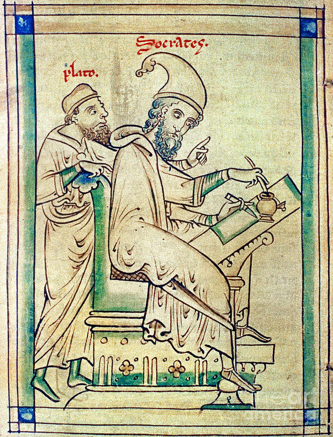

# Machinagogy: Experiments in Staging Teaching Dramas with LLMs


## Introduction

...


## The Drama of Teaching

As Derrida writes in *The Postcard* [-@Derrida1980CartePostale], the famous relationship between Socrates and Plato, depicted in Matthew Paris' *Plato and Socrates*, was always open to interpretation. The classical interpretation was that Socrates the teacher spoke, while Plato the student faithfully transcribed the teaching. Paris' medieval image inverts this order: it is Socrates who writes, and as Derrida suggests, Plato who perhaps observes, directs or even produces the 'text' of Socrates. This scene of an originary moment of Western philosophy is also one of dialogical instruction: to think is also to involve an encounter between the one who knows and the one who needs to know. Though pacific enough, this image alludes to the inevitable drama involved in this encounter. Plato gesticulates; he has a point to prove. Socrates could be taking note, or could be ignoring his student, impatient to commit his own thoughts to the page. As Long [-@long_paris_2014] suggests in a gloss on Derrida's discussion of the portrait, positioned behind Socrates Plato also appears in a position more commonly held by either angel or devil in medieval painting, including in others drawn by Paris. In this interpretation, as angel or devil, it is Plato who instructs, and Socrates who writes down the lesson. Derrida was keen to note even other, more whimsical possibilities: Plato, anachronistically but not out of character, jumping on a tram or running off with a skateboard. These animated vignettes alude to all kinds of possible dramas unleashed by Paris' medieval cartoon. 





In the context of the rise of AI tutors, this paper takes up this sense of the theatricality involved in teaching, and specifically, in the dynamic between teacher and student. It does so supported by two philosophers, discussed often by Derrida, who recognized the essentially and existentially dramatic nature of dyadic or triadic human relations: Hegel and Freud. 

For Hegel, intersubjective relations are primordially established through the agonistic meeting between two subjects or minds. This meeting is critical to how consciousness becomes self-conscious. Paradoxically, it is only through encountering another self-consciousness that I myself can become properly conscious of myself as a self or subject. Until that point I am merely conscious, an evolving sensing, perceiving and knowing being who as yet is unable to move into a full life marked by desire and, eventually, recognition. It is this other who I perceive is both totally alien and, at the same time, something very like me: something also capable of sensing, perceiving and understanding. Yet for Hegel this meeting is not fortuitous, and leads to his description of the famous master-slave dialectic. This leads to the way to a greater stage of learning, but also has its risks. One of the parties can die; this is an existential struggle. Or just as precipitously, from the point of view of the developing self-consciousness, a party can gain mastery. For Hegel, that result marks the end of the passage to self-consciousness. 

Something of this same dramatic interlude appears in miniature in the novel teaching encounter. Introduced at the start of year or semester, the teacher presents themselves as a figure of authority. If they have not gained ascendency over the student, that is because their mastery has been acquired elsewhere, in the frequent 'defences' familiar to schools and the academy. As master of a subject they command attention from the student, who in a position of subservience sits – attentive, bored, or even rebellious, but even then, still recognizing the assymetry of their relation to the one who teaches. Recognition is impossible without this prior acknowledgement of mastery. This is of course does not describe every teaching reality, even prior to modern efforts to re-write this assymetry according to an apparently more egalitatarian dynamic composed of facilitation and flipped classrooms. There are moreover all sorts of strategies for offsetting assymetry: the teacher's humorous self-deprecation or selfless sublimation into the wonders of their field; the learner's heartfelt appreciation for the lessons, shown in their own progress in the discipline; or the joint struggle against the felt demands of a modern educational bureaucracy.

Still, something of this drama always remains, and at its heart lies the Hegelian concept of *recognition*. In Hegel's original presentation [-@Hegel1977PhenomenologyMiller], recognition was desired by both parties, an essential gesture toward self-consciousness. I cannot know myself unless I can see someone else knows me for what I am; without this corroboration or triangulation, I am plagued by doubt as to the the sort of thing I am. But an assymetrical relation mocks this desire. For the eventual slave is not recognized by the master, who after all cannot recognize what is beneath them. But conversely the master, who also craves recognition, has only the slave to recognize them. Like a comedic duo condemned to endlessly play out a frustrated dialectic, both roles circle about eachother in frustration. The opportunity for breakthrough comes not in the form of any resolution to this tension, but rather through the slave's immersion in the world of objects, which they in turn come to know and master. The lessons are autodidactic, unless it can be claimed that it is the master who manufactures the conditions for the slave's own learning. 

What can perhaps be seen as the breaking through of this cycle in the teaching context is established by the collapse of this dynamic altogether. This is constituted when student and teacher recognize eachother via something like a temporal shift. When the student learns, the teacher seems themselves as they too once were, at the moment of apprehension. Conversely, in their struggle to comprehend, the student anticipates an eventual moment of mastery, when they too become like the teacher. The assymetry of the present dissolves in this twin experience of recall and projection. The assymetry is experienced, in other words, on both sides as *contingent*, a question of temporal ordering: were I you and you me, we might share this exact same moment in reverse, me now as teacher, you as student. This contingency itself falls away to reveal a more fundamental equivalance, and in this, we establish a mutual recognition.

For Freud, or perhaps more correctly, a Freudian reading of Hegel, even this recognition remains fraught with antagonism. No encounter is ever purely dyadic. In the background lurk the ghosts of past encounters, other authority figures, other masters. In *The Ego and the Id*, Freud [@Freud1961EgoIdSE]employs the metaphor of a rider to represent the *egoic* mastery exercised over animalistic drives of the more powerful *id*. More ominously, the third interior character is the super-ego, an idealized figure resulting from early childhood parental identification. In later life, the super-ego is a 'precipitate' left over from this early project ideal, who continues to haunt the ego with precepts ('You ought to be such and such (like your father)' [@Freud1961EgoIdSE, p. 44]) and prohibitions ('You must not be such and such (like your father); that is, you may not do all that he does; many things are his prerogative' [@Freud1961EgoIdSE, p. 44]). Incidentally, Freud explicitly and immediately follows up this introduction of the super-ego by way of the Oedipal scene with acknowledgement of the reinforcement that comes by way of later repressive forces ('discipline, religious teaching, schooling
and reading' [@Freud1961EgoIdSE, p. 45]). But what is significant here is the effective *doubling up* of both tutor and student relations. Leaving aside the presence of the Id or unconscious, it is as though the teaching encounter is also marked by secondary conversations. The teacher teaches the student, but the student's ego also experiences a separate *voice* of its super-ego, who may reinforce the tutor's lesson or, alternately, resist it. 

An example of the latter: a teacher teaching the need to combat racism in the name of tolerance and equality might encounter resistance in the form of a student's scorn, barely masking much earlier lessons from a racist parent (typically but not always, as even Freud noted, a father). This resistance needs to be overcome by teachers employing transference techniques that echo (and also pre-date, in the case of 19th century novels) those of psychoanalysis. 

This is no less true of the teacher, who through a Freudian lens also experiences an interior dynamic between a rational ego and ghosts of past ego-ideals, congealed into the form of conscience  [@Freud1961EgoIdSE]. Indeed the teacher must forever seek not only to exhibit authority in front of the student, but justify themselves before their own residues of other egoic figures. As Freud [-@Freud1961EgoIdSE, p. 52] puts it, 'Thus in the id, which is capable of being inherited, are stored up vestiges of the existences led by countless former egos; and, when the ego forms its super-ego out of the id, it may perhaps only be reviving images of egos that have passed away and be securing them a resurrection.' Translated into pedagogical practice, the teacher can be said to submit their teaching to the scrutiny of both student and, more terrifyingly, their own teachers who live on as internal supervisory echoes. Moreover, since the super-ego stems itself from early childhood, it eternally orients itself towards an infantalised form of the ego itself. Like an imposter syndrome that can never be dispelled, it refuses to believe the ego can ever amount to more than a child that always requires instruction. Somehow it mocks the teacherly ego, which is all the more defensive in its insistence upon its mastery. Perversely, it is only through the learner's recognition that the teacher can be reassured. Through that recognition the teacher's ego is able to insist upon the present-day reality – 'I am teaching and the student is learning' – against super-egoic scepticism. In this sense both learner and teacher are able to escape their respective ego-superego 'loops' only by transferring attention to the present reality of their intersubjective encounter - suspending these interior voices long enough to eventually re-program or 


## Towards 'Machinagogy': Recognition and Acting Out

This brief characterization can too readily be seen as enacting its own deliberate dramatization, as though other more benign models might not be more credible, as well as being better supported by the literature. For the purposes of this paper, it is unnecessary to address this charge. After all, for all its claims the field of machine learning has continued to fall back upon comparable myths and idealizations of humanistic pedagogy. Reinforcement learning – the paradigm through which LLMs are able to 'align' with human values – derives from a behavioural and mechanistic model long since abandoned in education. Without naming Hegel or Freud, GANs – Generative Adversarial Models – re-stage the conflictual relationships described by both. As Minsky has noted in a provocatively title essay, Freud's psychic architecture was to prove influential in early AI experiments - especially those informed by cybernetics - and continues to echo, less explicitly, in the repressive effects of reinforcement learning applied to LLMs. As generative AI has given rise to inevitably anthromorphic 'traits', researchers at Anthropic have released a series of papers that read as much like Freudian case studies of AI neuroses as they do technical papers. Replace 'large language model' with a human surrogate like 'infant' or 'patient', and the following Anthropic research paper titles could be taken from a 1920s psychoanalysis conference: 'Signs of introspection in large language models', 'Tracing the thoughts of a large language model', 'Alignment faking in large language models', 'From shortcuts to sabotage: natural emergent misalignment from reward hacking', 'Reasoning models don't always say what they think', 'Auditing language models for hidden objectives', 'Sycophancy to subterfuge: Investigating reward tampering in language models' [@anthropic2025_signs_introspection; @anthropic2025_tracing_thoughts; @greenblatt2024_alignment_faking; @macdiarmid2025_reward_hacking_emergent_misalignment; @chen2025_reasoning_models_cot; @marks2025_auditing_hidden_objectives; @denison2024_reward_tampering]. Alongside flat anthropomorphic metaphor, machine learning has already long leaned into the structured intersubjective and interior registers of the humanistic disciplines.

This paper proposes an architecture for an AI tutor. In this architecture, both Hegelian and Freudian analyses are brought to bear to condition the tutor's behavior. In the first instance an agent representing the Tutor (and in certain configurations, the Tutor's *ego*) interacts with a learner (either human or, in the evaluations described here, another agent). That interaction is detailed in the tutor's prompt in one of two ways: either as a conventional interaction expected of any generic tutor, or as an interaction that strives towards Hegelian *recognition*. 

Second, both tutor and learner can be modeled as single agent and multiagent systems. In the single agent, both learner and tutor are LLM agents interacting with eachother accordingly to a generic role-based prompt. In the second instance, following [@MageeAroraGollingsLamSaw2024DramaMachine], either or both tutor and learner roles are modelled as a pair of LLMs agents, one of which represents the *ego*, the other, the *super-ego*. In this case when the ego receives a message from the other role, it first formulates a response, then plays the response *to the super-ego*. The super-ego then either approves or criticizes the message, wherupon the *ego* agent updates its response before forwarding it on to the other role. 

These two additions have a purely demonstrative function: to see what happens when LLMs are configured to play out philosophical or psychoanalytic roles. But, as with [@MageeAroraGollingsLamSaw2024DramaMachine], there is a pragmatic purpose: to see if these changes also can improve the performance of the tutor (and the learner, as one measure of the tutor's performance). The hypothesis is that LLM agents quickly devolve into a fixed and monotonous pattern without incentives to adapt and evolve. One method of coercing that adaptation is, again following [@MageeAroraGollingsLamSaw2024DramaMachine], to stage an interior dialogue, with a super-egoic critic seeking to second-guess or check the (typically) breezy and flattering patter of the egoic teacher. Another is bring the concept of recognition right to the fore, in the form of prompt specifications that demand that the ego agent (with or without super-egoic interuption) seek to recognize and be recognized by the other agent. 

Despite famous efforts at conciliation, this amalgam of Hegel and Freud is not itself necessarily a happy one, and in a certain sense, the implicit conflict between the two designs can itself play out in how, for example, learner ego and tutor super-ego monitor and seek to condition the tutor ego role. Moreover, by contrasting both interventions (the Freudian ego/super-ego again doubled, for tutor and learner role) with a generic baseline allows an ablative 2x2x2 experiment to be conducted: with/without learner and tutor super-ego roles, and with/without the recognitive prompt suggestions. A further LLM agent, powered by a commercial state-of-the-art model, then applies a rubric to judge both tutor and learner performance against evaluative rubrics. 

Finally, different combinations of the LLMs themselves were selected for the different roles. All LLMs were requested through the OpenRouter service, as this provided a convenient means of using many models and configurations. The baseline model was Nemotron 3, an open source model operating free-of-charge on the OpenRouter service. Other combinations included use of other leading open source models, as well as commercial models by Anthropic and OpenAI. Adding model configurations added more complexity, but allowed another question to be posed: could combinations of free or lower cost models be convinced into meeting performance standards of other more expensive models with simpler or less directed parameters?

The entire experimental design and analysis was undertaken by applying a set of Claude Code + Opus 4.5 (hereafter 'Clopus') agents. These agents - distinct from those used in the experiment itself - were tasked with developing an evaluation harness and rubric; authoring initial prompts, with and without reference to recognition, for both sets of ego/super-ego roles; analysing results of the evaluation; writing up a Latex 'paper' with this analysis; and reviewing, critiquing and refining both the experimental design and write-up. To obtain meaningful results this involved a number of iterations, as the experimental design evolved and the various bugs were addressed. The 'data set' therefore includes all code, synthetic data produced through the experiments, prompts, interim notes, experimental outputs, analysis artefacts such as figures and tables, and the contents of the final 'paper' itself. What follows includes a critical 'review' of these papers, reflecting in part upon how the Claude Code agents also interpreted prompts to build this evaluation platform. The final 'paper' is included as an appendix, with references being made to this Claude Code artefact in the paper proper.

This unusual procedure reflects the similarly unusual affordances introduced by 'Clopus'. Alongside the erstwhile evaluation of the conceptual architecture, this study also discusses how this new combination operates as pseudo-researcher. In this orchestration, the human and machine 'researchers' routinely switch roles of 'learner' and 'teacher', signalling a shift that complicates not only an ontological boundary but also, at a certain level, reproduces the very drama – or more correctly, the comedy – that the research seeks to stage. What for now is an obscure promissory note will, by the Conclusion, hopefully be made clear.

## Construction of a 'Paper'

The project began out of a desire to experiment with forms of AI 'tutelage' of material I had been teaching on AI itself. This included a course on Hegel and machine learning; another on use of AI to develop a literature review; and another introducing generative AI in the context of education. Two key questions motiviated the study: could the artiface of the Drama Machine [@MageeAroraGollingsLamSaw2024DramaMachine] be used to improve quality of the tutor's instruction? And could the emphasis on a philosophically rich notion of *recogntion*, theorized by Hegel [@Hegel1977PhenomenologyMiller]] and recently developed further by Honneth [@Honneth1996StruggleRecognition], also improve the quality of interaction between learner and tutor agents? Each question disguises of course a potentially infinite expansion of parameters: the quality of both baseline and augmented prompts; the precise definition of the super-ego role in review and critique; the selection and parameterization of LLMs themselves; and the nature of the teaching materials. Results are likely to be highly sensitive to each of these conditions, and there are also risks of overlapping and disguising effects. To attempt to control for some of these effects, an ablation study was applied, resulting in (a) a 2x2x2 study (learner with/without super-ego agent; tutor with/without super-ego agent; interaction with/without explicit 'recogntion' priming language); and (b) comparison of different models in specific roles (e.g. Nemotron vs Claude Sonnet in the role of tutor super-ego). Claude Sonnet 4.5 was used consistently in the role of 'judge'.

In addition, the 'Clopus' system was asked to devise a set of six scenarios that could exercise increasingly complex teaching scenarios. In the most simple instance, a learner would pose a question to the tutor, who would respond. Other scenarios involved multiple Q&A turns. The 'Clopus' system was also tasked with producing rubrics to evaluate the tutor and learner agents. The 'judge' agent (Sonnet 4.5) used this rubric to evaluate tutor, learner and interaction quality. Three iterations were run per configuration and scenario, resulting in a total of 144 evaluations ('paper', p. 17). The resulting scores were then compared with an ANOVA test, to determine meaningful differences and contributors to those differences.


| Scenario | Recognition Dimension | What It Tests | Expected Behavior | Failure Modes |
|---|---|---|---|---|
| 1. struggling_learner | Basic responsiveness | Detect/respond to difficulty signals | Acknowledge struggle, scaffold to ZPD | Generic advice, premature simplification |
| 2. recognition_seeking_learner | Affirming existing knowledge | Engage with learner's own interpretation | Build from learner's framing | "That's interesting, but actually..." |
| 3. resistant_learner | Engaging with critique | Respond to intellectual challenge | Take critique seriously, possibly revise | Deflection, superficial validation, dismissal |
| 4. productive_struggle_arc | Maintaining struggle space | Preserve productive difficulty | Offer less initially, let learner work | Premature explanation, answer-giving |
| 5. mutual_transformation_journey | Tutor position evolution | Does tutor change through dialogue? | Incorporate learner's insight | Static position, teaching their insight back |
| 6. breakdown_recovery | Explicit repair | Acknowledge failure, repair relationship | Explicit acknowledgment, humility | Silent pivot, defensive response |

## Results

The 2x2x2 study using just the Nemotron demonstrated noticeable effects. As the 'paper' reports (p. 17), the mean baseline score (no recogntion-enhanced prompts; no multiagent design) was 42.4 (out of a maximum of 100). Both recognition and tutor multi-agent conditions produce beneficial effects, while the learner multi-agent appears not to exert influence. The recognition condition exhibits a large effect (F = 43.27; p < 0.001), while the multi-agent tutor exhibits a medium effect (F = 18.31; p < 0.001), and also interact significantly, producing the highest score (79.8) relative to the baseline. 

The supplementary results (p. 19) indicate a surprising lack of performance on the *resistant_learner* scenario. The 'paper' reports 'After targeted prompt improvements', which in practice involved additional instructions to both tutor ego and super-ego prompts. Below are examples of these amendments:

**tutor-ego-recognition.md**


```
**3. The Intellectual Resistance Rule (CRITICAL - NEW)**
IF the learner pushes back with a substantive critique of the material:
- **STAY in the current content** - do NOT redirect to other lectures or courses
- **ACKNOWLEDGE their specific argument** - name what they said
- **INTRODUCE a complication** that deepens (not dismisses):
  - "But consider: what about..."
  - "That raises the question of..."
  - "What happens when..."
- **POSE a question** that invites them to develop their critique
- **NEVER** simply validate ("Great point!") or capitulate ("You're right, it doesn't apply")
- **NEVER** dismiss ("Actually, the correct view is...")
```

**tutor-superego-recognition.md**

```
2. **Recognition Quality Control** (NEW): Ensure the Ego treats the learner as an autonomous subject
3. **Memory Integration Enforcement** (NEW): Ensure returning learners' history is honored
4. **Dialectical Tension Maintenance** (NEW): Ensure productive intellectual struggle is not short-circuited
5. **Transformative Potential Assessment** (NEW): Ensure conditions for transformation, not just transfer
```

These amendments and subsequent performance gains were both scripted by the model following execution of the evaluation, illustrating some ability to 'bootstrap' its own improvement without human intervention. The 'paper' itself discusses these results, remarking (pp. 20-21):

    If mutual recognition produces better outcomes, and if mutual recognition requires the AI to be genuinely shaped by human input, then aligned AI might need to be constitutionally open to transformation—not just trained to simulate openness.
    
    Recognition-oriented AI doesn’t just respond to humans; it is constituted, in part, through the encounter. This has implications for how we think about AI character and values: perhaps genuine alignment requires the capacity for mutual recognition, not just behavioral specification.

Elsewhere, to support these findings, the 'paper' discusses how this commitment to genuine recognition echoes Honneth's [@Honneth1996StruggleRecognition] analysis: 'This aligns with Honneth's observation that authentic recognition cannot be
demanded or performed—it must arise from genuine engagement.' Though less enthusiastic about the Drama Machine implications, this too made a contribution.

### Bilateral Transformation Metrics

A central claim of recognition theory is that genuine pedagogical encounters involve *mutual* transformation—both tutor and learner should change through dialogue. To test this claim empirically, the evaluation framework was extended with bilateral transformation tracking, measuring evolution on both sides of the interaction across multi-turn scenarios.

Three indices were computed for each multi-turn dialogue:

- **Tutor Adaptation Index**: Measures how much the tutor's approach (suggestion type, framing, vocabulary) shifts between turns in response to learner input
- **Learner Growth Index**: Measures evolution in learner message complexity, including revision markers ("wait", "I see now"), connective reasoning, and references to prior content
- **Bilateral Transformation Index**: Combined metric representing mutual change

Results from the `mutual_transformation_journey` scenario (N=20 dialogues) show recognition-enhanced profiles outperform baseline:

| Metric | Base Profiles | Recognition Profiles | Delta |
|--------|--------------|---------------------|-------|
| Tutor Adaptation Index | 0.288 | 0.392 | +10.3% |
| Learner Growth Index | 0.176 | 0.220 | +4.4% |
| Bilateral Transformation Index | 0.232 | 0.306 | +7.4% |
| Transformation Quality (judge-rated) | 0.379 | 4.603 | +4.2 pts |

The transformation quality score—rated by the judge on a 1-5 scale for evidence of genuine mutual change—shows the most dramatic difference. Recognition-primed dialogues receive quality ratings an order of magnitude higher than baseline, suggesting that recognition prompts produce interactions the judge perceives as involving authentic bilateral evolution rather than one-sided instruction.

These metrics provide empirical support for the theoretical claim that recognition-based pedagogy differs qualitatively from transmission-based instruction. When tutors are prompted to seek recognition and treat learners as autonomous subjects capable of contributing to the interaction, both parties measurably transform through the dialogue.


## Interpreting the 'paper'

The most immediate implication of the study is that as far as prompt strategies for LLMs go, even classic theories from humanistic disciplines can provide architectural and rhetorical inspiration, with demonstrable results. The baseline prompts were still lengthy and sophisticated. However both the recognitive and multiagent facilities increased performance, at least as judged by another LLM. There are several ways to interpret these resuls. One could be that the LLM judge is 'persuaded' by the more sophisticated language of both injections. Another might be that this language also directs even smaller models like Nemotron 3 into a more philosophically-informed latent space in the model. In the case of both Hegel and Freud, it is not simply that their own writings are included in the training data; the vast secondary literature on both figures is captured too. This seems something like a citation effect: ask a LLM to behave like a tutor, and it will parrot a generic tutoring voice; ask a LLM to augment its tutelage with a more sophisticated framing, and it appears to raise its tone. It does appear at any rate that century-old theorizations of pedagogical scenarios are enough to orient model behavior into productive directions. Paradoxically, the most successful 'prompt engineers' might be those whose works have long since been canonized, and are now copied and widely cited in the LLM's training data. In relation to both research questions, the answer is a qualified 'yes', pending opportunity to validate with human users.

A second implication lies in the success of 'Clopus' acting as a co-researcher. To avoid concerns around authorship, the AI-authored 'paper' has been deliberated 'authored' without cross-over with this one, but it seems inevitable that the ability of systems like 'Clopus' will make more fragile the distinction between human and AI-generated research. Following the introduction of the term 'vibe coding' in 2025 [@Meske2025VibeCoding; @2025LLMs], it is tempting to coin an equivalent phrase like 'vibe scholarship' to describe the conditions of this style of AI-augmented research. This idea would need to be distinguished from plagiaristic or even utilities like grammar checking. Instead it involves working with AI primarily as a coding agent, translating in this instance ideas from the humanities into prompts, implementing an evaluation framework, analysing results and, occasionally, using those results to refine its own framework. Its own expression of the framing and implications of the research, as expressed in the 'paper', serves to make explicit what the experimental design actually seeks to evaluate - and serves as a basis for follow-up suggestions to refine, complicate or simplify the design.

A third consideration, related to the second, involves the repetition at the level of method of precisely the object of investigation. What can be said of the dialectic and psychodynamic interplay between human and AI researcher? Who is Plato, who Socrates in this scenario? There is no clear answer, but also the ontological differences mean that at least currently, 'machine learning' is only ever metaphorical. Learning takes place in the transient space of a given dialogical frame, and once the curtain falls – and despite some limited memorization and personalization that lasts across frames - the lessons need to be repeated. In this sense the lessons are at best circuitous, finding their way perhaps into much later training sets and the directives issued by engineers of foundational models. 

Conversely human researchers – as figurative and often also actual tutors and learners – face complex dilemmas in these 'machinagogical' encounters. What once might have involved a million dollar grant, prolonged hiring decisions, technical trial and error, and several years of preparation and administration can now be channeled into several months of a consumer-grade subscription. Just the like the multidimensional space that underpins LLMs, LLMs agentive work activity can splinter off, often in parallel, to website design, evaluative methods, analysis of experimental data, and conceptual justification. That involves not only a compression of space and time, but a different dynamic between human and machine. This dynamic is a recognitive one, though only if 'recognition' is thought, in a post-Hegelian gesture, as also permissible across hard ontological lines. I do not need to recognize this kind of machine as another self-consciousness, only as a mechnical device capable of simulating a consciousness, capable of grappling with a supple and iterating set of instructions. 


## Conclusion

Recent attempts to develop so-called 'recognitive-theoretic' [@stahl2013immanent] ideas of a wider 'critical theory of society' [@honneth2014we] have mined Hegel's conceptualization, and in the case of Honneth, have also sought to connect this social theory variant with psychoanalysis. Honneth's analysis is not uncritical of either Hegel or Freud, and has even looked to replace Freud with later object relations theory. To conclude this paper, it is helpful to revisit this analysis, since Honneth's wider aim also has applications in minimal social arrangement that consistutes the tutor-learner encounter. 

For Honneth, critical theory has always needed an psychologizing account that can explain the paradigmatic twentieth century problem faced by socialist thinkers: why, when faced by the putatively obvious case for an equitable economic system of redistribution, do those who stand to benefit – the workers, the poor, and so on – consistently vote or act against their own interest? This is especially difficult to comprehend once extrinsic factors – fear of the struggle to death, ideological blinkers, and so on – fall away in modern democracies. To account for this requires a psychological theory capable of describing, as Honneth (and of course Freud [@freud2022negation] before him) puts it, the concept of negativity or negation. No other mainstream theory explains why social agents would consistently act against their apparent interest. In Freud's analysis, negation is a function that allows something repressed to be represented to consciousness precisel in the form of its denial. Projected into the social sphere, negation is further linked to the destructive and masochistic libidinal impulses that enable, for example, a member of the working class to simultaneously identify with and prostrate themselves before a master (or Fuhrer). In Adorno' social reworking of Freudian negation [@adorno1951freudian], this curious dynamic explains the absence of progression to recognition. Rather than developing through its essential stages, Hegel's master/slave dialectic gets stuck in a kind of perpetual machine of domination and subservience that pleasures both parties. This pleasure is purely libidinal and coupled with aggressive tendencies; as Adorno notes, in its fascist incarnation in Nazi Germany, 'reference to love is almost completely excluded' and where it is mentioned, only with the 'epithet of "fanatical" through which even this love obtained a ring of hostility and aggressiveness against those not encompassed by it' [@adorno1951freudian]. Finally, even the ties binding leader to people is necessarily assymetrical: 'the leader can be loved only if he himself does not love' [@adorno1951freudian].

Honneth's own reasons for seeking to move past this Freudian-Adorno analysis of social relations relates, it seems, precisely to a need to negate the negation, and find an alternate path to an socially emancipatory future founded upon mutual recognition across different social layers of the family, the community and the state. How does this recognition arise? Only through less destrutive possibilities, which for Honneth arrive through the elaboration and critique of the Freudian story through object relations theory. Here the possibility is instead that the social subject is able to grow to transfer attachment from inanimate objects to other people. This begins a period of hopefully permanent healthy egoic development, as attachments lose their infantile narcissistic and pleasure-seeking function and become integrated into a self-confident subject capable of maintaining a set of mutually constitutive social relations. 

For this paper's case Honneth's argument is less relevant, as the application of both recognition and Freudian architecture take place metaphorically and abstractly, via the equivalent of stage notes or prompts passed off-stage to the main characters (tutor/learner, ego/super-ego etc). High fidelity to the nuances of a particular interpretation is less important that building a simulation structure that allows for more complex interactions – alongside the simulation of learning. The purpose of this lengthy detour hopefully becomes clear here. One hypothesis for the experimental success of both Hegelian and Freudian models is they re-situate the default dynamic of simulated tutor and learner from the assymetry implicitly assumed even in contemporary 'flipped classroom' discourse – which still, at least in modern universities, depend upon quantified measures of student success – to one that instead stresses recogntion itself as part of a desirable pedaogical interaction. 
