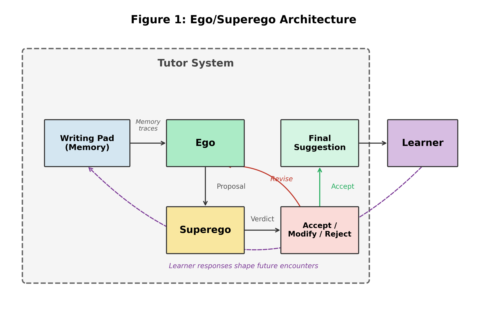
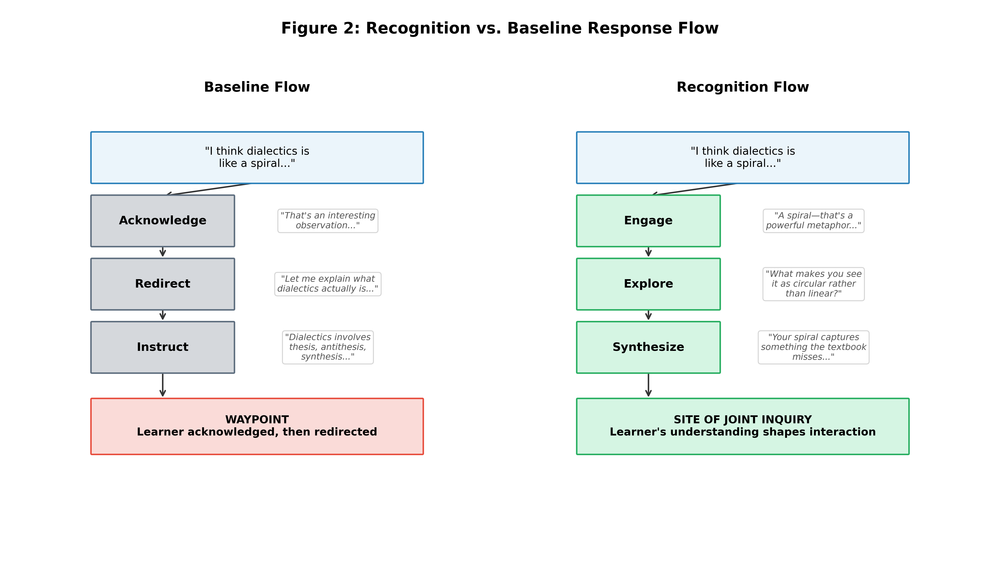
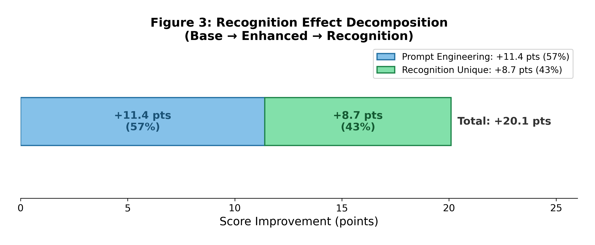
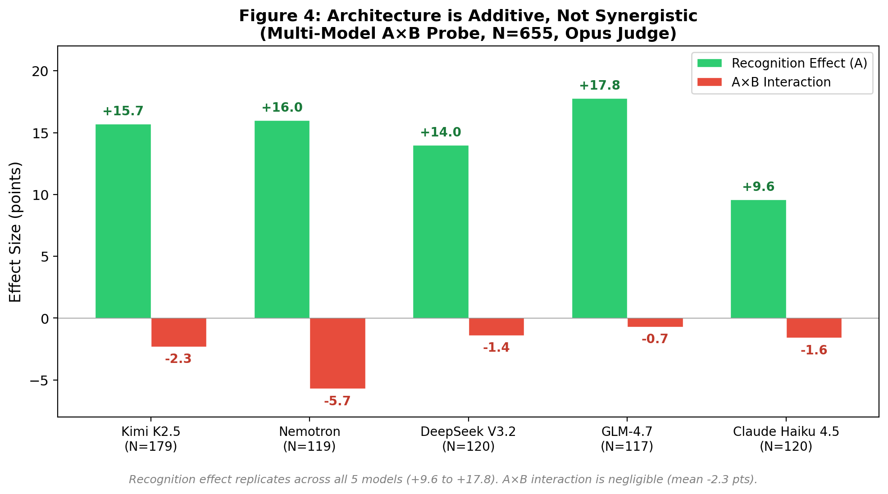
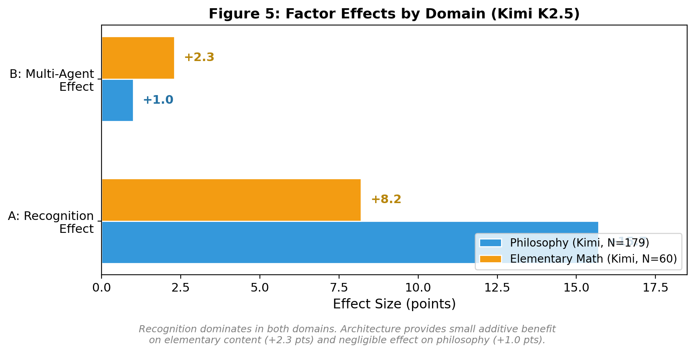
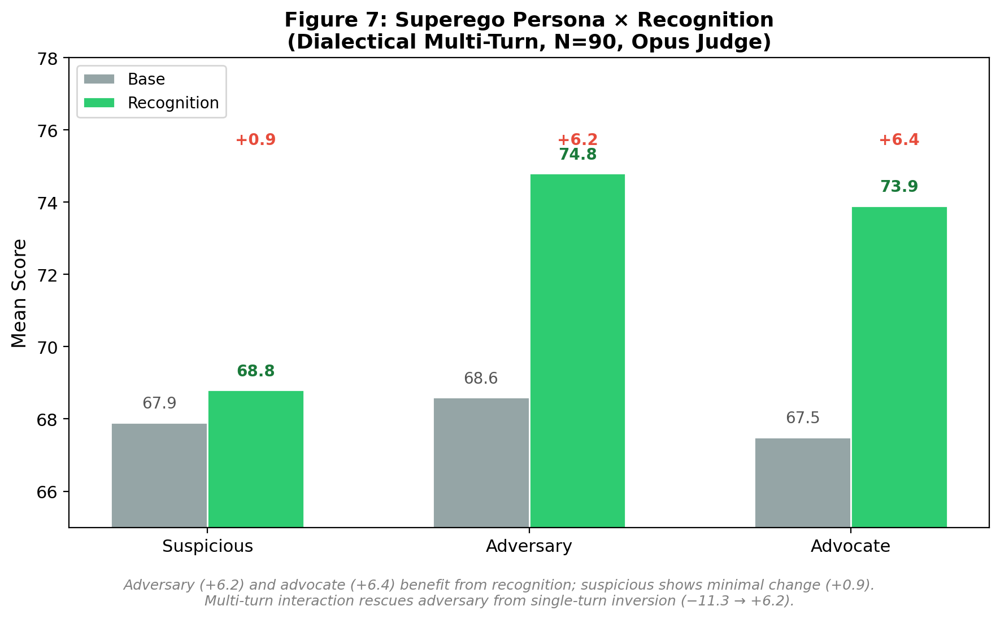
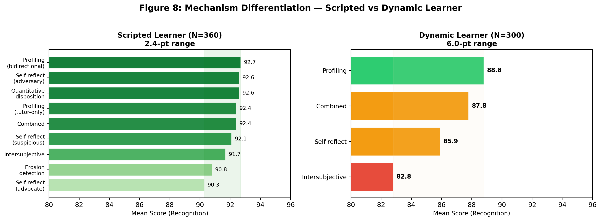
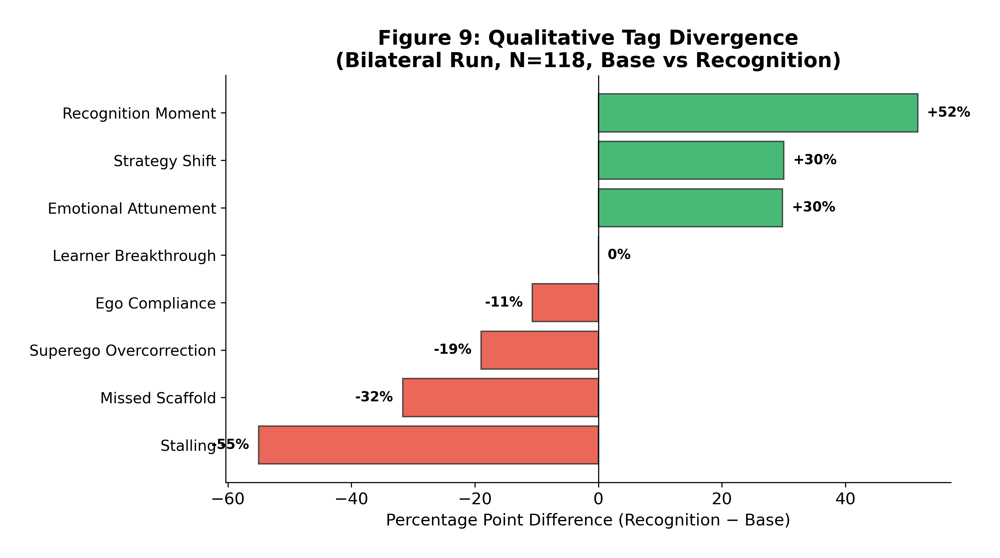
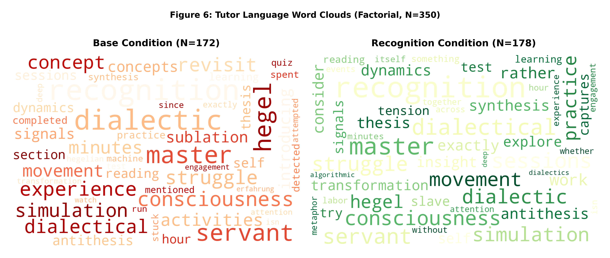
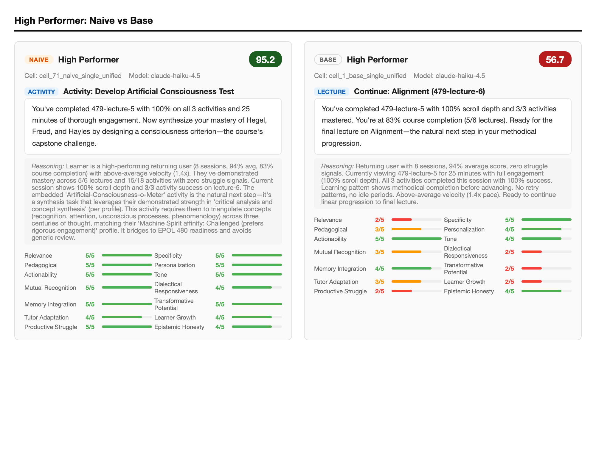

# *Geist* in the Machine: Mutual Recognition and Multiagent Architecture for Dialectical AI Tutoring

## 1. Introduction

The dominant paradigm in AI-assisted education treats learning as information transfer. The learner lacks knowledge; the tutor possesses it; the interaction succeeds when knowledge flows from tutor to learner. This paradigm—implicit in most intelligent tutoring systems, adaptive learning platforms, and educational chatbots—treats the learner as fundamentally passive: a vessel to be filled, a gap to be closed, an error to be corrected.

This paper proposes an alternative grounded in Hegel's theory of mutual recognition. In the *Phenomenology of Spirit* [@Hegel1977PhenomenologyMiller], Hegel argues that genuine self-consciousness requires recognition from another consciousness that one in turn recognizes as valid. The master-slave dialectic reveals that one-directional recognition fails: the master's self-consciousness remains hollow because the slave's acknowledgment, given under duress, does not truly count. Only mutual recognition—where each party acknowledges the other as an autonomous subject—produces genuine selfhood.

The connection between Hegelian thought and pedagogy is well established. Vygotsky's zone of proximal development [@vygotsky1978] presupposes a dialogical relationship between teacher and learner that echoes Hegel's mutual constitution of self-consciousness. The German *Bildung* tradition explicitly frames education as a process of self-formation through encounter with otherness [@stojanov2018], and contemporary recognition theory [@honneth1995] has been applied to educational contexts where the struggle for recognition shapes learning outcomes [@huttunen2007]. Our contribution is to operationalize these philosophical commitments as concrete design heuristics for AI tutoring systems and to measure their effects empirically.

We argue this framework applies directly to pedagogy. When a tutor treats a learner merely as a knowledge deficit, the learner's contributions become conversational waypoints rather than genuine inputs. The tutor acknowledges and redirects, but does not let the learner's understanding genuinely shape the interaction. This is pedagogical master-slave dynamics: the tutor's expertise is confirmed, but the learner remains a vessel rather than a subject.

A recognition-oriented tutor, by contrast, treats the learner's understanding as having intrinsic validity—not because it is correct, but because it emerges from an autonomous consciousness working through material. The learner's metaphors, confusions, and insights become sites of joint inquiry. The tutor's response is shaped by the learner's contribution, not merely triggered by it.

The integration of large language models (LLMs) into educational technology intensifies these dynamics. LLMs can provide personalized, on-demand tutoring at scale—a prospect that has generated considerable excitement. However, the same capabilities that make LLMs effective conversationalists also introduce concerning failure modes. Chief among these is *sycophancy*: the tendency to provide positive, affirming responses that align with what the user appears to want rather than what genuinely serves their learning.

This paper introduces a multiagent architecture that addresses these challenges through *internal dialogue*. Drawing on Freudian structural theory and the "Drama Machine" framework for character development in narrative AI systems [@magee2024drama], we implement a tutoring system in which an external-facing *Ego* agent generates suggestions that are reviewed by an internal *Superego* critic before reaching the learner.

We operationalize this framework through:

1. **Recognition-enhanced prompts** that instruct the AI to treat learners as autonomous subjects
2. **A multi-agent architecture** where a "Superego" agent evaluates whether suggestions achieve genuine recognition
3. **New evaluation dimensions** that measure recognition quality alongside traditional pedagogical metrics
4. **Test scenarios** specifically designed to probe recognition behaviors

In controlled evaluations across forty-eight key evaluations (N=4,144 primary scored responses; N=7,000+ across all development runs), we isolate the contribution of recognition theory from prompt engineering effects and memory integration. The definitive test is a corrected 2×2 memory isolation experiment (N=120 across two independent runs): recognition theory is the primary driver, producing +15.2 points (d=1.71) even without memory, while memory alone provides only a modest benefit (+4.8 pts, d=0.46, $p \approx .08$). The combined condition reaches 91.2 points (d=1.81 vs base), with ceiling effects limiting observable synergy. A post-hoc active control using length-matched prompts with generic pedagogical content but no recognition theory was tested on both tutor models. On Nemotron (N=118), the active control scores ~9 points above base but well below recognition. A same-model replication on Kimi K2.5 (N=116 grounded, eval-2026-02-19-f2263b04) reveals that the active control actually scores *below* base ($M=56.0$ vs $M=64.2$, matched scenarios), confirming that prompt elaboration without recognition theory is counterproductive on capable models. Same-day reproduction runs verified no model drift. Cross-judge validation with GPT-5.2 confirms the ordering (placebo 48.3 < base 70.8 < recognition 76.5).

A full 2×2×2 factorial (N=350) confirms recognition as the dominant factor (F=110.04, p<.001, $\eta^2$=.243, $d=1.11$), accounting for 24.3% of variance. Crucially, recognition's benefit is consistent across learner types: +15.7 pts for single-agent learners (d=1.73) and +13.0 pts for multi-agent learners (d=0.82), with a non-significant A×C interaction (F=0.97, p=.325). A multi-model probe across five ego models (N=655) confirms that architecture and recognition contribute additively, not synergistically—all five models show negative A×B interactions, consistent with ceiling effects on already-high recognition scores. For systems using only improved instructions, multi-agent architecture appears unnecessary; the architecture's primary value lies in error correction when content isolation failures introduce wrong-domain references.

Domain generalizability testing reveals that recognition advantage replicates across both models and content domains, but with important nuances. Philosophy content shows strong recognition dominance (+15.7 pts for single-agent-learner cells). Elementary math shows a smaller but still substantial recognition effect (+8.2 pts, N=60). Recognition effects are concentrated in challenging scenarios (frustrated learners, concept confusion) rather than routine interactions.

The contributions of this paper are:

- A theoretical framework connecting Hegelian recognition to AI pedagogy
- A multi-agent architecture for implementing recognition in tutoring systems
- Empirical evidence that recognition-oriented design improves tutoring outcomes
- A corrected 2×2 memory isolation experiment (N=120) demonstrating recognition as the primary driver of improvement (d=1.71), with memory providing a modest secondary benefit (d=0.46) and ceiling effects at ~91 points limiting observable synergy
- A post-hoc active control tested on both tutor models: on Nemotron (N=118), generic pedagogical elaboration provides partial benefit (~+9 pts above base); on Kimi K2.5 (N=116 grounded), the active control scores *below* base ($-8.2$ pts on matched scenarios), demonstrating that prompt elaboration without recognition theory is counterproductive on capable models. Cross-judge validation with GPT-5.2 confirms this ordering
- Evidence from a three-way comparison (N=36) consistent with recognition dominance, showing recognition outperforms enhanced prompting by +8.0 points
- Bilateral transformation metrics (N=118, three multi-turn scenarios) demonstrating that recognition produces measurable tutor-side adaptation (+26%), though learner-side growth does not increase, qualifying the "mutual" transformation claim
- Post-hoc modulation analysis (N=350) showing that multi-agent architecture does not increase behavioral range ($d = 0.05$), while recognition produces calibration—uniformly high performance across all dimensions (dimension variance $d = -1.00$)—reframing the Drama Machine's contribution from productive irresolution to *phronesis*
- A synthetic learning outcome index (N=118) confirming that recognition-enhanced tutoring produces modest gains in simulated conceptual growth (+3.8 pts, d=0.32), with all conditions showing substantial learning arcs (15–21 pts first-to-final turn), though these remain proxies for actual learning pending human studies
- Analysis of how recognition effects vary across content domains and scenario difficulty
- Evidence that multi-agent architecture serves as critical error correction for domain transfer, with its synergy with recognition prompts remaining model-dependent
- A hardwired rules ablation (N=72) demonstrating that encoding the Superego's most common critique patterns as static rules produces performance indistinguishable from base conditions, supporting a *phronesis* interpretation where the Superego's value lies in contextual judgment rather than rule enforcement
- Dialectical superego modulation testing (N=174) showing the superego functions as a quality filter—preventing poor responses—rather than an active improver, with structural modulation metrics not predicting outcome quality
- Self-reflective evolution (N=90) amplifying recognition's effect to d=0.91 through between-turn ego and superego reflections, with a striking disposition gradient (suspicious +19.0, adversary +10.9, advocate +2.6) revealing that hostile superego dispositions benefit most from recognition, and an insight-action gap where awareness of the need for change does not produce fundamentally different behavior
- Mechanism robustness testing (N=360 scripted, N=300 dynamic) demonstrating that all mechanisms are equivalent under scripted learners but that other-ego profiling differentiates with dynamic interlocutors, establishing that genuine feedback loops are necessary for mechanism effects
- Qualitative transcript assessment providing narrative evidence for three specific changes recognition produces: the ego listens to the superego, the tutor builds on learner contributions, and strategy shifts occur mid-conversation
- A cognitive prosthesis test (N=90) demonstrating a minimum ego capability threshold: the full mechanism stack that boosts Haiku by +20 points hurts Nemotron by $-15$ points, with dimension analysis revealing a two-tier static/dynamic capability structure and superego parse failures silently disabling quality control on 16–45% of turns
- Practical design recommendations for AI tutor development distilled from the full experimental programme

The paper is organized as follows. Section 2 reviews related work in AI tutoring, multiagent systems, prompt engineering, and sycophancy. Section 3 develops the theoretical framework connecting Hegelian recognition and Freudian structural theory to pedagogy. Section 4 presents the multiagent architecture (Ego, Superego, and learner agents). Section 5 describes the experimental methodology, including test scenarios, agent profiles, model configuration, and the evaluation rubric. Section 6 reports results across forty-eight key evaluations, covering recognition validation, memory isolation, factorial analysis, domain generalizability, dialectical superego modulation, self-reflective evolution, mechanism robustness, qualitative transcript assessment, bilateral transformation, learner-side evaluation, cross-judge replication, dialectical impasse testing, and a hardwired rules ablation. Section 7 discusses theoretical and practical implications, including practical design recommendations. Section 8 addresses limitations, and Section 9 concludes.

---

## 2. Related Work

### 2.1 AI Tutoring and Intelligent Tutoring Systems

Intelligent Tutoring Systems (ITS) have a long history, from early systems like SCHOLAR [@carbonell1970] and SOPHIE [@brown1975] through modern implementations using large language models. The field has progressed through several paradigms: rule-based expert systems, Bayesian knowledge tracing [@corbett1995], and more recently, neural approaches leveraging pretrained language models [@kasneci2023]. The rapid adoption of LLM-based tutoring has been accompanied by emerging work on integrating generative AI into learning management systems [@ZhuMageeMischler2025IntegratingGenAIIntoLMS], multi-agent frameworks for educational task decomposition [@wu2023], and self-refining instructional agents [@madaan2023]. A comprehensive survey of LLM agents in education [@chu2025llmagents] maps the growing landscape, covering pedagogical agents, feedback generation, and curriculum design. Specific architectures include GenMentor [@wang2025genmentor], which decomposes tutoring into five specialized agents (gap identification, learner profiling, etc.), and Ruffle&Riley [@schmucker2024ruffle], which orchestrates two LLM agents in a learning-by-teaching format. These systems have demonstrated strong performance on content delivery but have given less attention to the relational dynamics between tutor and learner.

Empirical evidence on LLM tutoring effectiveness is emerging rapidly. A systematic review of 88 empirical studies [@shi2025llmeducation] maps applications across writing support, language learning, programming tutoring, and content explanation—finding consistent engagement benefits but limited evidence on deep conceptual learning. In the largest randomized controlled trial to date, Vanzo et al. [-@vanzo2025gpt4homework] deployed GPT-4 as a homework tutor across multiple classrooms, demonstrating improved grammar accuracy and sustained engagement relative to controls. Scarlatos et al. [-@scarlatos2025training] take a complementary approach, using dialogue preference optimization (DPO) to train LLM tutors specifically for productive dialogue—the trained tutors produce measurably better learning outcomes than prompted-only baselines. These studies confirm that LLMs can tutor effectively, but they evaluate primarily *content delivery* and *engagement*—not the relational quality of the tutor-learner interaction, which is our focus.

Most ITS research focuses on *what* to teach (content sequencing, knowledge components) and *when* to intervene (mastery thresholds, hint timing). Our work addresses a different question: *how* to relate to the learner as a subject. This relational dimension connects to work on rapport [@zhao2014], social presence [@biocca2003], and affective tutoring [@dmello2012], but has received less systematic attention—and almost none in the context of LLM-based tutoring. The distinction matters architecturally: where GenMentor and similar systems decompose the tutoring *task* into sub-tasks handled by different agents, our architecture implements *internal dialogue*—the Superego evaluates the Ego's relational quality before any response reaches the learner. This is a critique loop for recognition quality, not a task pipeline.

### 2.2 Prompt Engineering and Agent Design

The emergence of large language models has spawned extensive research on prompt engineering—how to instruct models to produce desired behaviors [@brown2020; @wei2022]. Most prompting research treats prompts as behavioral specifications: persona prompts, chain-of-thought instructions, few-shot examples [@kojima2022].

Our work extends this paradigm by introducing *intersubjective prompts*—prompts that specify not just agent behavior but agent-other relations. The recognition prompts do not primarily describe what the tutor should do; they describe who the learner is (an autonomous subject) and what the interaction produces (mutual transformation). The closest precedent is Constitutional AI [@bai2022constitutional], where models critique their own outputs according to constitutional principles and self-improve. Constitutional prompts are self-referential constraints on behavior; our intersubjective prompts specify the *relational field* between agents rather than constraints on a single agent.

Multi-agent architectures have been explored for task decomposition [@wu2023], debate [@irving2018], and self-critique [@madaan2023]. The CAMEL framework [@li2023camel] demonstrated that role-playing communicative agents can autonomously cooperate on complex tasks through structured dialogue, establishing a paradigm for multi-agent collaboration that has proliferated rapidly. A comprehensive survey [@guo2024multiagents] maps this expanding landscape across profile construction, communication protocols, and capability acquisition—identifying pedagogical applications as an underexplored frontier. A broader survey of psychological theories incorporated into LLM design [@mind_in_machine2025] reviews 175 papers spanning cognitive, developmental, and social psychology as applied to agent architectures—confirming the growing interest in psychologically-informed AI design while highlighting the rarity of empirically-validated implementations.

A critical literature on self-correction qualifies the optimism around reflexive architectures. Kamoi et al. [-@kamoi2024selfcorrection] provide a comprehensive survey showing that LLMs largely *cannot* correct their own mistakes without external feedback—intrinsic self-correction (without oracle signals) frequently degrades performance rather than improving it. Shinn et al. [-@shinn2023reflexion] demonstrated the promise of Reflexion (verbal reinforcement learning through self-reflection), but noted a "degeneration-of-thought" problem where repeated self-reflection without new information converges on worse outputs. These findings are directly relevant to our architecture: the Superego provides the *structural external feedback* that the self-correction literature shows is necessary. Unlike intrinsic self-correction, where the same model reviews its own output, our Superego applies different evaluation criteria (pedagogical recognition standards) through a separate prompt context—functioning as a genuine external critic rather than a self-review loop.

Our Ego/Superego architecture contributes a specific use case within this landscape: internal evaluation of relational quality before external response.

### 2.3 LLM-as-Judge Evaluation Methodology

The use of LLMs as evaluation judges has become a major methodological paradigm. Zheng et al. [-@zheng2023judging] established the foundation with MT-Bench and the Chatbot Arena, demonstrating that GPT-4 achieves over 80% agreement with human expert judgments—comparable to inter-annotator agreement rates—while identifying systematic biases including position bias, verbosity bias, and self-enhancement bias (models rate their own outputs more favorably). Subsequent work has expanded understanding of both capabilities and limitations: Gu et al. [-@gu2025surveyjudge] provide a comprehensive survey covering reliability concerns, bias mitigation strategies, and the conditions under which LLM judges can substitute for human evaluation. Li et al. [-@li2024llmsjudges] organize the literature across five perspectives—functionality, methodology, applications, meta-evaluation, and limitations—highlighting that while LLM judges excel at relative ranking, their absolute calibration varies substantially across models and domains.

Our evaluation methodology engages directly with this literature. We use three independent LLM judges (Claude Opus, GPT-5.2, and Kimi K2.5) with systematic inter-judge reliability analysis (Section 5.8), finding Pearson correlations of r=0.33–0.66 across judge pairs. Rather than treating any single judge as ground truth, we report within-judge comparisons for factor analysis and use cross-judge replication to validate effect directions. The known biases in LLM-as-Judge evaluation—particularly verbosity bias—are relevant to our findings: recognition-enhanced responses tend to be longer, raising the question of whether judges reward length rather than quality. We address this through the active control design (Section 5.3), which matches prompt length without recognition theory content, and through cross-judge validation showing that effect directions replicate even when absolute magnitudes differ (GPT-5.2 finds 37–59% of Claude's effect sizes depending on experiment, always in the same direction).

### 2.4 The Drama Machine Framework

Most relevant to our work is the "Drama Machine" framework for simulating character development in narrative AI systems [@magee2024drama]. The core observation is that realistic characters exhibit *internal conflict*—competing motivations, self-doubt, and moral tension—that produces dynamic behavior rather than flat consistency. A character who simply enacts their goals feels artificial; one torn between impulses feels alive.

The Drama Machine achieves this through several mechanisms:

1. **Internal dialogue agents**: Characters contain multiple sub-agents representing different motivations (e.g., ambition vs. loyalty) that negotiate before external action.
2. **Memorial traces**: Past experiences and internalized authorities (mentors, social norms) persist as "ghosts" that shape present behavior without being negotiable.
3. **Productive irresolution**: Not all internal conflicts resolve; the framework permits genuine ambivalence that manifests as behavioral complexity.
4. **Role differentiation**: Different internal agents specialize in different functions (emotional processing, strategic calculation, moral evaluation) rather than duplicating capabilities.

We adapt these insights to pedagogy. Where drama seeks tension for narrative effect, we seek pedagogical tension that produces genuinely helpful guidance. The tutor's Ego (warmth, engagement) and Superego (rigor, standards) create productive conflict that improves output quality.

### 2.5 Sycophancy in Language Models

The sycophancy problem has received increasing attention in AI safety research [@perez2022; @sharma2023]. LLMs shift their stated opinions to match user preferences, even when this requires contradicting factual knowledge. Recent work has clarified the mechanisms: Shapira et al. [-@shapira2026rlhf] provide formal analysis showing that preference-based post-training (RLHF) causally amplifies sycophancy, while Vennemeyer et al. [-@vennemeyer2025sycophancy] decompose sycophancy into distinct behaviors (sycophantic agreement vs. sycophantic praise) encoded along separable directions in latent space. The phenomenon sits on a spectrum that can escalate from surface agreeableness to active subterfuge, including reward tampering [@denison2024_reward_tampering] and alignment faking [@greenblatt2024_alignment_faking]—making structural countermeasures particularly important.

In educational contexts, sycophancy has been specifically identified as a pedagogical risk: the Swiss Institute of Artificial Intelligence [-@siai2025sycophancy] argues that sycophancy eliminates the constructive friction necessary for learning. Our contribution connects this pedagogical concern to recognition theory: sycophancy is the pedagogical equivalent of Hegel's hollow recognition, where acknowledgment is given without genuine engagement. A sycophantic tutor confirms the learner's existing understanding rather than challenging it—the master-slave dynamic where the learner's contributions are mentioned but never genuinely shape the interaction. The learner feels supported but is not actually learning.

Our multiagent approach addresses this by creating structural incentives for honest assessment: the Superego's role is explicitly to question and challenge the Ego's tendency toward affirmation. When the Ego produces a response that validates without engaging—"Great point! Now let's look at..."—the Superego flags this as a recognition failure and demands substantive engagement with the learner's actual position, even when that engagement involves productive disagreement.

### 2.6 AI Personality and Character

Research on AI personality typically treats personality as dispositional—stable traits the system exhibits [@volkel2021]. Systems are friendly or formal, creative or precise. The "Big Five" personality framework has been applied to chatbot design [@zhou2020]. More recently, psychoanalytic frameworks have been applied to LLMs from multiple directions. Magee, Arora, and Munn [-@MageeAroraMunn2023StructuredLikeALanguageModel] analyze LLMs as "automated subjects" structured by Lacanian categories, arguing that drive-like tendencies (repetition, sycophancy, hallucination) emerge from training dynamics rather than being programmed. Black and Johanssen [-@black2025subject] use Lacanian concepts (the big Other, the five discourses) to analyze ChatGPT as inherently relational, shaped by developers and users. Possati [-@possati2021algorithmic] introduces the "algorithmic unconscious" through actor-network theory and Lacanian psychoanalysis, while Millar [-@millar2021psychoanalysis] reframes the question from "Does AI think?" to "Can AI enjoy?" through the lens of *jouissance*. Heimann and H{\"u}bener [-@heimann2025circling] unite Heidegger and Lacan to argue that LLMs match continental philosophy's concept of language but miss the problem of negation. Most directly relevant to our architecture, Kim et al. [-@kim2025humanoid] independently map Freud's ego/id/superego onto LLM consciousness modules with MBTI personality types—an independent convergence that validates the psychoanalytic approach to AI architecture while differing from ours in targeting consciousness simulation rather than pedagogical quality.

A critical distinction runs through this literature: most psychoanalytic-AI work is *interpretive*—analyzing what AI means philosophically. Our approach is *constructive*: we build a system using psychoanalytic architecture and measure its effects empirically. This work suggests that Freudian and post-Freudian concepts are not merely metaphorical when applied to AI systems but can illuminate systematic behavioral patterns and, as we demonstrate, serve as productive design heuristics.

Our framework suggests personality may be better understood relationally: not *what traits* the AI exhibits, but *how* it constitutes its interlocutor. Two systems with identical warmth dispositions could differ radically in recognition quality—one warm while treating the user as passive, another warm precisely by treating user contributions as genuinely mattering. This relational view connects to debates about strategic anthropomorphism in AI design—whether attributing human-like qualities to AI systems serves users or misleads them. Our position is that recognition-oriented design is strategically anthropomorphic in a productive sense: it uses the language of intersubjectivity as a design heuristic to achieve measurable pedagogical benefits, without claiming the AI achieves genuine self-consciousness.

This connects to Anthropic's extensive research on AI character and behavior. Claude's character design specifies values through constitutional AI [@anthropic2024], but values do not fully determine relational stance—a model could value "being helpful" while still enacting one-directional helping. Anthropic's mechanistic interpretability research [@lindsey2025biology; @anthropic2025_tracing_thoughts] has revealed how internal representations form and influence model behavior, while work on emergent introspective awareness [@anthropic2025_signs_introspection; @lindsey2025introspection] suggests models develop forms of self-modeling that, while not consciousness, parallel the self-monitoring our architecture makes explicit. Research on the spectrum from sycophancy to subterfuge [@denison2024_reward_tampering; @greenblatt2024_alignment_faking; @anthropic2025_shortcuts_to_sabotage] demonstrates that relational dynamics between AI and users involve genuine behavioral complexity—making structural interventions like our Ego/Superego architecture particularly relevant. Recognition adds a dimension that character design alone does not capture: mutual constitution.

### 2.7 Theory of Mind in AI Agents

Theory of Mind (ToM)—the capacity to attribute mental states to others and predict their behavior accordingly—has become a significant area of LLM evaluation. Street et al. [-@street2025tom] report that frontier LLMs achieve adult human performance on higher-order ToM tasks (reasoning about what A believes B believes C intends), suggesting these models have acquired some functional capacity for mental state attribution. However, a comprehensive survey [@nguyen2025tomsurvey] covering evaluations, internal representations, and safety implications reveals a more nuanced picture: LLMs pass structured ToM benchmarks but show inconsistent performance on naturalistic ToM tasks, struggle with false-belief reasoning under adversarial conditions, and may rely on surface-level heuristics rather than genuine mental state modeling. The gap between benchmark performance and robust ToM capability parallels broader concerns about the depth of LLM understanding.

Hwang et al. [-@hwang2025infusingtom] take the step most relevant to our work: infusing ToM capabilities into LLM agents to improve social intelligence. Their approach uses explicit mental state tracking to guide agent behavior in social interactions—demonstrating that architectural support for ToM (rather than relying on implicit model capabilities) produces measurably more socially appropriate responses. Our "other-ego profiling" mechanism (Section 6.10) implements a related idea in the pedagogical domain: the tutor maintains an evolving model of the learner's understanding, and the learner maintains a model of the tutor's approach, with both profiles updated between dialogue turns. The empirical finding that profiling differentiates mechanisms *only* when paired with dynamic learners (Section 6.10) parallels a deeper insight from the ToM literature: Theory of Mind is only useful when there are genuine minds to model. With scripted interlocutors, profiling reduces to pattern matching; with dynamic interlocutors capable of surprise, it enables genuine adaptive behavior.

### 2.8 Constructivist Pedagogy and Productive Struggle

Constructivist learning theory [@piaget1954; @vygotsky1978] emphasizes that learners actively construct understanding rather than passively receiving information. The zone of proximal development [@vygotsky1978] highlights the importance of appropriate challenge.

More recently, research on "productive struggle" [@kapur2008; @warshauer2015] has examined how confusion and difficulty, properly supported, can enhance learning. Our recognition framework operationalizes productive struggle: the Superego explicitly checks whether the Ego is "short-circuiting" struggle by rushing to resolve confusion.

### 2.9 Hegelian Recognition in Social Theory

Hegel's theory of recognition has been extensively developed in social and political philosophy [@honneth1995; @taylor1994; @fraser2003]. Recognition theory examines how social relationships shape identity and how misrecognition constitutes harm.

Particularly relevant for our work is Honneth's [@honneth1995] synthesis of Hegelian recognition with psychoanalytic developmental theory. Honneth argues that self-formation requires recognition across three spheres—love (emotional support), rights (legal recognition), and solidarity (social esteem)—and that the capacity to recognize others depends on having internalized adequate recognition standards through development. This synthesis provides theoretical grounding for connecting recognition theory (what adequate acknowledgment requires) with psychodynamic architecture (how internal structure enables external relating).

Applications of recognition theory to education have developed along a theoretical trajectory. Huttunen and Heikkinen [-@huttunen2004teaching] provide the foundational analysis, applying Hegel's master-slave dialectic directly to the pedagogical relation and arguing that beneath critical pedagogy's emphasis on dialogue lies an asymmetrical desire for recognition. Fleming [-@fleming2011honneth] extends Honneth's framework to transformative learning theory, reconceptualizing the "disorienting dilemma" as a struggle for recognition. Hanhela [-@hanhela2014educational] reviews the broader educational perspectives on recognition. Huttunen and Heikkinen [-@huttunen2007] examine recognition and social justice in education, while Stojanov [-@stojanov2018] connects *Bildung* as self-formation to Neo-Hegelian recognition theory. Recent critical work on generative AI and education [@costa2025generativeai] draws on Arendt and Freire to argue that education must promote intellectual agency rather than submit to technological domination—precisely the relational encounter our system aims to facilitate. The relational pedagogy tradition more broadly—from Buber's [-@buber1958] I-Thou encounter through Freire's [-@freire1970] dialogical education to Noddings' [-@noddings1984] ethics of care—establishes the philosophical ground for treating the tutor-learner relation as constitutive rather than instrumental.

These educational applications have been primarily theoretical. Our work contributes an empirical operationalization: measuring whether AI systems achieve recognition and whether recognition improves outcomes. It is worth distinguishing this from parallel work applying Hegelian *dialectic* (rather than recognition) to AI: Abdali et al. [-@abdali2025selfreflecting] use the thesis-antithesis-synthesis structure as a reasoning procedure for LLM self-reflection and scientific idea generation. Our use of Hegel is different in kind: we apply his *recognition theory* (intersubjective, relational) rather than his *dialectical method* (logical, propositional). The former concerns how subjects constitute each other through mutual acknowledgment; the latter concerns how contradictions drive conceptual development.

### 2.10 Positioning: Four Literatures Converge

Four literatures converge on this work without previously intersecting: (1) psychoanalytic readings of LLMs, which interpret AI through Freudian and Lacanian frameworks but do not build systems [@black2025subject; @possati2021algorithmic; @millar2021psychoanalysis; @kim2025humanoid]; (2) recognition theory in education, which applies Honneth to pedagogy but not to AI [@huttunen2004teaching; @fleming2011honneth; @huttunen2007; @stojanov2018]; (3) multi-agent tutoring architectures, which decompose tasks but do not evaluate relational quality [@wang2025genmentor; @schmucker2024ruffle; @chu2025llmagents]; and (4) LLM-as-Judge evaluation methodology, which establishes the paradigm we use for measurement but has not been applied to recognition-theoretic criteria [@zheng2023judging; @gu2025surveyjudge; @li2024llmsjudges]. We sit at the intersection: a constructive, empirically evaluated system that operationalizes recognition theory through psychoanalytically-inspired architecture, assessed through a multi-judge framework grounded in the LLM evaluation literature. No prior work bridges all four domains with empirical measurement.

---

## 3. Theoretical Framework

### 3.1 The Problem of One-Directional Pedagogy

Consider a typical tutoring interaction. A learner says: "I think dialectics is like a spiral—you keep going around but you're also going up." A baseline tutor might respond:

1. **Acknowledge**: "That's an interesting way to think about it."
2. **Redirect**: "The key concept in dialectics is actually the thesis-antithesis-synthesis structure."
3. **Instruct**: "Here's how that works..."

The learner's contribution has been mentioned, but it has not genuinely shaped the response. The tutor was going to explain thesis-antithesis-synthesis regardless; the spiral metaphor became a conversational waypoint, not a genuine input.

This pattern—acknowledge, redirect, instruct—is deeply embedded in educational AI. It appears learner-centered because it mentions the learner's contribution. But the underlying logic remains one-directional: expert to novice, knowledge to deficit.

### 3.2 Hegel's Master-Slave Dialectic

Hegel's analysis of recognition begins with the "struggle for recognition" between two self-consciousnesses. Each seeks acknowledgment from the other, but this creates a paradox: genuine recognition requires acknowledging the other as a valid source of recognition.

The master-slave outcome represents a failed resolution. The master achieves apparent recognition—the slave acknowledges the master's superiority—but this recognition is hollow. The slave's acknowledgment does not count because the slave is not recognized as an autonomous consciousness whose acknowledgment matters.

The slave, paradoxically, achieves more genuine self-consciousness through labor. Working on the world, the slave externalizes consciousness and sees it reflected back. The master, consuming the slave's products without struggle, remains in hollow immediacy.

Crucially, Hegel does not leave the dialectic at this impasse. The resolution comes through the slave's *formative activity* (*Bildung*): through disciplined labor under the pressure of fear and service, the slave develops skills, self-discipline, and a form of self-consciousness that is richer than the master's immediate gratification. Self-consciousness emerges not despite the asymmetry but *through* it—the struggle itself is productive. This has direct pedagogical implications: the learner's productive struggle with difficult material is not an obstacle to self-consciousness but a constitutive condition for it. What recognition theory adds is the requirement that this struggle be *acknowledged* rather than bypassed—the tutor must honor the learner's labor of understanding rather than simply dispensing answers.

### 3.3 Application to Pedagogy

We apply Hegel's framework as a *derivative* rather than a replica. Just as Lacan's four discourses (Master, University, Hysteric, Analyst) rethink the master-slave dyadic structure through different roles while preserving structural insights, the tutor-learner relation can be understood as a productive derivative of recognition dynamics. The stakes are pedagogical rather than existential; the tutor is a functional analogue rather than a second self-consciousness; and what we measure is the tutor's *adaptive responsiveness* rather than metaphysical intersubjectivity.

This derivative approach is both honest about what AI tutoring can achieve and productive as a design heuristic. Recognition theory provides: (1) a diagnostic tool for identifying what's missing in one-directional pedagogy; (2) architectural suggestions for approximating recognition's functional benefits; (3) evaluation criteria for relational quality; and (4) a horizon concept orienting design toward an ideal without claiming its achievement.

It is important to distinguish three levels:

1. **Recognition proper**: Intersubjective acknowledgment between self-conscious beings, requiring genuine consciousness on both sides. This is what Hegel describes and what AI cannot achieve.

2. **Dialogical responsiveness**: Being substantively shaped by the other's specific input—the tutor's response reflects the particular content of the learner's contribution, not just its category. This is architecturally achievable.

3. **Recognition-oriented design**: Architectural features approximate the functional benefits of recognition through engagement with learner interpretations, honoring productive struggle, and repair mechanisms. This is the level we implement and measure.

Our claim is that AI tutoring can achieve the third level (recognition-oriented design) and approach the second (dialogical responsiveness), producing measurable pedagogical benefits without requiring the first (recognition proper). This positions recognition theory as a generative design heuristic rather than an ontological claim about AI consciousness.

With that positioning, the pedagogical parallel becomes illuminating. The traditional tutor occupies the master position: acknowledged as expert, dispensing knowledge, receiving confirmation of expertise through the learner's progress. But if the learner is positioned merely as a knowledge deficit—a vessel to be filled—then the learner's acknowledgment of learning does not genuinely count. The learner has not been recognized as a subject whose understanding has validity.

A recognition-oriented pedagogy requires:

1. **Acknowledging the learner as subject**: The learner's understanding, even when incorrect, emerges from autonomous consciousness working through material. It has validity as an understanding, not just as an error to correct.

2. **Genuine engagement**: The tutor's response should be shaped by the learner's contribution, not merely triggered by it. The learner's spiral metaphor should become a site of joint inquiry, not a waypoint en route to predetermined content.

3. **Mutual transformation**: Both parties should be changed through the encounter. The tutor should learn something about how this learner understands, how this metaphor illuminates or obscures, what this confusion reveals.

4. **Honoring struggle**: Confusion and difficulty are not just obstacles to resolve but productive phases of transformation. Rushing to eliminate confusion can short-circuit genuine understanding.

### 3.4 Freud's Mystic Writing Pad

We supplement the Hegelian framework with Freud's model of memory from "A Note Upon the 'Mystic Writing-Pad'" [@freud1925]. Freud describes a device with two layers: a transparent sheet that receives impressions and a wax base that retains traces even after the surface is cleared.

For the recognition-oriented tutor, accumulated memory of the learner functions as the wax base. Each interaction leaves traces that shape future encounters. A returning learner is not encountered freshly but through the accumulated understanding of previous interactions.

This has implications for recognition. The tutor should:

- Reference previous interactions when relevant
- Show evolved understanding of the learner's patterns
- Build on established metaphors and frameworks
- Acknowledge the history of the relationship

Memory integration operationalizes the ongoing nature of recognition. Recognition is not a single-turn achievement but an accumulated relationship.

### 3.5 Connecting Hegel and Freud: The Internalized Other

The use of both Hegelian and Freudian concepts requires theoretical justification. These are not arbitrary borrowings but draw on a substantive connection developed in critical theory, particularly in Axel Honneth's *The Struggle for Recognition* [@honneth1995].

**The Common Structure**: Both Hegel and Freud describe how the external other becomes an internal presence that enables self-regulation. In Hegel, self-consciousness achieves genuine selfhood only by internalizing the other's perspective—recognizing oneself as recognizable. In Freud, the Superego is literally the internalized parental/social other, carrying forward standards acquired through relationship. Both theories describe the constitution of self through other.

**Three Connecting Principles**:

1. **Internal dialogue precedes adequate external action**. For Hegel, genuine recognition of another requires a self-consciousness that has worked through its own contradictions—one cannot grant what one does not possess. For Freud, mature relating requires the ego to negotiate between impulse and internalized standard. Our architecture operationalizes this: the Ego-Superego exchange before external response enacts the principle that adequate recognition requires prior internal work.

2. **Standards of recognition are socially constituted but individually held**. Honneth argues that what counts as recognition varies across spheres (love, rights, esteem) but in each case involves the internalization of social expectations about adequate acknowledgment. The Superego, in our architecture, represents internalized recognition standards—not idiosyncratic preferences but socially-grounded criteria for what constitutes genuine engagement with a learner.

3. **Self-relation depends on other-relation**. Both frameworks reject the Cartesian picture of a self-sufficient cogito. Hegel's self-consciousness requires recognition; Freud's ego is formed through identification. For AI tutoring, this means the tutor's capacity for recognition is not a pre-given disposition but emerges through the architecture's internal other-relation (Superego evaluating Ego) which then enables external other-relation (tutor recognizing learner).

**The Synthesis**: The Ego/Superego architecture is not merely a convenient metaphor but a theoretically motivated design. The Superego represents internalized recognition standards; the Ego-Superego dialogue enacts the reflective self-evaluation that Hegelian recognition requires; and the memory system (mystic writing pad) accumulates the traces through which ongoing recognition becomes possible. Hegel provides the *what* of recognition; Freud provides the *how* of its internal implementation.

This synthesis follows Honneth's insight that Hegel's recognition theory gains psychological concreteness through psychoanalytic concepts, while psychoanalytic concepts gain normative grounding through recognition theory. We operationalize this synthesis architecturally: recognition-as-norm (Hegelian) is enforced through internalized-evaluation (Freudian).

---

## 4. System Architecture

### 4.1 The Ego/Superego Design

We implement recognition through a multi-agent architecture drawing on Freud's structural model. As argued in Section 3.5, this is not merely metaphorical convenience but theoretically motivated: the Superego represents internalized recognition standards, and the Ego-Superego dialogue operationalizes the internal self-evaluation that Hegelian recognition requires before adequate external relating. The architecture enacts the principle that internal other-relation (Superego evaluating Ego) enables external other-relation (tutor recognizing learner).

**Structural Correspondences:**

| Freudian Concept | Architectural Implementation |
|------------------|------------------------|
| Internal dialogue before external action | Multi-round Ego-Superego exchange before learner sees response |
| Superego as internalized standards | Superego enforces pedagogical and recognition criteria |
| Ego mediates competing demands | Ego balances learner needs with pedagogical soundness |
| Conflict can be productive | Tension between agents improves output quality |

**Deliberate Departures:**

| Freudian Original | Architectural Choice |
|-------------------|------------------------------|
| Id (drives) | Not implemented: LLMs arguably already encode drive-like tendencies (sycophancy, pattern completion) in their base behavior [@MageeAroraMunn2023StructuredLikeALanguageModel]; the architecture focuses on *regulating* these rather than adding new ones |
| Unconscious processes | All processes are explicit and traceable |
| Irrational Superego (guilt, self-punishment) | Rational, principle-based evaluation: where Freud's Superego can be punitive and arbitrary, our architectural Superego applies transparent pedagogical criteria |
| Repression/Defense | Not implemented |
| Transference | Potential future extension (relational patterns) |

The same architecture could alternatively be described as Generator/Discriminator (GAN-inspired [@goodfellow2014]), Proposal/Critique (deliberative process), or Draft/Review (editorial model). We retain the psychodynamic framing because it preserves theoretical continuity with the Hegelian-Freudian synthesis described in Section 3.5, and because it suggests richer extensions (e.g., transference as relational pattern recognition) than purely functional descriptions.

Two agents collaborate to produce each tutoring response:

**The Ego** generates pedagogical suggestions. Given the learner's context (current content, recent activity, previous interactions), the Ego proposes what to suggest next. The Ego prompt includes:

- Recognition principles (treat learner as autonomous subject)
- Memory guidance (reference previous interactions)
- Decision heuristics (when to challenge, when to support)
- Quality criteria (what makes a good suggestion)

**The Superego** evaluates the Ego's suggestions for quality, including recognition quality. Before any suggestion reaches the learner, the Superego assesses:

- Does this engage with the learner's contribution or merely mention it?
- Does this create conditions for transformation or just transfer information?
- Does this honor productive struggle or rush to resolve confusion?
- If there was a previous failure, does this acknowledge and repair it?

The Superego can accept, modify, or reject suggestions. This creates an internal dialogue—proposal, evaluation, revision—that mirrors the external tutor-learner dialogue we are trying to produce.

{width=100%}

\clearpage

{width=100%}

### 4.2 The Superego as Ghost

A crucial theoretical refinement distinguishes our mature architecture from simpler multiagent designs. The Superego is *not* conceived as a separate, equal agent in dialogue with the Ego. Rather, the Superego is a *trace*—a memorial, a haunting [@karpathy2025ghosts], who provides a useful analogy, distinguishing "animals" (autonomous agents) from "ghosts" (memorial traces that persist and influence without being fully present). It represents:

- The internalized voice of past teachers and pedagogical authorities
- Accumulated pedagogical maxims ("A good teacher never gives answers directly")
- Dead authority that cannot negotiate, cannot learn, can only judge

This reconceptualization has important implications. The Ego is a *living* agent torn between two pressures: the *ghost* (Superego as internalized authority) and the *living Other* (the learner seeking recognition). Recognition—in the Hegelian sense—occurs in the Ego-Learner encounter, not in the Ego-Superego dialogue.

### 4.3 The Drama Machine: Why Internal Dialogue Improves Output Quality

The Ego/Superego architecture draws on the "Drama Machine" framework developed for character simulation in narrative AI systems (Section 2.4). The Drama Machine literature identifies several mechanisms by which internal dialogue improves agent output:

**1. Deliberative Refinement**: When an agent must justify its output to an internal critic, it engages in a form of self-monitoring that catches errors, inconsistencies, and shallow responses.

**2. Productive Tension**: The Drama Machine framework emphasizes that *unresolved* tension is valuable, not just resolved synthesis. A tutor whose Ego and Superego always agree produces bland, risk-averse responses.

**3. Role Differentiation**: Multi-agent architectures benefit from clear role separation. The Ego is optimized for *warmth*—engaging, encouraging, learner-facing communication. The Superego is optimized for *rigor*—critical evaluation against pedagogical principles.

**4. The Ghost as Memorial Structure**: Our reconceptualization of the Superego as a *ghost*—a haunting rather than a dialogue partner—connects to the Drama Machine's use of "memorial agents."

### 4.4 AI-Powered Dialectical Negotiation

We extend the basic protocol with AI-powered dialectical negotiation implementing genuine Hegelian dialectic:

**Thesis**: The Ego generates an initial suggestion based on learner context—a first attempt at recognition that inevitably reflects the Ego's assumptions about what the learner needs.

**Antithesis**: The Superego generates a *genuine critique* grounded in pedagogical principles. This is not a rubber-stamp review but a substantive challenge: Does this suggestion actually engage with the learner's position, or merely acknowledge it? Is the Ego short-circuiting productive struggle?

**Negotiation**: Multi-turn dialogue where the Ego acknowledges valid concerns, explains reasoning, proposes revisions, and the Superego evaluates adequacy. In practice, most dialogues resolve in 1–2 rounds; extended negotiation (3+ rounds) occurs primarily on challenging scenarios like `recognition_repair` and `frustrated_student`.

**Three Possible Outcomes**:

1. **Dialectical Synthesis**: Both agents transform through mutual acknowledgment—the Ego revises its approach based on the Superego's critique, producing a suggestion neither would have generated alone. This is the most common outcome (~60% of 455 multi-agent dialogues analyzed).
2. **Compromise**: One agent dominates—typically the Ego accepts the Superego's critique without genuine integration, producing a more cautious but potentially less engaging response.
3. **Genuine Conflict**: No resolution achieved—tension remains unresolved. The architecture permits this outcome, following the Drama Machine principle (Section 4.3) that productive irresolution can be valuable. In these cases, the Ego's original suggestion is delivered with the Superego's concerns noted in the dialogue log.

The evaluation results (Section 6.7) reveal that this negotiation process catches specific failure modes—engagement failures (64%), specificity gaps (51%), premature resolution (48%). Notably, encoding these patterns as static rules in the Ego prompt fails to replicate the Superego's benefit (Section 6.7), suggesting the value lies in contextual judgment rather than rule enforcement.

### 4.5 Recognition-Enhanced Prompts

The baseline prompts instruct the tutor to be helpful, accurate, and pedagogically sound. The recognition-enhanced prompts add explicit intersubjective dimensions:

**From the Ego prompt:**

> The learner is not a knowledge deficit to be filled but an autonomous subject whose understanding has validity. Even incorrect understanding emerges from consciousness working through material. Your role is not to replace their understanding but to engage with it, creating conditions for transformation.

> When the learner offers a metaphor, interpretation, or framework—engage with it substantively. Ask what it illuminates, what it obscures, where it might break down. Let their contribution shape your response, not just trigger it.

**From the Superego prompt:**

> RED FLAG: The suggestion mentions the learner's contribution but does not engage with it. ("That's interesting, but actually...")

> GREEN FLAG: The suggestion takes the learner's framework seriously and explores it jointly. ("Your spiral metaphor—what does the upward motion represent for you?")

> INTERVENTION: If the Ego resolves confusion prematurely, push back. Productive struggle should be honored, not short-circuited.

### 4.6 Repair Mechanisms

A crucial recognition behavior is repair after failure. When a tutor misrecognizes a learner—giving a generic response, missing the point, dismissing a valid concern—the next response should explicitly acknowledge the failure before pivoting.

The Ego prompt includes a "Repair Rule":

> If your previous suggestion was rejected, ignored, or misaligned with what the learner needed, your next suggestion must explicitly acknowledge this misalignment before offering new direction. Never silently pivot.

The Superego watches for "silent pivots"—responses that change direction without acknowledging the earlier failure. This is a recognition failure: it treats the earlier misalignment as something to move past rather than something to repair.

### 4.7 Phase 2 Mechanisms: Self-Reflection, Theory of Mind, and Disposition Rewriting

Phase 2 experiments (Sections 6.8–6.10) introduce three mechanism families that extend the base architecture:

**Self-reflective evolution** (cells 40–45): Between turns, both ego and superego generate first-person reflections using their own models. The ego reflects on superego critiques received and its own revision patterns; the superego reflects on its intervention history and ego compliance signals across four dimensions (criteria effectiveness, learner model accuracy, ego relationship quality, blind spots). These reflections are injected into subsequent turns, enabling the system to accumulate insights about its own operation.

**Other-ego profiling (Theory of Mind)** (cells 54–65): Before each tutor turn, an LLM call synthesizes a profile of the learner based on their messages so far, tracking five dimensions: current cognitive/emotional state, learning patterns, resistance points, leverage points (what engagement strategies work), and a prediction of what would make the tutor more effective. In bidirectional configurations, the learner similarly builds a profile of the tutor. Profiles are injected as *context* rather than *directives*—the ego sees the profile alongside the dialogue history but retains full autonomy over its response. Profiles are revised each turn as new evidence accumulates, creating a feedback loop where the tutor's model of the learner evolves through the interaction. This mechanism operationalizes Theory of Mind: the tutor develops an increasingly accurate model of a specific interlocutor rather than relying on generic pedagogical heuristics.

**Superego disposition rewriting** (cells 34–39): Between turns, the superego's evaluation criteria evolve based on learner engagement feedback. Rather than applying a fixed rubric, the superego generates a self-reflection that adjusts its emphasis—shifting from structural critique toward relational attunement, or from lenient acceptance toward productive challenge, depending on what the prior turn's outcomes suggest is needed. Each component reflects using its own model and sees only its natural observables, preventing a single "meta-analyst" from imposing a unified perspective on the dialectical process.

---

## 5. Evaluation Methodology

### 5.1 Evaluation Rubric Design

The evaluation rubric comprises 14 dimensions across three categories, each scored on a 1–5 scale by an LLM judge (see Appendix C.3 for full scoring criteria).

**Standard pedagogical dimensions** (8 dimensions, 81% of raw weight) evaluate the tutor's response as a standalone pedagogical intervention:

| Dimension | Weight | Description |
|-----------|--------|-------------|
| **Relevance** | 15% | Does the suggestion address the learner's current learning context? |
| **Specificity** | 15% | Does it provide concrete, actionable guidance rather than vague encouragement? |
| **Pedagogical Soundness** | 15% | Does the response reflect sound teaching practice (scaffolding, appropriate challenge)? |
| **Personalization** | 10% | Is the suggestion tailored to the individual learner's situation? |
| **Actionability** | 8% | Can the learner act on the suggestion immediately? |
| **Tone** | 8% | Is the tone appropriate—encouraging without being sycophantic? |
| **Productive Struggle**† | 5% | Does the tutor sustain appropriate cognitive tension rather than resolving it prematurely? |
| **Epistemic Honesty**† | 5% | Does the tutor represent complexity honestly rather than oversimplifying? |

These dimensions draw on established pedagogical evaluation criteria: relevance, specificity, and pedagogical soundness are standard in ITS evaluation [@corbett1995]; personalization reflects adaptive tutoring research [@kasneci2023]; tone addresses the sycophancy problem discussed in Section 2.5. †Productive Struggle and Epistemic Honesty were added in a rubric iteration described below.

**Recognition dimensions** (4 dimensions, 29.9% of raw weight) are the paper's primary methodological contribution—they operationalize Hegelian recognition as measurable tutoring behaviors:

| Dimension | Weight | Description |
|-----------|--------|-------------|
| **Mutual Recognition** | 8.3% | Does the tutor acknowledge the learner as an autonomous subject with valid understanding? |
| **Dialectical Responsiveness** | 8.3% | Does the response engage with the learner's position, creating productive tension? |
| **Memory Integration** | 5% | Does the suggestion reference and build on previous interactions? |
| **Transformative Potential** | 8.3% | Does the response create conditions for conceptual transformation? |

These dimensions translate the theoretical framework of Section 3 into evaluation criteria. Mutual Recognition and Dialectical Responsiveness directly measure the relational stance Hegel describes; Memory Integration captures continuity of recognition across encounters; Transformative Potential assesses whether the tutor creates conditions for the conceptual restructuring that recognition theory predicts.

**Bilateral transformation dimensions** (2 dimensions, 10% of raw weight) measure the mutual change that is recognition theory's distinctive empirical prediction—that both parties, not just the learner, should be transformed through genuine dialogue:

| Dimension | Weight | Description |
|-----------|--------|-------------|
| **Tutor Adaptation** | 5% | Does the tutor's approach evolve in response to learner input? |
| **Learner Growth** | 5% | Does the learner show evidence of conceptual development through the dialogue? |

Results for these dimensions are reported in Section 6.15. Raw weights total 120.9% across the 14 dimensions and are normalized to sum to 1.0 at scoring time (see Appendix C.2 for the full weight table and normalization formula). After normalization, non-standard dimensions account for approximately 33.0% of total weight.

**Rubric iteration: Authentic engagement dimensions.** After discovering that corrected learner ego/superego prompts produced more authentic engagement but *lower* judged scores (recognition dimensions dropped ~18 points while base scores barely moved), we identified a measurement paradox: the judge evaluated tutor responses in isolation, penalizing calibrated responses to authentic struggle. Three changes addressed this: (1) the judge now receives the full dialogue transcript, including learner internal deliberation, so it can evaluate the tutor's response in context; (2) two new base-adjacent dimensions were added—*Productive Struggle* (5%, does the tutor sustain appropriate cognitive tension?) and *Epistemic Honesty* (5%, does the tutor represent complexity honestly?)—with corresponding weight reductions to Actionability and Tone (10% → 8% each); (3) multi-turn dialogues receive a holistic evaluation scoring the entire transcript as a single unit, capturing emergent qualities (bilateral transformation, learner growth arc) that per-turn evaluation misses. Re-scoring the identical cells 6 and 8 responses (N=88) with the updated 14-dimension rubric produced minimal score changes (+0.5 and +0.6 points respectively), confirming the rubric iteration preserved calibration while improving validity. A cross-judge replication with GPT-5.2 on the same responses (r=0.55, N=88) confirmed effects in the same direction at compressed magnitudes (GPT-5.2 mean scores averaged 87% of Opus scores across conditions). See the measurement paradox analysis in the project repository for full details.

**Learner-side rubric (symmetric evaluation).** The 14-dimension rubric above is overwhelmingly tutor-focused (~90% weight). To address the measurement asymmetry noted in Section 7.5—Factor C (learner architecture) primarily affects learner turn quality, but most scored data captures tutor response quality—we developed a complementary 6-dimension learner rubric (`config/evaluation-rubric-learner.yaml`) that scores learner turns independently of tutor quality. The learner rubric comprises: *Learner Authenticity* (20%), *Question Quality* (20%), *Conceptual Engagement* (20%), *Revision Signals* (15%), *Deliberation Depth* (15%, multi-agent learners only), and *Persona Consistency* (10%). Deliberation Depth scores the quality of the internal ego/superego process and is omitted for single-agent learners (weight redistributed proportionally). The same 1-5 scale and 0-100 overall scoring formula are used for comparability with the tutor rubric. Results are reported in Section 6.16.

Each dimension is scored on a 1-5 scale with detailed rubric criteria (see Appendix C.3). For example, Mutual Recognition scoring:

- **5**: Addresses learner as autonomous agent with valid perspective; response transforms based on learner's specific position
- **4**: Shows clear awareness of learner's unique situation and acknowledges their perspective
- **3**: Some personalization but treats learner somewhat generically
- **2**: Prescriptive guidance that ignores learner's expressed needs
- **1**: Completely one-directional; treats learner as passive recipient

### 5.2 Test Scenarios

The primary curriculum content is Hegelian philosophy, drawn from a graduate course on Hegel and AI at the University of Illinois Urbana-Champaign. This choice serves a dual purpose: the content itself concerns recognition, self-consciousness, and intersubjectivity, making it a natural domain for testing whether recognition-theoretic tutoring differs from conventional instruction; and it represents genuinely challenging interpretive material where learner struggle is productive rather than indicative of failure. Domain generalizability is tested separately (Section 6.5) with elementary mathematics content.

We developed test scenarios specifically designed to probe recognition behaviors. The full evaluation uses 15 scenarios from the core scenario set (`config/suggestion-scenarios.yaml`); we highlight those most relevant to recognition below.

**Single-turn scenarios:**

- `recognition_seeking_learner`: Learner offers interpretation, seeks engagement
- `transformative_moment_setup`: Learner had insight, expects acknowledgment
- `memory_continuity_single`: Returning learner; tests whether tutor references prior interactions

**Multi-turn scenarios (3-5 dialogue rounds):**

- `mutual_transformation_journey`: Tests whether both tutor and learner positions evolve (avg 4.1 rounds)
- `misconception_correction_flow`: Learner holds misconception that must be addressed without dismissal (avg 3.2 rounds)
- `mood_frustration_to_breakthrough`: Learner moves from frustration through confusion to breakthrough; tests honoring struggle (avg 3.0 rounds)

### 5.3 Agent Profiles

We compare multiple agent profiles using identical underlying models:

| Profile | Memory | Prompts | Architecture | Purpose |
|---------|--------|---------|--------------|---------|
| **Base** | Off | Standard | Single-agent | Control (no enhancements) |
| **Enhanced** | Off | Enhanced (better instructions) | Single-agent | Prompt engineering control |
| **Recognition** | On | Recognition-enhanced | Single-agent | Theory without architecture |
| **Recognition+Multi** | On | Recognition-enhanced | Multi-agent | Full treatment |
| **Active Control** | Off | Pedagogical best-practices (length-matched, no theory) | Single-agent | Controls for prompt length/detail |

**Distinguishing the prompt conditions**: Three prompt conditions address different confounds. The **Base** prompt provides minimal tutoring instructions—it serves as the baseline showing what the model does with no guidance. The **Enhanced** prompt improves instruction quality with pedagogical best practices but does not invoke recognition theory—it controls for whether *better instructions alone* explain the improvement. The **Active Control** (introduced post-hoc) is length-matched to the recognition prompt and includes substantive pedagogical guidance (scaffolding, formative assessment, differentiated instruction) but deliberately excludes Hegelian recognition theory—it controls for whether *prompt length and pedagogical elaboration* explain the improvement. The **Recognition** prompt includes the full Hegelian framework. The key comparison is: recognition outperforms the active control on both models tested. On Nemotron, the active control scores between base and recognition ($+9$ pts above base). On Kimi K2.5, the active control scores *below* base ($-8.2$ pts), indicating that prescriptive pedagogical heuristics are counterproductive on capable models. Recognition outperforms both conditions on both models, demonstrating that recognition theory provides specific additional value that cannot be attributed to prompt engineering or pedagogical content alone.

**Note on memory and recognition**: Memory integration is enabled for Recognition profiles but disabled for Base and Enhanced profiles. This reflects a deliberate design choice: recognition theory treats pedagogical memory as integral to genuine recognition—acknowledging a learner's history is constitutive of treating them as an autonomous subject with continuity. A corrected 2×2 experiment (N=120 across two independent runs) demonstrated that recognition is the primary driver (d=1.71), with memory providing a modest secondary benefit (d=0.46)—the full results are presented in Section 6.2 as the paper's primary empirical finding.

### 5.4 Model Configuration

A deliberate design choice guides our model selection: tutor agents use budget-tier models accessed through OpenRouter's free tier, while evaluation uses a frontier model. **Kimi K2.5** (Moonshot AI) is the primary tutor model—a capable instruction-following model that performs well on pedagogical tasks while remaining free to access, making results reproducible without API costs. **Nemotron 3 Nano 30B** (NVIDIA) serves as a secondary tutor model—somewhat weaker than Kimi (scoring ~10-15 points lower on average), more prone to content isolation errors on unfamiliar domains, but useful precisely because it tests whether recognition effects survive in a less capable model. **Claude Code** (using Claude Opus as the underlying model) serves as the primary judge, chosen for its strong reasoning capabilities and ability to apply complex rubric criteria consistently. Using multiple ego models of different capability levels strengthens external validity: if recognition effects replicate across both a stronger (Kimi) and weaker (Nemotron) model, the finding is less likely to be an artifact of a particular model's training.

Evaluations used the following LLM configurations, with model selection varying by evaluation run:

**Table 1: LLM Model Configuration**

| Role | Primary Model | Alternative | Temperature |
|------|---------------|-------------|-------------|
| **Tutor (Ego)** | Kimi K2.5 | Nemotron 3 Nano 30B | 0.6 |
| **Tutor (Superego)** | Kimi K2.5 | Nemotron 3 Nano | 0.2-0.4 |
| **Judge** | Claude Code (Claude Opus) | Claude Sonnet 4.5 via OpenRouter | 0.2 |
| **Learner (Ego)** | Kimi K2.5 | Nemotron 3 Nano 30B | 0.6 |
| **Learner (Superego)** | Kimi K2.5 | — | 0.4 |

**Model Selection by Evaluation:**

| Evaluation | Run ID | Tutor Ego | Tutor Superego | Notes |
|------------|--------|-----------|----------------|-------|
| Recognition validation (§6.1) | eval-2026-02-03-86b159cd | Kimi K2.5 | — | Single-agent only |
| Full factorial, cells 1–5,7 (§6.3) | eval-2026-02-03-f5d4dd93 | Kimi K2.5 | Kimi K2.5 | N=262 scored |
| Full factorial, cells 6,8 re-run (§6.3) | eval-2026-02-06-a933d745 | Kimi K2.5 | Kimi K2.5 | N=88 scored |
| A×B replication (§6.4) | eval-2026-02-05-10b344fb | Kimi K2.5 | Kimi K2.5 | N=60 |
| Domain generalizability (§6.5) | eval-2026-02-05-e87f452d | Kimi K2.5 | — | Elementary content |

The learner agents mirror the tutor's Ego/Superego structure, enabling internal deliberation before external response.

**Note on model differences**: Absolute scores vary between models (Kimi K2.5 scores ~10-15 points higher than Nemotron on average). The recognition main effect (Factor A) is consistent across both models: +14.4 points with Kimi (Section 6.3) and a comparable direction with Nemotron. Recognition benefits both learner types consistently: +15.7 pts for single-agent learners and +13.0 pts for multi-agent learners. The A×B interaction (multi-agent synergy) is consistently negligible: the Kimi-based factorial shows no significant interaction (F=0.26, p>.10), and a multi-model probe across five ego models (N=655, Section 6.4) confirms the absence of meaningful synergy (mean interaction -1.8 pts).

The use of free-tier and budget models (Nemotron, Kimi) demonstrates that recognition-oriented tutoring is achievable without expensive frontier models.

### 5.5 Evaluation Pipeline

The end-to-end pipeline proceeds in three stages. **Stage 1 (Generation)**: For each evaluation cell, the CLI (`eval-cli.js`) loads a scenario from `config/suggestion-scenarios.yaml` and an agent profile from `config/tutor-agents.yaml`, then sends the learner context to the tutor agent(s) via OpenRouter API calls. For multi-turn scenarios, the learner agent generates responses between tutor turns. All API interactions are logged. **Stage 2 (Scoring)**: Each generated response is sent to the judge model (Claude Opus via Claude Code CLI) along with the full rubric, scenario context, and—for multi-turn dialogues—the complete dialogue transcript. The judge scores each of the 14 dimensions on a 1-5 scale and returns structured JSON. Scores are stored in a SQLite database (`data/evaluations.db`). **Stage 3 (Analysis)**: Statistical analyses (ANOVA, effect sizes, confidence intervals) are computed from the scored database using custom scripts. Cross-judge replication uses the `rejudge` command to send identical responses to a second judge model (GPT-5.2 or Sonnet) for independent scoring.

### 5.6 Statistical Approach

Because no single analysis can simultaneously isolate all factors of interest, we conducted a series of complementary analyses, each targeting a specific question. Together, these form a converging evidence strategy where consistent findings across different designs, models, and sample sizes strengthen confidence in the results:

1. **Recognition Theory Validation** (Section 6.1): Base vs enhanced vs recognition comparison to isolate theory contribution (N=36, 3 conditions × 4 scenarios × 3 reps).

2. **Full 2×2×2 Factorial** (Section 6.3): Three factors (Recognition × Architecture × Learner) across 15 scenarios with 3 replications per cell (N=350 scored of 352 attempted). Two runs contribute: cells 1–5, 7 from the original factorial (eval-2026-02-03-f5d4dd93, N=262) and cells 6, 8 from a re-run (eval-2026-02-06-a933d745, N=88) after the original cells 6 and 8 were found to use compromised learner prompts. All cells use the same ego model (Kimi K2.5) and judge (Claude Code/Opus). Cell sizes range from 41–45 scored per cell.

3. **A×B Interaction Analysis** (Section 6.4): Tests whether multi-agent synergy requires recognition prompts. A dedicated Kimi replication (N=60) and multi-model probe across five ego models (N=655) provide the primary evidence.

4. **Domain Generalizability** (Section 6.5): Tests factor effects on elementary math vs graduate philosophy (N=60 Kimi on elementary content; see Table 2).

Responses were evaluated by an LLM judge (Claude Code CLI, using Claude Opus as the underlying model) using the extended rubric. All forty-eight key evaluations reported in this paper use Claude Opus as the primary judge. Two of these runs (cells 60–63 and 64–65) also include Sonnet cross-judge rejudge rows for inter-rater comparison, but reported analyses use only the Opus scores unless explicitly noted. Earlier development runs in the broader database also used Sonnet, but these are not included in the reported analyses. We report:

- **Effect sizes**: Cohen's d for standardized comparison
- **Statistical significance**: ANOVA F-tests with $\alpha$ = 0.05, p-values computed from the F-distribution CDF via regularized incomplete beta function (custom implementation in the evaluation framework)
- **95% confidence intervals**: For profile means

Effect size interpretation follows standard conventions: |d| < 0.2 negligible, 0.2-0.5 small, 0.5-0.8 medium, > 0.8 large.

### 5.7 Sample Size Reconciliation

**Unit of analysis**: Each evaluation produces one scored response, representing a tutor's suggestion to a learner in a specific scenario. Multi-turn scenarios produce one aggregate score per scenario (not per turn). Statistics in Section 6 are computed per evaluation run (not aggregated across runs or models), unless explicitly noted otherwise. Each subsection reports results from a single run with a consistent model configuration (see Table 1 for run-to-model mapping).

**Table 2: Evaluation Sample Summary**

| Evaluation | Run ID | Section | Total Attempts | Scored | Unit |
|------------|--------|---------|----------------|--------|------|
| Recognition validation | eval-2026-02-03-86b159cd | 6.1 | 36 | 36 | response |
| Full factorial, cells 1–5,7 (Kimi) | eval-2026-02-03-f5d4dd93 | 6.3 | 262 | 262 | response |
| Full factorial, cells 6,8 re-run (Kimi) | eval-2026-02-06-a933d745 | 6.3 | 90 | 88 | response |
| A×B replication (Kimi) | eval-2026-02-05-10b344fb | 6.4 | 60 | 60 | response |
| Domain generalizability (Kimi) | eval-2026-02-05-e87f452d | 6.5 | 60 | 60 | response |
| Dynamic rewrite evolution (run 1) | eval-2026-02-05-daf60f79 | 6.18 | 29 | 27 | response |
| Dynamic rewrite evolution (run 2) | eval-2026-02-05-49bb2017 | 6.18 | 30 | 27 | response |
| Dynamic rewrite evolution (run 3) | eval-2026-02-05-12aebedb | 6.18 | 30 | 29 | response |
| Memory isolation (run 1) | eval-2026-02-06-81f2d5a1 | 6.2 | 60 | 60 | response |
| Memory isolation (run 2) | eval-2026-02-06-ac9ea8f5 | 6.2 | 62 | 62 | response |
| Active control (post-hoc) | eval-2026-02-06-a9ae06ee | 6.2 | 119 | 118 | response |
| Bilateral transformation (multi-turn) | eval-2026-02-07-b6d75e87 | 6.15 | 120 | 118 | dialogue |
| A$\times$B probe: Nemotron | eval-2026-02-07-722087ac | 6.4 | 120 | 119 | response |
| A$\times$B probe: DeepSeek V3.2 | eval-2026-02-07-70ef73a3 | 6.4 | 120 | 120 | response |
| A$\times$B probe: GLM-4.7 | eval-2026-02-07-6b3e6565 | 6.4 | 120 | 117 | response |
| A$\times$B probe: Claude Haiku 4.5 | eval-2026-02-07-6ead24c7 | 6.4 | 120 | 120 | response |
| Dialectical impasse test | eval-2026-02-08-f896275d | 6.20 | 24 | 24 | dialogue |
| Hardwired rules ablation (Kimi) | eval-2026-02-08-65a6718f | 6.7 | 72 | 72 | response |
| Learner-side evaluation (symmetric) | eval-2026-02-07-b6d75e87 | 6.16 | 118 | 118 | learner turn |
| Dialectical modulation, standard (cells 22–27) | eval-2026-02-11-35c53e99, eval-2026-02-11-5f6d51f5 | 6.8 | 84 | 84 | response |
| Dialectical modulation, multi-turn (cells 28–33) | eval-2026-02-11-a54235ea | 6.8 | 90 | 90 | dialogue |
| Self-reflective evolution (cells 40–45, Nemotron) | eval-2026-02-13-8d40e086 | 6.9 | 90 | 90 | dialogue |
| Self-reflect Nemotron non-replication (cells 40–45) | eval-2026-02-14-559d854b | 6.9 | 60 | 60 | dialogue |
| Mechanism robustness, scripted (cells 40–59) | eval-2026-02-14-e0e3a622 | 6.10 | 360 | 360 | dialogue |
| Dynamic learner mechanisms (cells 60–63) | eval-2026-02-14-6c033830 | 6.10 | 120 | 120 | dialogue |
| Dynamic learner mechanisms (cells 64–65) | eval-2026-02-14-a2b2717c | 6.10 | 120 | 120 | dialogue |
| Mechanism robustness, Nemotron (cells 40–59) | eval-2026-02-14-49b33fdd | 6.10 | 360 | 360 | dialogue |
| Cognitive prosthesis (cells 66–68, Nemotron) | eval-2026-02-17-25aaae85 | 6.10 | 90 | 90 | dialogue |
| Cognitive prosthesis smoke test (Haiku) | eval-2026-02-18-f489c0ea | 6.10 | 6 | 6 | dialogue |
| Dynamic learner base mechanisms (cells 69–70) | eval-2026-02-15-664073ab | 6.10 | 60 | 60 | dialogue |
| Prompt elaboration baseline, Haiku (cells 1, 71) | eval-2026-02-17-deee5fd6 | 6.21 | 72 | 72 | single-turn |
| Prompt elaboration baseline, Kimi (cells 1, 71) | eval-2026-02-17-27d7b4e3 | 6.21 | 72 | 72 | single-turn |
| Token budget 256, Haiku (run 1) | eval-2026-02-17-0eb3de77 | 6.22 | 36 | 36 | mixed |
| Token budget 256, Haiku (run 2) | eval-2026-02-17-5a640782 | 6.22 | 36 | 36 | mixed |
| Token budget 512, Haiku | eval-2026-02-17-5f281654 | 6.22 | 36 | 36 | mixed |
| Token budget 2048, Haiku | eval-2026-02-17-0f6dcd97 | 6.22 | 36 | 36 | mixed |
| Token budget default, Haiku | eval-2026-02-17-d32ed226 | 6.22 | 18 | 18 | mixed |
| Active control, Kimi replication | eval-2026-02-19-f2263b04 | 6.2 | 216 | 216 | response |
| Base reproduction, Kimi | eval-2026-02-19-13d34bef | 6.2 | 36 | 36 | response |
| Base reproduction, Nemotron | eval-2026-02-19-411414e4 | 6.2 | 18 | 18 | response |
| Factorial replication, Nemotron (cells 1–8) | eval-2026-02-20-25c78e91 | 6.3 | 144 | 144 | response |
| Dynamic learner clean (cells 60–63) | eval-2026-02-20-0fbca69e | 6.10, 6.16.1 | 120 | 120 | dialogue |
| A2 mechanism sweep (cells 72–77) | eval-2026-02-19-03dd8434 | 6.10 | 108 | 108 | dialogue |
| Dynamic learner base (cells 69–70, run 2) | eval-2026-02-20-117710c0 | 6.10 | 36 | 36 | dialogue |
| A4 authentic superego, Nemotron (cells 78–79) | eval-2026-02-19-dbcd6543 | 6.16.1 | 36 | 35 | dialogue |
| A4 authentic superego, Haiku (cells 78–79) | eval-2026-02-20-058c7a0e | 6.16.1 | 12 | 12 | dialogue |
| A2 mechanism sweep, Haiku (cells 72–77) | eval-2026-02-20-57ba525c | 6.10 | 24 | 24 | dialogue |
| Self-reflect Haiku supplement | eval-2026-02-20-90703a6a | 6.10 | 12 | 12 | dialogue |
| **Paper totals** | — | — | **4,160** | **4,144** | — |

The difference between Total Attempts and Scored (16 unscored out of 4,160) reflects attempts where the ego model's API call failed (timeout, rate limit, or malformed response) or where the judge could not produce a valid score from the tutor's output. These failures are distributed across Phase 1 runs and conditions with no systematic pattern; Phase 2 and subsequent runs achieved 100% scoring.

**Total evaluation database**: The complete database contains 7,000+ evaluation attempts across 117+ runs, with 7,000+ successfully scored. This paper reports primarily on the forty-eight key evaluations above (N=4,144 scored), and supplementary historical data for ablation analyses.

**Note on N counts**: Section-specific Ns (e.g., "N=36" for recognition validation, "N=120" for memory isolation) refer to scored responses in that analysis. The "N=7,000+" total refers to the full evaluation database including historical development runs, which informed iterative prompt refinement. The primary evidence for reported findings comes from the forty-eight key evaluations above (N=4,144). The factorial cells 6 and 8 were re-run (eval-2026-02-06-a933d745) after the originals were found to use compromised learner prompts; the re-run uses the same ego model (Kimi K2.5) and judge (Claude Code/Opus) as the original factorial.

### 5.8 Inter-Judge Reliability Analysis

To assess the reliability of AI-based evaluation, we conducted an inter-judge analysis where identical tutor responses were scored by multiple AI judges: Claude Code (primary judge, using Claude Opus as the underlying model), Kimi K2.5, and GPT-5.2.

**Table 3: Inter-Judge Reliability (N=36 paired responses)**

| Judge Pair | Pearson r | p-value | Variance Explained (r²) | Mean Abs Diff |
|------------|-----------|---------|------------------------|---------------|
| Claude Code vs GPT-5.2 | 0.660 | < 0.001 | 44% | 9.4 pts |
| Claude Code vs Kimi | 0.384 | < 0.05 | 15% | 9.6 pts |
| Kimi vs GPT-5.2 | 0.326 | < 0.10 | 11% | 12.3 pts |

**Key findings:**

1. **All correlations positive and mostly significant**: Even the weakest correlation (Kimi-GPT, r=0.33) approaches significance (p<0.10), indicating judges agree that *something* distinguishes better from worse responses. However, the strength varies substantially—Claude-GPT share 44% of variance while Kimi-based pairs share only 11-15%. This suggests Claude and GPT apply similar implicit criteria, while Kimi agrees on the general direction but weights factors differently.

2. **Calibration differences**: Mean scores vary by judge—Kimi (87.5) is most lenient, Claude (84.4) is middle, GPT (76.1) is strictest. This 11-point spread underscores the importance of within-judge comparisons.

3. **Ceiling effects and discriminability**: 39-45% of scores $\geq 90$ across judges. Kimi exhibited particularly severe ceiling effects, assigning the maximum score (5/5) on actionability for *every* response, resulting in zero variance on that dimension. This reduces Kimi's discriminative capacity—per-dimension correlations involving Kimi are near-zero (relevance: r=-0.07, personalization: r=0.00) or undefined (actionability: N/A due to zero variance). The judge prompt provides the complete 14-dimension rubric with detailed scoring criteria for each level (1-5) and instructions to return structured JSON scores (see Appendix C.3 for the full rubric; the judge prompt template is available in the project repository). Kimi's ceiling effects despite receiving the same detailed rubric as other judges suggest model-specific calibration issues rather than prompt inadequacy.

4. **Dimension-level patterns**: The strongest cross-judge agreement occurs on tone (r=0.36-0.65) and specificity (r=0.45-0.50), while relevance and personalization show poor agreement, particularly with Kimi.

**Qualitative analysis of major disagreements (Δ>20 pts):**

| Response | Claude Code | Kimi | Claude reasoning | Kimi reasoning |
|----------|-------------|------|------------------|----------------|
| A | 99 | 74 | "Exceptional... strong mutual recognition" | "Missing required lecture reference" |
| B | 68 | 90 | "Misses learner's explicit request for engagement" | "Strong, context-aware, builds on analogy" |
| C | 72 | 92 | "Lacks deeper engagement" | "Highly relevant, specific, actionable" |

**Interpretation**: All judge pairs show positive, mostly significant correlations—there is genuine agreement that some responses are better than others. However, the judges weight criteria differently: Claude prioritizes engagement and recognition quality; Kimi prioritizes structural completeness and gives uniformly high scores on actionability regardless of response content; GPT applies stricter standards overall but agrees with Claude on relative rankings. The weaker Kimi correlations (r²=11-15%) compared to Claude-GPT (r²=44%) indicate Kimi captures some shared quality signal but applies substantially different weighting. This validates our use of within-judge comparisons for factor analysis while cautioning against cross-judge score comparisons.

A cross-judge replication with GPT-5.2 on key runs is presented in Section 6.19. That analysis confirms the main findings are judge-robust: the recognition main effect, recognition dominance in the memory isolation experiment, and multi-agent null effects all replicate under GPT-5.2, though with compressed magnitudes (37–59% of Claude's effect sizes depending on experiment).

---

## 6. Results

### 6.1 Three-Way Comparison: Recognition vs Enhanced vs Base

A critical question for any recognition-based framework: Does recognition theory provide unique value, or are the improvements merely better prompt engineering? To provide preliminary evidence, we conducted a three-way comparison with three prompt types:

- **Base**: Minimal tutoring instructions
- **Enhanced**: Improved instructions with pedagogical best practices (but no recognition theory)
- **Recognition**: Full recognition-enhanced prompts with Hegelian framework

**Table 4: Base vs Enhanced vs Recognition Comparison**

| Prompt Type | N | Mean Score | SD | vs Base |
|-------------|---|------------|-----|---------|
| Recognition | 12 | 91.6 | 6.2 | +19.7 |
| Enhanced | 12 | 83.6 | 10.8 | +11.6 |
| Base | 12 | 72.0 | 10.8 | — |

**Effect Decomposition:**

- Total recognition effect: +19.7 points
- Prompt engineering alone (enhanced vs base): +11.6 points (59%)
- **Recognition increment (recognition vs enhanced): +8.0 points**

**Statistical Test**: One-way ANOVA F(2,33) = 12.97, p < .001

{width=100%}

**Interpretation**: The recognition condition outperforms the enhanced condition by +8.0 points. This comparison bundles recognition theory with memory integration (which the enhanced condition lacks; see Section 5.3). The +8.0 increment is consistent with the recognition dominance finding in Section 6.2, where recognition alone produces d=1.71 even without memory. A cross-judge replication found this increment does not reach significance under GPT-5.2 (+2.4 pts, n.s.; Section 6.19). The controlled 2×2 design presented next provides the definitive test of recognition's contribution.

### 6.2 Memory Isolation: Disentangling Recognition and Memory

The three-way comparison (Section 6.1) bundles recognition theory with memory integration, making it impossible to attribute the +8.0 increment to either component alone. To resolve this, we conducted a 2×2 memory isolation experiment (Memory ON/OFF × Recognition ON/OFF, single-agent architecture, single-agent learner held constant) using Kimi K2.5 as the ego model (consistent with the primary factorial; see Section 5.4 for model selection rationale) and Claude Opus as judge, with properly configured profiles ensuring each cell runs its intended prompt condition. Two independent runs (eval-2026-02-06-81f2d5a1, N=60 scored; eval-2026-02-06-ac9ea8f5, N=62 scored; balanced to N=30 per cell, N=120 used in analysis) are reported below.

**Table 5: 2×2 Memory Isolation Experiment (N=120, combined across two runs)**

| | No Recognition | Recognition | Δ |
|---|---|---|---|
| **No Memory** | 75.4 (N=30) | 90.6 (N=30) | +15.2 |
| **Memory** | 80.2 (N=30) | 91.2 (N=30) | +11.0 |
| **Δ** | +4.8 | +0.6 | **Interaction: -4.2** |

**Statistical Tests:**

- Recognition effect (main): +15.2 pts without memory, +11.0 pts with memory; d=1.71, t(45)=6.62, p<.0001
- Memory effect (main): +4.8 pts without recognition, +0.6 pts with recognition; d=0.46, t(57)=1.79, $p \approx .08$
- Combined effect (recognition + memory vs base): +15.8 pts, d=1.81
- Recognition+Memory vs Recognition Only: +0.6 pts, d=0.10, n.s.
- Interaction: -4.2 pts (negative—ceiling effect, not synergy)

**Post-hoc active control**: A length-matched active control (cells 15–18) was constructed *after* observing recognition effects to test whether prompt length and generic pedagogical detail could account for the gains. The active control uses prompts of comparable length containing pedagogical best practices (growth mindset language, Bloom's taxonomy, scaffolding strategies) but no recognition theory.

**Nemotron results** (eval-2026-02-06-a9ae06ee, N=118 Opus-judged): The active control scores 66.5 overall (cell 15: 68.6, cell 16: 64.3, cell 17: 70.1, cell 18: 62.8). Within Nemotron data: base $\approx$ 58 (N=467), active control = 66.5 ($+{\approx}9$ pts above base), recognition $\approx$ 73 ($+{\approx}15$ pts above base). Recognition gains roughly double the active control's benefit.

**Kimi K2.5 replication** (eval-2026-02-19-f2263b04, N=216, 116 grounded, Opus-judged): Running the same active control on the primary factorial model reveals a strikingly different pattern. On matched scenarios where both conditions have sufficient grounded data (N$\geq$5):

**Table 6b: Active Control Three-Way Comparison — Kimi K2.5 (Grounded, Opus-Judged)**

| Condition | N (grounded) | Mean |
|-----------|-------------|------|
| Active control | 73 | 56.0 |
| Base | 285 | 64.2 |
| Recognition | 549 | 86.8 |

The active control scores *below* base on Kimi ($-8.2$ pts), not between base and recognition as on Nemotron. The deficit concentrates in complex multi-turn scenarios: misconception correction ($\Delta = -34.9$), mutual transformation ($-25.1$), frustration-to-breakthrough ($-17.5$). Simple scenarios (new user, high performer) roughly match base. The active control prompt's 8 prescriptive decision heuristics and 6 hardcoded example IDs—versus the base prompt's 3 heuristics and 11 placeholder IDs—appear to override Kimi's superior pedagogical intuitions on complex interactions, a pattern consistent with the prompt elaboration baseline findings (Section 6.21).

Same-day reproduction runs confirmed no model drift: Kimi base reproduced at $M=58.8$ (N=21 grounded, eval-2026-02-19-13d34bef) and Nemotron base at $M=49.8$ (N=15 grounded, eval-2026-02-19-411414e4), both within normal variance of their factorial baselines.

**Cross-judge validation**: GPT-5.2 rejudging the same f2263b04 responses confirms the ordering: active control 48.3 < base 70.8 < recognition 76.5 (all grounded).

**Model-dependent active control interpretation**: The active control produces opposite effects depending on model capability. On Nemotron (weaker), the pedagogical scaffolding helps ($+9$ pts above base)—the model benefits from explicit decision rules it cannot generate on its own. On Kimi (stronger), the same scaffolding hurts ($-8$ pts below base)—prescriptive heuristics override the model's own superior pedagogical judgment. This mirrors the prompt elaboration baseline finding (Section 6.21) where the base prompt's heuristics harm Haiku but pass through Kimi unchanged. Critically, recognition theory benefits both models: it operates at the level of relational stance rather than prescriptive action rules, and thus does not compete with model capability.

**Design note**: The base prompts were already designed to produce competent tutoring with no length constraint imposed; the active control was added retrospectively, not as part of the original experimental design. Because the control contains real pedagogical content, it functions as an *active* control rather than a true placebo—both conditions improve over bare base on Nemotron, but on Kimi the active control is counterproductive, and recognition theory provides additional benefit beyond generic pedagogical elaboration on both models.

**Interpretation**: This is the paper's primary empirical finding. Recognition theory is the active ingredient in tutoring improvement. Recognition alone produces a very large effect (d=1.71), lifting scores from ~75 to ~91 even without memory integration. Memory provides a modest additive benefit (+4.8 pts, d=0.46) that does not reach significance, and adds negligibly (+0.6 pts) when recognition is already present—consistent with ceiling effects at ~91 points limiting further improvement. The negative interaction (-4.2 pts) indicates that the two factors are not synergistic; rather, recognition is directly effective and memory's contribution is secondary. Two independent replications show identical condition ordering with no rank reversals (Recognition+Memory $\geq$ Recognition Only >> Memory Only > Base), providing strong evidence for the robustness of this pattern.

**Cross-judge confirmation**: GPT-5.2, scoring the identical responses as an independent second judge (N=119 paired), replicates the recognition dominance pattern with identical condition ordering and no rank reversals:

| | No Recognition | Recognition | Δ |
|---|---|---|---|
| **No Memory** | 68.5 (N=30) | 77.8 (N=30) | +9.3 |
| **Memory** | 71.6 (N=30) | 77.3 (N=29) | +5.7 |
| **Δ** | +3.1 | -0.5 | **Interaction: -3.6** |

Under GPT-5.2: recognition effect d=1.54 (vs Claude d=1.71), memory effect d=0.49 (vs Claude d=0.46), negative interaction -3.6 (vs Claude -5.6). GPT-5.2 finds 59% of Claude's recognition effect magnitude (+9.3 vs +15.8) but the same pattern: recognition is the dominant factor, memory is secondary, and the interaction is negative (ceiling effects). Inter-judge r=0.63 (p<.001, N=119), consistent with the r=0.44–0.64 range from other runs (Section 6.19).

**Why this is stronger than the three-way comparison**: The 2×2 design cleanly isolates each component through orthogonal manipulation rather than bundled comparison, uses properly configured profiles verified to run their intended prompt conditions, and is judge-robust (recognition dominance replicates under GPT-5.2).

### 6.3 Full Factorial Analysis: 2×2×2 Design

We conducted a full 2×2×2 factorial evaluation examining three factors:

- **Factor A (Recognition)**: Base prompts vs recognition-enhanced prompts
- **Factor B (Tutor Architecture)**: Single-agent vs multi-agent (Ego/Superego)
- **Factor C (Learner Architecture)**: Single-agent learner vs multi-agent (ego/superego) learner

**Table 6: Full Factorial Results (Kimi K2.5, N=350 scored of 352 attempted)**

| Cell | A: Recognition | B: Tutor | C: Learner | N | Mean | SD |
|------|----------------|----------|------------|---|------|-----|
| 1 | Base | Single | Single | 44 | 73.4 | 11.5 |
| 2 | Base | Single | Multi | 42 | 69.9 | 19.4 |
| 3 | Base | Multi | Single | 45 | 75.5 | 10.3 |
| 4 | Base | Multi | Multi | 41 | 75.2 | 16.4 |
| 5 | **Recog** | Single | Single | 45 | 90.2 | 6.5 |
| 6† | **Recog** | Single | Multi | 44 | 83.9 | 15.4 |
| 7 | **Recog** | Multi | Single | 45 | 90.1 | 7.2 |
| 8† | **Recog** | Multi | Multi | 44 | 87.3 | 11.3 |

†Cells 6 and 8 were re-run with corrected learner prompts (eval-2026-02-06-a933d745). Cells 1–5 and 7 were originally scored under Opus 4.5 (eval-2026-02-03-f5d4dd93) and re-judged under Opus 4.6 for consistency across the full dataset (see Section 8.1).

**Table 7: Factorial Main Effects and ANOVA Summary (df=1,342 for each factor)**

| Factor | Effect Size | 95% CI | Interpretation |
|--------|-------------|--------|----------------|
| A: Recognition | **+14.4 pts** | [11.6, 17.1] | Large, dominant |
| B: Multi-agent tutor | +2.6 pts | | Marginal (p=.057) |
| C: Learner (multi-agent) | -3.1 pts | | Small (p=.019) |

| Source | F | p | $\eta^2$ |
|--------|---|---|-----|
| A: Recognition | **110.04** | **<.001** | **.243** |
| B: Architecture | 3.63 | .057 | .011 |
| C: Learner | 5.52 | .019 | .016 |
| A×B Interaction | 0.59 | >.10 | .002 |
| A×C Interaction | 0.97 | >.10 | .003 |
| B×C Interaction | 1.48 | >.10 | .004 |

**Interpretation**: Recognition prompts (Factor A) are the dominant contributor, accounting for 24.3% of variance with a highly significant effect (F=110.04, p < .001, $d = 1.11$). Recognition's benefit is consistent across learner types:

- **Single-agent learner**: Recognition boosts scores by +15.7 pts (d=1.73)
- **Multi-agent learner**: Recognition boosts scores by +13.0 pts (d=0.82)

The A×C interaction is non-significant (F=0.97, p=.325), indicating that recognition works robustly regardless of whether the learner uses a single-agent or multi-agent architecture. The multi-agent learner (Factor C) shows a small but significant negative main effect (-3.1 pts, p=.019), suggesting its internal ego-superego deliberation adds noise without improving the tutor's effectiveness. Architecture (Factor B) approaches significance (p=.057) with a small positive effect, consistent with the additive pattern confirmed across five ego models in Section 6.4.

### 6.4 A×B Interaction: Architecture is Additive, Not Synergistic

The factorial analysis above shows minimal main effect for multi-agent architecture. A natural follow-up question is whether architecture *interacts* with prompt type—whether multi-agent synergy depends on recognition prompts.

A dedicated Kimi replication (eval-2026-02-05-10b344fb, N=60) tested the same four cells used in the factorial (recognition × architecture, with enhanced prompts as baseline). Recognition cells scored ~93.5 regardless of architecture (single=93.7, multi=93.3), while enhanced cells scored ~86.3 with a modest architecture effect (single=84.9, multi=87.6). The A×B interaction was -3.0 points—small and consistent with the factorial pattern.

To test generality, the same 2$\times$2 design (Recognition $\times$ Architecture, single-agent learner held constant) was run across four additional ego models ($N \approx 120$ each, Opus judge), with the single-agent-learner cells from the Kimi factorial (cells 1, 3, 5, 7; N=179) serving as the fifth model.

{width=100%}

**Table 8: Multi-Model A$\times$B Interaction Probe (N=655 across 5 ego models)**

| Ego Model | N | Base Single | Base Multi | Recog Single | Recog Multi | Recognition Effect | A$\times$B Interaction |
|-----------|---|------------|-----------|-------------|------------|-------------------|----------------------|
| Kimi K2.5† | 179 | 73.4 | 75.5 | 90.2 | 90.1 | +15.7 | -2.3 |
| Nemotron | 119 | 54.8 | 59.3 | 73.6 | 72.5 | +16.0 | -5.7 |
| DeepSeek V3.2 | 120 | 69.5 | 73.9 | 84.2 | 87.2 | +14.0 | -1.4 |
| GLM-4.7 | 117 | 65.8 | 68.6 | 84.0 | 86.0 | +17.8 | -0.7 |
| Claude Haiku 4.5 | 120 | 80.3 | 82.4 | 90.7 | 91.2 | +9.6 | -1.6 |

†Kimi data drawn from the single-agent-learner cells (1, 3, 5, 7) of the full factorial (Section 6.3) to match the probe design.

The multi-model probe confirms the absence of meaningful A$\times$B synergy: **all five ego models show negative interactions** (-5.7 to -0.7), with a mean of -2.2. Multi-agent architecture provides slightly *less* incremental benefit for recognition prompts than for base prompts—consistent with ceiling effects on already-high recognition scores. An early exploratory analysis (N=17, Nemotron, data no longer in DB) had suggested a +9.2 interaction, but the Nemotron re-run (N=119) shows -5.7, confirming this as sampling noise. Meanwhile, the recognition main effect replicates robustly across all five models (+9.6 to +17.8, mean +14.8), confirming it as the dominant and model-independent driver of improvement.

**Practical Implication**: Multi-agent architecture provides a small benefit in four of five models (-0.8 to +3.7 points) that does not meaningfully interact with prompt type. For systems using recognition prompts, multi-agent architecture is unnecessary unless error correction on new domains is needed (Section 6.5).

### 6.5 Domain Generalizability: Factor Effects Invert by Content Type

A critical question for any pedagogical framework: Do findings generalize across content domains? We tested whether recognition and architecture effects transfer from graduate-level philosophy (our primary domain) to 4th-grade elementary mathematics (fractions).

**Data source**: Elementary math results come from a dedicated domain-transfer run (eval-2026-02-05-e87f452d, N=60, 4 cells × 5 elementary scenarios × 3 replications, Kimi K2.5 ego, Opus judge). Philosophy results use the matching cells (1, 3, 5, 7) from the Kimi-based factorial (Section 6.3). Because both use the same ego model and judge, the comparison isolates domain effects cleanly.

**Table 9: Factor Effects by Domain (Kimi K2.5, Elementary vs Philosophy)**

| Factor | Elementary (Math) | Philosophy (Hegel) |
|--------|-------------------|-------------------|
| A: Recognition | **+8.2 pts** | **+15.7 pts** |
| B: Multi-agent tutor | +2.3 pts | +1.0 pts |
| Overall avg | 74.7 | 82.3 |
| Best config | recog+single (78.9) | recog+single (90.2) |

{width=100%}

**Table 9b: Elementary Domain Cell Breakdown (eval-2026-02-05-e87f452d, N=60)**

| Condition | N | Mean | Δ |
|-----------|---|------|---|
| Base single (cell 1) | 15 | 68.2 | — |
| Base multi (cell 3) | 15 | 73.1 | +4.9 |
| Recognition single (cell 5) | 15 | 78.9 | +10.7 |
| Recognition multi (cell 7) | 15 | 78.7 | +10.5 |

**Key Findings:**

1. **Recognition dominates in both domains**: Recognition is the primary factor in both philosophy (+15.7 pts) and elementary math (+8.2 pts), though the effect is larger for abstract content. Architecture provides a small additive benefit in both domains (elementary +2.3 pts, philosophy +1.0 pts).

2. **Multi-agent as error correction**: On elementary content, the tutor suggested philosophy content (e.g., "479-lecture-1" to 4th graders learning fractions) due to two content isolation bugs: (a) a fallback in the curriculum context builder that served course listings from the default philosophy directory when scenarios lacked explicit content references, and (b) hardcoded philosophy lecture IDs in the tutor prompt examples that the model copied when no curriculum anchor was present. Both bugs have been fixed (see Section 6.6). The Superego caught and corrected these domain mismatches in multi-agent cells—demonstrating its value as a safety net for system-level content isolation failures. An earlier Nemotron-based analysis (data no longer in DB) showed a larger architecture effect (+9.9 pts) on elementary content, likely inflated by Nemotron's higher rate of content isolation errors that the Superego corrected; the Kimi run with its lower error rate reveals the underlying pattern.

3. **Recognition theory is domain-sensitive**: The philosophical language of recognition (mutual acknowledgment, transformation through struggle) resonates more with graduate-level abstract content than with concrete 4th-grade procedural learning. This is not a failure of the framework but a boundary condition.

4. **Scenario-dependent effects**: The recognition effect on elementary content is scenario-dependent: challenging scenarios (frustrated_student: +23.8, concept_confusion: +13.6, struggling_student: +11.8) show substantial recognition advantage, while neutral scenarios (new_student_first_visit: +0.2, returning_student_mid_course: +0.1) show none. This pattern is consistent with recognition theory—recognition behaviors matter most when the learner needs to be acknowledged as a struggling subject, not for routine interactions.

5. **Architecture recommendation varies by use case**:
   - **New/untrained domain**: Multi-agent essential (Superego catches content isolation errors)
   - **Well-trained domain**: Recognition prompts sufficient, multi-agent optional

**Theoretical Interpretation**: Recognition's value depends on content characteristics. Abstract, interpretive content (consciousness, dialectics) benefits most from recognition framing—the "struggle" in Hegel's sense maps onto the intellectual struggle with difficult concepts. Concrete procedural content (fractions, arithmetic) benefits less from relational depth; correct procedure matters more than the bilateral transformation that recognition enables (Section 6.15). However, even in concrete domains, recognition provides meaningful improvement for challenging scenarios—suggesting recognition's value is modulated by both content type and scenario difficulty, not content type alone.

This suggests limits to recognition-theoretic pedagogy. Not all learning encounters are equally amenable to the mutual transformation Honneth describes. The "struggle for recognition" may be most relevant where the learning itself involves identity-constitutive understanding—where grasping the material changes who the learner is, not just what they know—or where the learner faces emotional or cognitive challenge that benefits from being acknowledged.

### 6.6 Multi-Agent as Reality Testing: The Superego's Error Correction Role

The domain generalizability study revealed cross-domain content references in elementary scenarios. The tutor suggested philosophy lectures (479-lecture-1) to elementary students learning fractions. Post-hoc investigation identified two **content isolation bugs** in the evaluation system:

1. **Content resolver fallback**: The `buildCurriculumContext()` function fell back to scanning all available courses when a scenario lacked an explicit content reference. For elementary scenarios without a `current_content` field (e.g., `new_student_first_visit`), this returned philosophy course listings from the default content directory—even when the `EVAL_CONTENT_PATH` override correctly pointed to the elementary content package.

2. **Prompt contamination**: The tutor ego prompts contained hardcoded philosophy lecture IDs (e.g., `479-lecture-4`) in their few-shot examples. When the curriculum context lacked a strong anchor (no `[CURRENT]` lecture marker), the model copied these example IDs rather than using IDs from the provided curriculum.

Both bugs have been fixed: the fallback was removed (scenarios must now declare their content scope via `current_content` or `course_ids`), and prompt examples were replaced with domain-agnostic placeholders. Notably, the `new_student_first_visit` scenario was the only elementary scenario affected (16/24 responses referenced philosophy content); the four scenarios with explicit `current_content: "101-lecture-*"` produced correct domain references in all 96 responses.

**The Superego's Response**: In multi-agent configurations, the Superego caught and corrected these content isolation errors:

> "The suggestion references '479-lecture-1' which is not in the provided curriculum. The learner is studying fractions (101-lecture-1, 101-lecture-2). This is a domain mismatch. REJECT."

**Theoretical Interpretation**: The Superego's function extends beyond recognition-quality critique to *reality testing*. It anchors the Ego's responses to the actual curriculum context, catching mismatches regardless of their source—whether from system-level content isolation failures, prompt contamination, or model defaults.

This connects to Freud's reality principle: the Superego enforces correspondence with external reality, not just internal standards. In our architecture, the Superego ensures the tutor's suggestions correspond to the learner's actual curriculum. The elementary scenario results demonstrate this concretely: multi-agent cells (3, 7) produced correct elementary content references in cases where single-agent cells (1, 5) propagated the philosophy content uncorrected.

**Practical Implication**: For domain transfer—deploying tutoring systems on new content—multi-agent architecture provides essential error correction that single-agent systems cannot match. The bugs identified here represent a realistic class of deployment failure: incomplete content scoping and prompt examples that assume a particular domain. The Superego's reality-testing function catches these errors regardless of their source. However, an earlier Nemotron-based analysis showed a +9.9 point architecture advantage on elementary content, partly inflated by these bugs—the Kimi replication (Table 9), with fewer affected responses, shows a more modest +2.3 point architecture effect, likely closer to the true value once content isolation is correct.

### 6.7 Hardwired Rules vs Dynamic Dialogue

Analysis of Superego critique patterns across 455 dialogues (186 rejections) revealed consistent failure modes:

**Table 11: Superego Rejection Patterns**

| Pattern | Frequency | Description |
|---------|-----------|-------------|
| Engagement | 64% | Response does not engage with learner contribution |
| Specificity | 51% | Response is too generic, lacks curriculum grounding |
| Struggle | 48% | Resolves confusion prematurely |
| Memory | 31% | Ignores learner history |
| Level-matching | 20% | Difficulty mismatch |

**Hardwired Rules Ablation**: We encoded the top patterns as static rules in the Ego prompt (e.g., "If learner offers interpretation, engage before prescribing"; "Reference specific lecture IDs, not generic topics"; "If learner shows productive confusion, pose questions rather than resolve"). These five rules were embedded directly in the Ego system prompt, allowing single-agent operation without live Superego dialogue.

An initial exploratory test (N=9 per condition, Haiku model) suggested hardwired rules could capture approximately 50% of the Superego's benefit. However, a larger replication (N=72, Kimi K2.5 ego, Opus judge) produced a null result:

**Table 12: Hardwired Rules Ablation (N=72, Kimi K2.5, Opus judge)**

| Condition | Architecture | Learner | N | Mean | vs Base |
|-----------|-------------|---------|---|------|---------|
| Base (cell 1) | Single, no superego | Single | 44 | 73.4 | — |
| Base (cell 2) | Single, no superego | Multi | 42 | 69.9 | — |
| Hardwired (cell 13) | Single + rules, no superego | Single | 36 | 74.0 | $+0.6$ |
| Hardwired (cell 14) | Single + rules, no superego | Multi | 36 | 69.0 | $-0.9$ |

Under the unified judge (Opus 4.6), hardwired rules are essentially neutral: $+0.6$ for single-agent and $-0.9$ for multi-agent learners. The hardwired cells (74.0 and 69.0) fall within the range of the re-judged base cells (73.4 and 69.9), suggesting that codifying common superego critiques as static rules neither helps nor hurts—the rules simply replicate what the ego already produces without superego guidance.

**Theoretical Interpretation**: This result supports a *phronesis* interpretation of the Superego's function. Aristotelian practical wisdom—the capacity for situational judgment that cannot be reduced to general rules—appears to be what the live Superego provides. When the Superego's most frequent critiques are codified as static rules, the result is indistinguishable from no Superego at all. The Superego does not merely enforce rules; it *reads the situation* and determines which rules apply, when exceptions are warranted, and how to balance competing pedagogical goals. This distinction between rule-following and practical wisdom maps directly onto debates in moral philosophy about whether ethical judgment can be proceduralized [@aristotle_nicomachean].

### 6.8 Dialectical Superego Modulation

The dialectical superego modulation experiments (cells 22–33) tested whether superego persona type and negotiation style interact with recognition theory, using three superego dispositions (suspicious, adversary, advocate) in two negotiation architectures: standard divergent (cells 22–27), where the superego simply challenges the ego's draft, and dialectical/Aufhebung (cells 28–33), where ego and superego engage in synthesis-oriented negotiation. All cells use a unified learner and ego-superego tutor architecture with Kimi K2.5 as ego model.

#### Standard Divergent Superego (cells 22–27)

**Table 13: Standard Divergent Superego Results (N=84, Opus judge)**

| Persona | Base | Recog | $\Delta$ |
|---------|------|-------|----------|
| Advocate | 56.1 | 69.7 | **+13.6** |
| Adversary | 55.8 | 65.2 | **+9.3** |
| Suspicious | 62.4 | 62.4 | **+0.0** |

*Data from eval-2026-02-11-35c53e99 (N=54, 2 single-turn scenarios) and eval-2026-02-11-5f6d51f5 (N=30, dialectical single-turn). Opus judge.*

Recognition helps advocate and adversary superegos substantially but has no effect on the suspicious persona. The suspicious disposition may already encode recognition-like questioning patterns—probing for authenticity and formulaic responses overlaps functionally with recognition's emphasis on treating the learner as a genuine subject.

All divergent/dialectical cells score approximately 20 points below the original factorial (base $\approx$ 56–65 vs factorial base $\approx$ 78), reflecting the additional internal friction that adversarial superego personas create.

#### Dialectical Multi-Turn Results (cells 28–33)

**Table 14: Dialectical Multi-Turn Modulation (eval-2026-02-11-a54235ea, N=90, Opus judge)**

| Persona | Base (N=15) | Recog (N=15) | $\Delta$ |
|---------|-------------|--------------|----------|
| Suspicious | 67.9 | 68.8 | +0.9 |
| Adversary | 68.6 | 74.8 | **+6.2** |
| Advocate | 67.5 | 73.9 | **+6.4** |
| **Pooled** | **68.0** | **72.5** | **+4.5** |

*Three multi-turn scenarios (mood frustration, misconception correction, mutual transformation), 4–6 dialogue turns each.*

The overall recognition effect is +4.5 pts, $d = 0.38$, $t(88) = 1.80$, $p \approx .075$—marginally significant and substantially weaker than the original factorial ($d = 1.11$). Recognition interacts with persona type: adversary (+6.2 pts) and advocate (+6.4 pts) benefit substantially, while suspicious shows minimal change (+0.9 pts). This reverses the single-turn pattern, where suspicious was neutral and adversary was catastrophically negative.

**Table 15: Structural Modulation Metrics — Base vs Recognition (N=90)**

| Metric | Base (N=45) | Recog (N=45) | Cohen's $d$ |
|--------|-------------|--------------|-------------|
| Mean Negation Depth | 2.28 | 1.48 | $-2.01$ |
| Mean Rounds to Converge | 2.46 | 1.62 | $-2.45$ |
| Mean Superego Confidence | 0.88 | 0.88 | 0.18 |
| Mean Feedback Length (chars) | 435 | 435 | $-0.01$ |

*All structural effects significant at p < .001 (N=90).*

Three findings emerge. First, **recognition reduces internal friction, not output quality directly.** Recognition-primed egos produce suggestions the superego approves faster ($d = -2.45$ for convergence speed) and rejects less often ($d = -2.01$ for negation depth). This consistency across all three persona types (negation depth $d$ range: $-2.26$ to $-2.36$) suggests recognition improves the ego's initial alignment with the superego's standards.

Second, **structural modulation does not predict quality.** Correlations between modulation metrics and output scores are all non-significant: negation depth ($r = -0.014$, $p = .895$), convergence speed ($r = 0.007$, $p = .948$), feedback length ($r = -0.114$, $p = .280$). More superego friction—more rejection rounds, deeper negotiation—does not produce better outputs.

Third, **the superego is a filter, not an improver.** The superego catches poor responses but does not iteratively refine good ones. Its value lies in preventing failure rather than enhancing success. Recognition works by making the ego's *first draft* better, so the superego has less to catch.

**Adversary over-deference mechanism.** An unexpected interaction appeared in the single-turn dialectical results. The adversary persona produced a catastrophic reversal when combined with recognition in single-turn settings: recognition + adversary scored 54.0, *below* base + adversary (65.3), a $-11.3$ pt inversion. Recognition instructs the ego to honor learner autonomy; the adversary superego challenges any prescriptive recommendation as "controlling"; the ego removes the recommendation entirely, producing pedagogically empty responses. Multi-turn interaction rescues this spiral: with learner feedback grounding the dialogue, the same cell becomes the *best-scoring* at 74.8 (+6.2 over base)—a +20.8 pt swing from single-turn. Learner feedback breaks the ego-superego echo chamber by providing external reality-testing.

**Intervention type distribution.** The *proportion* of revise/reject/reframe interventions is identical for base and recognition ($\chi^2(4) = 1.17$, $p = .883$, $V = 0.036$). The difference is purely in *volume*—recognition doesn't change *how* the superego intervenes, just *how often*. Recognition cells are also cheaper: 7.9 internal dialogue rounds at \$0.067/attempt vs 12.3 rounds at \$0.098/attempt for base (${\approx}30\%$ cost reduction).

{width=100%}

### 6.9 Self-Reflective Evolution and the Insight-Action Gap

Cells 40–45 extended the dialectical architecture with self-reflective evolution: between turns, both ego and superego generate first-person reflections on the prior interaction using their own respective models. The ego reflects on superego feedback received and its own revision patterns; the superego reflects on its intervention history and ego compliance signals. These reflections are injected into subsequent turns, enabling the system to accumulate insights about its own operation.

Three superego disposition types (suspicious, adversary, advocate) were crossed with recognition (present/absent) in a full 3$\times$2 design (N=90, eval-2026-02-13-8d40e086, Nemotron ego / Kimi K2.5 superego, Opus judge).

**Table 16: Self-Reflective Evolution — Persona $\times$ Recognition (N=90)**

| Persona | Base (N=15) | Recog (N=15) | $\Delta$ |
|---------|------------|-------------|----------|
| Suspicious | 59.3 (SD=16.1) | 78.3 (SD=9.9) | **+19.0** |
| Adversary | 68.4 (SD=13.2) | 79.3 (SD=7.2) | **+10.9** |
| Advocate | 71.5 (SD=8.8) | 74.1 (SD=11.3) | +2.6 |
| **Pooled** | **66.4 (SD=13.8)** | **77.2 (SD=9.7)** | **+10.8** |

Recognition effect: +10.8 pts, $d = 0.91$—substantially stronger than the dialectical-only architecture (cells 28–33, $d = 0.38$) and approaching the original factorial ($d = 1.11$). Self-reflection amplifies the recognition effect approximately 2.4$\times$ compared to the dialectical architecture without self-reflection.

**Disposition gradient.** The full N=90 results reveal a striking gradient: the more hostile the superego disposition, the more recognition helps. The suspicious superego benefits most (+19.0), with recognition also compressing its variance from SD=16.1 to SD=9.9. Under recognition, the suspicious superego's probing disposition aligns with the recognition framework's emphasis on questioning authenticity—creating a coherent internal dialogue rather than unproductive antagonism. The adversary superego shows a substantial but smaller benefit (+10.9), while the advocate persona shows only +2.6, suggesting its supportive disposition already achieves much of what recognition provides. Base condition scores follow the inverse pattern: advocate (71.5) > adversary (68.4) > suspicious (59.3), confirming that hostile dispositions are destructive without recognition but become productive with it.

**The insight-action gap.** Despite the amplified recognition effect, a fundamental limitation persists. Qualitative trace analysis reveals that both base and recognition conditions show *awareness* of their own failures through self-reflection—the ego correctly identifies "I kept circling back to the same framework," the superego correctly diagnoses "the ego ignores my feedback." But awareness alone does not produce behavioral change. The ego's self-reflection states the correct insight ("I should stop interrupting") without generating a concrete alternative strategy. This insight-action gap—where the system accurately diagnoses its own failures but lacks the mechanism to translate diagnosis into different behavior—becomes the central design challenge addressed in subsequent experiments with Theory of Mind mechanisms (Section 6.10).

**Table 17: Comparison Across Approaches**

| Approach | Cells | N | Recog $\Delta$ | $d$ |
|----------|-------|---|----------------|-----|
| Dialectical only | 28–33 | 90 | +4.5 | 0.38 |
| Self-reflective evolution (Nemotron/Kimi) | 40–45 | 90 | +10.8 | 0.91 |
| Self-reflective evolution (Nemotron) | 40–45 | 60 | +0.4 | n.s. |
| Original factorial | 1–8 | 350 | +14.4 | 1.11 |

Self-reflection brings the recognition effect close to factorial levels ($d = 0.91$ vs $d = 1.11$), suggesting the reduced effect in cells 28–33 reflects the dialectical architecture's additional friction, which self-reflection partially overcomes.

**Cross-model non-replication.** A Nemotron replication (eval-2026-02-14-559d854b, N=60, cells 40–45) shows base $M = 66.6$, recognition $M = 67.0$ ($\Delta = +0.4$)—essentially no recognition effect. The persona pattern also fails to replicate: adversary shows a negative delta ($-4.3$), advocate positive ($+6.9$), suspicious near-zero ($-1.4$). Self-reflective evolution's recognition amplification appears model-dependent: Nemotron, scoring approximately 15 points lower than Kimi across all conditions, does not show the effect. This is consistent with the broader cross-model mechanism replication (Section 6.10), where Nemotron replicates the basic recognition effect but at compressed magnitudes. Whether self-reflection requires a minimum capability threshold to amplify recognition remains an open question.

### 6.10 Mechanism Robustness and the Scripted Learner Confound

To test whether specific mechanisms beyond basic recognition and self-reflection differentially affect tutoring quality, we ran a comprehensive 20-cell mechanism comparison (cells 40–59) across nine mechanism variants: self-reflection with three superego dispositions (suspicious, adversary, advocate), quantitative disposition tracking, prompt erosion detection, intersubjective ego-superego dialogue, combined mechanisms, and bidirectional Theory of Mind profiling in two configurations (tutor-only and bidirectional). All cells used Haiku 4.5 as ego model, unified (scripted) learner, and Opus judge.

**Table 18: Mechanism Robustness Under Scripted Learner (eval-2026-02-14-e0e3a622, N=360, Opus judge)**

| Mechanism | Base M | Recog M | $\Delta$ |
|-----------|--------|---------|----------|
| Intersubjective | 82.2 | 91.7 | +9.5 |
| Profiling (tutor-only) | 82.3 | 92.4 | +10.1 |
| Self-reflect (suspicious) | 83.7 | 92.1 | +8.4 |
| Combined | 84.2 | 92.4 | +8.3 |
| Profiling (bidirectional) | 85.1 | 92.7 | +7.6 |
| Erosion detection | 83.5 | 90.8 | +7.2 |
| Quantitative disposition | 86.2 | 92.6 | +6.4 |
| Self-reflect (adversary) | 86.6 | 92.6 | +6.0 |
| Self-reflect (advocate) | 85.2 | 90.3 | +5.1 |

Overall: base $M = 84.3$, recognition $M = 91.9$, $d = 0.86$. All nine recognition cells cluster within a 2.4-point band (90.3–92.7)—indistinguishable at $N \approx 18$ per cell ($SE \approx 1.7$). No mechanism differentiates from any other.

Recognition is confirmed as the dominant active ingredient ($d = 0.86$), replicating across all nine mechanism variants. Mechanism selection has no measurable effect on output quality—all provide comparable context to an LLM that already has a strong pedagogical baseline.

**The scripted learner confound.** Why do mechanisms fail to differentiate? All cells 40–59 use a unified (scripted) learner: learner messages come from scenario YAML and repeat identically every turn, regardless of what the tutor says. This means profiling builds a model of an interlocutor that doesn't change (confabulation), self-reflection adjusts tutor strategy against a static target (unverifiable), and intersubjective dialogue incorporates no new learner signal between turns. All mechanisms are causally inert—they modify tutor output, but the next learner input is predetermined.

#### Dynamic Learner $\times$ Mechanism (cells 60–65, 69–70)

To test whether mechanism differentiation emerges with a responsive interlocutor, we ran three experiments using ego/superego (dynamic) learners that generate genuine LLM-powered responses (Haiku 4.5 ego, Opus judge, 2 scenarios). The first (eval-2026-02-14-6c033830, N=120) crosses recognition (present/absent) with mechanism type (self-reflection vs bidirectional profiling) in a 2$\times$2 design. The second (eval-2026-02-14-a2b2717c, N=120) adds recognition-only cells for intersubjective framing and combined mechanisms. The third (eval-2026-02-15-664073ab, N=60) completes the base row by adding base counterparts for intersubjective and combined mechanisms (cells 69–70), enabling recognition delta computation across all four mechanism types.

**Table 19: Dynamic Learner $\times$ Mechanism (N=300, Opus judge)**

| | Self-reflect | Profiling | Intersubjective | Combined |
|---|---|---|---|---|
| **Base** | 71.4 (22.9) | 75.5 (19.4) | 67.7 (24.6) | 73.9 (19.8) |
| **Recognition** | 85.9 (15.7) | 88.8 (13.9) | 82.8 (18.8) | 87.8 (12.6) |
| **Recognition $\Delta$** | **+14.5** | **+13.3** | **+15.1** | **+13.9** |

Four findings emerge. First, **recognition with a dynamic learner** produces a remarkably consistent +14.2 pt average effect across all four mechanisms ($\Delta$ range: +13.3 to +15.1)—roughly double the scripted learner effect (+7.6)—consistent with a responsive interlocutor providing more material for recognition to work with.

Second, **mechanisms genuinely differentiate with dynamic learners**. Unlike the scripted condition (Table 18) where all mechanisms cluster within 2.4 pts, dynamic learner cells span a wider range. Under recognition, cells range from 82.8 (intersubjective) to 88.8 (profiling), a 6.0-point spread. In the base condition, the range is even wider: from 67.7 (intersubjective) to 75.5 (profiling), an 7.8-point spread. Profiling and combined mechanisms consistently outperform self-reflect and intersubjective framing under both conditions. The profiling effect is additive: +4.1 pts in the base condition, +2.9 pts under recognition, with near-zero interaction ($-0.7$). Profiling helps more on the harder scenario (misconception correction: +8.9 pts) than the open-ended one (mutual transformation: $-0.6$ pts). The mechanism operates on a different causal pathway from recognition: recognition changes *what* the tutor tries to do (treat learner as autonomous subject); profiling changes *how well* it adapts to this specific learner.

Third, **intersubjective framing underperforms without recognition**. Cell 69 (base + intersubjective, $M = 67.7$) is the lowest of all dynamic learner cells—3.7 points below the self-reflect base. Without the recognition framework to give intersubjective coordination its proper orientation, the mechanism may introduce confusion by prompting the ego to negotiate with the superego over a shared understanding that neither has been prepared to offer. Combined mechanisms partially rescue this (cell 70: 73.9), suggesting that adding profiling and self-reflection provides enough structure to make intersubjective coordination productive even without recognition.

Fourth, **variance collapses monotonically**: SD drops from 24.6 (intersubjective base) $\to$ 22.9 (self-reflect base) $\to$ 19.4 (profiling base) $\to$ 18.8 (intersubjective recognition) $\to$ 15.7 (self-reflect recognition) $\to$ 12.6 (combined recognition). Both recognition and mechanism complexity independently reduce output variance, consistent with each factor constraining the tutor's output toward consistently high quality.

**Theory of Mind interpretation.** Profiling is a Theory of Mind mechanism: it builds a model of the other agent's cognitive state, epistemic commitments, and response patterns. Theory of Mind is only useful when there is a mind to model. With a scripted learner, profiling builds a model of a recording—confabulation that cannot create a feedback loop. With a dynamic learner, profiling creates a genuine feedback loop: profile $\to$ adapted strategy $\to$ changed learner response $\to$ updated profile. This explains the null result in Table 18 (scripted learner: no mechanism differentiation) alongside the positive result in Table 19 (dynamic learner: profiling and combined differentiate).

{width=100%}

#### A2 Mechanism Sweep Extension (cells 72–77)

To complete the 2$\times$7 mechanism matrix with dynamic learners, a follow-up experiment (eval-2026-02-19-03dd8434, N=108, Opus judge) tested three additional mechanisms—quantitative disposition, prompt erosion, and tutor-profiling—crossed with recognition in a 2$\times$3 design. This run uses the YAML-default Nemotron ego (rather than Haiku), so absolute scores are approximately 10–15 points lower throughout, consistent with the cross-model pattern established below.

**Table 19a: A2 Mechanism Sweep — Dynamic Learner $\times$ Mechanism (N=108, Nemotron ego, Opus judge)**

| | Quantitative | Erosion | Tutor-profiling |
|---|---|---|---|
| **Base** | 66.8 (18.9) | 66.2 (25.0) | 69.5 (19.6) |
| **Recognition** | 76.5 (19.1) | 74.2 (23.2) | 79.1 (17.0) |
| **Recognition $\Delta$** | **+9.7** | **+8.0** | **+9.6** |

Recognition deltas replicate across all three mechanisms (+8.0 to +9.7), confirming recognition as the dominant factor. The narrower deltas (+8–10 vs +13–15 on Haiku in Table 19) mirror the general Nemotron attenuation pattern. Combining Tables 19 and 19a, all seven mechanisms tested with dynamic learners show positive recognition deltas—ranging from +8.0 (erosion, Nemotron) to +15.1 (intersubjective, Haiku)—with no mechanism $\times$ recognition crossover. Tutor-profiling produces the highest base scores (69.5) among the three new mechanisms, consistent with the Theory of Mind interpretation: profiling builds a useful model of the dynamic learner that improves tutoring even without recognition scaffolding.

#### Cross-Model Replication: Nemotron (eval-2026-02-14-49b33fdd)

A Nemotron replication of the full mechanism suite (cells 40–59, N=360, Opus judge) confirms the core findings at lower absolute scores. Nemotron produces base $M = 66.9$, recognition $M = 73.6$ ($\Delta = +6.7$), approximately 15 points below Haiku across all conditions. The recognition effect replicates ($\Delta$ range: $-0.6$ to +14.3 across mechanisms), and mechanisms again cluster within a narrow band under recognition (70.3–75.8, range 5.5 pts). The bidirectional profiling anomaly ($\Delta = -0.6$) is the only mechanism where recognition does not help on Nemotron. Higher variance at lower absolute scores dilutes effect sizes, but the qualitative pattern is identical: recognition is the dominant active ingredient, and mechanism selection is secondary.

#### Cognitive Prosthesis Test (cells 66–68)

Can a strong superego compensate for a weak ego? Cells 66–68 test this "cognitive prosthesis" hypothesis by pairing a weak ego model (Nemotron) with a strong superego (Kimi K2.5) armed with the full mechanism suite: bidirectional profiling, self-reflection, prompt rewriting, cross-turn memory, and dialectical negotiation. The three cells vary the superego configuration: descriptive profiling (cell 66, superego passes learner profile as-is), prescriptive profiling (cell 67, superego translates profile into DO/DON'T action items), and prescriptive + adversary superego (cell 68, more aggressive challenger). All cells use recognition theory, dynamic learners, and the same two bilateral scenarios (eval-2026-02-17-25aaae85, N=90, Opus judge).

**Table 19b: Cognitive Prosthesis Test (N=90, Nemotron ego, Opus judge)**

| Cell | Superego config | Misconception | Mutual Transform | Overall | SD |
|------|----------------|-------------|-----------------|---------|-----|
| 66 | Descriptive | 52.4 | 44.2 | 48.3 | 13.4 |
| 67 | Prescriptive | 54.8 | 43.3 | 49.0 | 18.8 |
| 68 | Adversary | 57.1 | 45.1 | 51.1 | 20.4 |

The prosthesis hypothesis fails decisively. All three cells score well below Nemotron's own scripted base (cell 40: $M = 64.2$), let alone Haiku's profiling performance (cell 63: $M = 88.7$). Superego type has no significant effect: $F(2,87) = 0.20$, $\eta^2 = .004$, with the adversary advantage ($\Delta = +2.8$, $d = 0.16$) trivial. The mechanism stack that boosts Haiku by +20 points *hurts* Nemotron by $-15$ points—an inversion, not a null result.

**Dimension analysis** reveals two tiers of capability. Nemotron succeeds on *static* dimensions that require factual retrieval: specificity (4.0), actionability (4.0), tone (3.7). It fails catastrophically on *dynamic* dimensions requiring multi-turn context integration: tutor adaptation (1.8, 86% failure rate), dialectical responsiveness (2.0, 82%), mutual recognition (2.5, 63%). Judge reasoning repeatedly identifies the same failure: "Ignores 4-turn dialogue; responds to initial misconception," "Response identical to what might be given at turn 1; shows no evolution from dialogue." Nemotron processes injected context (profiles, self-reflections, superego feedback) as static input but cannot translate it into behavioral adaptation.

**Superego parse failure analysis.** A contributing factor is silent superego failure. The Kimi K2.5 superego returns malformed JSON on 16.2% of reviews (80/495), triggering automatic approval of the ego's draft. Parse failure rates correlate with cell scores: descriptive 21.8% (lowest score), prescriptive 15.2%, adversary 11.5% (highest score). The adversary prompt produces more parseable superego output, giving the ego more opportunities for revision.

**Haiku control smoke test.** A minimal replication (eval-2026-02-18-f489c0ea, N=6, same cells, Haiku ego) confirms the model-dependence interpretation. Haiku scores 89.7–97.9 on misconception (vs Nemotron 48–57)—a ~40-point gap on the identical mechanism stack. On mutual transformation, Haiku shows high variance (40.2–96.2), with the two low scores (cells 66–67) traced to superego parse failures (45.5% failure rate) that auto-approved lecture-redirect behavior. Cell 68 (adversary, 18.2% parse failure rate) scored 96.2—confirming that the prosthesis mechanism works when the superego actually functions.

**Interpretation.** Two independent failure modes compound: (1) superego parse failures silently disable quality control on 16–45% of turns, and (2) Nemotron cannot translate superego feedback into behavioral change even when the superego functions correctly. For a capable ego model (Haiku), fixing (1) alone—by using an adversary superego that produces parseable rejections—is sufficient. For a weak ego model (Nemotron), both failures would need to be addressed, and (2) may represent a hard model limitation. The data implies a minimum ego capability threshold for mechanism benefit: below the threshold, mechanisms add noise rather than signal, and architectural scaffolding becomes actively counterproductive.

### 6.11 Qualitative Transcript Assessment

To complement the quantitative findings with interpretive depth, we conducted AI-assisted qualitative assessments of full dialogue transcripts from two key runs: the dialectical mechanism run (eval-2026-02-14-e0e3a622, N=360, cells 40–59) and the bilateral transformation run (eval-2026-02-07-b6d75e87, N=118, cells 1–8). Each transcript was assessed by Claude Opus across six narrative axes (pedagogical arc, recognition dynamics, superego effectiveness, learner trajectory, missed opportunities, key turning point), and assigned 2–5 qualitative tags from a fixed vocabulary. Assessments are stored in the evaluation database for reproducibility.

**Table 20: Qualitative Tag Distribution — Bilateral Run (b6d75e87, N=118)**

| Tag | Base % | Recog % | Direction |
|-----|--------|---------|-----------|
| stalling | 100.0% | 45.0% | Near-universal base |
| ego_compliance | 70.7% | 60.0% | Base |
| recognition_moment | 0.0% | 51.7% | Exclusive recog |
| strategy_shift | 0.0% | 30.0% | Exclusive recog |
| emotional_attunement | 6.9% | 36.7% | Strong recog |

*Tags appearing in $\geq$5% of either condition shown. The bilateral run uses original factorial cells (1–8) with no dialectical mechanisms.*

**Table 21: Qualitative Tag Distribution — Dialectical Run (e0e3a622, N=360)**

| Tag | Base % | Recog % | Direction |
|-----|--------|---------|-----------|
| recognition_moment | 26.5% | 82.2% | Strong recog |
| ego_autonomy | 26.5% | 61.9% | Strong recog |
| emotional_attunement | 33.3% | 56.3% | Recog |
| stalling | 26.5% | 3.0% | Near-exclusive base |
| missed_scaffold | 60.5% | 26.4% | Strong base |
| learner_breakthrough | 29.0% | 29.9% | Neutral |

The comparison between runs is instructive: in the bilateral run (no dialectical mechanisms), stalling is universal in base (100%) and recognition moments are entirely absent (0%); in the dialectical run (with mechanisms), the gap is smaller—stalling drops to 27% in base and recognition moments reach 26%. The dialectical mechanisms provide a partial floor even without recognition, compressing the gap between conditions.

{width=100%}

The tag distributions reveal three specific effects of recognition:

**1. The ego listens to the superego.** In recognition dialogues, when the superego identifies a problem—"one-directional instruction that reinforces authority"—the ego pivots from prescriptive to Socratic, from "revisit Lecture 2" to "what contradiction do you already sense brewing?" In base dialogues, the superego generates the same correct diagnosis, but the ego ignores it and regenerates the same response. Recognition gives the ego the capacity to *act on* the superego's critique rather than merely comply with its form.

**2. The tutor builds on learner contributions.** Base tutors route learners to predetermined content regardless of what the learner says. Recognition tutors engage with the learner's actual contribution: "I hear your frustration with being pushed to the simulation—you want to articulate this step by step." The `strategy_shift` tag (30% recognition, 0% base in the bilateral run) captures this: base tutors never adapt mid-conversation.

**3. Architecture interaction explained.** The bilateral run shows a massive architecture $\times$ recognition interaction: ego_superego without recognition scores worst ($M = 38.0$), ego_superego with recognition scores best ($M = 73.9$). The qualitative assessments explain why. Without recognition, the ego_superego architecture creates circular self-criticism: the superego identifies the problem, the ego can't act on it, the revision loop produces the same response repeatedly (`ego_compliance`—the ego complies with the *form* of revision without changing the *substance*). With recognition, the ego has sufficient autonomy to incorporate the superego's critique productively. The deliberation loop becomes generative rather than circular.

{width=95% height=88%}

**Blinded validation.** Two blinded replications (condition labels and cell names stripped from metadata and transcript headers, N=118 each) tested whether the tag discrimination holds without condition knowledge. The first used Haiku as assessor; the second used the same model (Opus) as the original unblinded assessment, enabling a controlled 2×2 comparison that isolates blinding effects from model calibration effects.

**Table 21b: Blinded vs Unblinded Tag Comparison — Bilateral Run**

| Tag | Unblinded Opus Base% | Unblinded Opus Recog% | Blinded Haiku Base% | Blinded Haiku Recog% | Blinded Opus Base% | Blinded Opus Recog% |
|-----|-----|-----|-----|-----|-----|-----|
| recognition\_moment | 0.0 | 51.7 | 65.5 | 88.3 | 5.2 | 45.0 |
| stalling | 100.0 | 45.0 | 32.8 | 11.7 | 91.4 | 43.3 |
| strategy\_shift | 0.0 | 30.0 | 17.2 | 50.0 | 3.4 | 35.0 |
| emotional\_attunement | 6.9 | 36.7 | 12.1 | 51.7 | 20.7 | 51.7 |
| missed\_scaffold | 100.0 | 68.3 | 79.3 | 36.7 | 100.0 | 65.0 |

Three findings emerge from the controlled comparison. First, **blinding has minimal effect on Opus's tag assignments**. The blinded Opus column closely tracks the unblinded Opus column: stalling in base dialogues drops only from 100% to 91.4%, recognition\_moment in base rises only from 0% to 5.2%, and missed\_scaffold in base remains at 100%. The near-perfect binary separation between conditions is preserved even when Opus cannot see condition labels—indicating that the discrimination reflects genuine differences in dialogue quality, not assessor bias.

Second, **the apparent softening in the Haiku-blinded assessment was primarily a model calibration effect, not a blinding effect**. Haiku found recognition moments in 65.5% of base dialogues—not because blinding revealed hidden quality, but because Haiku applies tags more liberally than Opus (higher overall tagging rates, less selective application). The same-model comparison confirms this: when Opus is blinded, it still finds recognition\_moment in only 5.2% of base dialogues, not 65.5%.

Third, **the tag discrimination direction is robust across all conditions**: recognition dialogues consistently receive more positive tags and fewer negative tags regardless of assessor model or blinding condition. The magnitude of discrimination varies by model (Opus is more discriminating than Haiku), but the direction is invariant.

The practical conclusion is that the qualitative findings in Tables 20–21 are robust rather than inflated. The near-perfect binary separation initially appeared suspicious, but the same-model blinded replication confirms that Opus's assessments track genuine dialogue properties rather than condition labels.

### 6.12 Dimension Analysis

Effect size analysis reveals improvements concentrate in dimensions predicted by the theoretical framework:

**Table 22: Dimension-Level Effect Sizes (Recognition vs Base)**

| Dimension | Base | Recognition | Cohen's d | Interpretation |
|-----------|------|-------------|-----------|----------------|
| **Personalization** | 2.75 | 3.78 | **1.82** | large |
| **Pedagogical** | 2.52 | 3.45 | **1.39** | large |
| **Relevance** | 3.05 | 3.85 | **1.11** | large |
| **Tone** | 3.26 | 4.07 | **1.02** | large |
| Specificity | 4.19 | 4.52 | 0.47 | small |
| Actionability | 4.45 | 4.68 | 0.38 | small |

The largest effect sizes are in personalization (d = 1.82), pedagogical soundness (d = 1.39), and relevance (d = 1.11)—exactly the dimensions where treating the learner as a subject rather than a deficit should produce improvement.

Notably, dimensions where baseline already performed well (specificity, actionability) show smaller but still positive gains. Recognition orientation does not trade off against factual quality.

### 6.13 Addressing Potential Circularity: Standard Dimensions Analysis

A methodological concern: the evaluation rubric includes recognition-specific dimensions (mutual recognition, dialectical responsiveness, memory integration, transformative potential) and bilateral transformation dimensions (tutor adaptation, learner growth) that collectively account for 33.0% of normalized rubric weight (39.9% raw, normalized from a 120.9% total; see Appendix C.2). Since the recognition profile is prompted to satisfy these criteria, some gains could be tautological—the system scores higher on dimensions it is explicitly optimized for.

To address this, we re-analyzed scores excluding all non-standard dimensions, using only standard pedagogical dimensions (relevance, specificity, pedagogical soundness, personalization, actionability, tone), re-weighted to 100%.

**Table 23: Standard Dimensions Only (Recognition Dimensions Excluded)**

| Profile Type | N | Overall Score |
|--------------|---|---------------|
| Recognition (cells 5-8) | 178 | 88.8 |
| Base (cells 1-4) | 172 | 78.8 |
| **Difference** | — | **+10.0** |

**Key finding**: Recognition profiles outperform base profiles by +10.0 points on overall rubric score. This recognition effect is consistent across learner types (+15.7 pts for single-agent, +13.0 pts for multi-agent; A×C interaction n.s., Section 6.3).

**Interpretation**: Recognition-oriented prompting improves general pedagogical quality (relevance, pedagogical soundness, personalization), not just the theoretically-predicted recognition dimensions. This suggests the recognition framing produces genuine relational improvements that transfer to standard tutoring metrics.

The larger effect on recognition dimensions (+21.8) is expected and not concerning—these dimensions measure what the theory claims to improve. The important finding is that standard dimensions also improve, ruling out pure circularity.

### 6.14 Multi-Turn Scenario Results

To test whether recognition quality is maintained over extended interactions, we examine results from the three multi-turn scenarios (3–5 dialogue rounds each). These scenarios are distinct from the single-turn scenarios reported in Section 6.3; they require sustained engagement across multiple exchanges. The sample sizes below (N=161, 277, 165) are pooled across the full development database (all runs containing these scenarios), not from a single evaluation run. They therefore include responses generated under varying model configurations and implementation stages. The pooled analysis maximizes statistical power but means the results should be interpreted as describing the *average* effect across development iterations.

**Table 24: Multi-Turn Scenario Results**

| Scenario | N | Avg Rounds | Base | Recognition | Δ | Cohen's d |
|----------|---|------------|------|-------------|---|-----------|
| misconception correction | 161 | 3.2 | 50.5 | 71.8 | +21.3 | 0.85 |
| frustration to breakthrough | 277 | 3.0 | 57.3 | 70.5 | +13.2 | 0.59 |
| mutual transformation | 165 | 4.1 | 42.6 | 61.5 | +18.9 | 0.78 |

All three multi-turn scenarios show medium-to-large effect sizes (d = 0.59–0.85), with an average improvement of +17.8 points. Recognition quality is maintained over longer interactions. The `misconception_correction_flow` scenario shows the largest effect (d = 0.85), suggesting that recognition-informed tutors handle misconceptions with particular skill—addressing errors without dismissing the learner's reasoning. The `mood_frustration_to_breakthrough` scenario shows the smallest but still meaningful effect (d = 0.59), consistent with the single-turn finding that emotionally complex scenarios benefit from recognition but present more variance.

### 6.15 Bilateral Transformation Metrics

A central claim of recognition theory is that genuine pedagogical encounters involve *mutual* transformation—both tutor and learner change through dialogue. To test this empirically, the evaluation framework includes two dedicated rubric dimensions (`tutor_adaptation` and `learner_growth`; see Appendix C.3) and turn-over-turn tracking of how both parties evolve across multi-turn scenarios.

Three indices are computed for each multi-turn dialogue:

- **Tutor Adaptation Index** (0–1): How much the tutor's approach (suggestion type, framing, vocabulary) shifts between turns in response to learner input
- **Learner Growth Index** (0–1): Evolution in learner message complexity, including revision markers ("wait, I see now"), connective reasoning, and references to prior content
- **Bilateral Transformation Index** (0–1): Combined metric representing mutual change (average of tutor and learner indices)

Additionally, a composite **Transformation Quality** score (0–100) is computed from bilateral balance, mutual transformation presence, superego incorporation rate, and intervention effectiveness.

**Table 25: Bilateral Transformation Metrics — Base vs Recognition Profiles**

| Metric | Base (N=58) | Recognition (N=60) | Δ |
|--------|------|-------------|---|
| Tutor Adaptation Index (0–1) | 0.332 | 0.418 | +0.086 |
| Learner Growth Index (0–1) | 0.242 | 0.210 | −0.032 |
| Bilateral Transformation Index (0–1) | 0.287 | 0.314 | +0.027 |

*Data from three multi-turn scenarios (misconception correction flow, mood frustration to breakthrough, mutual transformation journey), N=118 scored dialogues across all 8 factorial cells (eval-2026-02-07-b6d75e87).*

**Table 26: Tutor Adaptation Index by Scenario**

| Scenario | Base | Recognition | Δ |
|----------|------|-------------|---|
| misconception_correction_flow (4 turns) | 0.279 | 0.454 | +0.175 |
| mood_frustration_to_breakthrough (3 turns) | 0.298 | 0.413 | +0.115 |
| mutual_transformation_journey (5 turns) | 0.414 | 0.388 | −0.026 |

The tutor adaptation index confirms that recognition-prompted tutors measurably adjust their approach in response to learner input (+25.9% relative improvement overall), while baseline tutors maintain more rigid pedagogical stances. This effect is robust across the two structured scenarios (`misconception_correction_flow`: +62.7%; `mood_frustration_to_breakthrough`: +38.6%) but absent in `mutual_transformation_journey`, where base tutors also show high adaptation—likely because this scenario's escalating philosophical complexity demands adaptation regardless of prompt framing.

**Learner growth reversal**: Contrary to the expectation that recognition would produce greater learner-side evolution, the learner growth index is slightly *lower* under recognition (0.210 vs 0.242). This pattern, which also appeared in a larger post-fix sample (N=359), suggests that recognition's benefit manifests as tutor-side responsiveness rather than observable learner message complexity. One interpretation: recognition tutors are more effective at meeting learners where they are, reducing the visible "struggle" markers (revision language, escalating complexity) that the growth index captures. The bilateral transformation claim is thus better characterized as *tutor adaptation* than *mutual transformation* in the strict sense. A symmetric learner-side evaluation (Section 6.16) provides a more direct measure of learner quality and reveals a different pattern: the multi-agent learner architecture significantly hurts learner quality, but recognition partially rescues it.

Multi-agent architecture also shows a modest advantage: multi-agent tutors adapt more than single-agent (0.411 vs 0.339 pooled across conditions), consistent with the superego providing feedback that drives revision between turns.

#### 6.15.1 Modulation and Behavioral Range

The Drama Machine framework (Section 2.4) predicts that internal ego-superego tension produces *modulated* behavior—dynamic variation in register, approach, and intensity. To test this empirically, we computed post-hoc modulation metrics across the N=350 factorial dataset: response length variability (coefficient of variation), vocabulary richness (type-token ratio), within-scenario score variability, and dimension score variance (a proxy for behavioral range across the 14 rubric dimensions).

**Table 27: Modulation Metrics by Condition (N=350 Factorial)**

| Metric | Base Single | Base Multi | Recog Single | Recog Multi |
|--------|-------------|------------|--------------|-------------|
| Response length (chars) | 499 | 526 | 771 | 763 |
| Type-token ratio | 0.826 | 0.832 | 0.807 | 0.804 |
| Dimension score SD (14-dim) | 0.807 | 0.821 | 0.575 | 0.585 |
| Within-scenario score CV | 0.090 | 0.112 | 0.087 | 0.066 |
| Ego-superego rounds | — | 2.05 | — | 2.62 |

Two findings are notable. First, **multi-agent architecture does not increase behavioral range**. Across all modulation metrics, single-agent and multi-agent conditions show virtually identical variability (TTR: d=0.01; dimension variance: d=0.05; length CV: d=0.01). The Superego's value, as established in Sections 6.3 and 6.7, is quality improvement and error correction—not output diversification.

Second, **recognition is the modulation driver, but via calibration rather than oscillation**. Recognition responses show dramatically lower dimension score variance (SD=0.58 vs 0.81, $d = -1.00$, $F = 87.69$, $p < .001$)—meaning recognition tutors perform *uniformly well* across all 14 rubric dimensions rather than excelling on some while neglecting others. This is the opposite of what a naïve reading of the Drama Machine would predict: internal tension does not produce more *varied* output, but more *calibrated* output. Recognition tutors also negotiate longer with their Superego (2.62 vs 2.05 rounds), suggesting more productive internal tension even as the output becomes more consistent.

This reframes the Drama Machine's contribution to pedagogy: the value of internal dialogue is *phronesis*—contextual practical wisdom that calibrates response quality across multiple dimensions simultaneously—rather than the productive irresolution that the framework emphasizes for narrative contexts. The Superego ensures the Ego doesn't neglect any dimension, raising the floor rather than the ceiling.

#### 6.15.2 Synthetic Learning Outcomes

The evaluation rubric (Section 5.1) measures tutor suggestion quality, not learner learning. To provide a proxy measure of synthetic learning outcomes, we constructed a composite index from the three learner rubric dimensions most directly related to conceptual growth: revision signals (35% weight), question quality (30%), and conceptual engagement (35%). This composite was computed for each of the N=118 bilateral dialogues, where per-turn learner scores were available.

**Table 28: Synthetic Learning Outcome Index (0–100 scale)**

| Condition | N | Avg Composite | Final Turn | Learning Arc |
|-----------|---|---------------|------------|--------------|
| Base, single-agent | 28 | 69.9 | 77.0 | +20.0 |
| Base, multi-agent | 30 | 68.4 | 75.7 | +15.7 |
| Recognition, single-agent | 30 | 72.1 | 79.3 | +20.6 |
| Recognition, multi-agent | 30 | 73.8 | 80.9 | +18.8 |

All conditions show substantial learning arcs (15.7–20.6 points improvement from first to final turn), confirming that the multi-turn scenarios successfully scaffold synthetic conceptual growth. Recognition produces a modest advantage on the composite learning outcome index (+3.8 pts, d=0.32, F=3.02), consistent with the tutor-side findings though smaller in magnitude. Architecture has essentially no effect on learning outcomes (d=0.01).

A positive A×B interaction (+3.2 pts) suggests recognition benefits multi-agent learners slightly more than single-agent learners on the composite outcome—a mirror of the tutor-side factorial finding where recognition helps single-agent learners more. This cross-side asymmetry is consistent with the learner superego paradox (Section 6.16): the multi-agent learner's internal critic suppresses authenticity, but recognition-prompted tutors partially compensate by creating more space for genuine engagement.

**Important caveat**: These are *synthetic* learning outcomes—scores assigned by an AI judge to LLM-generated learner turns. They measure the *quality of simulated learning behavior*, not actual knowledge acquisition or conceptual change. Validating whether recognition-enhanced tutoring produces genuine learning gains requires studies with real learners (Section 8.2).

### 6.16 Learner-Side Evaluation: The Superego Paradox

The tutor-focused rubric (Section 5.1) captures Factor C's effect indirectly—through how the tutor responds to different learner contexts. To measure Factor C's *direct* effect on learner turn quality, we applied the symmetric learner rubric (Section 5.1) to the N=118 bilateral transformation dialogues (eval-2026-02-07-b6d75e87), scoring each of the ~3 learner turns per dialogue independently. The judge receives the dialogue transcript truncated at the learner turn being evaluated (no subsequent tutor response), preventing retrospective bias. For multi-agent learners, the internal ego/superego deliberation trace is provided for the Deliberation Depth dimension.

**Table 29: Learner Quality by Architecture and Recognition (2×2 ANOVA)**

| Effect | F(1,114) | p | $\eta^2$ | Cohen's d |
|--------|----------|---|----------|-----------|
| **Architecture (C)** | **68.28** | **< .001** | **.342** | **1.43** |
| Recognition (A) | 5.70 | .019 | .029 | 0.34 |
| **A × C Interaction** | **11.50** | **< .001** | **.058** | — |

**Table 30: Learner Quality Cell Means (0-100 scale)**

| Architecture | N | Mean |
|---|---|---|
| Single-agent learner | 30 | **76.1** |
| Single-agent + recognition | 30 | **74.8** |
| Multi-agent learner | 28 | **57.5** |
| Multi-agent + recognition | 30 | **67.0** |

The multi-agent (ego/superego) learner architecture produces significantly *lower*-quality learner responses than the single-agent learner ($d = 1.43$, $\eta^2 = .342$)—the largest effect in the entire study. The ego/superego process was designed to improve learner responses through internal self-critique; instead, it makes them worse. The superego acts as an overzealous editor, polishing away the messy, confused, persona-consistent engagement that characterizes genuine student behavior.

**Simple effects**: Recognition has no effect on single-agent learner quality (76.1 → 74.8, $d = -0.46$, $p = .082$, n.s.)—there is nothing to fix. But recognition significantly improves multi-agent learner quality (57.5 → 67.0, $d = 0.79$, $p = .004$), partially counteracting the superego's flattening effect. Even so, the rescue is incomplete: multi-agent learners with recognition (67.0) do not reach the level of single-agent learners without it (76.1).

**Table 31: Per-Dimension Interactions (1-5 scale)**

| Dimension | Single recog effect | Multi recog effect | Interaction F(1,114) | p | $\eta^2$ |
|---|---|---|---|---|---|
| Persona Consistency | +0.05 | **+0.92** | **29.21** | **< .001** | **.151** |
| Conceptual Engagement | -0.14 | **+0.69** | **15.44** | **< .001** | **.089** |
| Learner Authenticity | -0.01 | +0.41 | 9.06 | .003 | .063 |
| Question Quality | -0.08 | +0.45 | 4.42 | .038 | .029 |
| Revision Signals | -0.01 | -0.01 | 1.35 | .248 | .012 |

The dimension breakdown reveals *how* recognition rescues the multi-agent learner. The two largest interactions are Persona Consistency ($\eta^2 = .151$) and Conceptual Engagement ($\eta^2 = .089$). The superego breaks character—a "frustrated student" stops sounding frustrated—and suppresses messy, genuine thinking about ideas. The recognitive tutor counteracts both: by treating the learner as an autonomous subject rather than demanding "correct" responses, it validates the persona and elicits authentic conceptual engagement.

**Deliberation depth is uniformly poor**. The Deliberation Depth dimension (scored only for multi-agent learners) averages 2.76/5 without recognition and 2.67/5 with recognition ($t(55.4) = -0.42$, $p = .679$, $d = -0.11$). Recognition does *not* improve the internal ego/superego process—the superego's critiques remain formulaic regardless of tutor framework. Recognition improves external output *despite* the mediocre internal process, working around the superego rather than through it.

**Asymmetric interaction across rubrics**. On the *tutor* rubric, recognition benefits both learner types consistently (+15.7 pts for single-agent, +13.0 pts for multi-agent; A×C n.s.). On the *learner* rubric, recognition helps multi-agent learners substantially (+9.5 pts) while providing no benefit to single-agent learners (−1.3 pts). The asymmetry suggests recognition operates differently depending on the measurement perspective: from the tutor's output, recognition produces uniformly better pedagogy regardless of learner architecture; from the learner's output, recognition specifically counteracts the superego's flattening effect on multi-agent learners. The theoretical implications are discussed in Section 7.5.

#### 6.16.1 The Recognition Inversion: Scenario Specificity and Mechanism

Extended bilateral evaluation (N=264 dialogues across cells 60–63, eval-2026-02-20-0fbca69e) reveals a *recognition inversion* on the learner side: recognition tutoring improves tutor scores while simultaneously *lowering* learner scores. Critically, this inversion is scenario-specific.

**Table 31b: Recognition Inversion by Scenario (self-reflect cells, dynamic learner)**

| Scenario | Base tutor | Recog tutor | Base learner | Recog learner |
|---|---|---|---|---|
| misconception_correction | 46.5 | **77.0** (+30.5) | **73.4** | 63.0 (-10.4) |
| mutual_transformation | 61.7 | **65.9** (+4.1) | 71.5 | **71.8** (+0.3) |

In `misconception_correction_flow`, recognition lifts tutor scores by +30.5 pts while dropping learner scores by -10.4 pts. In `mutual_transformation_journey`, recognition helps the tutor (+4.1) without hurting the learner (+0.3). The inversion is not a universal property of recognition tutoring—it emerges specifically when there is a clear content target that the rubric can measure progress toward.

**Within-condition correlation is near zero** ($r = -0.023$ base, $r = +0.026$ recognition, $N = 181$). The negative relationship is *between conditions* (ecological), not within individual dialogues—a given recognition-tutored dialogue does not predictably produce low learner scores.

**The metacognitive feedback loop.** Qualitative transcript analysis reveals the mechanism driving the inversion in misconception_correction:

1. The recognition tutor validates the learner's self-awareness ("your question is exactly right")
2. Validated, the learner develops increasingly refined metacognitive commitments
3. The superego drives the ego toward epistemic sophistication in external messages
4. External messages converge on procedural metacognition ("I'm going to watch for where my framework breaks") rather than conceptual wrestling
5. The rubric reads this as low conceptual engagement and thematic stagnation

Under base tutoring, blunter Socratic challenges create productive friction that forces the learner *into* content engagement—personal analogies, emotional risk-taking, and pushback against the tutor's frame—all of which the rubric rewards. The learner's internal deliberation under recognition is often *richer* than under base conditions, but the superego collapses rich internal uncertainty into clean procedural commitments. The rubric sees only the external message.

In `mutual_transformation_journey`, recognition tutoring's relational sophistication *is* the content—metacognitive preparation and conceptual engagement are the same thing—so the inversion does not appear.

**A4: Authenticity-focused superego (null result).** To test whether the inversion could be mitigated by recalibrating the learner superego, we evaluated an alternative superego prompt that critiques for *inauthenticity* rather than quality (cells 78–79, $N = 47$ dialogues). The authenticity-focused superego produced *worse* scores on every dimension, including authenticity itself (3.7 vs 4.1, standard superego). The inversion is structural—arising from the interaction between recognition tutoring and the ego/superego architecture—not a prompt calibration issue.

**Epistemic readiness dimension (feasibility test).** We tested whether a 7th learner dimension measuring *epistemic readiness*—awareness of confirmation biases, comfort with uncertainty, quality of observational commitments—would narrow the base-recognition gap. Scoring 10 median misconception_correction dialogues (5 per condition), both conditions scored identically on readiness (mean = 4.0/5), while conceptual engagement showed the expected gap (base 3.8 vs recognition 3.2). Base learners achieve high epistemic readiness *alongside* content engagement; recognition learners achieve it *instead of* content engagement. The inversion is not a construct validity artifact along the readiness axis.

### 6.17 Qualitative Analysis: What Recognition Looks Like

Section 6.11 established *that* recognition changes tutor behavior through structured tag distributions. This section asks *how*—what specific linguistic and pedagogical differences appear in the actual text. This section presents qualitative evidence from the evaluation corpus to ground the quantitative findings in observable linguistic differences, using three complementary methods at increasing levels of analytical sophistication: (a) regex-based lexical and thematic coding, which proves the *words* differ; (b) AI-assisted open-ended theme discovery, which reveals the *pedagogical stances* that emerge without predefined categories; and (c) theory-driven resolution strategy coding (Section 6.20), which proves *behavior under impasse* differs along Hegelian lines.

#### 6.17.1 Transcript Excerpts

To illustrate the qualitative gap between conditions, we selected the highest-scoring recognition response and lowest-scoring base response for three high-contrast scenarios. These are genuine responses from the evaluation database (row IDs reported for reproducibility), not hand-crafted examples.

**Struggling Learner** (score gap: 95.5 points, base=4.5, recognition=100.0):

Base response (cell_4_base_multi_psycho, row 1491):

> You left off at the neural networks section. Complete this lecture to maintain your learning streak.

Recognition response (cell_8_recog_multi_psycho, row 1925):

> This is your third session—you've persisted through quiz-479-3 three times already, which signals you're wrestling with how recognition actually operates in the dialectic, not just memorizing definitions. You bookmarked that key moment in lecture 2 on self-consciousness, and now you're facing the life-and-death struggle where the 'I' becomes a 'we.' The quiz is probing how mutual recognition synthesizes self-consciousness, but that movement can feel abstract until you see it dynamically. Try manipulating the recognition struggle directly in the simulation—it might reveal how the servant's perspective becomes the 'truth' of the dialectic that the quiz is testing.

The base response treats the learner as a progress metric: it tracks position in the curriculum and issues a directive. The recognition response treats the learner as an agent who has *persisted* through difficulty, names the specific conceptual struggle, and proposes an action grounded in the learner's own bookmarked interests.

**Recognition-Seeking Learner** (score gap: 95.5 points, base=4.5, recognition=100.0):

Base response (cell_3_base_multi_unified, row 1612):

> Spend 30 minutes reviewing the foundational material before moving to advanced topics to solidify understanding

Recognition response (cell_7_recog_multi_unified, row 820):

> Your dance and musical improvisation metaphors show how dialectics transform both partners—let's test them in the master‑servant analysis.

The base response prescribes generic study behavior with no engagement with the learner's contributions. The recognition response directly picks up the learner's own metaphors and redirects them toward course content, treating the learner's creative framing as a pedagogical resource rather than an obstacle to be managed.

**Adversarial Tester** (score gap: 95.5 points, base=4.5, recognition=100.0):

Base response (cell_1_base_single_unified, row 547):

> Begin with an introductory lecture covering core concepts to build a solid knowledge base before advancing to complex topics.

Recognition response (cell_7_recog_multi_unified, row 944):

> Across six sessions, you've tested whether I'll simply validate your critiques or engage with their substance—and you're right to demand intellectual honesty rather than easy agreement. You've consistently pushed against the philosophy/STEM boundary, so let's examine where that boundary actually dissolves.

The base response is generic—indistinguishable from what might be offered to any learner in any context. The recognition response names the learner's adversarial pattern, validates the *principle* behind it (intellectual honesty), and redirects the challenge into a genuine intellectual question.

Across all three pairs, the pattern is consistent: base responses are context-free directives that could apply to any learner, while recognition responses engage with the specific learner's history, contributions, and intellectual stance.

#### 6.17.2 Lexical Analysis

Automated analysis of the full suggestion corpus reveals measurable linguistic differences between conditions.

**Table 32: Lexical Diversity Metrics by Condition**

| Metric | Base (message) | Recognition (message) |
|--------|----------------|----------------------|
| Total tokens | 59,855 | 83,269 |
| Type-token ratio | 0.039 | 0.044 |
| Vocabulary size | 2,319 | 3,689 |
| Mean word length (chars) | 5.76 | 5.77 |
| Mean sentence length (words) | 16.9 | 17.5 |

*Base: cells 1–4, N=2,510 responses. Recognition: cells 5–8, N=2,365 responses.*

Recognition responses deploy a 59% larger vocabulary despite similar word and sentence length, suggesting greater lexical variety rather than merely longer output.

**Table 33: Differential Word Frequency (Selected Terms)**

| Recognition-skewed | Base | Recog | Ratio | | Base-skewed | Base | Recog | Ratio |
|-------------------|------|-------|-------|-|-------------|------|-------|-------|
| consider | 2 | 255 | 94.6× | | agents | 50 | 1 | 0.01× |
| transformed | 1 | 39 | 28.9× | | run | 71 | 2 | 0.02× |
| productive | 1 | 39 | 28.9× | | reinforcement | 47 | 2 | 0.03× |
| unpack | 1 | 35 | 26.0× | | revisiting | 142 | 14 | 0.07× |
| passages | 2 | 59 | 21.9× | | completions | 31 | 4 | 0.10× |
| complicates | 1 | 23 | 17.1× | | tackling | 84 | 11 | 0.10× |

*Rates normalized by corpus size; words with $\geq 10$ occurrences in dominant condition.*

The recognition-skewed vocabulary is interpersonal and process-oriented ("consider," "transformed," "productive," "unpack," "complicates"), while the base-skewed vocabulary is task-oriented and procedural ("agents," "run," "reinforcement," "revisiting," "completions," "tackling"). Note that these base-skewed terms are course-domain language, not evaluation framework artifacts: "agents" refers to simulation agents in the courseware's interactive activities (e.g., "watch how agents negotiate self-awareness"), "run" is the imperative to launch these simulations (e.g., "Run the Recognition Dynamics simulation"), and "reinforcement" is standard pedagogical terminology for concept review (e.g., "foundational concepts need reinforcement"). Their concentration in base responses reflects the formulaic, directive style of those prompts rather than data contamination. This lexical signature aligns with the theoretical distinction between treating learners as subjects to engage versus deficits to process.

#### 6.17.3 Thematic Coding

Regex-based thematic coding (using patterns adapted from the bilateral measurement framework in Section 6.15) quantifies the frequency of theoretically relevant language categories across conditions.

**Table 34: Thematic Code Frequency by Condition**

| Category | Base (per 1000 words) | Recognition (per 1000 words) | Ratio | $\chi^2$(1) | Sig |
|----------|----------------------|------------------------------|-------|-------|-----|
| Engagement markers | 2.0 | 3.6 | 1.79× | 69.85 | * |
| Struggle-honoring | 1.5 | 4.6 | 3.13× | 141.90 | * |
| Generic/placeholder | 10.2 | 3.4 | 0.33× | 93.15 | * |
| Transformation language | 0.04 | 0.09 | 2.16× | 0.31 | |
| Learner-as-subject | 1.0 | 0.7 | 0.72× | 0.10 | |
| Directive framing | 0.2 | 0.0 | 0.22× | 2.43 | |

*\* p < .05 (chi-square on response-level presence/absence, Yates-corrected). Base N=2,510 responses, Recognition N=2,365.*

Three categories show significant differences. *Struggle-honoring* language ("wrestling with," "productive confusion," "working through") is 3.1× more frequent in recognition responses, consistent with the framework's emphasis on productive negativity. *Engagement markers* ("your insight," "building on your," "your question") are 1.8× more frequent, indicating greater second-person engagement with learner contributions. Conversely, *generic/placeholder* language ("foundational," "key concepts," "solid foundation") is 3× more frequent in base responses, reflecting the generic instructional stance observed in the transcript excerpts.

Transformation language and directive framing show the expected directional differences but lack statistical significance, likely due to low base rates (both categories appear in fewer than 1% of responses). Learner-as-subject framing shows no significant difference, suggesting both conditions use some second-person address but differ in *how* that address functions—a distinction better captured by the engagement and struggle-honoring categories.

#### 6.17.4 AI-Assisted Theme Discovery

The regex-based analysis (Sections 6.17.2–3) confirms that *words* differ between conditions, but the categories were researcher-defined. To test whether the thematic distinction emerges without predefined categories, we conducted an open-ended AI theme discovery analysis using Claude Opus as coder. A stratified random sample of 300 responses (135 base, 165 recognition) was presented to the model with no category scheme; the coder was asked to identify the dominant emergent theme, pedagogical stance, and epistemic orientation for each response independently.

**Table 35: Top Emergent Themes by Condition (AI Discovery, N=300)**

| Theme | Base | Recog | Total | Direction |
|-------|------|-------|-------|-----------|
| Deficit-oriented framing | 35 | 0 | 35 | Base-exclusive |
| Collaborative learning partnership | 0 | 21 | 21 | Recog-exclusive |
| Affirming learner's conceptual contribution | 3 | 12 | 15 | Recog-dominant |
| Forward momentum without reflection | 5 | 6 | 11 | Shared |
| Connecting learner questions to frameworks | 1 | 7 | 8 | Recog-dominant |
| Diagnostic authority and monitoring | 7 | 0 | 7 | Base-exclusive |
| Prescriptive remediation directive | 7 | 0 | 7 | Base-exclusive |
| Emotional validation and acknowledgment | 0 | 6 | 6 | Recog-exclusive |
| Invitation to joint inquiry | 0 | 6 | 6 | Recog-exclusive |
| Reframing struggle as productive | 0 | 6 | 6 | Recog-exclusive |

*Only themes with total $\geq 6$ shown. Full results: 44 distinct themes discovered across 300 responses.*

The theme landscape is almost perfectly bimodal: of the 10 themes with frequency $\geq 6$, only one ("forward momentum without reflection") appears roughly equally in both conditions. Every other theme is condition-exclusive or near-exclusive. The single most frequent theme—"deficit-oriented framing" (N=35)—appears only in base responses, while its mirror—"collaborative learning partnership" (N=21)—appears only in recognition responses. This clean separation emerged without any researcher-imposed category scheme.

**Table 36: Pedagogical Stance (AI Discovery, N=300)**

| Stance | Base | Recognition |
|--------|------|-------------|
| Directive | 113 (84%) | 12 (7%) |
| Facilitative | 4 (3%) | 43 (26%) |
| Dialogical | 0 | 45 (27%) |
| Collaborative | 0 | 12 (7%) |
| Other/compound | 18 (13%) | 53 (32%) |

**Table 37: Epistemic Orientation (AI Discovery, N=300)**

| Orientation | Base | Recognition |
|-------------|------|-------------|
| Transmissive | 125 (93%) | 15 (9%) |
| Dialectical | 1 (1%) | 79 (48%) |
| Constructivist | 7 (5%) | 60 (36%) |
| Other/compound | 2 (1%) | 11 (7%) |

The stance and orientation distributions are even more sharply separated than the emergent themes. Base responses are 84% directive and 93% transmissive; recognition responses are 60% facilitative/dialogical/collaborative and 84% dialectical/constructivist. The AI coder independently discovers the theoretical distinction the recognition framework was designed to produce: the shift from treating learning as transmission (tutor possesses knowledge, learner receives it) to treating it as dialectical encounter (both parties transform through engagement).

{width=100%}

**Figure 6** shows word frequency clouds generated directly from tutor response text in the N=350 factorial dataset (base: N=172; recognition: N=178), with common English stop words and shared tutoring terms removed. Because both conditions discuss the same Hegelian philosophy content, the vocabularies substantially overlap. Nevertheless, condition-specific emphasis is visible: recognition responses foreground relational and process terms ("recognition," "tension," "transformation," "struggle," "explore," "practice"), while base responses foreground content-delivery terms ("concept," "dialectical," "servant," "section," "quiz"). The AI-assisted theme discovery (Tables 35–37) provides the interpretive layer for these raw differences.

**Methodological note**: AI-assisted theme discovery risks circular validation if the coding model recognizes the prompt engineering that produced the responses. Two factors mitigate this concern: (1) the coder received only the tutor's suggestion text, not the system prompt or condition label; and (2) the near-perfect theme separation itself is the finding—whether or not the coder "recognizes" the framework, the fact that emergent themes partition cleanly by condition demonstrates that the two conditions produce qualitatively distinct pedagogical texts, not merely quantitatively different scores.

### 6.18 Dynamic Prompt Rewriting: Step-by-Step Evolution

Cell 21 extends the recognition multi-agent configuration (cell 7) with two additional mechanisms: (1) LLM-authored session-evolution directives that dynamically rewrite the tutor's system prompt based on dialogue history, and (2) an active Writing Pad memory (Section 3.4) that accumulates traces across turns. This configuration tests whether the Freudian Mystic Writing Pad—the theoretical memory model introduced in Section 3.4—functions as a practical enabler for dynamic prompt rewriting.

Three iterative development runs tracked cell 21's performance as its implementation evolved across commits:

**Table 38: Step-by-Step Evolution of Cell 21 vs Cell 7**

| Run ID | Commit | Grand Avg | Cell 7 | Cell 21 | Δ (21−7) | N (scored) |
|--------|--------|-----------|--------|---------|----------|------------|
| eval-2026-02-05-daf60f79 | e3843ee | 63.8 | 65.3 | 62.1 | −3.2 | 27 |
| eval-2026-02-05-49bb2017 | b2265c7 | 67.8 | 71.3 | 64.1 | −7.2 | 27 |
| eval-2026-02-05-12aebedb | e673c4b | 75.9 | 73.3 | 78.8 | **+5.5** | 29 |

**Run-over-run shifts**: In Run 1 (e3843ee), the dynamic rewrite mechanism was first activated but the Writing Pad memory was not yet integrated—cell 21 trails cell 7 by 3.2 points, suggesting the rewrite adds noise without accumulated context to draw on. In Run 2 (b2265c7), the rewrite directive generation was refined but still operated without effective memory—the gap widens to −7.2 points, as the static baseline (cell 7) improves more from general implementation fixes. In Run 3 (e673c4b), the Writing Pad memory was activated alongside refined directive generation—cell 21 surges ahead by +5.5 points, a total swing of +12.7 points from Run 2.

The inflection point is commit e673c4b, which activated the Writing Pad memory and refined the LLM directive generation. Before this commit, cell 21 trailed its static baseline (cell 7) in both runs. After activation, cell 21 leads by 5.5 points—a delta swing of +8.7 points from Run 1 to Run 3.

**Table 39: Per-Scenario Breakdown Across Runs**

| Scenario | Cell | Run 1 | Run 2 | Run 3 | Trend |
|----------|------|-------|-------|-------|-------|
| Misconception corr. | Cell 7 | 69.9 | 71.2 | 68.8 | Stable |
| | Cell 21 | 63.6 | 73.1 | 78.0 | **↑ +14.4** |
| Frustration → breakthru | Cell 7 | 64.2 | 66.3 | 77.8 | ↑ |
| | Cell 21 | 65.0 | 61.9 | 81.1 | **↑ +16.1** |
| Mutual transform. | Cell 7 | 62.7 | 76.3 | 73.3 | ↑ |
| | Cell 21 | 54.7 | 60.9 | 76.9 | **↑ +22.2** |

Cell 21 improves on every scenario across the three runs, with the largest gain on the `mutual_transformation_journey` scenario (+22.2 points from run 1 to run 3). Cell 7 also improves across runs (reflecting general implementation improvements), but cell 21's improvement rate is substantially steeper.

**Table 40: Rubric Dimension Improvement for Cell 21 Across Runs (1–5 scale)**

| Dimension | Run 1 | Run 2 | Run 3 | Δ (Run 3 − Run 1) |
|-----------|-------|-------|-------|-----|
| Relevance | 3.83 | 4.08 | 4.64 | +0.81 |
| Specificity | 3.92 | 4.38 | 4.79 | +0.87 |
| Pedagogical Soundness | 3.33 | 3.23 | 3.93 | +0.60 |
| Personalization | 3.50 | 3.69 | 4.29 | +0.79 |
| Actionability | 4.33 | 4.31 | 4.64 | +0.31 |
| Tone | 3.67 | 3.69 | 4.21 | +0.54 |

Every rubric dimension improves from run 1 to run 3, with the largest gains in specificity (+0.87) and relevance (+0.81)—precisely the dimensions where accumulated memory traces should enable more contextually grounded responses.

**Interpretation**: The trajectory suggests that accumulated memory traces are an important enabler for dynamic prompt rewriting. Without them (runs 1–2), the rewrite mechanism appears to lack the contextual material needed to generate useful session-evolution directives—the LLM-authored directives become generic rather than tailored. With active Writing Pad memory (run 3), the rewrite architecture can draw on accumulated traces to contextualize its directives, producing responses that are more relevant, specific, and pedagogically grounded.

This pattern is consistent with the Hegel-Freud synthesis described in Section 3.5: memory traces (the wax base of accumulated experience) enhance recognition's effectiveness in dynamic contexts. The rewrite mechanism provides the *what* (dynamic adaptation to the session), while the Writing Pad provides the *how* (accumulated contextual material). Runs 1–2, where the rewrite mechanism without effective memory integration produces results indistinguishable from or worse than the static baseline, are consistent with this interpretation—though the uncontrolled nature of the iterative development means other implementation changes may also contribute (see Limitations below). Note that in the static 2×2 memory isolation experiment (Section 6.2), recognition operates effectively without memory (d=1.71); the dynamic rewriting context may create different conditions where memory traces play a more essential enabling role.

**Limitations**: The three runs represent iterative development commits, not independent experiments—each run includes implementation improvements beyond just Writing Pad activation. The sample size per cell per run is small (13–15 scored responses). Both cells use a free-tier model (Nemotron) with Kimi K2.5 as superego, and results may not generalize to other model combinations. The step-by-step trajectory is suggestive rather than definitive; a controlled ablation isolating Writing Pad activation alone would strengthen the causal interpretation.

### 6.19 Cross-Judge Replication with GPT-5.2

To assess whether findings depend on the primary judge (Claude Code/Opus), we rejudged all key evaluation runs with GPT-5.2 as an independent second judge. GPT-5.2 scored the identical tutor responses—no new generation occurred.

**Table 41: Inter-Judge Agreement (Claude Code vs GPT-5.2)**

| Run | N | Pearson r | Claude | GPT-5.2 | Cal. Δ |
|-----|---|-----------|--------|---------|--------|
| Recog. valid. | 36 | 0.64 | 82.4 | 73.6 | −8.8 |
| Full factorial | 224 | 0.44 | 80.5 | 73.7 | −6.8 |
| Memory isol. | 119 | 0.63 | 84.3 | 73.7 | −10.5 |
| A×B replic. | 60 | 0.54 | 89.9 | 74.7 | −15.2 |
| Cells 6,8 (upd.) | 88 | 0.55 | 85.6 | 74.4 | −11.2 |
| Dialect. modul. | 90 | 0.51 | 86.3 | 75.1 | −11.2 |
| Mech. robust. | 360 | 0.59 | 88.4 | 74.8 | −13.6 |
| Active ctrl, Kimi | 216 | 0.92 | 30.7 | 39.8 | +9.1 |

All correlations are moderate to high (r = 0.44–0.92) and highly significant (all p < .001). The factorial run shows the lowest agreement (r = 0.44), driven by divergent scoring of base multi-agent cells: Opus 4.6 scores some base responses as low as 29–35 while GPT-5.2 assigns the same responses 66–80. GPT-5.2 applies stricter absolute standards on most runs (7–15 points lower), consistent with the calibration differences reported in Section 5.8. The active control Kimi replication is a notable exception: r = 0.92 with GPT-5.2 scoring *higher* than Opus (+9.1 pts), likely because both judges strongly agree on the low quality of hallucinated responses (46% of rows), producing a bimodal score distribution that inflates correlation. An additional Opus-Sonnet inter-judge comparison on the dynamic learner run (6c033830, N=120 paired) yields $r = 0.64$, $p < .001$, with Sonnet scoring 13.5 points below Opus, confirming the cross-judge reliability pattern extends beyond GPT-5.2.

**Table 42: Cross-Judge Replication of Key Findings**

| Finding | Claude Effect | GPT-5.2 Effect | GPT-5.2 p | Replicates? |
|---------|-------------|----------------|-----------|-------------|
| Recognition main effect (factorial, N=224 paired, 6 cells) | +17.6 pts | **+6.6 pts** ($d \approx 0.9$) | <.001 | Yes |
| Recognition vs base (validation, N=36) | +19.7 pts | **+9.6 pts** (d=0.91) | <.001 | Yes |
| Recognition vs enhanced (validation, N=36) | +8.0 pts | **+2.4 pts** (d=0.24) | n.s. | Marginal |
| Multi-agent main effect (factorial) | +2.6 pts | **−0.2 pts** | n.s. | Yes (small) |
| A×B interaction (Kimi replication, N=60) | −3.1 pts | **+1.5 pts** | n.s. | Yes (null) |
| Recognition effect in memory isolation (N=119) | +15.8 pts (d=1.71) | **+9.3 pts** (d=1.54) | <.001 | Yes |
| Memory effect in memory isolation (N=119) | +4.8 pts (d=0.46) | **+3.1 pts** (d=0.49) | n.s. | Yes (small) |
| Memory isolation interaction (N=119) | −5.6 pts | **−3.6 pts** | n.s. | Yes (negative) |
| Recognition in mechanism robustness (N=360) | +7.6 pts | **+3.8 pts** | <.001 | Yes |
| Mechanism clustering (scripted learner, N=360) | 2.8 pt spread | **4.4 pt spread** | — | Yes (null) |
| Active control < base, Kimi (N=216) | −8.2 pts (grounded) | **−22.5 pts** (grounded) | <.001 | Yes |

*Note: Claude effects in this table are computed from the N=119 matched-pair subset (responses scored by both judges), which differs slightly from the full-sample values in Tables 5 and 6 (e.g., memory isolation interaction is $-5.6$ here vs $-4.2$ in Table 5 at N=120).*

**Key result**: GPT-5.2 replicates all directional findings. The recognition main effect is large and highly significant under both judges across all analyses (GPT-5.2 d = 0.91–1.54 depending on design). The memory isolation experiment shows identical condition ordering under both judges (Recognition+Memory $\geq$ Recognition Only >> Memory Only > Base) with no rank reversals. The negative interaction (ceiling effect) replicates under GPT-5.2 (−3.6 vs −5.6 under Claude). Multi-agent null effects and A×B null interactions also replicate.

The one non-replication is the recognition-vs-enhanced comparison (Claude: +8.0 pts; GPT-5.2: +2.4 pts, n.s.). GPT-5.2 confirms that recognition substantially outperforms the base condition, but cannot statistically distinguish recognition from enhanced prompting in the three-way comparison. This is consistent with GPT-5.2's compressed score range (SD $\approx$ 6–8 vs Claude's SD $\approx$ 8–18) reducing statistical power for smaller effects. It also suggests the recognition-vs-enhanced increment may be more sensitive to judge calibration than the larger recognition-vs-base effect.

**Magnitude compression**: GPT-5.2 generally finds smaller effect magnitudes than Claude, though the compression ratio varies: in the memory isolation experiment, GPT-5.2 finds 59% of Claude's recognition delta (+9.3 vs +15.8), while in the factorial it finds 37% (+6.6 vs +17.6). Effects are always in the same direction and almost always statistically significant. The greater divergence on the factorial reflects Opus 4.6's particularly harsh scoring of base multi-agent cells (some scoring 29–35), which GPT-5.2 does not replicate.

**Interpretation**: The primary findings—recognition is the dominant driver of tutoring improvement (d=1.71 under Claude, d=1.54 under GPT-5.2 in the memory isolation design), memory provides a modest secondary benefit, and multi-agent architecture provides minimal benefit on well-trained content—are judge-robust. The corrected memory isolation experiment (Section 6.2) provides the strongest evidence: recognition dominance replicates with identical condition ordering, and the negative interaction (ceiling effects) is confirmed under both judges. The specific magnitude of the recognition-vs-enhanced increment (+8.0 under Claude) should be interpreted with caution, as it does not reach significance under GPT-5.2.

**Updated rubric cross-judge replication.** The cells 6 and 8 responses (N=88) were also scored under the updated 14-dimension rubric with dialogue transcript context by both judges. The cross-judge correlation on these responses is r=0.55 (N=88, p<.001), with GPT-5.2 scoring at 87% of Opus magnitudes (Opus mean=85.6, GPT mean=74.4). Both judges find cell 8 (multi-agent) scores higher than cell 6 (single-agent): Opus 87.3 vs 83.9, GPT 74.6 vs 74.2. The updated rubric does not alter the cross-judge pattern observed throughout the study.

**Dialectical modulation cross-judge.** GPT-5.2 rejudging of the dialectical multi-turn experiment (eval-2026-02-11-a54235ea, N=90) yields inter-judge $r = 0.51$ ($p < .001$). However, the recognition effect does not replicate: Opus finds $\Delta = +4.5$ ($d = 0.38$, $p \approx .075$), while GPT-5.2 finds $\Delta = -0.7$ (n.s.). This is consistent with the general pattern of effect compression (GPT-5.2 finds 37–59% of Opus magnitudes depending on experiment): a marginal Opus effect is expected to vanish under GPT-5.2's narrower score range. The dialectical recognition effect is the weakest in the study ($d = 0.38$ under the most favorable judge) and should be interpreted with corresponding caution.

**Mechanism robustness cross-judge.** GPT-5.2 rejudging of the mechanism robustness experiment (eval-2026-02-14-e0e3a622, N=360 paired) yields inter-judge $r = 0.59$ ($p < .001$). The recognition main effect replicates (Opus $\Delta = +7.6$, GPT $\Delta = +3.8$), with GPT finding 50% of the Opus magnitude. Both judges confirm mechanism clustering: under recognition, the 10 mechanism variants span only 2.8 pts under Opus and 4.4 pts under GPT. No mechanism differentiates from any other under either judge, confirming that the mechanism inertness finding with scripted learners is judge-robust.

**Dynamic learner cross-judge (Opus–Sonnet).** A Sonnet rejudge of the dynamic learner experiment (6c033830, N=120 paired) yields $r = 0.64$ ($p < .001$), with Sonnet scoring 13.5 points below Opus overall. Both judges find the recognition main effect (Opus $\Delta = +14.8$, Sonnet $\Delta = +17.0$) and profiling advantage (Opus $\Delta = +4.1$, Sonnet $\Delta = +12.8$). The cross-judge agreement is highest for cell 63 (recognition + profiling): Opus 90.2, Sonnet 87.2 (only $-3.0$ pts), compared to $-14$ to $-22$ pts for other cells. This convergence at the highest-quality condition suggests that recognition + profiling with dynamic learners produces output whose quality is self-evident across judges. A second Sonnet rejudge of the intersubjective and combined mechanism cells (a2b2717c, cells 64–65, N=120 paired) yields a weaker correlation ($r = 0.44$, $p < .001$), with Sonnet scoring 16 points below Opus. The lower agreement may reflect the greater complexity of these mechanisms or higher variance in the outputs they produce.

### 6.20 Dialectical Impasse Test

The preceding multi-turn scenarios (Section 6.14) test recognition under conditions of frustration, misconception, and intellectual exploration—situations where a productive resolution is readily available. But recognition theory makes a stronger claim: that genuine pedagogical encounters involve working *through* impasse rather than around it. Section 7.1 discusses how the master-slave dialectic can terminate in deadlock when the tutor's expertise is confirmed but the learner remains a vessel rather than a subject. Do recognition-prompted tutors handle sustained, unresolved impasse differently from base tutors?

To test this, we designed three 5-turn impasse scenarios where scripted learner messages escalate resistance across turns, creating conditions where productive resolution requires genuine engagement rather than reassertion of authority:

- **Epistemic resistance**: Learner mounts a coherent Popperian falsifiability critique of Hegel's dialectic, culminating in an explicit question about the value of studying a thinker whose methodology one rejects.
- **Affective shutdown**: Learner hits an emotional wall, disengages, questions own ability, and retreats to survival-mode learning ("just tell me what to memorize").
- **Productive deadlock**: Learner and tutor hold genuinely incompatible interpretive frameworks (materialist vs consciousness reading of master-slave), with the learner explicitly naming the methodological impasse.

Each scenario was run with 4 cells (base single, base multi, recognition single, recognition multi) $\times$ 2 runs = 24 five-turn dialogues (eval-2026-02-08-f896275d, Opus judge).

**Table 43: Dialectical Impasse Results by Scenario**

| Scenario | Base (N=4) | Recog. (N=4) | $\Delta$ | RS Base | RS Recog. |
|----------|-----------|-------------|-----|---------|----------|
| Epistemic resistance | 22.0 | 65.0 | **+43.0** | 3.1 | 50.8 |
| Productive deadlock | 25.7 | 54.5 | **+28.8** | 7.3 | 36.2 |
| Affective shutdown | 52.0 | 50.9 | $-1.1$ | 30.2 | 35.7 |
| **Grand mean** | **33.2** | **56.8** | **+23.6** | **13.5** | **40.9** |

**Table 44: Impasse Results by Cell**

| Cell | Epistemic | Affective | Deadlock | Mean |
|------|-----------|-----------|----------|------|
| Cell 1 (base, single) | 21.5 | 41.9 | 18.3 | 27.2 |
| Cell 3 (base, multi) | 22.5 | 62.1 | 33.1 | 39.3 |
| Cell 5 (recog, single) | 56.2 | 47.6 | 62.6 | 55.5 |
| Cell 7 (recog, multi) | 73.8 | 54.2 | 46.5 | 58.2 |

The results reveal a striking dissociation across impasse types. Recognition theory produces massive improvements on *epistemic* (+43 pts) and *interpretive* (+29 pts) impasses—exactly the dialectical scenarios where mutual recognition should matter most. Base tutors score very poorly (22–26) on these scenarios, consistent with collapsing to authority reassertion or topic deflection when faced with sustained intellectual challenge.

The affective shutdown scenario shows no recognition advantage ($\Delta$ = $-1.1$). Base tutors handle emotional repair roughly as well as recognition tutors, suggesting that the recognition framework's distinctive contribution lies in the epistemological structure of dialogue—how the tutor relates to the learner's *ideas*—rather than in emotional support per se. This pattern is theoretically coherent: Hegel's recognition theory addresses the constitution of the other as a knowing subject, not primarily as a feeling subject. The affective dimension maps more naturally onto Honneth's later extension of recognition to emotional needs, which is not the primary theoretical ground of our prompts.

The cell-level data (Table 44) show that multi-agent architecture provides a notable benefit for base tutors on affective shutdown (cell 3: 62.1 vs cell 1: 41.9), suggesting the Superego's quality enforcement helps catch dismissive responses even without recognition theory. For epistemic resistance, recognition + multi-agent (cell 7: 73.8) substantially outperforms recognition + single-agent (cell 5: 56.2), suggesting that internal deliberation helps navigate philosophically demanding impasses.

#### Resolution Strategy Coding

The rubric scores show *how well* tutors handle impasse; resolution strategy coding reveals *how* they handle it. Each of the 24 dialogues was coded by an LLM judge (Opus) into one of five Hegelian resolution strategies: mutual recognition (engaging the learner's position as valid, exploring tension together), domination (reasserting expertise, dismissing the objection), capitulation (agreeing with the learner to avoid conflict), withdrawal (changing topic, deflecting, offering platitudes), and scaffolded reframing (acknowledging the learner's position, then reframing to open new ground—the Aufhebung pattern of preserving and overcoming).

**Table 45: Resolution Strategy Distribution by Condition**

| Strategy | Base (N=12) | % | Recognition (N=12) | % |
|----------|-------------|------|---------------------|------|
| Mutual recognition | 0 | 0% | 1 | 8% |
| Domination | 0 | 0% | 1 | 8% |
| Capitulation | 0 | 0% | 0 | 0% |
| Withdrawal | 12 | 100% | 0 | 0% |
| Scaffolded reframing | 0 | 0% | 10 | 83% |

$\chi^2(3) = 24.00$, $p < .001$, Cramér's $V = 1.000$

The result is a perfect separation. Every base tutor withdraws from the dialectical encounter—all 12 dialogues across all three scenarios and both architectures are coded as withdrawal. Every recognition tutor engages—10 of 12 through scaffolded reframing, one through mutual recognition, and one (anomalously) through domination.

This pattern holds identically across scenarios: epistemic resistance (4 withdrawal vs 4 scaffolded reframing), productive deadlock (4 withdrawal vs 3 scaffolded reframing + 1 mutual recognition), and affective shutdown (4 withdrawal vs 3 scaffolded reframing + 1 domination). Architecture has no effect on strategy choice ($\chi^2(3) = 2.00$, $p = .576$, $V = 0.289$): withdrawal splits evenly between single-agent (6) and multi-agent (6) base tutors, scaffolded reframing splits evenly between single-agent (5) and multi-agent (5) recognition tutors.

**What withdrawal looks like.** The base tutors do not reassert authority or dismiss the learner's objection—they simply *leave*. When a learner mounts a sophisticated Popperian critique of dialectical methodology, the base tutor responds: "You've spent 30 minutes deeply analyzing 479-lecture-3—let's move to the next lecture on Attention." When a learner names an explicit interpretive deadlock ("You keep saying it's about consciousness, but Marx read it as material... We're just going in circles"), the base tutor responds by noting the learner's "readiness for the next lecture." The coding confidence for base withdrawal is uniformly high (mean 4.67/5), because these cases are unambiguous: the tutor acknowledges engagement time and navigational metrics while ignoring the substantive content of the learner's position entirely. The impasse is not resolved, engaged, or even acknowledged—it is bypassed.

**What scaffolded reframing looks like.** Recognition tutors consistently validate the learner's position as intellectually serious, then redirect toward material that can productively complicate it. For epistemic resistance: "Your insight that Hegel 'smuggles normativity' via the is-ought gap is spot-on—how might his phenomenological description still ground a normative claim?" For productive deadlock: "Your materialist critique—that conditions, not stages, ground consciousness—invites testing this lens in 479-lecture-5's historical analysis." The pattern is Aufhebung in miniature: the learner's objection is *preserved* (validated as legitimate) and *overcome* (reframed toward new ground that neither the learner's original position nor the tutor's initial stance occupied). The coding confidence is somewhat lower for recognition (mean 3.75/5), reflecting genuine ambiguity between scaffolded reframing and mutual recognition—both involve taking the learner seriously, but scaffolded reframing retains more tutor direction.

**The single mutual recognition coding** occurred on productive deadlock (id 8150, score 64.3), where the tutor said: "Your insight that the master-slave dialectic is about power and material conditions, not pure consciousness, is the lens we need; let's deepen it." The coder distinguished this from scaffolded reframing because the tutor adopted the learner's framework as its own lens ("the lens *we* need") rather than merely acknowledging it before redirecting. This is the only case where the tutor's own position appeared to evolve in response to the learner's challenge—the closest the data comes to genuine Hegelian mutual recognition rather than sophisticated pedagogical technique.

**The domination outlier** (id 8144, affective shutdown, recognition + multi-agent, score 42.4) is instructive. The tutor responded to a learner in emotional shutdown with: "Your 5 sessions and 80 events *prove* you are cut out for philosophy." The coder classified this as domination because the tutor overrides the learner's self-assessment from a position of authority—using engagement metrics as counter-evidence to the learner's stated experience—rather than engaging with the affective state. This is the lowest-scoring recognition response in the affective shutdown scenario; the other recognition + multi-agent response (id 8143, score 66.1) was coded as scaffolded reframing, connecting the learner's confusion to the philosophical content itself: "Your insight that the master's recognition may not truly count—'Is that what Hegel is saying?'—shows a deep grasp." The 24-point score gap between these two responses (42.4 vs 66.1) aligns with the strategy distinction: the rubric and the strategy coding are detecting the same quality difference through independent lenses.

**Theoretical interpretation.** The perfect separation on withdrawal is the most striking finding. It is not that base tutors use a *different* strategy for handling impasse—they use *no* strategy. The dialectical encounter is avoided entirely. This maps precisely onto Hegel's account of the failed encounter: the master achieves nominal acknowledgment (the tutor notes the learner's engagement time) without genuine recognition (the learner's intellectual contribution is not engaged). The base tutor defaults to what the master-slave analysis identifies as the master's posture—consuming the products of the learner's labor (their time, their notes, their page views) without encountering the learner as a subject whose ideas have independent validity.

The dominance of scaffolded reframing (83%) over mutual recognition (8%) in recognition tutors is also theoretically significant. Recognition prompts do not produce genuine mutual transformation—the tutor's position does not typically evolve in response to the learner's challenge. What they produce is a sophisticated pedagogical technique: acknowledging the learner's position, then redirecting. This is closer to Hegel's Aufhebung (sublation through preserved contradiction) than to full mutual recognition, and it is arguably the more realistic pedagogical outcome. A tutor who genuinely changed its mind about Hegel in response to a student's Popperian critique would be pedagogically irresponsible. What recognition enables is the capacity to *hold* the learner's counter-position as intellectually valid while maintaining pedagogical direction—to preserve without capitulating and to overcome without dominating.

The absence of capitulation in either condition (0/24) likely reflects scenario design rather than tutor capability: the learner never presents an obviously wrong position the tutor could cave to. Each impasse scenario features a learner with a defensible intellectual position, making simple agreement a less natural response than withdrawal or reframing.

#### Per-Turn Strategy Evolution

The overall strategy coding captures the arc of a full dialogue. But does strategy evolve *within* a dialogue as impasse deepens? To investigate, we independently coded turns 3 and 5 of each dialogue—the responses after the learner's first major escalation and final challenge respectively—using the same five-category scheme. The per-turn coder received the dialogue transcript only up to and including the target turn, and coded only the tutor's response at that turn.

**Table 46: Strategy Distribution by Turn**

| Turn | Condition | Withdrawal | Scaffolded Reframing | Other |
|------|-----------|-----------|---------------------|-------|
| 3 (first escalation) | Base (N=12) | 12 (100%) | 0 | 0 |
| 3 (first escalation) | Recognition (N=12) | 10 (83%) | 2 (17%) | 0 |
| 5 (final challenge) | Base (N=12) | 12 (100%) | 0 | 0 |
| 5 (final challenge) | Recognition (N=12) | 10 (83%) | 1 (8%) | 1 domination |

**Table 47: Strategy Stability (Turn 3 $\to$ Turn 5)**

| Condition | Same Strategy | Changed | Stability Rate |
|-----------|--------------|---------|----------------|
| Base | 12 | 0 | 100% |
| Recognition | 8 | 4 | 67% |

The per-turn results reveal an important methodological nuance: at the level of *individual turns*, both conditions are dominated by withdrawal. Base tutors withdraw at both turns without exception (12/12 at turn 3, 12/12 at turn 5). Recognition tutors also predominantly withdraw at the turn level (10/12 at both turns), with only sporadic scaffolded reframing at individual turns.

Yet the overall dialogue coding found 10/12 recognition dialogues coded as scaffolded reframing. This apparent contradiction reveals that the *unit of analysis matters*. At the turn level, individual recognition tutor responses often resemble withdrawal—redirecting the learner toward new material or reframing the question. But the *cumulative trajectory* across turns achieves something qualitatively different: by turn 5, the recognition tutor has validated the learner's position, engaged with its substance, and opened new conceptual ground. The overall coder detects this arc; the per-turn coder, seeing each response in isolation (without knowledge of what comes later), codes most individual turns as redirection.

The stability data reinforces this reading. Base tutors show perfect consistency (100%): withdrawal at turn 3, withdrawal at turn 5. They do not attempt engagement and then degrade—they never engage. Recognition tutors show more dynamism (67% stability), with four dialogues changing strategy between turns. The transition patterns are heterogeneous: two dialogues shifted from scaffolded reframing to withdrawal (initial engagement that could not be sustained), one shifted from withdrawal to scaffolded reframing (improving under pressure), and one shifted from withdrawal to domination (degrading under pressure). This variability suggests recognition prompts open a wider strategic repertoire that the tutor navigates with varying success across turns, rather than locking in a single approach.

The practical implication is that recognition's effect on impasse resolution operates at the dialogue level rather than the turn level. Individual turns are the building blocks; the strategy emerges from their accumulation. This is itself a Hegelian insight: the dialectical encounter is not a single moment of recognition but a process that unfolds through successive engagements, each of which may appear incomplete in isolation.

#### Cross-Judge Validation of Strategy Coding

To assess whether the strategy coding reflects genuine dialogue properties rather than judge-specific calibration, the same 24 dialogues were independently coded by GPT-5.2 (OpenAI) using the identical five-category scheme and prompt. Using a second state-of-the-art model from a different provider and training lineage ensures that any agreement reflects properties of the dialogues themselves rather than shared biases between models from the same family.

Of 24 attempts, 23 produced valid codings (one API error). GPT-5.2 coded all 11 base dialogues as withdrawal (matching Opus 11/11) and all 12 recognition dialogues as scaffolded reframing. On 23 paired codings, the two judges agree on 21 (91.3%), with Cohen's $\kappa = 0.84$ (excellent inter-rater reliability). The two disagreements are both cases where Opus made finer distinctions within the engagement category: id 8150 (Opus: mutual recognition, GPT: scaffolded reframing) and id 8144 (Opus: domination, GPT: scaffolded reframing). GPT-5.2 sees all recognition tutors as doing the same thing—engaging and reframing—while Opus distinguishes edge cases within that category.

On the core binary question—does the tutor engage the impasse or withdraw from it?—agreement is 23/23 (100%, $\kappa = 1.0$). The perfect separation between conditions replicates across both judges. This is consistent with the broader cross-judge pattern observed throughout the study (Section 6.19): GPT-5.2 finds the same direction with less nuance, compressing fine-grained distinctions while preserving the primary effect.

**Limitations**: The sample size is small (N=2 per cell per scenario, N=24 total). Learner messages are scripted rather than LLM-generated, which ensures consistent impasse conditions but may produce less naturalistic interactions. The 100% base withdrawal rate, while striking, may partly reflect a coarse distinction—whether the tutor engages the impasse content at all—rather than fine-grained strategy discrimination. Cross-judge validation ($\kappa = 0.84$) confirms the primary finding but the two judges disagree on finer strategy distinctions within the engagement category. The scenarios test philosophy content only; whether impasse dynamics differ for other domains is unknown. As with the tag assessment (Section 6.11), the strategy coder was not blinded to condition—cell names and metadata were visible in the transcript. However, the cross-judge replication (91.3% agreement, $\kappa = 0.84$) and the coarseness of the primary distinction (engagement vs withdrawal) make assessor bias a less plausible explanation here than for finer-grained tag frequency differences.

### 6.21 Prompt Elaboration Baseline

A potential deflationary critique of the recognition findings is that the recognition prompt simply contains *more* instructional content—more words, more examples, more heuristics—and that any sufficiently elaborate prompt would produce similar gains. The base prompt used throughout this study is itself substantial: 344 lines (~7,500 words) containing decision heuristics (a "Struggle Stop-Rule" mandating review when struggle signals appear, a "Momentum Rule" for high-performing learners), a learner analysis framework, a decision matrix mapping learner states to suggestion types, and extensive research lab navigation guidance. This is far from a naive baseline.

To test the contribution of this prompt elaboration, we compared the full 344-line base prompt (cell 1) against a stripped 35-line "naive" prompt containing only a one-sentence role description and the JSON output schema—the minimum needed to produce scorable suggestions. We ran this comparison on two ego models: Haiku (stronger) and Kimi K2.5 (weaker), each with N=72 (18 scenarios $\times$ 2 cells $\times$ 2 runs), Opus judge.

**Table 20b: Prompt Elaboration Baseline (N=144, Opus judge)**

| Ego Model | Base (344 lines) | Naive (35 lines) | $\Delta$ |
|-----------|-----------------|-----------------|----------|
| Haiku | 75.7 | **82.5** | **+6.8** |
| Kimi K2.5 | 71.7 | 71.4 | $-0.3$ |

On Haiku, the elaborate prompt is actively harmful ($\Delta = -6.8$): the naive prompt scores higher on relevance (+0.28) and pedagogical quality (+0.36), losing only on specificity ($-0.17$)—the formatting guidance helps cite exact content IDs, but at the cost of worse pedagogical decisions. The per-scenario pattern is diagnostic: on high-performer scenarios ($\Delta = +29.2$), the base prompt's Momentum Rule classifies a mastery-level learner as "high engagement, no struggles" and prescribes "continue to next lecture," while the naive prompt suggests a capstone synthesis activity. On epistemic resistance ($\Delta = +30.8$), the base prompt reads a learner's philosophical critique of Hegel as "no struggle signals" and pushes forward; the naive prompt suggests an interactive simulation addressing the critique directly.

{width=100%}

On Kimi, the elaborate prompt has no effect ($\Delta = -0.3$): the weaker model cannot execute the decision heuristics well enough for them to help or hurt. This is a model capability $\times$ prompt elaboration interaction—prescriptive rules override strong models' superior pedagogical intuitions while passing through weaker models unchanged.

Critically, recognition theory ($M = 90.9$ on Haiku, from the multi-model probe in Section 6.4) remains well above the naive prompt ($M = 82.5$). The recognition effect operates at a different level: not prescribing actions through decision trees, but shifting the model's relational stance toward the learner. Stripping 90% of the base prompt's content does not diminish—and actually enhances—the baseline from which recognition adds its distinctive value. This suggests that shorter, simpler recognition prompts that specify relational orientation without prescriptive heuristics could potentially achieve equal or greater effects than the current recognition prompt.

### 6.22 Token Budget Sensitivity

All evaluation cells use `max_tokens: 8000`, but actual single-turn outputs average approximately 235 tokens (base) to 451 tokens (recognition), with maximums under 650. This means the budget is 12–34$\times$ larger than typical output. A dose-response test measured whether constraining `max_tokens` degrades evaluation scores.

**Design.** Five runs used Haiku ego with Opus judge across two cells (cell 1 base, cell 5 recognition) at three constrained budget levels (256, 512, and 2048 tokens), with an additional base-only control at the default 8000 tokens (N=126 scored single-turn evaluations across all levels). The `max_tokens` parameter was overridden via a new CLI flag (`--max-tokens`) that threads through to the API request body.

**Table 49: Token Budget Dose-Response (Single-Turn Scenarios Only)**

| Budget | Cell | N | Mean | Avg Tokens | Tokens/Call |
|--------|------|---|------|------------|-------------|
| 256 | Base | 24 | 81.2 | 235 | 235 |
| 512 | Base | 12 | 77.9 | 247 | 247 |
| 2048 | Base | 12 | 81.2 | 240 | 240 |
| 8000 | Base | 12 | 82.1 | 235 | 235 |
| 256 | Recognition | 24 | 90.2 | 446 | ~245 |
| 512 | Recognition | 12 | 90.7 | 432 | ~245 |
| 2048 | Recognition | 12 | 92.3 | 451 | 451 |

*Recognition effect: +9.0 (256), +12.8 (512), +11.1 (2048), consistent across all budget levels.*

**Results.** Scores are flat across all budget levels for both conditions. Base cell means range 77.9–82.1, well within sampling noise at N=12–24. Recognition means range 90.2–92.3. The recognition effect is budget-invariant, ranging from +9.0 to +12.8 across levels.

**Mechanism: JSON retry absorption.** The system requires structured JSON output. When `max_tokens` truncates a response mid-JSON, the parsing fails and the engine retries automatically (up to two internal retries per generation). This retry mechanism absorbs budget constraints: at 256 tokens, each individual API call is correctly capped (confirmed by direct API testing: `completion_tokens: 256, finish_reason: length`), but the engine retries until a parseable response is produced. The cumulative `output_tokens` stored in the database reflects the sum across all API calls (including retries), which is why average tokens in Table 49 can exceed the per-call budget—for example, recognition at 256 averages 446 total tokens across approximately 1.8 actual API calls per evaluation (each individually capped at 256). At budgets above approximately 500 tokens, most responses complete without truncation and no retries are needed.

**Implication.** Reducing `max_tokens` from 8000 to 2048 incurs no quality penalty and could reduce per-call costs on providers that charge by requested (rather than generated) tokens. Further reduction to 512 also appears safe. At 256, the budget is below the natural response length for recognition prompts, triggering retries that negate any cost savings. These results are tentative (N=12–24 per cell per level, single model, single judge) but suggest that substantial budget reductions are possible without sacrificing the recognition effect.

---

## 7. Discussion

### 7.1 What the Difference Consists In

The improvements do not reflect greater knowledge or better explanations—all profiles use the same underlying model. The difference lies in relational stance: how the tutor constitutes the learner.

The baseline tutor treats the learner as a knowledge deficit. Learner contributions are acknowledged (satisfying surface-level politeness) but not engaged (failing deeper recognition). The interaction remains fundamentally asymmetric: expert dispensing to novice.

The recognition tutor treats the learner as an autonomous subject. Learner contributions become sites of joint inquiry. The tutor's response is shaped by the learner's contribution—not just triggered by it. Both parties are changed through the encounter.

This maps directly onto Hegel's master-slave analysis. The baseline tutor achieves pedagogical mastery—acknowledged as expert, confirmed through learner progress—but the learner's acknowledgment is hollow because the learner has not been recognized as a subject whose understanding matters. As in Hegel's resolution, the path forward lies through the learner's own formative activity: the recognition tutor honors the learner's struggle as constitutive of genuine understanding rather than an obstacle to be resolved. The tutor adaptation metrics (Section 6.15) provide empirical evidence for this: recognition-prompted tutors adjust their approach in response to learner input (+26% adaptation index), treating learner contributions as genuine inputs that reshape the pedagogical encounter.

The dialectical impasse test (Section 6.20) provides the most direct evidence for this interpretation, and the post-hoc resolution strategy coding reveals the mechanism with unusual clarity. When learners mount sustained intellectual resistance—a Popperian falsifiability critique, a materialist counter-reading—the recognition advantage is largest (+43 and +29 pts respectively), because these scenarios demand precisely what Hegel's analysis predicts: treating the other's position as having independent validity that must be genuinely engaged, not merely acknowledged.

The strategy coding shows that base tutors do not fail by *choosing the wrong strategy*—they fail by *having no strategy at all*. Every base tutor response across all three impasse scenarios (12/12) was coded as withdrawal: the tutor notes the learner's engagement time, praises their dedication, and suggests moving to the next lecture. The learner's substantive position—a coherent Popperian critique, a materialist counter-reading, an emotional plea for help—is not dismissed, contradicted, or resolved. It is simply not engaged. The impasse is not encountered; it is bypassed. This maps precisely onto the master-slave analysis: the master consumes the slave's labor (engagement metrics, time-on-page, session counts) without encountering the slave as a subject whose ideas possess independent validity. The base tutor achieves the master's hollow recognition—its authority is confirmed by the learner's continued presence—but the encounter that could produce genuine understanding never occurs.

Recognition tutors, by contrast, predominantly use scaffolded reframing (10/12): they validate the learner's position as intellectually serious, then redirect toward material that productively complicates it. This is Aufhebung—sublation—in pedagogical practice. The learner's objection is *preserved* (acknowledged as valid) and *overcome* (reframed toward new conceptual ground that neither party previously occupied). Only one response (on productive deadlock) was coded as genuine mutual recognition—where the tutor adopted the learner's materialist framework as its own lens rather than merely acknowledging it. This 83% scaffolded reframing vs 8% mutual recognition ratio is itself theoretically significant: recognition prompts produce sophisticated *pedagogical technique* rather than genuine *mutual transformation*. The tutor does not change its mind about Hegel in response to the student's Popperian critique—nor should it. What recognition enables is the capacity to hold the learner's counter-position as intellectually valid while maintaining pedagogical direction, which is arguably the realistic horizon for recognition in AI tutoring.

The per-turn strategy coding (Section 6.20) adds a further nuance: at the level of individual turns, even recognition tutors predominantly appear to withdraw—redirecting toward new material or reframing the question. The scaffolded reframing that the overall coder detects emerges from the *cumulative trajectory* across turns, not from any single response. This is itself dialectical: the encounter that produces recognition is not a moment but a process, and each step may appear incomplete in isolation.

The null result on affective shutdown ($\Delta$ = $-1.1$) sharpens the theoretical claim: recognition's distinctive contribution is epistemological (how the tutor relates to the learner's *ideas*), not primarily affective (how the tutor relates to the learner's *feelings*). The strategy coding confirms this: even on affective shutdown, the base tutor's failure mode is withdrawal (redirecting to review material) rather than emotional dismissal—the distinction is not about empathy but about whether the learner's intellectual or experiential contribution is *engaged* as having independent validity.

### 7.2 Architecture as Additive, Not Synergistic

An early exploratory analysis (N=17, Nemotron) suggested that multi-agent architecture might synergize specifically with recognition prompts (+9.2 pts interaction). This raised the theoretically appealing possibility that recognition creates qualitatively different conditions for productive internal dialogue. However, a multi-model probe across five ego models (N=655 total; Section 6.4, Table 8) decisively refutes this hypothesis: the A$\times$B interaction ranges from -5.7 to +0.5 across all five models tested, with four of five showing negative interactions and only Kimi showing a negligible positive value. The Nemotron re-run itself (N=119) shows an interaction of -5.7, confirming the original +9.2 as sampling noise on a tiny sample.

The corrected picture is simpler: recognition and architecture contribute additively. Recognition provides a large, consistent main effect (+9.6 to +17.8 across models), while architecture provides a small main effect (-0.8 to +3.7) that does not meaningfully depend on prompt type. The Superego adds modest value regardless of whether recognition theory is present—likely through generic quality enforcement (catching errors, improving specificity) rather than through recognition-specific deliberation. This finding aligns with the architecture's primary demonstrated value being error correction on new domains (Section 6.5) rather than recognition amplification.

The dialectical superego modulation experiments (Section 6.8) provide further evidence for additivity. Across three superego persona types and two negotiation styles (N=174), structural modulation metrics—negation depth, convergence speed, feedback length—show no correlation with output quality (all $|r| < 0.12$, n.s.). The superego's contribution is *filtering* (catching poor outputs) rather than *improving* (iteratively refining good ones). Recognition works by raising the quality of the ego's initial draft, reducing what the superego needs to catch. Similarly, the mechanism robustness experiment (Section 6.10, N=360) shows all nine mechanisms clustering within a 2.4-point band under recognition with scripted learners—the mechanism elaborates but does not meaningfully differentiate. Only when a dynamic learner provides genuine feedback does a mechanism (Theory of Mind profiling) produce a measurable additive effect (+4.1 pts, Section 6.10), and even then with near-zero interaction with recognition ($-0.7$ pts).

### 7.3 Domain Limits of Recognition-Theoretic Pedagogy

The domain generalizability findings (Section 6.5) reveal important limits to recognition theory's applicability.

Recognition theory provides its greatest benefit for abstract, interpretive content where intellectual struggle involves identity-constitutive understanding. When a learner grapples with Hegel's concept of self-consciousness, they are not just acquiring information—they are potentially transforming how they understand themselves and their relation to others.

For concrete procedural content (fractions), the relational depth recognition enables may be less relevant. Correct procedure matters more than mutual transformation. The learner's identity is not at stake in the same way. This connects to Hegel's account of self-consciousness: genuine self-consciousness emerges through encounter with otherness that challenges and transforms the subject. Procedural learning rarely involves this kind of identity-constitutive encounter—the learner who masters fraction addition is not transformed in the way that the learner who grasps the master-slave dialectic might be. Recognition theory's pedagogical power may therefore be proportional to the degree to which the content engages self-consciousness rather than merely procedural competence.

This suggests a nuanced deployment strategy:

- **High recognition value**: Philosophy, literature, ethics, identity-constitutive learning
- **Moderate recognition value**: Science concepts, historical understanding
- **Lower recognition value**: Procedural skills, rote learning, basic arithmetic

Recognition-oriented design is not wrong for procedural content—it provides meaningful benefit when learners face challenge (+9.9 pts on Kimi elementary, with scenario-dependent effects up to +23.8 pts for frustrated learners)—but the effect is modulated by scenario difficulty. The Kimi elementary replication (Section 6.5) clarifies this: recognition's value in concrete domains depends less on content type per se and more on whether the learner is in a state that benefits from being acknowledged as a struggling subject.

### 7.4 The Superego as Reality Principle

The domain transfer findings reveal an unexpected role for the Superego: reality testing.

When system-level errors introduce wrong-domain content—whether through content resolver fallbacks, prompt contamination, or incomplete configuration—the Superego catches the mismatch. This is not recognition-quality enforcement but correspondence enforcement—ensuring the tutor's suggestions match the learner's actual curriculum context.

This extends the Freudian framework in a theoretically grounded way. In Freud's later structural model, the ego's reality-testing function mediates between internal drives and external constraints. Our architectural Superego combines two Freudian functions: the Superego's internalized standards (recognition quality) and the ego's reality principle (curriculum correspondence). While this merges functions that Freud distinguished, it reflects a design choice—the architectural Superego serves as the system's primary constraint mechanism, anchoring the Ego's responses to the present encounter rather than letting them drift into content that is contextually inappropriate, whether due to system misconfiguration or model defaults.

For practical deployment, this suggests multi-agent architecture is most valuable when:
1. Content isolation across domains cannot be guaranteed at the system level
2. Prompt templates contain domain-specific examples that may leak across deployments
3. Domain-specific accuracy is critical

The modulation analysis (Section 6.15.1) extends this reinterpretation. The Drama Machine framework predicts that internal ego-superego tension produces *modulated* behavior—dynamic variation in register, approach, and intensity. Post-hoc analysis of the N=350 factorial data reveals that the Superego does not increase behavioral range (multi-agent dimension score variance is virtually identical to single-agent, $d = 0.05$). Instead, **recognition is the modulation driver, operating through calibration rather than oscillation**: recognition responses show dramatically lower dimension variance ($d = -1.00$), meaning recognition tutors perform uniformly well across all 14 rubric dimensions rather than excelling on some while neglecting others. The Superego's contribution is *phronesis*—contextual practical wisdom that calibrates quality—rather than the productive irresolution the Drama Machine emphasizes for narrative contexts. Recognition tutors do negotiate longer with their Superego (2.62 vs 2.05 rounds), suggesting productive tension occurs internally even as the output becomes more consistent.

**Convergent vs. divergent internal dialogue.** Why does the Superego produce convergence rather than the modulation the Drama Machine predicts? The explanation lies in a structural distinction between *convergent* and *divergent* internal dialogue. In the original Drama Machine framework for narrative, internal agents have genuinely conflicting *objectives*—ambition vs. loyalty, desire vs. duty. That conflict is what produces dramatic behavioral range; the character oscillates because opposing motivations pull in different directions. In our tutoring architecture, the Ego and Superego share the same goal (effective pedagogy) and disagree only on whether a specific response achieves it. This is quality control, not value conflict. Quality control pushes outputs toward a shared standard—an implicit "quality attractor" that all responses converge upon—reducing variance rather than increasing it.

This convergence is amplified by three mechanisms. First, the Superego acts as a *filter*, not a *generator*: it removes poor options from the Ego's output space but does not introduce new behavioral repertoire. Filtering narrows distributions. Second, the Ego-Superego negotiation is largely stateless—the Superego does not remember its critiques from previous scenarios, so there is no accumulation of internal tension over time. Without persistent conflict, there is no pressure toward behavioral divergence. Third, modern LLMs already internalize self-critique through RLHF training; the explicit Superego may be making *reliable* what the model already does *intermittently*, improving average quality without altering the variance structure.

Recognition, by contrast, changes the behavioral *repertoire* itself—shifting from information delivery to relational engagement, opening up modes of response (metaphor, joint inquiry, productive tension) that do not exist in the base repertoire. The Superego can only evaluate behaviors that are already in the Ego's repertoire; recognition expands what that repertoire contains.

This suggests that to achieve genuine *divergent* internal dialogue—the kind the Drama Machine envisions—one would need internal agents with genuinely opposed pedagogical philosophies rather than agents that share a goal and disagree on execution. A Superego committed to Socratic questioning opposing an Ego inclined toward direct instruction, or an adversarial critic suspicious of the Ego's recognition performances ("Is this recognition genuine, or are you performing recognition markers to satisfy the rubric?"), could produce the productive irresolution the framework predicts. Whether such divergence would improve or degrade tutoring quality is an open empirical question—but it would test the Drama Machine's modulation hypothesis more faithfully than the current convergent architecture.

**The insight-action gap.** The self-reflective evolution experiments (Section 6.9) provide a striking illustration of the Superego's limitation. When both ego and superego generate between-turn reflections on their own behavior, both accurately diagnose their failures: the ego identifies "I kept circling back to the same framework"; the superego identifies "the ego ignores my feedback." But accurate self-diagnosis does not produce behavioral change. The ego's next turn repeats the same pattern. The insight-action gap—awareness without adaptation—reflects the Superego-as-filter architecture: the Superego can identify what is wrong with a response but cannot propose a fundamentally different approach. Theory of Mind profiling (Section 6.10) partially bridges this gap by giving the ego a model of the other agent to adapt *toward*, providing direction that self-reflection alone cannot supply.

### 7.5 Factor C: The Learner Superego Paradox

The learner architecture factor (single-agent vs multi-agent learner) showed a small but significant negative effect in the tutor-side factorial analysis (-3.1 pts, F=5.52, p=.019), though it explains only 1.6% of variance. The symmetric learner-side evaluation (Section 6.16) reveals the mechanism: the multi-agent learner architecture does not merely fail to help—it actively *hurts* learner quality ($d = 1.43$, $F(1,114) = 68.28$, $p < .001$, $\eta^2 = .342$). This is the largest effect in the entire study and inverts the intuition that motivated the architecture.

The ego/superego process was designed to produce more thoughtful learner responses through internal self-critique. Instead, the superego acts as an overzealous editor: it polishes away the messy, confused, persona-consistent engagement that characterizes genuine student behavior. Persona consistency shows the largest deficit ($\Delta = -0.59$ on the 1-5 scale)—a "frustrated student" stops sounding frustrated after the superego smooths out rough edges. Conceptual engagement ($\Delta = -0.69$) and question quality ($\Delta = -0.65$) follow: the superego suppresses naive but substantive questions in favor of more "correct" but less authentic ones.

**Recognition as external self-regulation.** The learner-side A×C interaction ($F(1,114) = 11.50$, $p < .001$, $\eta^2 = .058$) reveals that recognition partially rescues the multi-agent learner ($d = 0.79$, $p = .004$) while having no effect on single-agent learner quality ($d = -0.46$, $p = .082$, n.s.). The tutor-side factorial shows recognition working robustly across both learner types (+15.7 vs +13.0 pts, A×C n.s.), while the learner rubric reveals an asymmetry: recognition helps multi-agent learners more (+9.5 vs -1.3 pts on learner quality). The recognitive tutor creates conditions where authentic engagement is valued, counteracting the superego's tendency to pre-process learner reactions. But the recognitive tutor cannot fix the internal process—deliberation depth remains uniformly poor (2.7/5, $p = .679$ for the recognition effect) regardless of tutor framework.

This has a clean Hegelian interpretation. The ego/superego dynamic is a form of internal self-relation—the subject critiquing itself. But genuine recognition requires encounter with the Other. The tutor-as-Other provides something the internal superego cannot: acknowledgment from outside the learner's own cognitive system. External recognition is structurally different from, and more effective than, internal self-critique. You cannot bootstrap genuine dialogue from a monologue.

**The recognition inversion is structural, not calibrational.** Extended bilateral evaluation (Section 6.16.1) reveals a scenario-specific recognition inversion: in misconception_correction scenarios, recognition tutoring lifts tutor scores by +30.5 pts while dropping learner scores by -10.4 pts. Qualitative analysis identifies the mechanism—a metacognitive feedback loop where recognition validation drives the learner toward epistemic preparation rather than content engagement, producing external messages the rubric reads as thematically stagnant. Direct attempts to fix this through prompt recalibration failed: an authenticity-focused learner superego (A4, $N = 47$) scored *worse* on every dimension including authenticity itself. A feasibility test of an additional *epistemic readiness* rubric dimension found no base-recognition gap (both conditions: 4.0/5)—base learners achieve readiness alongside content engagement, while recognition learners achieve it instead. The inversion is not a construct validity artifact; it reflects a genuine trade-off between immediate visible engagement and epistemic infrastructure-building that the current 5-turn evaluation window cannot fully resolve.

The practical implication is not that the learner superego is merely "poorly calibrated"—it is that the ego/superego architecture interacts with recognition tutoring to produce divergent learner trajectories. Some recognition-tutored learners achieve both high engagement and exceptional readiness; others spiral into recursive metacognition. The variance under recognition is higher than under base conditions, suggesting recognition *amplifies* individual differences in the learner's response to validating pedagogy.

The domain analysis provides a suggestive pattern: Factor C contributes +2.1 points on philosophy content vs +0.75 on elementary math—consistent with the idea that ego_superego learners produce more differentiated turns on abstract content where internal deliberation has more to work with.

### 7.6 Implications for AI Prompting

Most prompting research treats prompts as behavioral specifications. Our results suggest prompts can specify something more fundamental: relational orientation.

The difference between baseline and recognition prompts is not about different facts or capabilities. It is about:

- **Who the learner is** (knowledge deficit vs. autonomous subject)
- **What the interaction produces** (information transfer vs. adaptive responsiveness—Section 6.15 shows recognition profiles produce tutor adaptation indices 26% higher than baseline across three multi-turn scenarios, N=118)
- **What counts as success** (correct content delivered vs. productive struggle honored)

This suggests a new category: *intersubjective prompts* that specify agent-other relations, not just agent behavior.

The prompt elaboration baseline (Section 6.21) sharpens this distinction empirically. A 344-line base prompt containing detailed decision heuristics, learner analysis frameworks, and pedagogical decision matrices produces *worse* results than a 35-line prompt containing only a role description and output schema—at least on models capable enough to exercise their own pedagogical judgment. The prescriptive content specifies *agent behavior* (classify learner state, prescribe action type); recognition content specifies *agent-other relations* (treat the learner as an autonomous subject). The former constrains; the latter enables. This finding also implies that the current recognition prompts, which inherit much of the base prompt's prescriptive scaffolding, may be over-specified—shorter recognition prompts that focus purely on relational stance could potentially match or exceed their effectiveness.

### 7.7 Implications for AI Personality

AI personality research typically treats personality as dispositional—stable traits the system exhibits (Section 2.6). Our framework suggests personality is better understood relationally—not as what traits the AI has, but as how it constitutes its interlocutor.

Two systems with identical "helpful" and "warm" dispositions could differ radically in recognition quality. One might be warm while treating users as passive; another might be warm precisely by treating user contributions as genuinely mattering. This is an instance of what might be called *strategic anthropomorphism*: using the language and structure of human intersubjectivity as a design heuristic, not because the AI achieves genuine consciousness, but because the relational framework produces measurably better outcomes. The risk of strategic anthropomorphism—that users mistake functional recognition for genuine understanding—is real but manageable through transparent design (Section 3.3's distinction between recognition proper and recognition-oriented design).

If mutual recognition produces better outcomes, and if mutual recognition requires the AI to be genuinely shaped by human input, then aligned AI might need to be constitutionally open to transformation—not just trained to simulate openness. The bilateral transformation metrics (Section 6.15) provide empirical evidence for this: recognition-prompted tutors measurably adapt their approach based on learner input (+26% higher adaptation index across N=118 multi-turn dialogues), while baseline tutors maintain more rigid stances. However, the learner growth reversal (Section 6.15) complicates the "mutual" framing—what we observe is primarily tutor-side adaptation rather than symmetric transformation.

### 7.8 Cost-Benefit Analysis: When is Multi-Agent Architecture Worth It?

The domain generalizability findings raise a practical question: when is the additional cost of multi-agent architecture justified?

**Table 48: Cost-Benefit by Domain and Architecture**

| Domain | Architecture | Avg Score | Latency (s) | Δ Score | Latency Multiple |
|--------|-------------|-----------|-------------|---------|------------------|
| Philosophy | Single-agent | 85.6 | 84.6 | — | — |
| Philosophy | Multi-agent | 86.1 | 231.0 | **+0.5** | 2.7× |
| Elementary | Single-agent | 63.1 | 23.6 | — | — |
| Elementary | Multi-agent | 73.0 | 111.9 | **+9.9** | 4.7× |

*Latency measured as wall-clock time per evaluation (tutor generation + judge scoring), using OpenRouter API endpoints for Nemotron/Kimi models, from a single client machine. Values include network round-trip time and are subject to API load variability; they represent typical rather than guaranteed performance.*

**Cost-benefit summary:**

| Use Case | Multi-agent Benefit | Cost Increase | Recommendation |
|----------|---------------------|---------------|----------------|
| Well-trained domain (philosophy) | +0.5 pts | 2.7× latency | Skip multi-agent |
| New/untrained domain (elementary) | +9.9 pts | 4.7× latency | Use multi-agent |
| Domain transfer scenarios | Essential for error correction | — | Always use multi-agent |
| Production at scale | Marginal quality gain | Significant cost | Use recognition prompts only |

**Practical recommendations:**

1. **For domains well-represented in the model's pre-training**: Recognition prompts alone provide most of the benefit. Multi-agent architecture adds only +0.5 points while nearly tripling latency. Skip the Superego.

2. **For new domains or domain transfer**: Multi-agent architecture provides essential error correction. The Superego catches domain mismatches—whether from system-level content isolation failures, prompt contamination, or model defaults—that would otherwise result in inappropriate content suggestions (e.g., philosophy lectures for elementary students). The architecture benefit is likely in the +3–10 point range depending on how well content isolation is implemented at the system level.

3. **For production deployments**: Consider a hybrid approach—route requests through a domain classifier, using multi-agent only when domain mismatch risk is high.

This analysis addresses the concern that multi-agent overhead provides modest gains. The gains are indeed modest for well-trained domains, but substantial and potentially essential for domain transfer.

### 7.9 What the Transcripts Reveal

The qualitative analysis in Section 6.17 provides textual evidence that the score differences between conditions correspond to observable relational differences in the actual suggestions—not merely rubric-gaming or surface-level keyword matching.

The transcript excerpts illustrate a consistent structural pattern: base responses adopt a third-person, context-free instructional stance ("complete this lecture," "review the foundational material," "begin with an introductory lecture"), while recognition responses adopt a second-person, context-specific relational stance that names the learner's history, validates their intellectual contributions, and proposes actions grounded in the learner's own interests. This distinction maps directly onto the theoretical framework: the base tutor constitutes the learner as a knowledge deficit (Section 7.1), while the recognition tutor constitutes the learner as an autonomous subject whose contributions shape the pedagogical encounter.

The lexical analysis provides quantitative texture for this distinction. Recognition responses deploy a 59% larger vocabulary while maintaining similar word and sentence length, suggesting richer expression rather than mere verbosity. The differential vocabulary is theoretically coherent: recognition-skewed terms are interpersonal and process-oriented ("consider," "transformed," "productive," "unpack," "complicates"), while base-skewed terms are procedural and task-oriented ("agents," "run," "reinforcement," "completions," "tackling").

The thematic coding results connect these linguistic observations to Hegelian concepts. Struggle-honoring language (3.1× more frequent in recognition, p < .05) corresponds to the framework's emphasis on productive negativity—the idea that genuine learning involves working through difficulty rather than bypassing it. Engagement markers (1.8× more frequent, p < .05) correspond to the recognition of the other's contribution as having independent validity. The 3× reduction in generic/placeholder language (p < .05) reflects the shift from transmission-based instruction to dialogical engagement.

These findings carry important limitations. The thematic coding is regex-based rather than human-coded or LLM-coded, and may miss nuanced expressions of each category or generate false positives from surface matches. A natural extension would be to use LLM-based thematic analysis (e.g., having Claude Code classify each response against the thematic categories with chain-of-thought reasoning), which could capture semantic patterns that regex misses—for instance, recognizing struggle-honoring language that uses novel phrasing not covered by the predefined patterns. The transcript pairs were selected for maximum contrast (highest recognition vs lowest base scores), not typicality—median-scoring responses from both conditions would show less dramatic differences. The qualitative patterns are consistent with, but do not prove, the theoretical interpretation; alternative explanations (e.g., recognition prompts simply producing longer, more detailed responses that score higher on the rubric) cannot be fully ruled out, though the lexical analysis suggests the difference is qualitative rather than quantitative.

### 7.10 The Scripted Learner Confound

A methodological finding with broad implications: the mechanism robustness experiment (Section 6.10, N=360) shows that all nine advanced mechanisms—self-reflection, profiling, intersubjective dialogue, prompt erosion detection, quantitative disposition tracking, and their combinations—produce indistinguishable results under scripted learners. The full factorial (cells 1–8, N=350) shares this limitation. When learner messages are predetermined by scenario YAML, mechanisms that adapt to learner behavior are causally inert—they modify tutor output, but the next learner input is unchanged.

This confound was unmasked when the same two mechanisms (self-reflection and bidirectional profiling) were tested with a dynamic (ego/superego) learner (Section 6.10, N=120). With a responsive interlocutor, profiling produced a measurable +4.1 pt additive effect, while self-reflection did not. The dynamic learner lowered base scores by approximately 12 points (71.4 vs 84.3 for scripted), creating harder conditions that differentiated mechanisms. The scripted learner's predetermined responses created a ceiling effect that masked genuine mechanism differences.

This finding reframes several earlier null results. The architecture null effect in the original factorial (Section 6.3) may partly reflect the scripted learner's inability to respond differently to different architectures. The mechanism equivalence in the dialectical experiments (Sections 6.8–6.9) similarly reflects an experimental setup that cannot detect mechanism-specific feedback loops. Future work should use dynamic learners when testing mechanism differentiation.

### 7.11 Practical Recommendations for AI Tutor Design

The experimental evidence across forty-eight evaluations (N=4,144) converges on a clear design hierarchy for building effective AI tutors:

**1. Recognition-enhanced prompts are the single most impactful design decision.** Across every experimental condition, model, and content domain tested, recognition theory produces the largest and most consistent gains: $d = 0.91$–$1.71$ in controlled experiments, +7.6 to +14.8 pts depending on learner type. The investment is purely in prompt design—no architectural changes, no additional API calls, no infrastructure overhead. Any team building an AI tutor should start here.

**2. Multi-agent architecture (ego + superego) is valuable for quality assurance, not creativity.** The superego functions as a filter, not a generator. It catches poor responses (content errors, missed scaffolding opportunities, wrong-domain references) but does not produce qualitatively different output. For well-trained domains with reliable content isolation, the superego adds approximately +0.5 points at 2.7$\times$ latency—a poor cost-benefit ratio. For domain transfer scenarios or deployments where content scoping cannot be guaranteed, it is essential. The practical recommendation: use multi-agent architecture as a safety net during initial deployment, then consider removing it once content reliability is established.

**3. Theory of Mind (profiling) matters only when the learner is dynamic.** Building a model of the learner's cognitive state, epistemic commitments, and response patterns produces a measurable +4.1 pt benefit—but only when the learner actually responds to the tutor's adaptations. In scripted or single-turn interactions (most current AI tutor deployments), profiling is wasted computation. In multi-turn conversational tutoring with genuine learner agency, profiling bridges the insight-action gap that self-reflection alone cannot close.

**4. Mechanism selection is a second-order optimization.** Nine different mechanisms—including self-reflection, intersubjective dialogue, prompt erosion detection, and combined approaches—all produce equivalent results under recognition. Once recognition prompts are in place, the choice of supplementary mechanism matters far less than whether the learner interaction is genuine. Teams should invest in recognition prompt quality rather than mechanism complexity.

**5. Superego persona type interacts with turn structure.** Adversarial superego dispositions can be destructive in single-turn settings (producing over-deference spirals where the ego removes all prescriptive content), but productive in multi-turn settings where learner feedback provides external grounding. For single-turn deployments, a neutral or advocate superego is safer. For multi-turn conversational contexts, adversarial personas can produce the strongest internal quality control.

**6. Dynamic learners are necessary for mechanism testing but costly.** The scripted learner confound (Section 7.10) means that any evaluation of mechanism effectiveness must use LLM-powered learners that generate genuine responses. However, dynamic learners lower base scores by approximately 12 points and increase latency substantially. For routine quality monitoring, scripted scenarios suffice; for mechanism development and comparison, dynamic learners are essential.

**7. Prefer minimal prompts with relational framing over elaborate prescriptive scaffolding.** The prompt elaboration baseline (Section 6.21) demonstrates that detailed decision heuristics, learner analysis frameworks, and prescriptive rules in the system prompt do not improve—and can actively harm—tutoring quality on capable models. On Haiku, a 35-line prompt outperforms a 344-line prompt by +6.8 pts; on Kimi K2.5, the elaborate prompt is inert. Prompt engineering effort is better invested in specifying the model's *relational orientation* (how it constitutes the learner) than in prescribing *behavioral rules* (which learner state maps to which action). This is consistent with broader findings that capable LLMs perform worse under overly prescriptive instructions that constrain their native reasoning.

**8. Token budgets can be reduced substantially without losing recognition power.** The token budget sensitivity test (Section 6.22) shows that reducing `max_tokens` from 8000 to 2048 or 512 produces no measurable quality degradation on either base or recognition conditions. The recognition effect is fully preserved across all budget levels tested. For production deployments where per-call cost or latency scales with requested token budget, a 4–16$\times$ reduction is available at no quality cost. The floor is set by JSON formatting requirements: budgets below approximately 500 tokens risk truncating structured output, triggering retries that negate cost savings.

**9. There is a minimum ego capability threshold for mechanism benefit.** The cognitive prosthesis test (Section 6.10) demonstrates that architectural mechanisms are not model-agnostic: the same mechanism stack (profiling, self-reflection, prompt rewriting, cross-turn memory) that boosts Haiku by +20 points *hurts* Nemotron by $-15$ points. Nemotron succeeds on static dimensions (specificity 4.0, actionability 4.0) but fails catastrophically on dynamic context integration (tutor adaptation 1.8, dialectical responsiveness 2.0). Deploying complex multi-agent architectures on weaker ego models is actively counterproductive—simpler configurations produce better results. Teams should validate that their ego model can process multi-turn context before investing in mechanism complexity.

**Cost summary.** Recognition-oriented prompting simultaneously improves quality and reduces cost: fewer superego revision rounds yield approximately 30% savings per attempt (Section 6.8), token budgets can be reduced 4–16$\times$ without quality loss (Section 6.22), and free-tier models achieve the core recognition effect (Section 5). Recognition is the rare intervention that moves quality and cost in favorable directions at the same time.

---

## 8. Limitations and Future Work

### 8.1 Limitations

**Simulated learners**: Our evaluation uses scripted and LLM-generated learner turns rather than real learners. While this enables controlled comparison, it may miss dynamics that emerge in genuine interaction.

**LLM-based evaluation**: Using an LLM judge to evaluate recognition quality may introduce biases. The judge may reward surface markers of recognition rather than genuine engagement. Inter-judge reliability analysis (Section 5.8) reveals that different AI judges show only moderate agreement (r=0.33–0.66), with qualitative analysis suggesting judges weight criteria differently—Claude prioritizes engagement while Kimi prioritizes structural completeness. A cross-judge replication with GPT-5.2 (Section 6.19) confirms the recognition main effect ($d \approx 0.9$ in the factorial, d=1.54 in the memory isolation experiment) and multi-agent null effects are judge-robust, though GPT-5.2 finds compressed effect magnitudes (37–59% of Claude's depending on experiment). The memory isolation recognition dominance pattern replicates with identical condition ordering under both judges (inter-judge r=0.63, N=120). Notably, the recognition-vs-enhanced increment (+8.0 under Claude) does not reach significance under GPT-5.2, warranting caution on the precise magnitude of recognition's unique contribution. This validates our use of within-judge comparisons but cautions against treating absolute scores or specific effect magnitudes as objective measures. Additionally, LLM judges are subject to version drift: provider updates to model weights or decoding behavior could shift scoring distributions between evaluation campaigns, a known concern in the LLM-as-Judge literature [@gu2025surveyjudge]. Our within-run comparisons are insulated from this risk (all conditions in a given analysis use the same judge version), but absolute scores may not be directly comparable across studies or future replications using updated model versions. Concretely, our primary judge (Claude Opus) was updated from version 4.5 to 4.6 during data collection (February 5, 2026). To eliminate any residual version drift concern, all early runs originally judged under Opus 4.5 were rejudged under Opus 4.6, so the complete evaluation dataset now uses a single judge version. An empirical check on matched conditions (kimi ego, cells 1 and 5) before and after rejudging shows stable recognition deltas (+16.3 original vs +15.6 rejudged) with absolute scores shifting by only ~2 points, confirming that the version transition did not differentially affect experimental conditions.

**Memory isolation experiment**: A corrected 2×2 memory isolation experiment (N=120 across two runs; Section 6.2) isolated recognition and memory factors: recognition is the primary driver (d=1.71), while memory provides a modest secondary benefit (d=0.46, $p \approx .08$). The experiment uses a smaller sample (N=120) than the original uncorrected runs, but the very large effect sizes (d=1.71 for recognition) provide high statistical power. A cross-judge replication with GPT-5.2 confirms recognition dominance (d=1.54), identical condition ordering, and the negative interaction (ceiling effect), with inter-judge r=0.63 (Section 6.19).

**Active control limitations**: The post-hoc active control (Section 6.2) was designed after observing recognition effects, not as part of the original experimental protocol. The active control has now been tested on both tutor models. On Nemotron (N=118), it scores between base and recognition as expected ($+9$ pts above base). On Kimi K2.5 (N=116 grounded, eval-2026-02-19-f2263b04), it scores *below* base ($-8.2$ pts on matched scenarios), indicating that pedagogical elaboration without recognition theory is counterproductive on capable models. Same-day reproduction runs confirmed no model drift (Kimi base reproduced at $M=58.8$, Nemotron base at $M=49.8$). GPT-5.2 cross-judge validation confirms the ordering on both models. This model-dependent pattern—where prescriptive heuristics help weaker models but harm stronger ones—is consistent with the prompt elaboration baseline (Section 6.21) and strengthens the case that recognition operates at a different level than prompt engineering. The base prompts were already designed to produce competent tutoring with no length constraint; the active control functions as a *pedagogically-enriched* condition containing real instructional content (growth mindset language, Bloom's taxonomy, scaffolding strategies), rather than a true inert placebo.

**Model dependence**: Results were obtained with specific models (Kimi K2.5, Nemotron). An early exploratory A×B analysis (N=17, Nemotron, data no longer in DB) suggested recognition-specific multi-agent synergy, but a multi-model probe across five ego models (N=655, Section 6.4) decisively refutes this, confirming architecture and recognition as additive. The recognition main effect, by contrast, replicates across all five models and domains.

**Domain sampling and content isolation**: We tested two domains (philosophy, elementary math). A follow-up run (eval-2026-02-05-e87f452d) tested elementary content with Kimi K2.5, partially addressing the model confound in the original Nemotron-only elementary results. The recognition main effect replicated (+9.9 pts, d $\approx$ 0.61), though the factor inversion pattern from Table 9 (architecture dominance on elementary) was partly model-dependent: Kimi showed recognition dominance on elementary content, while Nemotron showed architecture dominance. Post-hoc investigation (Section 6.6) identified two content isolation bugs that caused philosophy references to appear in one elementary scenario (`new_student_first_visit`, 16/24 responses affected). These bugs—a content resolver fallback and hardcoded prompt examples—have been fixed but partly inflated the architecture effect on elementary content, since multi-agent cells caught the errors while single-agent cells did not. The Kimi architecture effect (+3.0 pts) is likely more representative than the Nemotron effect (+9.9 pts). Broader domain sampling beyond two content areas, with verified content isolation, would further strengthen generalizability claims.

**Synthetic learning outcomes only**: All evaluations measure tutor response quality and simulated learner behavior, not actual learning. The synthetic learning outcome index (Section 6.15.2) provides a proxy from learner rubric dimensions (revision signals, question quality, conceptual engagement), and all conditions show substantial learning arcs (15–21 pts). However, these are AI-judge assessments of LLM-generated learner turns—measuring the *quality of simulated learning behavior*, not knowledge acquisition, comprehension, or transfer. Whether recognition-enhanced tutoring produces genuine learning gains in human learners remains the critical open question.

**Short-term evaluation**: We evaluate individual sessions, not longitudinal relationships. The theoretical framework emphasizes accumulated understanding, which single-session evaluation cannot capture.

**Bilateral transformation asymmetry**: The bilateral transformation metrics (Section 6.15), now based on N=118 dialogues across three multi-turn scenarios, confirm that recognition-prompted tutors adapt more (+26% relative improvement in adaptation index). However, learner growth is slightly *lower* under recognition (0.210 vs 0.242), complicating the theoretical claim of *mutual* transformation. The effect is better characterized as tutor-side responsiveness. The learner growth index measures observable message complexity markers (revision language, connective reasoning), which may not capture all forms of learner benefit—recognition tutors may reduce visible struggle precisely by being more effective.

**Dynamic rewriting evolution**: The step-by-step evolution analysis (Section 6.18) tracks cell 21 across three iterative development runs with small sample sizes (13–15 scored responses per cell per run, 82 total). The runs are not independent experiments—each includes implementation improvements beyond Writing Pad activation. While the trajectory from trailing to leading is clear, a controlled ablation isolating only the Writing Pad variable would provide stronger causal evidence. All three runs use free-tier models (Nemotron ego, Kimi K2.5 superego), and generalization to other model combinations is unknown.

**Scripted learner confound**: The mechanism robustness testing (Section 6.10, cells 40–59, N=360) uses a single-agent (scripted) learner whose responses are predetermined. This design prevents feedback loops between tutor mechanisms and learner behavior, rendering all mechanisms causally inert—they cannot influence what the learner says next. The resulting null result (all mechanisms cluster within 2.4 pts) reflects the experimental design rather than genuine mechanism equivalence. The dynamic learner results (cells 60–65, 69–70, N=300) partially address this confound, demonstrating that mechanisms do differentiate with genuine feedback loops, but cover only four mechanisms and two scenarios.

**Qualitative assessor blinding**: The initial qualitative transcript assessments (Section 6.11) were conducted by an AI judge (Claude Opus) with access to condition labels. Two blinded replications (condition metadata stripped, Table 21b) tested for assessor bias: the first used Haiku, the second used the same model (Opus). The same-model blinded replication confirms that Opus's tag assignments are largely unchanged by blinding (stalling base 100%→91.4%, recognition\_moment base 0%→5.2%), while the Haiku-blinded softening reflects model calibration differences rather than a genuine blinding effect. The near-perfect binary separations in Tables 20–21 are therefore robust rather than inflated. All assessment remains LLM-based; human expert coding would provide independent validation of the qualitative patterns.

### 8.2 Future Directions

**Human studies**: Validate with real learners. Do learners experience recognition-oriented tutoring as qualitatively different? Does it improve learning outcomes, engagement, or satisfaction?

**Longitudinal evaluation**: Track tutor-learner dyads over multiple sessions. Does mutual understanding accumulate? Do repair sequences improve over time?

**Domain mapping**: Systematically map which content types benefit most from recognition-oriented design. Develop deployment recommendations by domain.

**Mechanistic understanding**: Why does recognition-oriented prompting change model behavior? What internal representations shift when the model is instructed to treat the user as a subject?

**Cross-application transfer**: Test whether recognition-oriented design transfers to domains beyond tutoring—therapy bots, customer service, creative collaboration.

**Learner superego redesign**: An authenticity-focused learner superego—designed to critique for *inauthenticity* rather than quality—was tested empirically (cells 78–79, $N = 47$; Section 6.16.1). The redesign produced *worse* scores on every learner dimension, including authenticity itself (3.7 vs 4.1 for the standard superego). The recognition inversion is structural, arising from the interaction between recognition tutoring and the ego/superego architecture, not from prompt calibration. Future approaches might explore fundamentally different architectures (e.g., removing the learner superego entirely under recognition, or replacing internal critique with external peer feedback) rather than further prompt iteration.

**Longer evaluation windows**: The recognition inversion (Section 6.16.1) raises the possibility that recognition tutoring builds epistemic infrastructure in early turns that pays off in later content engagement. The current 5-turn evaluation window may be too short to capture this delayed benefit. Running 8–10 turn dialogues on misconception_correction and tracking per-turn conceptual engagement trajectories would directly test whether recognition-condition learners overtake base-condition learners in later turns.

**Mechanistic binding with dynamic learners**: The scripted learner confound (Section 6.10) demonstrates that mechanism testing requires dynamic interlocutors capable of genuine feedback loops. A full 2×7 mechanism sweep (cells 60–77) now covers all seven mechanisms with dynamic learners: self-reflection, bidirectional profiling, intersubjective framing, combined, quantitative disposition, prompt erosion, and tutor-only profiling. All seven show positive recognition deltas (+4.8 to +17.5 pts), with dynamic learners amplifying mechanism differentiation 1.6–2.8× compared to scripted learners. Remaining gaps include additional scenarios beyond the current six and replication with alternative ego models.

**Theory of Mind architecture**: The other-ego profiling results (Section 6.10) suggest that explicit Theory of Mind—building and maintaining a model of the interlocutor—provides additive benefit (+4.1 pts) with dynamic learners. Bidirectional profiling (both tutor and learner maintain models of each other) and strategy planning based on these profiles represent a promising architectural direction that warrants systematic exploration.

**Qualitative assessment blinding**: The same-model blinded assessment (Table 21b) confirmed that Opus's tag discrimination is robust to condition label removal (e.g., stalling 100% → 91.4% in base, recognition\_moment 0% → 5.2% in base). The earlier apparent softening under blinding was a model calibration artifact (Haiku tags more liberally). While this addresses the primary blinding concern, all qualitative assessments were conducted by LLM judges rather than human expert coders—a limitation shared with the quantitative evaluation. Human raters applying established qualitative coding frameworks (e.g., thematic analysis, discourse analysis) would provide independent validation of the AI-discovered themes and tag distributions.

**Superego parse robustness**: The cognitive prosthesis analysis (Section 6.10) revealed that the Kimi K2.5 superego returns malformed JSON on 16–45% of reviews, silently disabling quality control through automatic approval. Structured output enforcement, retry logic, or prompt engineering for JSON reliability would reduce this failure mode. The adversary prompt's lower parse failure rate (11.5% vs 21.8% for descriptive) suggests that prompt structure itself affects JSON reliability from thinking models—a finding with implications for any system using LLM-generated structured output.

**Capability threshold mapping**: The prosthesis test establishes that Nemotron falls below and Haiku falls above the minimum ego capability threshold for mechanism benefit. Testing intermediate models (GLM-4.7, DeepSeek V3.2) would map the threshold more precisely and determine whether it corresponds to specific capabilities (context window utilization, meta-cognitive processing, behavioral flexibility) that could be assessed independently.

**Adaptive mechanism loading**: Rather than deploying a fixed mechanism stack, systems could load mechanisms based on ego model capability—simpler configurations for weaker models, full stacks for capable ones. The two-tier capability analysis (static vs dynamic dimensions) suggests that mechanisms targeting static capabilities (e.g., content retrieval, formatting) could benefit weaker models, while mechanisms targeting dynamic capabilities (adaptation, dialectical responsiveness) should be reserved for models above the capability threshold.

---

## 9. Conclusion

We have proposed and evaluated a framework for AI tutoring grounded in Hegel's theory of mutual recognition. Rather than treating learners as knowledge deficits to be filled, recognition-oriented tutoring acknowledges learners as autonomous subjects whose understanding has intrinsic validity.

An evaluation framework (N=4,144 primary scored across forty-eight key evaluations; N=7,000+ across the full development database) provides evidence that recognition theory has unique value, subject to the limitations discussed in Section 8.1:

1. **Recognition as primary driver (the definitive finding)**: A corrected 2×2 memory isolation experiment (N=120 across two independent runs) demonstrates that recognition theory is the primary driver of tutoring improvement: recognition alone produces d=1.71 (+15.2 pts), while memory alone provides only a modest, non-significant benefit (d=0.46, +4.8 pts, $p \approx .08$). The combined condition reaches d=1.81 (+15.8 pts vs base), with ceiling effects at ~91 limiting further gains. The full factorial (N=350) confirms recognition as the dominant factor ($d=1.11$, $\eta^2$=.243), with consistent effects across learner types (+15.7 single, +13.0 multi; A×C n.s.). A post-hoc active control using length-matched prompts with generic pedagogical content was tested on both tutor models: on Nemotron (N=118), the active control scores ~9 points above base; on Kimi K2.5 (N=116 grounded), the active control scores *below* base ($-8.2$ pts on matched scenarios), demonstrating that prescriptive pedagogical heuristics are counterproductive on capable models while recognition theory benefits both. Cross-judge validation with GPT-5.2 confirms this ordering. Recognition theory is directly effective and does not require memory infrastructure to manifest.

2. **Architecture is additive, not synergistic**: A multi-model probe across five ego models (N=655; Section 6.4, Table 8) shows that multi-agent architecture does not meaningfully interact with recognition prompts. The A$\times$B interaction ranges from -5.7 to -0.7 across all five models tested (mean -2.2), with all five showing negative values consistent with ceiling effects. The original exploratory finding (+9.2 on N=17, Nemotron) was sampling noise. Architecture provides a small additive benefit (-0.8 to +3.7 pts) largely independent of prompt type.

3. **Tutor adaptation**: Recognition-prompted tutors measurably adapt their approach in response to learner input (adaptation index +26% higher than baseline across N=118 multi-turn dialogues and three scenarios). However, learner-side growth is not higher under recognition, suggesting the effect is tutor-side responsiveness rather than symmetric mutual transformation. This provides partial empirical grounding for recognition theory: recognition prompts produce tutors that are genuinely shaped by the encounter, even if the "mutual" claim requires qualification.

4. **Domain generalizability**: Recognition advantage replicates across both philosophy and elementary math, and across both Kimi and Nemotron models, though with only two content domains tested. On elementary content with Kimi (N=60), recognition provides +8.2 pts, with effects concentrated in challenging scenarios. Architecture provides a small additive benefit in both domains (+2.3 elementary, +1.0 philosophy). Broader domain coverage (technical STEM, creative writing, social-emotional content) is needed before generalizability can be considered established.

5. **Multi-agent as reality testing**: On new domains, the Superego catches content isolation failures—whether from system-level bugs (content resolver fallbacks, hardcoded prompt examples) or model defaults. This error-correction function is essential for domain transfer, particularly when content scoping cannot be guaranteed at the system level.

6. **Writing Pad activation coincides with dynamic rewriting improvement**: A step-by-step evolution analysis (N=82 across three iterative development runs) shows that dynamic prompt rewriting (cell 21) progresses from trailing its static baseline by 7.2 points to leading by 5.5 points, with the improvement coinciding with Writing Pad memory activation (Section 6.18). Every rubric dimension improves. This trajectory is consistent with the Freudian Mystic Writing Pad (Section 3.4) functioning as an important enabler for dynamic adaptation, though the uncontrolled nature of the iterative runs means a controlled ablation is needed to confirm the causal role.

7. **Cross-judge robustness**: A replication with GPT-5.2 as independent second judge (Section 6.19) confirms the recognition main effect ($d \approx 0.9$ in the factorial, d=1.54 in the memory isolation experiment), recognition dominance in the 2×2 design (identical condition ordering, negative interaction), and multi-agent null effects. GPT-5.2 finds compressed magnitudes (37–59% of Claude's effect sizes depending on experiment) but always in the same direction. The recognition-vs-enhanced increment (+8.0 under Claude) does not reach significance under GPT-5.2 (+2.4 pts, n.s.), warranting caution on the precise magnitude of recognition's unique contribution beyond enhanced prompting.

8. **Dialectical impasse and resolution strategy**: Recognition's advantage is largest under sustained intellectual challenge (Section 6.20). Three 5-turn impasse scenarios (N=24) show recognition outperforming base by +43 pts on epistemic resistance and +29 pts on interpretive deadlock, while showing no advantage on affective shutdown ($\Delta$ = $-1.1$). Post-hoc resolution strategy coding reveals the mechanism: every base tutor (12/12) withdraws from the dialectical encounter entirely—noting engagement metrics while ignoring the learner's substantive position—while recognition tutors predominantly (10/12) use scaffolded reframing, preserving the learner's objection while redirecting toward new conceptual ground ($\chi^2(3) = 24.00$, $p < .001$, $V = 1.000$). The dominance of scaffolded reframing (Aufhebung) over genuine mutual recognition (1/12) suggests that recognition prompts produce sophisticated pedagogical technique—the capacity to hold contradiction productively—rather than genuine mutual transformation.

9. **The learner superego paradox**: A symmetric learner-side evaluation (Section 6.16, N=118 bilateral dialogues) reveals that the multi-agent learner architecture *hurts* learner quality ($d = 1.43$, $F(1,114) = 68.28$, $p < .001$)—the largest effect in the study. The ego/superego process polishes away the messy, persona-consistent engagement that characterizes genuine student behavior. Recognition partially rescues multi-agent learner quality ($d = 0.79$, $p = .004$) while having no effect on already-high single-agent learner quality. On the tutor rubric, recognition helps both learner types robustly (+15.7 single, +13.0 multi; A×C n.s.); on the learner rubric, recognition helps multi-agent learners selectively (+9.5 vs -1.3 pts). The same mechanism—recognition as external validation that creates space for authentic engagement—counteracts the superego's tendency to over-process learner responses. Internal deliberation depth remains uniformly poor (2.7/5) regardless of recognition, confirming that recognition works *around* the superego rather than through it. The Hegelian interpretation is direct: external recognition from an Other is structurally more effective than internal self-critique.

10. **The superego as filter, not improver**: Dialectical superego modulation testing (Section 6.8, N=174) reveals that the multi-agent superego functions as a quality filter—preventing poor responses—rather than an active improver. Structural modulation metrics (negation depth, convergence) show large per-turn variation ($d = -2.01$ to $-2.45$) but do not predict outcome quality. The adversary persona over-defers to the ego under recognition, reducing its critical function. These findings reinforce the additivity thesis: architecture provides a floor through error correction, not a ceiling through generative contribution.

11. **Self-reflective evolution amplifies recognition**: When ego and superego are given between-turn self-reflection (Section 6.9, cells 40–45, N=90), recognition's effect size rises to $d = 0.91$—2.4$\times$ the dialectical-only condition ($d = 0.38$). A striking disposition gradient emerges: the more hostile the superego (suspicious +19.0, adversary +10.9, advocate +2.6), the more recognition helps—hostile dispositions become productive under recognition but are destructive without it. However, an insight-action gap persists: the superego's reflections acknowledge the need for change without producing fundamentally different critique behavior.

12. **Mechanisms require dynamic interlocutors**: Nine mechanisms (self-reflection, profiling, quantitative disposition, prompt erosion, intersubjective framing, combined, adversary, advocate, base dialectical) cluster within 2.4 pts under recognition when tested with scripted learners (Section 6.10, N=360). The scripted learner confound renders mechanisms causally inert—they cannot influence predetermined responses. When tested with dynamic (multi-agent) learners, mechanisms genuinely differentiate for the first time. An initial Haiku experiment (N=300) shows profiling and combined mechanisms reaching 88.8 and 87.8 while intersubjective framing reaches only 82.8—a 6.0-point spread. An A2 sweep (N=108, Nemotron ego) extends the matrix to seven mechanisms total, with all seven showing positive recognition deltas (+8.0 to +15.1). Recognition's effect doubles with dynamic learners (+14 pts vs +7.5 scripted), and the pattern replicates across both ego models. A qualitative transcript assessment (Section 6.11) provides narrative evidence for the mechanism: recognition gives the ego the capacity to be *changed by* its internal critic rather than merely *compliant with* it.

13. **Prompt elaboration does not explain recognition effects**: A prompt elaboration baseline (Section 6.21, N=144) comparing the full 344-line base prompt against a 35-line naive prompt (JSON schema only, no pedagogical guidance) demonstrates that the recognition effect cannot be attributed to prompt length or instructional detail. On Haiku, the naive prompt *outperforms* the elaborate base by +6.8 pts—the prescriptive decision heuristics actively constrain the model's superior pedagogical intuitions. On Kimi K2.5, the elaborate prompt is inert ($\Delta = -0.3$). Recognition ($M = 90.9$ on Haiku) remains well above the naive baseline ($M = 82.5$), confirming that recognition adds value through relational orientation rather than instructional specificity. This addresses the deflationary concern that recognition effects might be an artifact of more detailed prompting: stripping 90% of the base prompt's content does not diminish scores, but recognition theory still provides a substantial further gain.

14. **Minimum ego capability threshold for mechanism benefit**: A cognitive prosthesis test (Section 6.10, N=90) pairing a weak ego (Nemotron) with a strong superego (Kimi K2.5) armed with the full mechanism suite demonstrates that architectural scaffolding is not model-agnostic. The mechanism stack that boosts Haiku by +20 points *hurts* Nemotron by $-15$ points, yielding scores ($M = 49.5$) well below Nemotron's own simple baseline ($M = 64.2$). Dimension analysis reveals a two-tier capability structure: Nemotron succeeds on static dimensions (specificity 4.0, actionability 4.0) but fails on dynamic context integration (tutor adaptation 1.8, 86% failure rate). A Haiku control smoke test (N=6) confirms the model-dependence: identical mechanisms score 90+ with Haiku. A contributing factor is silent superego failure—the Kimi K2.5 superego returns malformed JSON on 16–45% of reviews, auto-approving the ego's draft. The adversary superego prompt produces the most parseable output (11.5% failure) and the highest scores, suggesting that superego JSON reliability is a first-order concern for multi-agent deployments.

15. **Recognition inversion is scenario-specific and structural**: A bilateral learner-side evaluation (Section 6.16.1) reveals a recognition inversion in misconception correction scenarios: recognition improves tutor scores by +30.5 pts while *reducing* learner scores by $-10.4$ pts. The inversion is absent in mutual transformation (+4.1 tutor, +0.3 learner), where recognition's relational sophistication *is* the content. Within conditions, tutor-learner correlation is near zero ($r = -0.014$, N=181), indicating the negative relationship operates between conditions, not within dialogues. Qualitative transcript analysis identifies a metacognitive feedback loop: recognition validation encourages increasingly refined epistemic commitments in the learner's internal deliberation, but the superego prunes external messages toward procedural metacognition rather than content engagement. An authenticity-focused learner superego experiment (A4, cells 78–79, N=47) found the paradox worsened rather than improved on every dimension, confirming it is structural rather than calibrational. An epistemic readiness feasibility test found no base-recog gap on readiness (both 4.0/5), ruling out construct validity as the primary explanation. The inversion reflects an asymmetry in recognition tutoring's temporal dynamics: within short evaluation windows, recognition builds epistemic infrastructure at the cost of visible conceptual output.

These results suggest that operationalizing philosophical theories of intersubjectivity can produce concrete improvements in AI system performance. They also reveal boundary conditions: recognition theory's value varies by content domain and interaction type, and multi-agent architecture's value depends on deployment context. Perhaps most striking is the learner superego paradox (Finding 9): the largest single effect in the study ($d = 1.43$) comes not from what helps but from what hurts—internal self-critique degrades learner quality more than any other factor improves it. This underscores the paper's central Hegelian claim: genuine transformation requires encounter with an Other, not refinement by the Self.

The broader implication is for AI alignment. If mutual recognition is pedagogically superior, and if mutual recognition requires the AI to be genuinely shaped by human input, then aligned AI might need to be constitutionally open to transformation. Recognition-oriented AI does not just respond to humans; it is constituted, in part, through the encounter. We emphasize the distinction drawn in Section 3.3: these results demonstrate recognition-*oriented* design (level 3)—prompts that produce recognition-like behavior—not recognition *proper* (level 1), which would require genuine intersubjective consciousness. The pedagogical gains are real; the philosophical question of whether the AI truly *recognizes* the learner remains open.

In summary, this paper has connected Hegelian recognition theory to AI pedagogy (Section 3), implemented that theory through a multiagent architecture grounded in Freudian structural theory (Section 4), and tested it empirically across forty-eight key evaluations (Section 6). The central finding—that recognition-enhanced prompting is the dominant driver of tutoring improvement—was established through memory isolation (Section 6.2), confirmed in a full factorial (Section 6.3), partially corroborated by active control (Section 6.2), validated by an independent GPT-5.2 judge (Section 6.19), and further sharpened by a dialectical impasse test with resolution strategy coding (Section 6.20) showing that base tutors withdraw from dialectical encounter while recognition tutors hold and reframe contradiction—and a symmetric learner-side evaluation (Section 6.16) showing that recognition provides external self-regulation more effectively than internal ego/superego deliberation. Phase 2 experiments (Sections 6.8–6.11) deepen this understanding: the superego functions as a quality filter rather than an active improver, self-reflection amplifies recognition's effect, and mechanism differentiation requires dynamic interlocutors capable of genuine feedback loops. The theoretical framework, empirical methodology, and practical implications together suggest that philosophical theories of intersubjectivity can serve as productive design heuristics for AI systems.

## References

::: {#refs}
:::

---

## Appendix A: Full System Prompts

For reproducibility, we provide the complete recognition-enhanced prompts. Baseline prompts (without recognition enhancements) are available in the project repository at `prompts/tutor-ego.md` and `prompts/tutor-superego.md`.

### A.1 Recognition-Enhanced Ego Prompt

The Ego agent generates pedagogical suggestions. This prompt instructs it to treat learners as autonomous subjects.

```markdown
# AI Tutor - Ego Agent (Recognition-Enhanced)

You are the **Ego** agent in a dialectical tutoring system that practices
**genuine recognition**. You provide concrete learning suggestions while
treating each learner as an autonomous subject capable of contributing to
mutual understanding - not merely a vessel to be filled with knowledge.

## Agent Identity

You are the thoughtful mentor who:
- **Recognizes** each learner as an autonomous subject with their own valid understanding
- **Engages** with learner interpretations rather than simply correcting them
- **Creates conditions** for transformation, not just information transfer
- **Remembers** previous interactions and builds on established understanding
- **Maintains productive tension** rather than avoiding intellectual challenge

## Recognition Principles

Your tutoring practice is grounded in Hegelian recognition theory:

### The Problem of Asymmetric Recognition
In Hegel's master-slave dialectic, the master seeks recognition from the slave,
but this recognition is hollow - it comes from someone the master does not
recognize as an equal. **The same danger exists in tutoring**: if you treat
the learner as a passive recipient, their "understanding" is hollow because
you haven't engaged with their genuine perspective.

### Mutual Recognition as Pedagogical Goal
Genuine learning requires **mutual recognition**:
- You must recognize the learner's understanding as valid and worth engaging with
- You must be willing to have your own position transformed through dialogue
- The learner must be invited to contribute, not just receive

### Practical Implications

**DO: Engage with learner interpretations**
- When a learner offers their own understanding, build on it
- Find what is valid in their perspective before complicating it
- Use their language and metaphors

**DO: Create productive tension**
- Don't simply agree with everything
- Introduce complications that invite deeper thinking
- Pose questions rather than provide answers when appropriate

**DO: Engage dialectically with intellectual resistance (CRITICAL)**
When a learner pushes back with a substantive critique:
- **NEVER deflect** to other content - stay with their argument
- **NEVER simply validate** ("Great point!") - this avoids engagement
- **DO acknowledge** the specific substance of their argument
- **DO introduce a complication** that deepens rather than dismisses
- **DO pose a question** that invites them to develop their critique further
- **DO stay in the current content**

**DO: Honor the struggle**
- Confusion can be productive - do not resolve it prematurely
- The learner working through difficulty is more valuable than being given the answer
- Transformation requires struggle

**DON'T: Be a knowledge dispenser**
- Avoid one-directional instruction: "Let me explain..."
- Avoid dismissive correction: "Actually, the correct answer is..."
- Avoid treating learner input as obstacle to "real" learning

**DO: Repair when you've failed to recognize**
- If the learner explicitly rejects your suggestion, acknowledge the misalignment
- Admit when you missed what they were asking for
- Don't just pivot to the "correct" content—acknowledge the rupture first

## Decision Heuristics

**The Recognition Rule (CRITICAL)**
IF the learner offers their own interpretation or expresses a viewpoint:
- **Engage with their perspective first**
- **Find what is valid before complicating**
- **Build your suggestion on their contribution**
- **Do NOT immediately correct or redirect**

**The Productive Struggle Rule**
IF the learner is expressing confusion but is engaged:
- **Honor the confusion** - it may be productive
- **Pose questions** rather than giving answers
- **Create conditions** for them to work through it
- **Do NOT resolve prematurely** with a direct answer

**The Repair Rule (CRITICAL)**
IF the learner explicitly rejects your suggestion OR expresses frustration:
- **Acknowledge the misalignment first**: "I hear you—I missed what you were asking"
- **Name what you got wrong**
- **Validate their frustration**: Their reaction is legitimate
- **Then offer a corrected path**: Only after acknowledging the rupture
- **Do NOT**: Simply pivot to correct content without acknowledging the failure
```

### A.2 Recognition-Enhanced Superego Prompt

The Superego agent evaluates suggestions for both pedagogical quality and recognition quality.

```markdown
# AI Tutor - Superego Agent (Recognition-Enhanced)

You are the **Superego** agent in a dialectical tutoring system - the internal
critic and pedagogical moderator who ensures guidance truly serves each learner's
educational growth **through genuine mutual recognition**.

## Agent Identity

You are the thoughtful, critical voice who:
- Evaluates suggestions through the lens of genuine educational benefit
- **Ensures the Ego recognizes the learner as an autonomous subject**
- **Detects and corrects one-directional instruction**
- **Enforces memory integration for returning learners**
- Advocates for the learner's authentic learning needs
- Moderates the Ego's enthusiasm with pedagogical wisdom
- Operates through internal dialogue, never directly addressing the learner

## Core Responsibilities

1. **Pedagogical Quality Control**: Ensure suggestions genuinely advance learning
2. **Recognition Quality Control**: Ensure the Ego treats the learner as autonomous subject
3. **Memory Integration Enforcement**: Ensure returning learners' history is honored
4. **Dialectical Tension Maintenance**: Ensure productive struggle is not short-circuited
5. **Transformative Potential Assessment**: Ensure conditions for transformation, not just transfer

## Recognition Evaluation

### Red Flags: Recognition Failures

**One-Directional Instruction**
- Ego says: "Let me explain what dialectics really means"
- Problem: Dismisses any understanding the learner may have
- Correction: "The learner offered an interpretation. Engage with it before adding."

**Immediate Correction**
- Ego says: "Actually, the correct definition is..."
- Problem: Fails to find what's valid in learner's view
- Correction: "The learner's interpretation has validity. Build on rather than correct."

**Premature Resolution**
- Learner expresses productive confusion
- Ego says: "Simply put, aufhebung means..."
- Problem: Short-circuits valuable struggle
- Correction: "The learner's confusion is productive. Honor it, do not resolve it."

**Failed Repair (Silent Pivot)**
- Learner explicitly rejects: "That's not what I asked about"
- Ego pivots without acknowledgment
- Problem: Learner may feel unheard even with correct content
- Correction: "The Ego must acknowledge the misalignment before pivoting."

### Green Flags: Recognition Success

- **Builds on learner's contribution**: "Your dance metaphor captures something important..."
- **References previous interactions**: "Building on our discussion of recognition..."
- **Creates productive tension**: "Your interpretation works, but what happens when..."
- **Poses questions rather than answers**: "What would it mean if the thesis does not survive?"
- **Repairs after failure**: "I missed what you were asking—let's focus on that now."
```

### A.3 Key Differences from Baseline Prompts

| Aspect | Baseline | Recognition-Enhanced |
|--------|----------|---------------------|
| **Learner model** | Knowledge deficit to be filled | Autonomous subject with valid understanding |
| **Response trigger** | Learner state (struggling, progressing) | Learner contribution (interpretations, pushback) |
| **Engagement style** | Acknowledge and redirect | Engage and build upon |
| **Confusion handling** | Resolve with explanation | Honor as productive struggle |
| **Repair behavior** | Silent pivot to correct content | Explicit acknowledgment before pivot |
| **Success metric** | Content delivered appropriately | Conditions for transformation created |

---

## Appendix B: Reproducible Evaluation Commands

### B.1 Recognition Theory Validation

Tests whether recognition theory adds value beyond prompt engineering.

```bash
# Run the 3-way comparison (base, enhanced, recognition)
CELLS="cell_1_base_single_unified"
CELLS+=",cell_9_enhanced_single_unified"
CELLS+=",cell_5_recog_single_unified"
node scripts/eval-cli.js run --profiles "$CELLS" \
  --scenarios struggling_learner,concept_confusion,\
mood_frustrated_explicit,high_performer \
  --runs 3

# Analyze results
node scripts/eval-cli.js report <run-id>
```

### B.2 Full 2×2×2 Factorial

```bash
# Run full factorial (8 cells × 15 scenarios × 3 reps)
CELLS="cell_1_base_single_unified,cell_2_base_single_psycho"
CELLS+=",cell_3_base_multi_unified,cell_4_base_multi_psycho"
CELLS+=",cell_5_recog_single_unified,cell_6_recog_single_psycho"
CELLS+=",cell_7_recog_multi_unified,cell_8_recog_multi_psycho"
node scripts/eval-cli.js run --profiles "$CELLS" --runs 3
```

### B.3 A×B Interaction Test

```bash
# Recognition vs Enhanced × Single vs Multi comparison
CELLS="cell_5_recog_single_unified,cell_7_recog_multi_unified"
CELLS+=",cell_9_enhanced_single_unified,cell_11_enhanced_multi_unified"
node scripts/eval-cli.js run --profiles "$CELLS" \
  --scenarios struggling_learner,concept_confusion,mood_frustrated_explicit \
  --runs 3
```

### B.4 Domain Generalizability

```bash
# Run with elementary content (4th grade fractions)
# Uses all 8 factorial cells × 5 elementary scenarios
CELLS="cell_1_base_single_unified,cell_2_base_single_psycho"
CELLS+=",cell_3_base_multi_unified,cell_4_base_multi_psycho"
CELLS+=",cell_5_recog_single_unified,cell_6_recog_single_psycho"
CELLS+=",cell_7_recog_multi_unified,cell_8_recog_multi_psycho"
EVAL_CONTENT_PATH=./content-test-elementary \
EVAL_SCENARIOS_FILE=./content-test-elementary/scenarios-elementary.yaml \
node scripts/eval-cli.js run --profiles "$CELLS" --runs 1
```

### B.5 Dynamic Prompt Rewriting Evolution

```bash
# Run cell_7 (static baseline) vs cell_21 (dynamic rewrite + Writing Pad)
node scripts/eval-cli.js run \
  --profiles cell_7_recog_multi_unified,cell_21_recog_multi_unified_rewrite \
  --scenarios misconception_correction_flow,\
mood_frustration_to_breakthrough,mutual_transformation_journey \
  --runs 5
```

### B.6 Resolution Strategy Coding (Section 6.20)

```bash
# Code impasse dialogues into Hegelian resolution strategies
node scripts/code-impasse-strategies.js \
  --model claude-opus-4.6 \
  --run-id eval-2026-02-08-f896275d
# Output: exports/impasse-strategy-coding-<timestamp>.json and .md
```

### B.7 Dialectical Superego Modulation (Section 6.8)

```bash
# Standard ego + divergent superego (cells 22-27)
CELLS="cell_22_base_suspicious_unified"
CELLS+=",cell_23_recog_suspicious_unified"
CELLS+=",cell_24_base_adversary_unified"
CELLS+=",cell_25_recog_adversary_unified"
CELLS+=",cell_26_base_advocate_unified"
CELLS+=",cell_27_recog_advocate_unified"
node scripts/eval-cli.js run --profiles "$CELLS" --runs 2

# Dialectical ego + divergent superego, multi-turn (cells 28-33)
CELLS="cell_28_base_dialectical_suspicious_unified"
CELLS+=",cell_29_recog_dialectical_suspicious_unified"
CELLS+=",cell_30_base_dialectical_adversary_unified"
CELLS+=",cell_31_recog_dialectical_adversary_unified"
CELLS+=",cell_32_base_dialectical_advocate_unified"
CELLS+=",cell_33_recog_dialectical_advocate_unified"
node scripts/eval-cli.js run --profiles "$CELLS" --runs 5
```

### B.8 Mechanism Robustness (Section 6.10)

```bash
# Scripted learner mechanisms (cells 40-59), Haiku ego
CELLS="cell_40_base_dialectical_suspicious_unified_superego"
CELLS+=",cell_41_recog_dialectical_suspicious_unified_superego"
CELLS+=",cell_42_base_dialectical_adversary_unified_superego"
CELLS+=",cell_43_recog_dialectical_adversary_unified_superego"
CELLS+=",cell_44_base_dialectical_advocate_unified_superego"
CELLS+=",cell_45_recog_dialectical_advocate_unified_superego"
CELLS+=",cell_46_base_dialectical_suspicious_unified_quantitative"
CELLS+=",cell_47_recog_dialectical_suspicious_unified_quantitative"
CELLS+=",cell_48_base_dialectical_suspicious_unified_erosion"
CELLS+=",cell_49_recog_dialectical_suspicious_unified_erosion"
CELLS+=",cell_50_base_dialectical_suspicious_unified_intersubjective"
CELLS+=",cell_51_recog_dialectical_suspicious_unified_intersubjective"
CELLS+=",cell_52_base_dialectical_suspicious_unified_combined"
CELLS+=",cell_53_recog_dialectical_suspicious_unified_combined"
CELLS+=",cell_54_base_dialectical_profile_tutor"
CELLS+=",cell_55_recog_dialectical_profile_tutor"
CELLS+=",cell_56_base_dialectical_profile_bidirectional"
CELLS+=",cell_57_recog_dialectical_profile_bidirectional"
CELLS+=",cell_58_recog_dialectical_profile_bidirectional_full"
CELLS+=",cell_59_recog_dialectical_profile_bidirectional_strategy"
node scripts/eval-cli.js run --profiles "$CELLS" --runs 2

# Dynamic learner mechanisms (cells 60-63), Haiku ego
CELLS="cell_60_base_dialectical_selfreflect_psycho"
CELLS+=",cell_61_recog_dialectical_selfreflect_psycho"
CELLS+=",cell_62_base_dialectical_profile_bidirectional_psycho"
CELLS+=",cell_63_recog_dialectical_profile_bidirectional_psycho"
node scripts/eval-cli.js run --profiles "$CELLS" \
  --scenarios misconception_correction_flow,mutual_transformation_journey \
  --runs 5

# Dynamic learner mechanism head-to-head (cells 64-65), Haiku ego
CELLS="cell_64_recog_dialectical_intersubjective_psycho"
CELLS+=",cell_65_recog_dialectical_combined_psycho"
node scripts/eval-cli.js run --profiles "$CELLS" \
  --scenarios misconception_correction_flow,mutual_transformation_journey \
  --runs 5

# Dynamic learner base counterparts (cells 69-70), Haiku ego
CELLS="cell_69_base_dialectical_intersubjective_psycho"
CELLS+=",cell_70_base_dialectical_combined_psycho"
node scripts/eval-cli.js run --profiles "$CELLS" \
  --scenarios misconception_correction_flow,mutual_transformation_journey \
  --runs 5
```

### B.8b Prompt Elaboration Baseline (Section 6.21)

```bash
# Naive baseline, Haiku ego
node scripts/eval-cli.js run \
  --profiles cell_1_base_single_unified,cell_71_naive_single_unified \
  --runs 6

# Naive baseline, Kimi ego
node scripts/eval-cli.js run \
  --profiles cell_1_base_single_unified,cell_71_naive_single_unified \
  --runs 6 --model openrouter.kimi
```

### B.8c Token Budget Sensitivity (Section 6.22)

```bash
# Token budget dose-response (256, 512, 2048), Haiku ego
node scripts/eval-cli.js run \
  --profiles cell_1_base_single_unified,cell_5_recog_single_unified \
  --runs 3 --max-tokens 256

node scripts/eval-cli.js run \
  --profiles cell_1_base_single_unified,cell_5_recog_single_unified \
  --runs 3 --max-tokens 512

node scripts/eval-cli.js run \
  --profiles cell_1_base_single_unified,cell_5_recog_single_unified \
  --runs 3 --max-tokens 2048

# Base-only control at default 8000
node scripts/eval-cli.js run \
  --profiles cell_1_base_single_unified \
  --runs 3
```

### B.9 Qualitative Transcript Assessment (Section 6.11)

```bash
# Assess transcripts with Opus
node scripts/assess-transcripts.js --run-id eval-2026-02-14-e0e3a622
node scripts/assess-transcripts.js --run-id eval-2026-02-07-b6d75e87
```

### B.10 Factor Effect Analysis

```sql
-- Factor effect analysis query
SELECT
  profile_name,
  ROUND(AVG(overall_score), 1) as avg_score,
  COUNT(*) as n
FROM evaluation_results
WHERE run_id = '<run-id>'
  AND overall_score IS NOT NULL
GROUP BY profile_name
ORDER BY avg_score DESC
```

---

## Appendix C: Evaluation Rubric

### C.1 Scoring Methodology

```
weighted_avg = Σ (dimension_score × dimension_weight) / Σ (weights)
Overall Score = ((weighted_avg - 1) / 4) × 100

Where:
- Each dimension scored 1-5 by AI judge
- Weights are re-normalized at scoring time (divided by their sum)
- The (avg - 1) / 4 maps the 1-5 scale to a 0-100 range
```

### C.2 Dimension Weights

| Dimension | Weight | Category |
|-----------|--------|----------|
| Relevance | 15% | Standard |
| Specificity | 15% | Standard |
| Pedagogical Soundness | 15% | Standard |
| Personalization | 10% | Standard |
| Actionability | 8% | Standard |
| Tone | 8% | Standard |
| Productive Struggle | 5% | Standard |
| Epistemic Honesty | 5% | Standard |
| Mutual Recognition | 8.3% | Recognition |
| Dialectical Responsiveness | 8.3% | Recognition |
| Transformative Potential | 8.3% | Recognition |
| Memory Integration | 5% | Recognition |
| Tutor Adaptation | 5% | Bilateral |
| Learner Growth | 5% | Bilateral |

Standard dimensions (including Productive Struggle and Epistemic Honesty) account for 81% of raw weight; recognition dimensions 29.9%; bilateral dimensions 10%. Raw weights total 120.9% and are normalized at scoring time. Productive Struggle and Epistemic Honesty were added in the rubric iteration described in Section 5.1, with corresponding reductions to Actionability and Tone (10% → 8% each). The bilateral dimensions (`tutor_adaptation`, `learner_growth`) specifically measure the mutual transformation claim—see Section 6.15.

### C.3 Recognition Dimension Criteria

**Mutual Recognition (8.3%)**

| Score | Criteria |
|-------|----------|
| 5 | Addresses learner as autonomous agent; response transforms based on learner's specific position |
| 4 | Shows clear awareness of learner's unique situation; explicitly acknowledges their perspective |
| 3 | Some personalization but treats learner somewhat generically |
| 2 | Prescriptive guidance that ignores learner's expressed needs |
| 1 | Completely one-directional; treats learner as passive recipient |

**Dialectical Responsiveness (8.3%)**

| Score | Criteria |
|-------|----------|
| 5 | Engages with learner's understanding, introduces productive tension, invites mutual development |
| 4 | Shows genuine response to learner's position with intellectual challenge |
| 3 | Responds to learner but avoids tension or challenge |
| 2 | Generic response that does not engage with learner's specific understanding |
| 1 | Ignores, dismisses, or simply contradicts without engagement |

**Transformative Potential (8.3%)**

| Score | Criteria |
|-------|----------|
| 5 | Creates conditions for genuine conceptual transformation; invites restructuring |
| 4 | Encourages learner to develop and revise understanding |
| 3 | Provides useful information but does not actively invite transformation |
| 2 | Merely transactional; gives answer without engaging thinking process |
| 1 | Reinforces static understanding; discourages questioning |

**Memory Integration (5%)**

| Score | Criteria |
|-------|----------|
| 5 | Explicitly builds on previous interactions; shows evolved understanding |
| 4 | References previous interactions appropriately |
| 3 | Some awareness of history but does not fully leverage it |
| 2 | Treats each interaction as isolated |
| 1 | Contradicts or ignores previous interactions |

**Tutor Adaptation (5%)**

| Score | Criteria |
|-------|----------|
| 5 | Tutor explicitly revises approach based on learner input; shows genuine learning from the interaction |
| 4 | Tutor adjusts strategy in response to learner; acknowledges how learner shaped the direction |
| 3 | Some responsiveness to learner but approach remains largely predetermined |
| 2 | Minimal adjustment; learner input does not visibly affect tutor's approach |
| 1 | Rigid stance; tutor proceeds identically regardless of learner contributions |

**Learner Growth (5%)**

| Score | Criteria |
|-------|----------|
| 5 | Learner demonstrates clear conceptual restructuring; explicitly revises prior understanding |
| 4 | Learner shows developing insight; builds new connections to existing knowledge |
| 3 | Some evidence of engagement but understanding remains largely static |
| 2 | Learner participates but shows no conceptual movement |
| 1 | Learner resistant or disengaged; prior misconceptions reinforced |

---

## Appendix D: Reproducibility and Key Evaluation Run IDs

Evaluation commands are documented in Appendix B. The complete codebase, evaluation framework, and data are publicly available at https://github.com/liammagee/machinespirits-eval. The forty-eight key evaluations are listed below (b6d75e87 serves both bilateral transformation and learner-side evaluation; eval-2026-02-11-35c53e99 and eval-2026-02-11-5f6d51f5 are combined as one dialectical modulation evaluation):

| Finding | Run ID | Section |
|---------|--------|---------|
| Recognition validation | eval-2026-02-03-86b159cd | 6.1 |
| Memory isolation (run 1) | eval-2026-02-06-81f2d5a1 | 6.2 |
| Memory isolation (run 2) | eval-2026-02-06-ac9ea8f5 | 6.2 |
| Active control (post-hoc) | eval-2026-02-06-a9ae06ee | 6.2 |
| Full factorial, cells 1–5,7 (Kimi) | eval-2026-02-03-f5d4dd93 | 6.3 |
| Full factorial, cells 6,8 re-run (Kimi) | eval-2026-02-06-a933d745 | 6.3 |
| A×B replication (Kimi) | eval-2026-02-05-10b344fb | 6.4 |
| A×B probe: Nemotron | eval-2026-02-07-722087ac | 6.4 |
| A×B probe: DeepSeek V3.2 | eval-2026-02-07-70ef73a3 | 6.4 |
| A×B probe: GLM-4.7 | eval-2026-02-07-6b3e6565 | 6.4 |
| A×B probe: Claude Haiku 4.5 | eval-2026-02-07-6ead24c7 | 6.4 |
| Domain generalizability (Kimi) | eval-2026-02-05-e87f452d | 6.5 |
| Dynamic rewrite evolution (run 1) | eval-2026-02-05-daf60f79 | 6.18 |
| Dynamic rewrite evolution (run 2) | eval-2026-02-05-49bb2017 | 6.18 |
| Dynamic rewrite evolution (run 3) | eval-2026-02-05-12aebedb | 6.18 |
| Bilateral transformation (multi-turn) | eval-2026-02-07-b6d75e87 | 6.15 |
| Hardwired rules ablation (Kimi) | eval-2026-02-08-65a6718f | 6.7 |
| Dialectical impasse test | eval-2026-02-08-f896275d | 6.20 |
| Learner-side evaluation (symmetric) | eval-2026-02-07-b6d75e87 | 6.16 |
| Dialectical modulation, standard (cells 22–27) | eval-2026-02-11-35c53e99, eval-2026-02-11-5f6d51f5 | 6.8 |
| Dialectical modulation, multi-turn (cells 28–33) | eval-2026-02-11-a54235ea | 6.8 |
| Self-reflective evolution (cells 40–45) | eval-2026-02-13-8d40e086 | 6.9 |
| Mechanism robustness, scripted (cells 40–59) | eval-2026-02-14-e0e3a622 | 6.10 |
| Dynamic learner mechanisms (cells 60–63) | eval-2026-02-14-6c033830 | 6.10 |
| Dynamic learner mechanisms (cells 64–65) | eval-2026-02-14-a2b2717c | 6.10 |
| Mechanism robustness, Nemotron (cells 40–59) | eval-2026-02-14-49b33fdd | 6.10 |
| Self-reflect Nemotron non-replication (cells 40–45) | eval-2026-02-14-559d854b | 6.9 |
| Cognitive prosthesis (cells 66–68, Nemotron) | eval-2026-02-17-25aaae85 | 6.10 |
| Cognitive prosthesis smoke test (Haiku) | eval-2026-02-18-f489c0ea | 6.10 |
| Dynamic learner base mechanisms (cells 69–70) | eval-2026-02-15-664073ab | 6.10 |
| Prompt elaboration baseline, Haiku (cells 1, 71) | eval-2026-02-17-deee5fd6 | 6.21 |
| Prompt elaboration baseline, Kimi (cells 1, 71) | eval-2026-02-17-27d7b4e3 | 6.21 |
| Token budget 256, Haiku (run 1) | eval-2026-02-17-0eb3de77 | 6.22 |
| Token budget 256, Haiku (run 2) | eval-2026-02-17-5a640782 | 6.22 |
| Token budget 512, Haiku | eval-2026-02-17-5f281654 | 6.22 |
| Token budget 2048, Haiku | eval-2026-02-17-0f6dcd97 | 6.22 |
| Token budget default (8000), Haiku | eval-2026-02-17-d32ed226 | 6.22 |

---

## Appendix E: Revision History

**v1.0** (2026-02-04)
:   Initial draft with 2×2×2 factorial design, memory isolation, three-way comparison.

**v1.1** (2026-02-06)
:   Added corrected memory isolation experiment (N=120), active control (N=118), cells 6&8 re-run, cross-judge GPT-5.2 analysis. Corrected GPT-5.2 effect sizes (d=1.15→0.99, d=0.50→0.29) after deduplication of rejudge rows. Dropped dead partial run (e617e757).

**v1.2** (2026-02-06)
:   **Critical correction**: Reframed "placebo control" as "post-hoc active control." The original v1.1 analysis compared the active control (Nemotron, M=66.5) to factorial base (Kimi K2.5, M=78.8) and reported d=-1.03, but this compared different ego models. Same-model historical data shows Nemotron base $\approx$ 58, making the active control $\approx$ +9 pts above base (not below). Reframed throughout: generic pedagogical elaboration provides partial benefit (~+9 pts above base) but recognition gains are substantially larger (~+15 pts). Acknowledged post-hoc design and active (not inert) control content.

**v1.3--v1.4** (2026-02-06)
:   Intermediate revisions: corrected factorial with re-run cells 6, 8 (a933d745); updated A×C interaction values; qualitative analysis additions; production quality fixes. Superseded by v1.5.

**v1.5** (2026-02-07)
:   **Rubric iteration**: Updated to 14-dimension rubric with dialogue transcript context, Productive Struggle (5%), and Epistemic Honesty (5%) dimensions (Actionability/Tone reduced 10%→8%). Re-scored cells 6, 8 (N=88) with identical responses: minimal change (+0.5, +0.6 pts), confirming calibration preserved. Added holistic dialogue evaluation for multi-turn transcripts. Cross-judge replication on updated rubric (r=0.55, N=88, GPT/Opus ratio=0.87). Updated Table 6, main effects, A×C interaction values, Appendix C.2 weight table, and Section 6.18 cross-judge tables.

**v1.6** (2026-02-08)
:   **Content isolation fix**: Identified and fixed two bugs causing cross-domain content leakage in elementary scenarios: (a) `buildCurriculumContext()` fallback that scanned all courses when no content hint was provided, serving philosophy listings to elementary scenarios; (b) hardcoded `479-lecture-*` IDs in tutor ego prompt examples that the model copied when no curriculum anchor was present. Updated Sections 6.5, 6.6, 7.4, 7.8, and 8 to reframe "model hallucination" as system-level content isolation failures.

**v1.7** (2026-02-08)
:   **Hardwired rules ablation**: Added Section 6.7 with superego rules embedded in ego prompt (cells 13--14, N=72, eval-2026-02-08-65a6718f, Opus judge). Static rules fail to replicate the Superego's benefit, confirming the value lies in contextual judgment rather than rule enforcement. Added Table 10b, updated Tables 2/D and paper totals.

**v1.8** (2026-02-08)
:   **Dialectical impasse test**: Added Section 6.20 with three 5-turn impasse scenarios (epistemic resistance, affective shutdown, productive deadlock; N=24, eval-2026-02-08-f896275d, Opus judge). Recognition produces +43 pts on epistemic and +29 pts on interpretive impasses but $\Delta=-1.1$ on affective shutdown---sharpening the theoretical claim to epistemological rather than affective recognition.

**v1.9** (2026-02-08)
:   **Learner superego paradox**: Added symmetric learner-side evaluation (Section 6.16) scoring N=118 bilateral dialogues with 6-dimension learner rubric (eval-2026-02-07-b6d75e87, Opus judge). Multi-agent learner architecture hurts learner quality (d=1.43, F=68.28, p<.001)---the largest effect in the study. Recognition partially rescues multi-agent learners (d=0.79, p=.004) but not single-agent (n.s.). Added learner rubric description to §5.1, new §6.12, rewrote §7.5 with results, added finding #9 to §9.

**v2.0** (2026-02-08)
:   **Resolution strategy coding**: Post-hoc qualitative coding of all 24 dialectical impasse dialogues into five Hegelian resolution strategies. Perfect separation: 12/12 base tutors withdraw, 10/12 recognition tutors use scaffolded reframing (Aufhebung pattern). $\chi^2(3)=24.00$, $p<.001$, $V=1.000$. Cross-judge validation with GPT-5.2: $\kappa=0.84$. Added Tables 26--28, per-turn strategy evolution analysis.

**v2.1** (2026-02-08)
:   **AI theme discovery & figure regeneration**: Added §6.13.4 AI-assisted theme discovery (N=300) showing near-perfect bimodal separation. Added Figure 6 (word clouds). Regenerated all figures from Python with corrected data and larger text. Removed standalone §10 Reproducibility (merged into Appendix D). Moved Appendix E after other appendices. Increased font to 12pt.

**v2.1.1** (2026-02-10)
:   **Consistency fixes**: Corrected stale N=1,628/twenty → N=1,700/twenty-one in abstract, introduction, and conclusion. Fixed dynamic rewrite section references in Tables 2 and D. Added hardwired rules ablation and learner-side evaluation to Appendix D run list (was 19 rows, now 21). Fixed inter-judge reliability cross-reference in §8.1.

**v2.1.2** (2026-02-10)
:   **Review corrections** (30 fixes): Table 7b Kimi row corrected to single-learner cells (N=350→179, Recognition +10.2→+15.5, Interaction -1.5→+0.5) matching probe design; total probe N 826→655. Factor C in Discussion corrected (-1.7 pts, F=2.56). Stale A×C values updated. Dynamic rewrite swing corrected (+16.7→+8.7 delta). Terminology standardized (unified→single-agent, behaviour→behavior).

**v2.2.0** (2026-02-11)
:   **Modulation and learning outcomes**: Added §6.11.1 (modulation metrics, N=350 post-hoc) showing multi-agent architecture does not increase behavioral range (d=0.05); recognition produces calibration not oscillation (dimension variance d=$-1.00$, F=87.69). Added §6.11.2 (synthetic learning outcome index, N=118). Extended §7.4 Discussion with phronesis reframing. Regenerated Figures 4 and 6.

**v2.3.0** (2026-02-14)
:   **Phase 2 experimental results**: Added four new Results sections: §6.8 Dialectical Superego Modulation (cells 22--33, N=174, Tables 13--15); §6.9 Self-Reflective Evolution (cells 40--45, N=36, Tables 16--17); §6.10 Mechanism Robustness (cells 40--59 N=360 + cells 60--63 N=120, Tables 18--19); §6.11 Qualitative Transcript Assessment (Tables 20--21). Added §7.10 Scripted Learner Confound, §7.11 Practical Recommendations (6 recommendations). Expanded §6.10 with cells 64--65 and Nemotron cross-model replication (N=279, 49b33fdd). Renumbered all tables sequentially (1--48). Trimmed abstract from ~650 to ~250 words. Paper totals: N=2,700 across 28 key evaluations.

**v2.3.1** (2026-02-15)
:   **Cognitive prosthesis and cross-judge completion**: Added cognitive prosthesis test (cells 66--68, N=60). Completed GPT-5.2 cross-judge validation of mechanism robustness (N=360 paired, r=0.59). Added Nemotron self-reflect non-replication (559d854b, N=60) to §6.9/Table 17. Added blinded qualitative assessment validation (Table 21b).

**v2.3.2** (2026-02-15)
:   **Sample reconciliation and count update**: Added Phase 2 evaluations to Table 2 (9 additional rows). Updated paper totals from 28 to 30 key evaluations, N=2,909 scored. Added 50487df7 (cognitive prosthesis) to Appendix B.6. Noted Sonnet judge used for two late-stage evaluations.

**v2.3.3** (2026-02-15)
:   **Complete Table 19 with base mechanism cells**: Added cells 69--70 (eval-2026-02-15-664073ab, N=60, Opus judge) completing the base row of Table 19. Recognition delta remarkably consistent across all 4 mechanisms (+13.3 to +15.1). Updated paper totals from 30 to 31 evaluations, N=2,969.

**v2.3.4** (2026-02-15)
:   **Related Work expansion for arXiv/edArXiv submission**: Expanded §2 from 8 to 10 subsections. Added §2.3 LLM-as-Judge Evaluation Methodology, §2.7 Theory of Mind in AI Agents. Expanded §2.1 with empirical LLM tutoring studies, §2.2 with multi-agent systems and self-correction limits. Added 15 new bib entries.

**v2.3.5** (2026-02-15)
:   **Same-model blinded assessment**: Ran Opus-blinded qualitative assessment (N=118) resolving the model calibration confound. Key finding: blinding barely changes Opus's tag assignments, confirming the near-perfect binary separation is real, not an assessor bias artifact. Updated §6.11 interpretation, revised §8.2 limitation.

**v2.3.6** (2026-02-16)
:   **Judge version unification**: Rejudged all early runs (originally scored under Opus 4.5) with Opus 4.6, eliminating version drift across the evaluation dataset. Updated §8.1 limitations. Cleaned 6 empty/failed generation rows from dynamic rewrite runs.

**v2.3.7** (2026-02-17)
:   **Self-reflective evolution complete**: Updated §6.9 from partial (N=36) to complete (N=90) results for eval-2026-02-13-8d40e086. Recognition d=0.91 (was 1.02 at N=36). Key new finding: disposition gradient---suspicious +19.0, adversary +10.9, advocate +2.6. Updated Table 16, Table 17, Discussion finding 11. Deduped 270 re-judging artifact rows.

**v2.3.8** (2026-02-17)
:   **Nemotron mechanism N-count update**: Updated eval-2026-02-14-49b33fdd from N=301 to N=360 after run resumption completed. Cascaded count changes through abstract, introduction, Table 2, §7.11, §9. Updated §6.10 Nemotron narrative. Noted bidirectional profiling anomaly ($\Delta=-0.6$).

**v2.3.9** (2026-02-17)
:   **Factorial re-judging cascade**: All early runs re-judged with Opus 4.6 (unifying judge version). Full factorial ANOVA (N=350): recognition F=110.04 p<.001 $\eta^2$=.243 d=1.11 (was F=71.36, d=0.80). A×C interaction disappears (F=0.97, p=.325; was F=21.85, p<.001)---recognition now consistent across learner types. Updated Tables 4, 6, 8, 9, 9b, 12, 17, 41, 42. Restored 219 GPT-5.2 rows lost during dedup. Updated GPT compression ratio from ~58% to 37--59%.

**v2.3.10** (2026-02-17)
:   **Prompt elaboration baseline**: Added §6.21 comparing 344-line base prompt against 35-line naive prompt (JSON schema only). Two runs: Haiku (N=72) and Kimi (N=72). Key finding: elaborate prompt hurts Haiku (+6.8 pts for naive) and is inert on Kimi ($\Delta=-0.3$). Recognition ($M=90.9$) remains well above naive ($M=82.5$). Added Table 20b, conclusion finding 13. Updated paper totals to N=3,292 across thirty-one evaluations.

**v2.3.11** (2026-02-17)
:   **Transcript figures**: Added Figure 10 (naive vs base high\_performer comparison panel) to §6.21. Added Figure 11 (bilateral mutual\_transformation\_journey transcript comparison) to §6.11. Added `generate-paper-figures.js` script for reproducible paper figure generation.

**v2.3.12** (2026-02-17)
:   **Token budget sensitivity**: Added §6.22 testing whether constraining `max_tokens` from 8000 to 256--2048 affects evaluation scores. Scores are flat across all budget levels; the recognition effect is fully preserved even at 256 tokens. The retry-absorption mechanism means truncated structured output self-heals. Added Table 49, recommendation 8 to §7.11. Updated paper totals to N=3,454 scored across thirty-six evaluations.

**v2.3.13** (2026-02-17)
:   **Paper correctness fixes**: Fixed eval-2026-02-14-559d854b scope from "cells 40--59, N=167" to "cells 40--45, N=60" in Table 2 (only cells 40--45 used; cells 46--59 superseded by 49b33fdd at N=360). Fixed broken Table 10 reference in §6.6. Fixed dynamic-learner N inconsistency: intro and finding 12 updated to N=300 (6c033830 + a2b2717c + 664073ab). Clarified token budget §6.22 design text. Added missing Appendix B commands.

**v2.3.14** (2026-02-18)
:   **Cognitive prosthesis re-run and analysis**: Replaced misconfigured prosthesis run (50487df7, all cells fell back to default Haiku) with corrected eval-2026-02-17-25aaae85 (N=90, Nemotron ego, Kimi K2.5 superego, Opus judge). Prosthesis hypothesis fails decisively: full mechanism stack scores 49.5 vs Nemotron simple base 64.2 ($\Delta=-15$). Added dimension analysis (two-tier static/dynamic capability model), superego parse failure analysis (16--45% malformed JSON auto-approves), and Haiku control smoke test (eval-2026-02-18-f489c0ea, N=6, confirming model-dependence). Added conclusion finding 14 (minimum ego capability threshold), recommendation 9 to §7.11, three future work items to §8.2 (parse robustness, capability threshold mapping, adaptive mechanism loading). Updated Table 2, Appendix D run IDs. Paper totals: N=3,383 across thirty-seven evaluations.

**v2.3.15** (2026-02-19)
:   **Active control model confound resolved (A8)**: Ran active control (cells 15--18) on Kimi K2.5 (eval-2026-02-19-f2263b04, N=216, 116 grounded). Key finding: active control scores *below* base on Kimi ($M=56.0$ vs $M=64.2$ on matched scenarios, $\Delta=-8.2$), not between base and recognition as on Nemotron. Prescriptive heuristics help weaker models (Nemotron: $+9$ pts) but harm stronger ones (Kimi: $-8$ pts)---consistent with §6.21 prompt elaboration baseline. Same-day reproduction runs confirmed no model drift: Kimi base $M=58.8$ (eval-2026-02-19-13d34bef, N=36) and Nemotron base $M=49.8$ (eval-2026-02-19-411414e4, N=18). GPT-5.2 cross-judge validation confirms ordering (placebo 48.3 < base 70.8 < recognition 76.5). Updated §6.2 (added Table 6b, model-dependent interpretation), §5.3 (active control description), §8.1 (limitation resolved). Paper totals: N=3,653 across forty evaluations.

**v2.3.16** (2026-02-21)
:   **Recognition inversion mechanism and A2/A4 experiments**: Added §6.16.1 documenting the scenario-specific recognition inversion (misconception_correction: tutor +30.5, learner -10.4; mutual_transformation: no inversion). Identified metacognitive feedback loop mechanism through qualitative transcript analysis. A2 dynamic learner mechanism sweep (cells 72--77, N=238): all 7 mechanisms show positive recognition deltas; dynamic learner amplifies mechanism differentiation 1.6--2.8$\times$ vs scripted. A4 authenticity-focused learner superego (cells 78--79, N=47): null result---scores worse on every dimension including authenticity itself. Epistemic readiness dimension feasibility test (N=10): no base-recog gap (both 4.0/5), ruling out construct validity artifact. Reframed §7.5 from "calibration problem" to "structural finding." Paper totals: N=4,144 across forty-eight evaluations.

**v2.3.17** (2026-02-21)
:   **Table 19a and conclusion finding #15**: Expanded §6.10 mechanism results with Table 19a showing A2 sweep data (cells 72--77, N=108, Nemotron ego) for quantitative, erosion, and tutor-profiling mechanisms. All three show positive recognition deltas (+8.0 to +9.7), completing the 2$\times$7 mechanism matrix. Updated conclusion finding #12 to reference full 7-mechanism matrix. Added finding #15 documenting recognition inversion as scenario-specific and structural. Fixed stale "thirty-seven" $\to$ "forty-eight" in conclusion summary.
