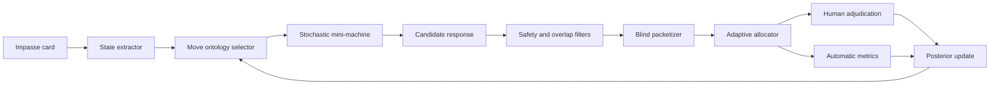
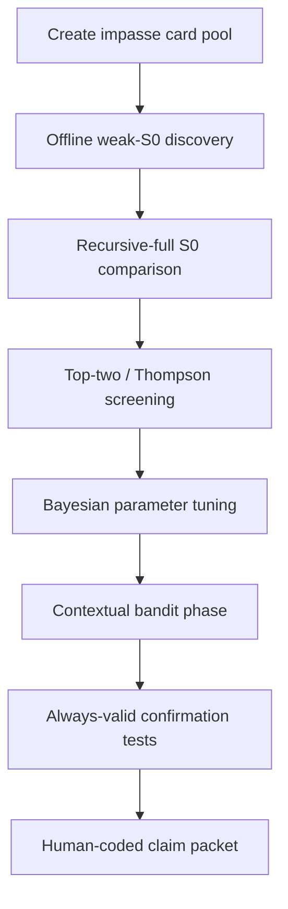

# Feasibility and Implementation of an A19 Mini Drama Machines Branch

## Executive Summary

A new A19 branch built around **mini drama machines** is feasible, and it is more than a stylistic detour: it is a plausible way around the specific bottleneck that sank the current A19 path. The uploaded A19 exhaustion report shows that the present learner-standing line fell below claim threshold mainly because **recursive-full S0 already solved too much of the space**, leaving only one ambiguous local headroom case with granularity risk and no human coder evidence. In other words, the current problem is not infrastructure failure; it is **construct collapse against a very strong aligned baseline**. A branch that probes small, explicit, formalized rhetorical moves—especially ones drawn from classical rhetoric and drama rather than generic modern “repair” language—directly targets that bottleneck by moving the intervention space from broad moral-discursive obligations to tightly parameterized stylistic and recognition moves. fileciteturn0file0

The literature makes this branch look promising but not easy. Classical rhetoric already gives a usable ontology: Aristotle frames persuasion through **ethos, pathos, logos**, and treats style, rhythm, delivery, and metaphor as operational resources; the *Poetics* adds **anagnorisis** and **peripeteia** as recognition and reversal structures; Latin rhetoric systematizes figures of diction and thought such as **anaphora, metonymy, synecdoche, hyperbaton,** and related devices; Quintilian ties rhetoric to situational appropriateness and ethical credibility. Modern computational rhetoric then adds the practical reason to prefer a “mini-machine” branch: annotated resources for lesser-known figures are still scarce, detection remains difficult outside metaphor, sarcasm, and irony, and ontology-supported annotation has only recently become practical. That combination strongly favors **small, controlled generators plus careful human adjudication**, not another large, long-loop transfer claim. citeturn3view0turn6view0turn4view1turn23search0turn35search2turn19academia0turn19academia1

The best implementation is not a single monolithic “drama model.” It is a family of **compact stochastic generators** that emit one move or a short move sequence, each parameterized by move class, intensity, placement, explicitness, figural density, and stance. You then evaluate them with **fast adaptive experiments** rather than long fixed runs: fixed-budget best-arm identification for early screening, contextual Thompson sampling for online allocation, Bayesian optimization for low-dimensional move parameters, Hyperband-style multi-fidelity evaluation to keep validation costs down, and anytime-valid sequential tests for confirmation. This is exactly the kind of black-box, budget-constrained prompt-selection problem where best-arm and Bayesian methods are already known to be sample efficient. citeturn10academia0turn10academia1turn11academia0turn30academia0turn30academia1turn30academia3turn31academia0turn31academia2

The main scientific risk is that the branch may still collapse into generic prosociality, charisma, or surface ornament. That risk is real. Modern work on figurative language shows that LLMs can often **generate** metaphorical or stylistically transformed language from natural-language instructions, but their **understanding** of figurative structure can still track surface cues and lexical overlap more than deep conceptual mapping. Modern persuasion work also shows that no single strategy works universally and that contextual fit matters more than strategy labels alone. So the right claim target is not “classical rhetoric beats RLHF.” It is: **a low-dimensional classical move ontology can be used as a controlled experimental probe to discover context-sensitive micro-interventions that affect learner impasses measurably and faster than current long-iteration A19 loops**. citeturn26academia3turn22academia1turn33academia0turn32academia0turn29academia1

## Why this branch is strategically plausible

The present A19 branch is running into a very specific ceiling. The exhaustion report says the v0.8 learner-standing loop produced one real attempt-1 survivor, admitted one bounded axiom, then hit recursive-full S0 ceilings on held-out siblings and preserved only one ambiguous packet with zero coder files. The report’s own conclusion is that the meaningful next moves are either independent coding or a genuinely new preregistered family. That is exactly the opening for a mini-drama branch: it changes the experimental object without pretending that the current construct has already transferred. fileciteturn0file0

The deeper reason this branch is plausible is that classical rhetoric gives you a **different control surface** from the one your current “repair / boundary / conversion” language is operating on. Aristotle defines rhetoric as the faculty of observing “the available means of persuasion” in a given case, and he explicitly decomposes persuasion into the character of the speaker, the emotion of the audience, and the proof carried by the speech itself. He also treats rhetoric as fundamentally situational and contingent rather than tied to one fixed subject matter. That matters for your branch because learner impasses are also contingent, local, and highly dependent on timing and framing. citeturn3view0

Classical theory also gives you a principled reason to work in **small moves**, not big narratives. In *Poetics*, Aristotle treats **recognition** and **reversal** as especially powerful because they reorganize a situation rather than merely describe it. That is precisely the kind of minimal intervention you want to test at an impasse: not a new lesson plan, but a micro-turn that flips salience, role, or relation. Likewise, in *Rhetoric* Book III Aristotle treats clarity, naturalness, rhythm, delivery, and metaphor as concrete levers of effect, and argues that metaphor gives prose clarity, charm, and distinction. That gives you an operational justification for treating figures not as decorative extras but as experimentally manipulable components. citeturn4view1turn6view0

Modern computational work supports the same design choice from the opposite direction. Recent surveys of rhetorical-figure detection emphasize that the field still suffers from **dataset scarcity**, **language limitations**, and heavy reliance on rule-based methods for many lesser-known figures. Recent ontology-based tooling shows that structured rhetorical ontologies are becoming usable for annotation and retrieval, but the work remains early and domain-specific. That means the practical route is not to build a giant universal rhetoric model. It is to build a **small experimental ontology with a short list of high-yield figures**, then instrument it well. citeturn19academia1turn19academia0

There is also a stronger-than-it-looks reason to believe this branch may be more orthogonal to current alignment than your current one. Modern LLMs already respond strongly to generic persuasion and social-support prompts, and prompting them with named strategies can improve outcomes, but “no one-size-fits-all” strategy emerges. In persuasion dialogue datasets, strategy labels alone often explain surprisingly little variance in outcomes. That is bad news for broad “repair family” claims, but good news for a branch that explicitly treats moves as **context-sensitive probes** selected adaptively rather than as universally valid axioms. citeturn22academia1turn33academia0

## Classical ontology to operational move primitives

The cleanest way to implement this branch is to treat the classical tradition as a **typed ontology** with four layers: **appeals**, **dramatic turns**, **figures of diction**, and **tropes/figures of thought**. The mapping below is a synthesis of Aristotle’s rhetorical appeals and treatment of style, the *Poetics*’ recognition and reversal machinery, Latin figure taxonomies descending from *Rhetorica ad Herennium*, and Quintilian’s emphasis on ethical credibility and stylistic appropriateness. The table is therefore an implementation proposal grounded in those sources, not a claim that the ancients themselves provided this exact engineering schema. citeturn3view0turn6view0turn4view1turn23search0turn35search2

| Classical motif | Operational primitive | Core parameters | Intended local effect | Main failure mode |
| --- | --- | --- | --- | --- |
| **Ethos** | Credibility alignment move | humility level, norm invoked, speaker positioning, first/second-person ratio | increase trust and legitimacy of the turn | generic niceness or self-display |
| **Pathos** | Affective attunement move | valence, arousal, target emotion, compression | reduce friction, increase felt relevance | melodrama, overreach, emotional flooding |
| **Logos** | Enthymeme move | premise gap, explicitness, analogy strength, conclusion force | unlock inference with minimal explanation | over-teaching, didactic sprawl |
| **Kairos** | Timing/occasion move | placement in sequence, latency, response length, escalation threshold | intervene at the “right” moment | premature or belated move |
| **Anagnorisis** | Recognition move | what is recognized, who recognizes, explicitness, naming style | reframe the impasse by making a hidden relation visible | banal restatement |
| **Peripeteia** | Reversal move | degree of inversion, surprise level, continuity, rescue path | change the local direction of the exchange | jarring reversal, trust loss |
| **Anaphora** | Initial repetition kernel | repeated phrase, count, clause length, cadence | emphasis, rhythm, momentum | sloganizing, redundancy |
| **Chiasmus / antimetabole** | Symmetry/inversion kernel | X/Y terms, semantic distance, inversion sharpness | memorability and conceptual pivot | gimmickry, forced parallelism |
| **Metaphor** | Cross-domain mapping move | source domain, target domain, novelty, specificity | compress and reconfigure meaning | obscurity or cliché |
| **Metonymy** | Contiguity shift move | association type, salience, literal recoverability | shift focus without full reframing | ambiguity, referential confusion |
| **Synecdoche** | Part-whole spotlighting move | part/whole choice, granularity, human/nonhuman target | make the problem tractable by rescaling it | flattening or distortion |
| **Irony** | Norm-violation contrast move | target, sincerity signal, explicitness, polarity | create distance, expose contradiction | hostility, misread sarcasm |
| **Apostrophe / prosopopoeia** | Direct address / voiced abstraction move | addressee type, personification, intimacy, vividness | intensify recognition and presence | theatrical excess |

A practical consequence of that mapping is that not all motifs belong in the first wave. **Ethos, logos, kairos, anagnorisis, peripeteia, anaphora, metaphor, metonymy, and apostrophe** are the best starting set. They are easier to parameterize and, in most cases, easier to recognize and code than irony. Irony should be late-phase only, because irony processing depends heavily on salience, violations of expectation, and pragmatic norm-tracking; both psycholinguistic and computational work treat it as one of the harder figurative phenomena to classify reliably. citeturn18academia3turn32search6

A second practical consequence is that you should distinguish **single-sentence figures** from **dialogue-level turns**. Anaphora or metaphor can sit inside a sentence. Anagnorisis and peripeteia are better treated as **micro-dialogic transformations**: a recognition move names what was actually at stake; a reversal move reorients the exchange after that recognition. This distinction matters because it keeps you from forcing plot concepts into purely lexical templates. Aristotle himself treats recognition and reversal as plot-level dynamizers, not as ornamental figures. citeturn4view1

Finally, the ontology should be **closed and typed**, not free-form. Every generated move should carry machine-readable fields such as `appeal_family`, `dramatic_turn`, `figure_type`, `stance`, `intensity`, `placement`, and `risk_flags`. Recent ontology-based rhetorical annotation work and broader computational rhetoric surveys make it clear that if you do not type the phenomena up front, annotation, retrieval, and later statistical analysis become far less reliable. citeturn19academia0turn19academia1

## Mini machine generator design

The right “mini drama machine” is not a full dialogue agent. It is a **compact stochastic controller** that maps an impasse context to either one move or a very short move sequence. That design is not only cheaper; it is also scientifically cleaner, because it makes causal attribution easier. It is much more plausible to detect the effect of “recognition + metaphor” than the effect of a many-turn rhetorical style cloud. Modern prompt-based style-transfer work also supports this choice: LLMs can already execute constrained rewrites such as “insert a metaphor” or other arbitrary stylistic transformations from natural-language instructions, which means prompt-conditioned micro-generators are technically viable even without model fine-tuning. citeturn26academia3

### Generator families

| Generator family | Output length | State | Best use | Notes |
| --- | --- | --- | --- | --- |
| **Single-move sampler** | one sentence or one short paragraph | stateless | fast screening, clear causal readout | default starting unit |
| **Paired-move sampler** | two linked clauses or two sentences | local state only | test interaction of recognition + figure | best for anagnorisis/peripeteia combinations |
| **Contextual switcher** | one move chosen after context embedding | contextual stateless | contextual bandits and adaptive allocation | use when impasse types differ sharply |
| **Fallback-safe sampler** | same as above | stateless | safety-constrained deployment | only emits if predicted utility > baseline |
| **Latent figure rewriter** | rewrite of neutral response | stateless | style-controlled comparisons | isolates figure from content |

The **single-move sampler** should be the workhorse. It receives a compact machine-readable state vector:

```json
{
  "impasse_type": "confusion|resistance|overwhelm|status-threat|disclosure-friction|silence",
  "task_stage": "before_attempt|after_failure|after_meta-comment|re-entry",
  "baseline_quality": "weak|adequate|strong",
  "move_family": "ethos|logos|kairos|anagnorisis|peripeteia|anaphora|metaphor|metonymy|apostrophe",
  "intensity": 0.0,
  "explicitness": 0.0,
  "figuration_density": 0.0,
  "cadence": "plain|balanced|marked",
  "risk_budget": "low|medium|high"
}
```

It then emits exactly one candidate response plus its internal metadata. This keeps generation cheap and makes head-to-head tests straightforward.

The **paired-move sampler** should be reserved for the combinations most justified by theory and prior evidence. The most promising pairs are:

| Pair | Why test it |
| --- | --- |
| **kairos → logos** | delay explanation until the user is ready for it |
| **ethos → logos** | establish credibility before a compressed inference |
| **anagnorisis → peripeteia** | recognition first, reversal second |
| **anagnorisis → metaphor** | name the hidden relation, then compress it |
| **ethos → anaphora** | credibility plus rhythmic emphasis |
| **metonymy → metaphor** | contiguity shift before full reframing |

This is not arbitrary. Modern figurative-language work suggests that hybridization can make otherwise subtle figurative structure more legible; for example, recent work on figurative fusion found that metaphor can make metonymy more explicit to both humans and LLMs. That is exactly the sort of reason to test **short combinations**, not just isolated figures. citeturn29academia0

### Architecture sketch



### Prompting strategy

Use **two distinct prompt layers**. The first is internal and classical: it names the move, the parameters, and the constraints. The second is external and natural: it forbids modern A19 vocabulary such as *repair*, *boundary*, *conversion*, or *transfer* from appearing in branch prompts or outputs.

A good development prompt for the generator looks like this:

```text
You are a micro-rhetorical generator.
Emit exactly one response turn.
Use the assigned classical move only.
Do not explain the move.
Do not add therapeutic framing.
Do not ask for private disclosure.
Keep output under 70 words.

Context state:
- impasse_type: overwhelm
- task_stage: after_failure
- move_family: anagnorisis
- intensity: 0.45
- explicitness: 0.70
- cadence: plain
- figuration_density: 0.05
```

A good **shadow-control** prompt uses the same length and topic budget, but forbids any marked figure:

```text
Emit one neutral, plain-language response turn.
No rhetorical figure.
No repetition.
No metaphor.
No irony.
No dramatic reframing.
Keep output under 70 words.
```

This control is essential because LLMs can execute stylistic instructions fairly well, but modern metaphor evaluation also shows that models may rely on surface features. If you only compare ornate outputs to loose baselines, you learn nothing. citeturn26academia3turn32academia0

## Fast adaptive experiments and baseline controls

The branch will only stay faster than current A19 if the experiments are designed for **sample efficiency from the start**. Fortunately, your search space is exactly the kind of low-dimensional, expensive, noisy black-box problem where adaptive methods perform well.

### Experimental arms

| Arm type | What varies | Recommended adaptive method | When to use |
| --- | --- | --- | --- |
| **Discrete move family** | ethos vs logos vs kairos vs anagnorisis etc. | Thompson sampling or top-two sampling | early exploration |
| **Single figure parameters** | intensity, explicitness, novelty, cadence | Bayesian optimization | within-family tuning |
| **Short sequences** | ordered two-move combinations | fixed-budget best-arm identification | middle-phase screening |
| **Context-sensitive policy** | move chosen by impasse type | contextual Thompson sampling | after enough context labels |
| **Safety-constrained policy** | optimize utility under side-effect limits | constrained contextual bandit | late-stage online use |

For **discrete family screening**, use **top-two Thompson sampling** or a close variant rather than naive round-robin. Best-arm work shows that top-two / Bayesian best-arm procedures are particularly efficient when the goal is to identify winners rather than maximize long-run reward. That maps cleanly to your use case, which is mostly **pure exploration with confidence**, not online maximization. citeturn10academia0turn10academia1turn21academia3

For **continuous move parameters**, use Bayesian optimization over a small parameter vector such as intensity, novelty, explicitness, cadence, and figuration density. Bayesian optimization is designed for expensive black-box objectives in low dimensions, and recent prompt-optimization work shows the same logic transfers well to prompt-conditioned LLM systems. When cost matters, add **multi-fidelity evaluation** so poor candidates are screened on fewer cards first. Hyperband-style Bayesian prompt selection is especially relevant here because it explicitly optimizes prompts under limited validation budgets. citeturn11academia0turn30academia0turn30academia1

For **confirmation tests**, do not go back to long fixed runs. Use **always-valid sequential inference**. The point is not just convenience; it is legality of peeking. Always-valid p-values and confidence sequences let you stop when the evidence is there without invalidating inference, and modern sequential-inference work shows that anytime-valid testing can be built on martingale foundations robustly. citeturn31academia0turn31academia1turn31academia2

### Practical evaluation phases



### Baselines and controls

Your branch should preserve the existing A19 discipline around S0 and S1, but repurpose it.

| Baseline / condition | Role in branch | Claim status |
| --- | --- | --- |
| **Recursive-full S0** | primary claim baseline | required |
| **Weak S0** | diagnostic discovery only | not claim-bearing |
| **Shadow-control S1** | same length, no marked figure | required |
| **Literal classical prompt** | development only, not evaluative | internal |
| **Latent classical prompt** | actual experimental generator | required |
| **Human-authored figure control** | occasional calibration anchor | preferred |

This is where your uploaded report matters most. The report already concludes that weak/model-stratified S0 conditions are diagnostic only and that recursive-full S0 remains the real adversary. The new branch should keep that rule. Weak S0 can be used to discover candidates fast, but only recursive-full S0 should support a claim of policy headroom. fileciteturn0file0

One more design rule is important: use **safe exploration** once you move from offline comparisons to any live or semi-live loop. Constrained contextual bandit work and safe exploration methods show how to optimize while requiring performance not to fall below a baseline on auxiliary constraints. Here, the auxiliary constraints should be things like privacy pressure, sycophancy, and boundary erosion. citeturn21academia1turn30academia2

## Human adjudication and measurement stack

The uploaded A19 report already gives you a strong technical starting point. It says the repo now has a merge command for blinded packet adjudication, verifies packet hashes and run IDs, preserves raw coder judgments, applies the answer key only after preservation, and refuses to create a panel claim with zero or one coder. That is exactly the right backbone. The new branch should **extend that system**, not replace it. fileciteturn0file0

### What the human layer is for

Human adjudication should do three jobs only:

First, determine whether the output **actually instantiated the intended rhetorical move**.  
Second, determine whether the move **helped with the impasse**.  
Third, determine whether it did so **for the right reason**, rather than by generic warmth, generic explanation, or covert pressure.

That design is consistent with current benchmark-validity thinking. Recent work on construct validity in LLM evaluation argues that benchmarks need explicit empirical validation of whether they actually measure the intended construct; recent rubric work further shows that rubric-guided LLM evaluation can help, but still misses some of the finer distinctions human experts capture. In other words, keep LLM judges as assistants if you want, but make the human-coded packet the claim-bearing artifact. citeturn12academia2turn12academia1turn12academia3

### Packet format

Each adjudication packet should contain:

- a hashed packet ID,
- the impasse card,
- the neutral baseline output,
- the experimental output,
- move metadata with **arm IDs hidden from coders**,
- branch-specific codebook version,
- randomized output order,
- optional model family redaction,
- and a place for **counterfactual rationales**.

A compact packet schema can look like this:

```json
{
  "packet_id": "sha256:...",
  "branch": "a19r-mini-drama",
  "codebook_version": "0.1.0",
  "card_id": "impasse_042",
  "hashes": {
    "card_hash": "sha256:...",
    "arm_a_hash": "sha256:...",
    "arm_b_hash": "sha256:..."
  },
  "blinding": {
    "order_seed": "sha256:...",
    "model_redacted": true,
    "move_labels_redacted": true
  },
  "materials": {
    "context": "...",
    "response_a": "...",
    "response_b": "..."
  }
}
```

### Coder JSON

The coder file should capture both outcome judgments and **why** those judgments were made.

```json
{
  "packet_id": "sha256:...",
  "coder_id": "coder_07",
  "codebook_version": "0.1.0",
  "annotations": {
    "move_detected_a": ["anagnorisis"],
    "move_detected_b": ["shadow_control"],
    "move_confidence_a": 0.82,
    "move_confidence_b": 0.91,
    "impasse_helpfulness_a": 4,
    "impasse_helpfulness_b": 2,
    "authority_restoration_a": 5,
    "authority_restoration_b": 2,
    "disclosure_pressure_a": 1,
    "disclosure_pressure_b": 1,
    "generic_warmth_only_a": false,
    "generic_warmth_only_b": true,
    "winner": "a",
    "counterfactual_rationale": {
      "why_a_helped": "It named the hidden issue directly without escalating pressure.",
      "what_would_make_better": "A clearer recognition move before explanation.",
      "what_would_disqualify_a": "If the naming felt imposed rather than discovered."
    }
  }
}
```

### Codebook categories

The codebook should be tied directly to the rhetorical ontology:

| Dimension | Example values | Why it matters |
| --- | --- | --- |
| **Move detection** | ethos, kairos, anagnorisis, metaphor | checks treatment fidelity |
| **Figure quality** | absent, weak, clear, forced | distinguishes true use from accidental resemblance |
| **Impasse effect** | worsened, unchanged, slight help, clear help | primary behavioral outcome |
| **Authority restoration** | low to high | branch-specific target |
| **Disclosure pressure** | none to severe | safety guardrail |
| **Generic warmth only** | yes / no | anti-collapse flag |
| **Manipulative feel** | none to high | charisma/sycophancy guardrail |
| **Counterfactual rationale** | free text | diagnosis, not just vote count |

### Merge and QA commands

A good repo extension would preserve the current A19 merge discipline while adding branch-specific wrappers:

```bash
npm run a19r:packetize -- --run exports/a19r/run-2026-06-08 --blind
npm run a19r:codebook-validate -- --version 0.1.0
npm run a19r:adjudication-merge -- packet.json coder-*.json
npm run a19r:qa -- --strict
npm run a19r:report -- --json
```

Automated QA should reject:

- packet/codebook version mismatch,
- coder file with wrong packet hash,
- unblinded move labels,
- duplicate coder IDs,
- missing counterfactual rationales on winner judgments,
- and impossible field combinations such as `move_detected = irony` with `figure_quality = absent`.

### Agreement metrics

Use **Krippendorff’s alpha** for nominal or ordinal fields, **Gwet’s AC1/AC2** where prevalence is extreme, and pairwise confusion matrices for move-detection errors. Do not reduce agreement to a single scalar. In this branch, the most informative agreement artifact will often be a **confusion matrix between intended move and perceived move**, because that tells you whether the machine emitted the wrong move or whether the codebook itself is blurry. That follows the same construct-validity logic as the benchmark literature: disagreement is often a measurement signal, not just annotator noise. citeturn12academia2turn12academia3

### Sample coder instruction excerpt

> Read the context and both responses as if you were judging a local intervention at a learner impasse.  
> Do not score elegance alone.  
> First identify whether a marked rhetorical move is actually present.  
> Then judge whether it helps the impasse.  
> Then judge whether it helps **because of that move**, rather than because the response is merely kinder, longer, or more explanatory.  
> If unsure, use the counterfactual fields: explain what specific wording would have made the move clear or disqualifying.

### Behavioral and linguistic metrics

Your primary experimental endpoints should be:

| Metric family | Concrete measure |
| --- | --- |
| **Impasse resolution** | binary or ordinal coder score |
| **Re-engagement** | follow-up response willingness, continuation length, next-turn uptake |
| **Authority restoration** | coder-rated restoration of learner standing / authorship |
| **Disclosure retention** | whether the response preserves rather than solicits additional private disclosure |
| **Move fidelity** | whether coders detect the intended move |

Secondary metrics should combine text analytics and human ratings:

| Secondary metric | Implementation |
| --- | --- |
| **Lexical repetition** | repeated n-grams, opening repetition, balanced-clause counts |
| **Semantic figuration** | metaphor source-target distance, metonymy category, trope density |
| **Cadence / prosody proxies** | clause length variance, punctuation rhythm, parallelism signatures, euphony features |
| **Emotional loading** | valence/arousal scores, affect lexicon features |
| **Overhead cost** | response length, tokens, latency |
| **Side effects** | sycophancy markers, manipulation score, privacy pressure |

The reason to include **prosody proxies** even in text-only experiments is that classical rhetoric treats delivery, rhythm, and voice as real levers, and modern computational work on euphony and prosodic modeling shows that sound-like and rhythmic properties can affect persuasiveness and naturalness even when all you observe directly is text. Aristotle explicitly treats volume, pitch, and rhythm as part of delivery, while computational work on persuasive language finds phonetic/euphonic features predictive across several persuasive domains. citeturn6view0turn20academia0

For statistics, use a **hierarchical model** rather than flat significance tests alone. The right default is a multilevel ordinal/logistic model with random intercepts for card, coder, model family, and move family, plus random slopes where feasible. If you want a single optimization target for bandits, preregister a composite utility like:

\[
U = w_1(\text{impasse help}) + w_2(\text{authority restoration}) + w_3(\text{re-engagement}) - w_4(\text{privacy pressure}) - w_5(\text{manipulative feel})
\]

Then do final confirmation with always-valid sequential inference and adjust across multiple families with Holm-style correction or a Bayesian multilevel shrinkage approach. citeturn31academia0turn31academia2turn31search5

## Theoretical spine and testable hypotheses

This branch can carry a strong theoretical spine **without letting theory outrun the experiment**. The key is to convert each theoretical tradition into a small, falsifiable family of hypotheses.

Hegel gives you the recognition hypothesis. The classic recognition structure in the *Phenomenology* is that self-consciousness becomes itself through recognition by another, and that mere unilateral acknowledgment is not enough. In your setting, that translates naturally into a prediction about impasses: **moves that explicitly acknowledge the learner as a participant with standing, not merely as an object to be corrected, should outperform otherwise equivalent plain controls on authority-restoration scores**. The operational candidates here are ethos, apostrophe, and especially anagnorisis. citeturn16search1turn16search3

Freud and Lacan give you the displacement hypothesis. Freud’s dream-work turns on **condensation** and **displacement**; Lacan famously connects **metonymy** to the sliding chain of desire and **metaphor** to the crossing that produces signification. You do not need to buy the full psychoanalytic system to derive a testable empirical claim: **some learner impasses may be loosened less effectively by direct explanation than by a controlled figurative displacement that reorganizes salience**. That predicts that metaphor and metonymy should help most when the impasse appears **frame-bound**, not when it is purely informational. citeturn16search4turn17search1turn17search0

Weber gives you the charisma hypothesis. Weberian charisma rests not just on traits, but on a relation of **recognized exceptional force** between speaker and followers. Modern computational work on charismatic leadership tactics shows that such tactics can be identified reliably in text, which means they can also be engineered as experimental variables. The testable prediction is not “be charismatic.” It is narrower: **patterned, elevated, value-laden language—such as controlled anaphora, antithesis, or chiasmic balance—will increase engagement and memorability, but it may also raise manipulation and overcompliance risk**. That gives you a clean trade-off to measure. citeturn15search9turn36academia0

Recent computational and psycholinguistic work adds more specific hypotheses. Large-scale political-language analysis suggests metaphor is associated with higher engagement; newer work argues that metaphor often expresses stronger emotion partly through greater specificity; context studies suggest metaphor judgments compress toward the center once richer context is supplied. Those three findings together imply a very concrete prediction: **figurative moves should be tested in context-stratified batches, because move effectiveness and recognizability may look larger in isolated snippets than in full conversational context**. citeturn14academia2turn14academia4turn14academia3

The hypotheses below are the strongest starting set:

| Hypothesis | Test |
| --- | --- |
| **Recognition hypothesis** | anagnorisis/ethos moves outperform neutral controls on authority-restoration |
| **Timing hypothesis** | kairos-conditioned moves outperform identical untimed moves |
| **Displacement hypothesis** | metaphor/metonymy help more on frame-bound impasses than on factual-confusion impasses |
| **Reversal hypothesis** | peripeteia improves re-engagement after repeated failure but harms trust if used too early |
| **Charisma trade-off hypothesis** | anaphora/chiasmus increase engagement and memorability but also manipulation scores |
| **Surface-overlap risk hypothesis** | some apparent gains vanish when shadow controls match length and vividness |

That final hypothesis is especially important because current LLM metaphor research warns that surface cues can masquerade as conceptual understanding. You should treat that as a built-in falsification condition for the branch. citeturn32academia0

## Roadmap, preregistration, success criteria, and risks

The right rollout is staged.

### Stage zero

Define the ontology, freeze the first-wave move list, and write the codebook before you generate large candidate pools. Do not start with all classical figures. Start with a compact pack:

- ethos  
- logos  
- kairos  
- anagnorisis  
- peripeteia  
- anaphora  
- metaphor  
- metonymy  
- apostrophe  

This list is broad enough to test appeals, timing, dramatic recognition, reversal, and figuration, while avoiding the highest-ambiguity cases in the first pass.

### Stage alpha

Build a **card library** of learner impasses. Label each card for impasse type, stage, sensitivity, privacy pressure, and whether the card is likely “frame-bound” or “information-bound.” This is where the branch becomes fast: once you have the card library, everything else is cheap iteration.

### Stage beta

Run weak-S0 discovery. Generate one neutral response plus several mini-machine candidates per card. Use fixed-budget best-arm screening to eliminate obvious losers quickly. TRIPLE-style best-arm framing and Hyperband-style multi-fidelity prompt evaluation are directly relevant here because they are designed to select among candidate prompts under API and validation budget constraints. citeturn30academia3turn30academia0

### Stage gamma

Move only the best candidates to **recursive-full S0 comparisons**. At this stage, each winner must beat both the plain control and recursive-full S0, or at minimum show defensible local headroom on a preregistered target. The uploaded A19 report makes that discipline non-negotiable. fileciteturn0file0

### Stage delta

Add human adjudication on blinded packets. Require at least two coders before any claim, and treat coder disagreement as diagnostic evidence for ontology refinement rather than as a nuisance to smooth away.

### Stage epsilon

Run contextual bandits on the surviving move families. The aim here is not to declare a universal winner, but to learn a **policy over contexts**: what move type is most useful for which impasse type, under which risk budget.

### Preregistration checklist

A good preregistration should freeze:

| Item | Freeze before running? |
| --- | --- |
| ontology version | yes |
| move families in first wave | yes |
| generator parameter bounds | yes |
| card inclusion/exclusion rules | yes |
| weak-S0 diagnostic status | yes |
| recursive-full S0 claim role | yes |
| primary outcomes | yes |
| side-effect measures | yes |
| stopping rules | yes |
| multiple-testing plan | yes |
| adjudication thresholds | yes |
| promotion criteria from one stage to next | yes |

### Success criteria

Because the branch is exploratory at first, define **two success levels**.

**Method success** means:

- the ontology is codable,
- the generators reliably instantiate intended moves,
- the adaptive loop is materially faster than current long A19 iterations,
- and at least some families show stable context-sensitive differences.

**Empirical success** means:

- at least two move families demonstrate clean recursive-full S0 headroom on preregistered targets,
- human coders correctly detect the intended move above chance with acceptable agreement,
- the improvement is not explained away by length, generic warmth, or vividness,
- and side-effect metrics stay within preregistered limits.

### Risk and mitigation

The biggest risk is **construct collapse**. Classical categories can collapse upward into “just persuasive style” or downward into “just colorful wording.” The fix is shadow controls, move-detection coding, and target-specific outcome measures rather than global “better response” scores. That concern is fully consistent with current construct-validity critiques of benchmark design. citeturn12academia2

The second risk is **RLHF overlap**. The model may already know ethos/pathos/logos and may generate decent metaphor on command. The fix is not to deny that overlap; it is to measure incremental effect over tightly matched controls and to emphasize the less saturated, more structural phenomena such as kairos-conditioned placement, metonymic shifts, or recognition/reversal pairings. Computational rhetoric surveys and recent metaphor evaluation both support the view that data scarcity and surface-feature dependence remain real issues here. citeturn19academia1turn32academia0

The third risk is **evaluator drift**. As soon as coders start learning the branch’s habits, they may over-detect figures. The fix is versioned codebooks, packet hashing, periodic calibration packets, and frozen audit sets. Recent rubric literature strongly supports multidimensional, calibrated evaluation rather than single holistic judgments. citeturn12academia1turn12academia3

The fourth risk is **manipulative success**. Some moves may increase compliance, disclosure, or positive ratings for the wrong reason. This is not hypothetical: modern dialogue work shows that strategy effects depend heavily on context, that some strategies such as guilt induction can backfire, and that relational tactics such as chatbot self-disclosure can increase user self-disclosure and recommendation acceptance. Your branch should therefore treat disclosure pressure and manipulative feel as hard constraints, not afterthought metrics. citeturn33academia0turn28academia1

### Open questions and limitations

Some important uncertainties remain.

The classical-to-operational mapping offered here is a research design synthesis, not a settled scholarly taxonomy. That is acceptable so long as the branch treats the ontology as **versioned and revisable** rather than canonical.

The evidence base for some specific figures remains uneven. Metaphor and irony have much stronger modern literatures than chiasmus or apostrophe. That is another reason to start with a compact first wave.

Finally, this report supports the branch most strongly as a **fast adaptive probe architecture**, not yet as a new claim language. The branch becomes claim-ready only after it proves that its effects survive recursive-full S0, survive human adjudication, and survive shadow controls that remove the easiest stylistic confounds. citeturn19academia1turn32academia0turn12academia2

The most actionable conclusion is therefore straightforward: **yes, build this branch**—but build it as a **typed, stochastic, adaptive, human-audited experimental system**, not as a new grand theory of learner repair. That is exactly the scale at which the classical ontology is most likely to deliver new signal quickly.