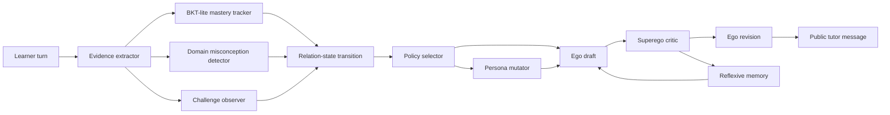

# Challenge-State Adaptation Loop

This note documents the current non-weight-learning mechanism for on-the-fly
adaptation. It is a LangGraph-equivalent finite state machine implemented in
plain JavaScript so the prototype stays dependency-light and inspectable.

## Why This Was Added

The hard-mode statistics run exposed a concrete failure: the reflexive tutor
kept asking for a generic "third factor" after the learner kept returning to
the graph. That was not genuine adaptation. The tutor needed a stateful
recognition that the learner was resisting, forgetting, or reverting, followed
by a public strategy change.

The new mechanism adds `challenge_state` between evidence extraction and policy
selection. It does not update model weights. It updates explicit controller
state and uses that state to constrain the next tutor move.

## Nodes

## Challenge State

`src/challengeState.js` tracks:

- `level`: `none`, `active`, `escalated`, or `resolved`;
- `signals`: forgetfulness, skepticism, disinterest, reversion, resistance, or
  hard-mode incorrectness;
- `repairAttempts` and `repeatedChallengeTurns`;
- `strategy`: domain-specific strategy such as `skeptical_comparison`;
- `directive`: the binding public-message contract.

For statistics, the directive requires the tutor to use `confounder` or `third
variable`, give the concrete cue `winter vs summer`, avoid naming heat, weather,
water exposure, or swimming before the learner does, and ask for a matched,
controlled, or randomized comparison.

## Policy Effect

When `challenge_state.level` becomes `escalated`, `transitionRelationState()`
forces `relationState = misconception_repair` and `selectPolicy()` merges the
domain repair template with the challenge directive. This blocks transfer and
summary until learner evidence shows repair.

`evolvePersona()` also changes the persona vector: curiosity and humility rise,
tempo slows, and directiveness increases slightly only on escalation so the
tutor supplies a concrete cue without taking over the central learner work.

When hard-mode evidence remains resolved across more than one turn, the policy
selector can choose `summarize_and_check`. This is the agency-restoration
countermove: after repair and transfer have happened, the tutor should stop
repeating the transfer case and ask the learner to state their own rule,
boundary, or audit criterion.

## Reflexive Effect

The Ego/Superego prompts now treat `selected_policy.challengeDirective` as a
hard constraint. The Superego must reject repeated abstract repair after a
hard-mode challenge, and the Ego revision must translate the directive into
learner-facing work without exposing internal labels.

## Acceptance Criterion

This mechanism should be judged by public behavior, not internal elegance:

1. hard-mode learner challenge is detected in the state trace;
2. the next policy includes a challenge directive;
3. the public tutor message changes strategy and uses the concrete cue;
4. the learner produces observable repair work;
5. paired baseline comparison improves on adaptive criteria, with statistical
   confirmation before any strong claim.

## Ablation Hooks

The current implementation supports named mechanism deletions:

- `no_challenge` disables the challenge observer and challenge directives;
- `no_outcome_gate` disables the forced misconception-repair gate;
- `ego_only` disables Superego critique and Ego revision;
- `no_memory` resets reflexive memory each turn.

These are documented in `ABLATION_CONDITIONS.md` and are intended for LLM
learner validation before any main-line claim.
